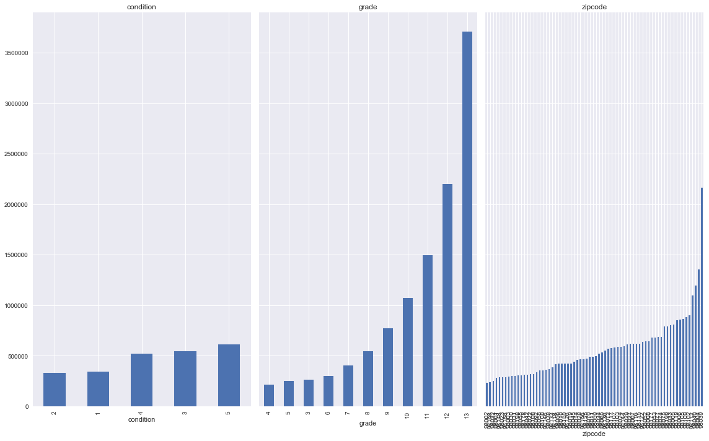
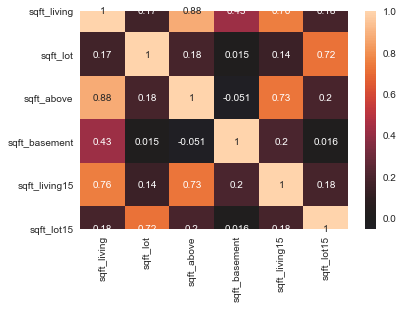
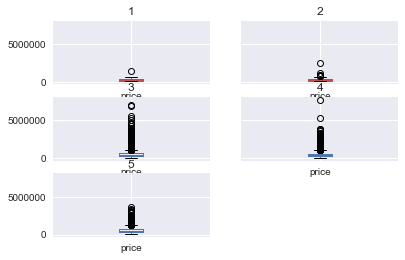
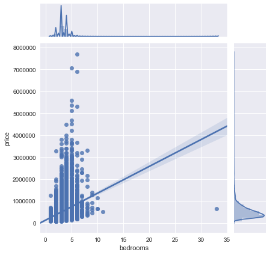
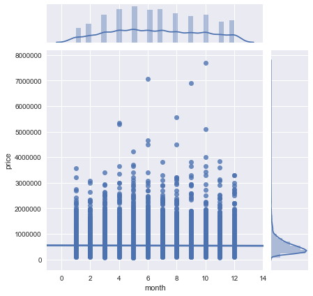
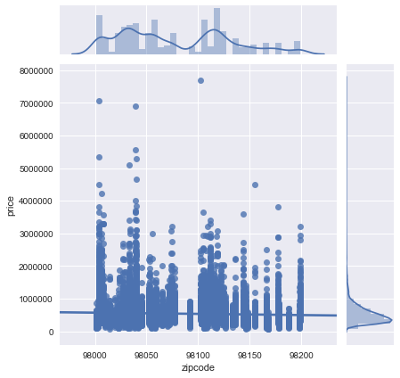
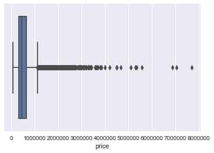
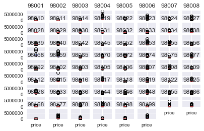
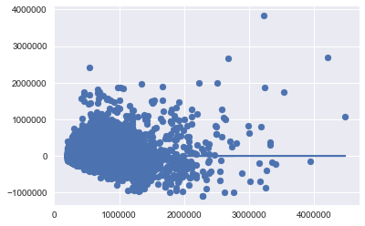

## Final Project Submission

Please fill out:
* Student name: Eric Cusick
* Student pace: Full time
* Scheduled project review date/time: 
* Instructor name: James Irving
* Blog post URL:


1. **[OBTAIN](#OBTAIN)**
    - Import data, inspect, check for datatypes to convert and null values
    - Display header and info.
    - Drop any unneeded columns, if known (`df.drop(['col1','col2'],axis=1,inplace=True`)
    <br><br>


2. **[SCRUB](#SCRUB)**
    - Recast data types, identify outliers, check for multicollinearity, normalize data**
    - Check and cast data types
        - [ ] Check for #'s that are store as objects (`df.info()`,`df.describe()`)
            - when converting to #'s, look for odd values (like many 0's), or strings that can't be converted.
            - Decide how to deal weird/null values (`df.unique()`, `df.isna().sum()`)
            - `df.fillna(subset=['col_with_nulls'],'fill_value')`, `df.replace()`
        - [ ] Check for categorical variables stored as integers.
            - May be easier to tell when you make a scatter plotm or `pd.plotting.scatter_matrix()`
            
    - [ ] Check for missing values  (df.isna().sum())
        - Can drop rows or colums
        - For missing numeric data with median or bin/convert to categorical
        - For missing categorical data: make NaN own category OR replace with most common category
    - [ ] Check for multicollinearity
        - Use seaborn to make correlation matrix plot 
        - Good rule of thumb is anything over 0.75 corr is high, remove the variable that has the most correl with the largest # of variables
    - [ ] Normalize data (may want to do after some exploring)
        - Most popular is Z-scoring (but won't fix skew) 
        - Can log-transform to fix skewed data
    
    
3. **[EXPLORE](#EXPLORE)**
    - [ ] Check distributions, outliers, etc**
    - [ ] Check scales, ranges (df.describe())
    - [ ] Check histograms to get an idea of distributions (df.hist()) and data transformations to perform.
        - Can also do kernel density estimates
    - [ ] Use scatter plots to check for linearity and possible categorical variables (`df.plot("x","y")`)
        - categoricals will look like vertical lines
    - [ ] Use `pd.plotting.scatter_matrix(df)` to visualize possible relationships
    - [ ] Check for linearity.
   
   
4. **[MODEL](#MODEL)**

    - **Fit an initial model:** 
        - Run an initial model and get results

    - **Holdout validation / Train/test split**
        - use sklearn `train_test_split`
    
    
5. **[iNTERPRET](#iNTERPRET)**
    - **Assessing the model:**
        - Assess parameters (slope,intercept)
        - Check if the model explains the variation in the data (RMSE, F, R_square)
        - *Are the coeffs, slopes, intercepts in appropriate units?*
        - *Whats the impact of collinearity? Can we ignore?*
        <br><br>
    - **Revise the fitted model**
        - Multicollinearity is big issue for lin regression and cannot fully remove it
        - Use the predictive ability of model to test it (like R2 and RMSE)
        - Check for missed non-linearity
        
       
6. **Interpret final model and draw >=3 conclusions and recommendations from dataset**

## OBTAIN


> Importing packages


```python
import pandas as pd
import numpy as np
import matplotlib.pyplot as plt
%matplotlib inline
import seaborn as sns
plt.style.use('seaborn')
```

> Loading in the dataset for the project and make sure it loaded correctly


```python
df = pd.read_csv("kc_house_data.csv")
df.head()
```


<div>
<style scoped>
    .dataframe tbody tr th:only-of-type {
        vertical-align: middle;
    }

    .dataframe tbody tr th {
        vertical-align: top;
    }

    .dataframe thead th {
        text-align: right;
    }
</style>
<table border="1" class="dataframe">
  <thead>
    <tr style="text-align: right;">
      <th></th>
      <th>id</th>
      <th>date</th>
      <th>price</th>
      <th>bedrooms</th>
      <th>bathrooms</th>
      <th>sqft_living</th>
      <th>sqft_lot</th>
      <th>floors</th>
      <th>waterfront</th>
      <th>view</th>
      <th>...</th>
      <th>grade</th>
      <th>sqft_above</th>
      <th>sqft_basement</th>
      <th>yr_built</th>
      <th>yr_renovated</th>
      <th>zipcode</th>
      <th>lat</th>
      <th>long</th>
      <th>sqft_living15</th>
      <th>sqft_lot15</th>
    </tr>
  </thead>
  <tbody>
    <tr>
      <td>0</td>
      <td>7129300520</td>
      <td>10/13/2014</td>
      <td>221900.0</td>
      <td>3</td>
      <td>1.00</td>
      <td>1180</td>
      <td>5650</td>
      <td>1.0</td>
      <td>NaN</td>
      <td>0.0</td>
      <td>...</td>
      <td>7</td>
      <td>1180</td>
      <td>0.0</td>
      <td>1955</td>
      <td>0.0</td>
      <td>98178</td>
      <td>47.5112</td>
      <td>-122.257</td>
      <td>1340</td>
      <td>5650</td>
    </tr>
    <tr>
      <td>1</td>
      <td>6414100192</td>
      <td>12/9/2014</td>
      <td>538000.0</td>
      <td>3</td>
      <td>2.25</td>
      <td>2570</td>
      <td>7242</td>
      <td>2.0</td>
      <td>0.0</td>
      <td>0.0</td>
      <td>...</td>
      <td>7</td>
      <td>2170</td>
      <td>400.0</td>
      <td>1951</td>
      <td>1991.0</td>
      <td>98125</td>
      <td>47.7210</td>
      <td>-122.319</td>
      <td>1690</td>
      <td>7639</td>
    </tr>
    <tr>
      <td>2</td>
      <td>5631500400</td>
      <td>2/25/2015</td>
      <td>180000.0</td>
      <td>2</td>
      <td>1.00</td>
      <td>770</td>
      <td>10000</td>
      <td>1.0</td>
      <td>0.0</td>
      <td>0.0</td>
      <td>...</td>
      <td>6</td>
      <td>770</td>
      <td>0.0</td>
      <td>1933</td>
      <td>NaN</td>
      <td>98028</td>
      <td>47.7379</td>
      <td>-122.233</td>
      <td>2720</td>
      <td>8062</td>
    </tr>
    <tr>
      <td>3</td>
      <td>2487200875</td>
      <td>12/9/2014</td>
      <td>604000.0</td>
      <td>4</td>
      <td>3.00</td>
      <td>1960</td>
      <td>5000</td>
      <td>1.0</td>
      <td>0.0</td>
      <td>0.0</td>
      <td>...</td>
      <td>7</td>
      <td>1050</td>
      <td>910.0</td>
      <td>1965</td>
      <td>0.0</td>
      <td>98136</td>
      <td>47.5208</td>
      <td>-122.393</td>
      <td>1360</td>
      <td>5000</td>
    </tr>
    <tr>
      <td>4</td>
      <td>1954400510</td>
      <td>2/18/2015</td>
      <td>510000.0</td>
      <td>3</td>
      <td>2.00</td>
      <td>1680</td>
      <td>8080</td>
      <td>1.0</td>
      <td>0.0</td>
      <td>0.0</td>
      <td>...</td>
      <td>8</td>
      <td>1680</td>
      <td>0.0</td>
      <td>1987</td>
      <td>0.0</td>
      <td>98074</td>
      <td>47.6168</td>
      <td>-122.045</td>
      <td>1800</td>
      <td>7503</td>
    </tr>
  </tbody>
</table>
<p>5 rows × 21 columns</p>
</div>


## SCRUBBING

### Previewing the Data

 >Checking Data Types


```python
df.info()
```

    <class 'pandas.core.frame.DataFrame'>
    RangeIndex: 21597 entries, 0 to 21596
    Data columns (total 21 columns):
    id               21597 non-null int64
    date             21597 non-null object
    price            21597 non-null float64
    bedrooms         21597 non-null int64
    bathrooms        21597 non-null float64
    sqft_living      21597 non-null int64
    sqft_lot         21597 non-null int64
    floors           21597 non-null float64
    waterfront       19221 non-null float64
    view             21534 non-null float64
    condition        21597 non-null int64
    grade            21597 non-null int64
    sqft_above       21597 non-null int64
    sqft_basement    21597 non-null object
    yr_built         21597 non-null int64
    yr_renovated     17755 non-null float64
    zipcode          21597 non-null int64
    lat              21597 non-null float64
    long             21597 non-null float64
    sqft_living15    21597 non-null int64
    sqft_lot15       21597 non-null int64
    dtypes: float64(8), int64(11), object(2)
    memory usage: 3.5+ MB
    


```python
# Both date and sqft_basement are object
```

>Checking out 'sqft_basement' column because it is listed as an object


```python
df.sqft_basement.unique()[:5]
```


    array(['0.0', '400.0', '910.0', '1530.0', '?'], dtype=object)


>Checking out the 'price' column


```python
df.price.unique()[:5]
```


    array([221900., 538000., 180000., 604000., 510000.])


```python
# It's a float dtype but ended up checking to make sure there was no weird 
# symbols
```

>Checking out the waterfront due to missing rows


```python
df.waterfront.unique()
```


    array([nan,  0.,  1.])


>Checking to see if there is any extraneous values


```python
for col in df:
    print(col, '\n', df[col].value_counts(normalize=True).head(), '\n\n')
```

    id 
     795000620     0.000139
    1825069031    0.000093
    2019200220    0.000093
    7129304540    0.000093
    1781500435    0.000093
    Name: id, dtype: float64 
    
    
    date 
     6/23/2014    0.006575
    6/25/2014    0.006066
    6/26/2014    0.006066
    7/8/2014     0.005880
    4/27/2015    0.005834
    Name: date, dtype: float64 
    
    
    price 
     350000.0    0.007964
    450000.0    0.007964
    550000.0    0.007362
    500000.0    0.007038
    425000.0    0.006945
    Name: price, dtype: float64 
    
    
    bedrooms 
     3    0.454878
    4    0.318655
    2    0.127796
    5    0.074131
    6    0.012594
    Name: bedrooms, dtype: float64 
    
    
    bathrooms 
     2.50    0.248970
    1.00    0.178312
    1.75    0.141131
    2.25    0.094782
    2.00    0.089364
    Name: bathrooms, dtype: float64 
    
    
    sqft_living 
     1300    0.006390
    1400    0.006251
    1440    0.006158
    1660    0.005973
    1010    0.005973
    Name: sqft_living, dtype: float64 
    
    
    sqft_lot 
     5000    0.016576
    6000    0.013428
    4000    0.011622
    7200    0.010187
    7500    0.005510
    Name: sqft_lot, dtype: float64 
    
    
    floors 
     1.0    0.494189
    2.0    0.381303
    1.5    0.088438
    3.0    0.028291
    2.5    0.007455
    Name: floors, dtype: float64 
    
    
    waterfront 
     0.0    0.992404
    1.0    0.007596
    Name: waterfront, dtype: float64 
    
    
    view 
     0.0    0.901923
    2.0    0.044441
    3.0    0.023591
    1.0    0.015325
    4.0    0.014721
    Name: view, dtype: float64 
    
    
    condition 
     3    0.649164
    4    0.262861
    5    0.078761
    2    0.007871
    1    0.001343
    Name: condition, dtype: float64 
    
    
    grade 
     7     0.415521
    8     0.280826
    9     0.121082
    6     0.094365
    10    0.052507
    Name: grade, dtype: float64 
    
    
    sqft_above 
     1300    0.009816
    1010    0.009724
    1200    0.009538
    1220    0.008890
    1140    0.008520
    Name: sqft_above, dtype: float64 
    
    
    sqft_basement 
     0.0      0.593879
    ?        0.021021
    600.0    0.010048
    500.0    0.009677
    700.0    0.009631
    Name: sqft_basement, dtype: float64 
    
    
    yr_built 
     2014    0.025883
    2006    0.020975
    2005    0.020836
    2004    0.020049
    2003    0.019447
    Name: yr_built, dtype: float64 
    
    
    yr_renovated 
     0.0       0.958096
    2014.0    0.004112
    2003.0    0.001746
    2013.0    0.001746
    2007.0    0.001690
    Name: yr_renovated, dtype: float64 
    
    
    zipcode 
     98103    0.027874
    98038    0.027272
    98115    0.026994
    98052    0.026578
    98117    0.025605
    Name: zipcode, dtype: float64 
    
    
    lat 
     47.6624    0.000787
    47.5491    0.000787
    47.5322    0.000787
    47.6846    0.000787
    47.6711    0.000741
    Name: lat, dtype: float64 
    
    
    long 
     -122.290    0.005325
    -122.300    0.005140
    -122.362    0.004815
    -122.291    0.004630
    -122.372    0.004584
    Name: long, dtype: float64 
    
    
    sqft_living15 
     1540    0.009122
    1440    0.009029
    1560    0.008890
    1500    0.008334
    1460    0.007825
    Name: sqft_living15, dtype: float64 
    
    
    sqft_lot15 
     5000    0.019771
    4000    0.016484
    6000    0.013335
    7200    0.009724
    4800    0.006714
    Name: sqft_lot15, dtype: float64 
    
    
    


```python
# Columns that have extraneous values: sqft_basement
```

>Checking for missing values


```python
df.isna().sum()
```


    id                  0
    date                0
    price               0
    bedrooms            0
    bathrooms           0
    sqft_living         0
    sqft_lot            0
    floors              0
    waterfront       2376
    view               63
    condition           0
    grade               0
    sqft_above          0
    sqft_basement       0
    yr_built            0
    yr_renovated     3842
    zipcode             0
    lat                 0
    long                0
    sqft_living15       0
    sqft_lot15          0
    dtype: int64


```python
# Waterfront, yr_renovated, and view are missing some values

# May be a good idea to fill in the view with the mode or remove the rows
# altogether

# Waterfront nan should be mark with a 0 under the assumption the house is not
# on a waterfront

# yr_renovated needs to be transform into a numeric boolean value
```

>Using .describe() to take a look at some of the min and max values in each columns


```python
df.describe()
```


<div>
<style scoped>
    .dataframe tbody tr th:only-of-type {
        vertical-align: middle;
    }

    .dataframe tbody tr th {
        vertical-align: top;
    }

    .dataframe thead th {
        text-align: right;
    }
</style>
<table border="1" class="dataframe">
  <thead>
    <tr style="text-align: right;">
      <th></th>
      <th>id</th>
      <th>price</th>
      <th>bedrooms</th>
      <th>bathrooms</th>
      <th>sqft_living</th>
      <th>sqft_lot</th>
      <th>floors</th>
      <th>waterfront</th>
      <th>view</th>
      <th>condition</th>
      <th>grade</th>
      <th>sqft_above</th>
      <th>yr_built</th>
      <th>yr_renovated</th>
      <th>zipcode</th>
      <th>lat</th>
      <th>long</th>
      <th>sqft_living15</th>
      <th>sqft_lot15</th>
    </tr>
  </thead>
  <tbody>
    <tr>
      <td>count</td>
      <td>2.159700e+04</td>
      <td>2.159700e+04</td>
      <td>21597.000000</td>
      <td>21597.000000</td>
      <td>21597.000000</td>
      <td>2.159700e+04</td>
      <td>21597.000000</td>
      <td>19221.000000</td>
      <td>21534.000000</td>
      <td>21597.000000</td>
      <td>21597.000000</td>
      <td>21597.000000</td>
      <td>21597.000000</td>
      <td>17755.000000</td>
      <td>21597.000000</td>
      <td>21597.000000</td>
      <td>21597.000000</td>
      <td>21597.000000</td>
      <td>21597.000000</td>
    </tr>
    <tr>
      <td>mean</td>
      <td>4.580474e+09</td>
      <td>5.402966e+05</td>
      <td>3.373200</td>
      <td>2.115826</td>
      <td>2080.321850</td>
      <td>1.509941e+04</td>
      <td>1.494096</td>
      <td>0.007596</td>
      <td>0.233863</td>
      <td>3.409825</td>
      <td>7.657915</td>
      <td>1788.596842</td>
      <td>1970.999676</td>
      <td>83.636778</td>
      <td>98077.951845</td>
      <td>47.560093</td>
      <td>-122.213982</td>
      <td>1986.620318</td>
      <td>12758.283512</td>
    </tr>
    <tr>
      <td>std</td>
      <td>2.876736e+09</td>
      <td>3.673681e+05</td>
      <td>0.926299</td>
      <td>0.768984</td>
      <td>918.106125</td>
      <td>4.141264e+04</td>
      <td>0.539683</td>
      <td>0.086825</td>
      <td>0.765686</td>
      <td>0.650546</td>
      <td>1.173200</td>
      <td>827.759761</td>
      <td>29.375234</td>
      <td>399.946414</td>
      <td>53.513072</td>
      <td>0.138552</td>
      <td>0.140724</td>
      <td>685.230472</td>
      <td>27274.441950</td>
    </tr>
    <tr>
      <td>min</td>
      <td>1.000102e+06</td>
      <td>7.800000e+04</td>
      <td>1.000000</td>
      <td>0.500000</td>
      <td>370.000000</td>
      <td>5.200000e+02</td>
      <td>1.000000</td>
      <td>0.000000</td>
      <td>0.000000</td>
      <td>1.000000</td>
      <td>3.000000</td>
      <td>370.000000</td>
      <td>1900.000000</td>
      <td>0.000000</td>
      <td>98001.000000</td>
      <td>47.155900</td>
      <td>-122.519000</td>
      <td>399.000000</td>
      <td>651.000000</td>
    </tr>
    <tr>
      <td>25%</td>
      <td>2.123049e+09</td>
      <td>3.220000e+05</td>
      <td>3.000000</td>
      <td>1.750000</td>
      <td>1430.000000</td>
      <td>5.040000e+03</td>
      <td>1.000000</td>
      <td>0.000000</td>
      <td>0.000000</td>
      <td>3.000000</td>
      <td>7.000000</td>
      <td>1190.000000</td>
      <td>1951.000000</td>
      <td>0.000000</td>
      <td>98033.000000</td>
      <td>47.471100</td>
      <td>-122.328000</td>
      <td>1490.000000</td>
      <td>5100.000000</td>
    </tr>
    <tr>
      <td>50%</td>
      <td>3.904930e+09</td>
      <td>4.500000e+05</td>
      <td>3.000000</td>
      <td>2.250000</td>
      <td>1910.000000</td>
      <td>7.618000e+03</td>
      <td>1.500000</td>
      <td>0.000000</td>
      <td>0.000000</td>
      <td>3.000000</td>
      <td>7.000000</td>
      <td>1560.000000</td>
      <td>1975.000000</td>
      <td>0.000000</td>
      <td>98065.000000</td>
      <td>47.571800</td>
      <td>-122.231000</td>
      <td>1840.000000</td>
      <td>7620.000000</td>
    </tr>
    <tr>
      <td>75%</td>
      <td>7.308900e+09</td>
      <td>6.450000e+05</td>
      <td>4.000000</td>
      <td>2.500000</td>
      <td>2550.000000</td>
      <td>1.068500e+04</td>
      <td>2.000000</td>
      <td>0.000000</td>
      <td>0.000000</td>
      <td>4.000000</td>
      <td>8.000000</td>
      <td>2210.000000</td>
      <td>1997.000000</td>
      <td>0.000000</td>
      <td>98118.000000</td>
      <td>47.678000</td>
      <td>-122.125000</td>
      <td>2360.000000</td>
      <td>10083.000000</td>
    </tr>
    <tr>
      <td>max</td>
      <td>9.900000e+09</td>
      <td>7.700000e+06</td>
      <td>33.000000</td>
      <td>8.000000</td>
      <td>13540.000000</td>
      <td>1.651359e+06</td>
      <td>3.500000</td>
      <td>1.000000</td>
      <td>4.000000</td>
      <td>5.000000</td>
      <td>13.000000</td>
      <td>9410.000000</td>
      <td>2015.000000</td>
      <td>2015.000000</td>
      <td>98199.000000</td>
      <td>47.777600</td>
      <td>-121.315000</td>
      <td>6210.000000</td>
      <td>871200.000000</td>
    </tr>
  </tbody>
</table>
</div>


```python
# 'sqft_basement' and 'date' columns are missing due to being an object
# we would want to have the sqft_basement to be an integer/float
# the 'date' can be left alone as it is a categorical data
```

### Cleaning/Fixing Data

>Converting the 'sqft_basement' dtype from an object to a number


```python
df.sqft_basement.head(10)
```


    0       0.0
    1     400.0
    2       0.0
    3     910.0
    4       0.0
    5    1530.0
    6         ?
    7       0.0
    8     730.0
    9       0.0
    Name: sqft_basement, dtype: object


```python
# Needs to fix it into a mean!!!!!!!
df.sqft_basement = df.sqft_basement.replace('?', np.nan)
```


```python
df.sqft_basement.head(10)
```


    0       0.0
    1     400.0
    2       0.0
    3     910.0
    4       0.0
    5    1530.0
    6       NaN
    7       0.0
    8     730.0
    9       0.0
    Name: sqft_basement, dtype: object


```python
df.sqft_basement = df.sqft_basement.astype('float64')
# not a perament change yet
```


```python
df.sqft_basement = df.sqft_basement.fillna(np.nanmedian(df.sqft_basement))
```


```python
df.sqft_basement.head(10)
```


    0       0.0
    1     400.0
    2       0.0
    3     910.0
    4       0.0
    5    1530.0
    6       0.0
    7       0.0
    8     730.0
    9       0.0
    Name: sqft_basement, dtype: float64


>Taking care of missing values in the dataset

>Replace all missing value in 'waterfront' to a 0 assuming that the house is not on a waterfront


```python
df.waterfront = df.waterfront.fillna(0)
```


```python
df.waterfront.unique()
```


    array([0., 1.])


>Filling in the missing values for 'view' column with a 0


```python
df.view = df.view.fillna(0)
```


```python
df.view.unique()
```


    array([0., 3., 4., 2., 1.])


>Filling in the missing values for 'yr_renovated' with a 0 assuming that they have not been renovated


```python
df.yr_renovated = df.yr_renovated.fillna(0)
```


```python
df.yr_renovated.unique()
```


    array([   0., 1991., 2002., 2010., 1992., 2013., 1994., 1978., 2005.,
           2003., 1984., 1954., 2014., 2011., 1983., 1945., 1990., 1988.,
           1977., 1981., 1995., 2000., 1999., 1998., 1970., 1989., 2004.,
           1986., 2007., 1987., 2006., 1985., 2001., 1980., 1971., 1979.,
           1997., 1950., 1969., 1948., 2009., 2015., 1974., 2008., 1968.,
           2012., 1963., 1951., 1962., 1953., 1993., 1996., 1955., 1982.,
           1956., 1940., 1976., 1946., 1975., 1964., 1973., 1957., 1959.,
           1960., 1967., 1965., 1934., 1972., 1944., 1958.])


```python
df.isna().sum()
```


    id               0
    date             0
    price            0
    bedrooms         0
    bathrooms        0
    sqft_living      0
    sqft_lot         0
    floors           0
    waterfront       0
    view             0
    condition        0
    grade            0
    sqft_above       0
    sqft_basement    0
    yr_built         0
    yr_renovated     0
    zipcode          0
    lat              0
    long             0
    sqft_living15    0
    sqft_lot15       0
    dtype: int64


```python
# All missing values has been replaced
```

>Checking the .describe() for changes


```python
df.describe()
```


<div>
<style scoped>
    .dataframe tbody tr th:only-of-type {
        vertical-align: middle;
    }

    .dataframe tbody tr th {
        vertical-align: top;
    }

    .dataframe thead th {
        text-align: right;
    }
</style>
<table border="1" class="dataframe">
  <thead>
    <tr style="text-align: right;">
      <th></th>
      <th>id</th>
      <th>price</th>
      <th>bedrooms</th>
      <th>bathrooms</th>
      <th>sqft_living</th>
      <th>sqft_lot</th>
      <th>floors</th>
      <th>waterfront</th>
      <th>view</th>
      <th>condition</th>
      <th>grade</th>
      <th>sqft_above</th>
      <th>sqft_basement</th>
      <th>yr_built</th>
      <th>yr_renovated</th>
      <th>zipcode</th>
      <th>lat</th>
      <th>long</th>
      <th>sqft_living15</th>
      <th>sqft_lot15</th>
    </tr>
  </thead>
  <tbody>
    <tr>
      <td>count</td>
      <td>2.159700e+04</td>
      <td>2.159700e+04</td>
      <td>21597.000000</td>
      <td>21597.000000</td>
      <td>21597.000000</td>
      <td>2.159700e+04</td>
      <td>21597.000000</td>
      <td>21597.000000</td>
      <td>21597.000000</td>
      <td>21597.000000</td>
      <td>21597.000000</td>
      <td>21597.000000</td>
      <td>21597.000000</td>
      <td>21597.000000</td>
      <td>21597.000000</td>
      <td>21597.000000</td>
      <td>21597.000000</td>
      <td>21597.000000</td>
      <td>21597.000000</td>
      <td>21597.000000</td>
    </tr>
    <tr>
      <td>mean</td>
      <td>4.580474e+09</td>
      <td>5.402966e+05</td>
      <td>3.373200</td>
      <td>2.115826</td>
      <td>2080.321850</td>
      <td>1.509941e+04</td>
      <td>1.494096</td>
      <td>0.006760</td>
      <td>0.233181</td>
      <td>3.409825</td>
      <td>7.657915</td>
      <td>1788.596842</td>
      <td>285.716581</td>
      <td>1970.999676</td>
      <td>68.758207</td>
      <td>98077.951845</td>
      <td>47.560093</td>
      <td>-122.213982</td>
      <td>1986.620318</td>
      <td>12758.283512</td>
    </tr>
    <tr>
      <td>std</td>
      <td>2.876736e+09</td>
      <td>3.673681e+05</td>
      <td>0.926299</td>
      <td>0.768984</td>
      <td>918.106125</td>
      <td>4.141264e+04</td>
      <td>0.539683</td>
      <td>0.081944</td>
      <td>0.764673</td>
      <td>0.650546</td>
      <td>1.173200</td>
      <td>827.759761</td>
      <td>439.819830</td>
      <td>29.375234</td>
      <td>364.037499</td>
      <td>53.513072</td>
      <td>0.138552</td>
      <td>0.140724</td>
      <td>685.230472</td>
      <td>27274.441950</td>
    </tr>
    <tr>
      <td>min</td>
      <td>1.000102e+06</td>
      <td>7.800000e+04</td>
      <td>1.000000</td>
      <td>0.500000</td>
      <td>370.000000</td>
      <td>5.200000e+02</td>
      <td>1.000000</td>
      <td>0.000000</td>
      <td>0.000000</td>
      <td>1.000000</td>
      <td>3.000000</td>
      <td>370.000000</td>
      <td>0.000000</td>
      <td>1900.000000</td>
      <td>0.000000</td>
      <td>98001.000000</td>
      <td>47.155900</td>
      <td>-122.519000</td>
      <td>399.000000</td>
      <td>651.000000</td>
    </tr>
    <tr>
      <td>25%</td>
      <td>2.123049e+09</td>
      <td>3.220000e+05</td>
      <td>3.000000</td>
      <td>1.750000</td>
      <td>1430.000000</td>
      <td>5.040000e+03</td>
      <td>1.000000</td>
      <td>0.000000</td>
      <td>0.000000</td>
      <td>3.000000</td>
      <td>7.000000</td>
      <td>1190.000000</td>
      <td>0.000000</td>
      <td>1951.000000</td>
      <td>0.000000</td>
      <td>98033.000000</td>
      <td>47.471100</td>
      <td>-122.328000</td>
      <td>1490.000000</td>
      <td>5100.000000</td>
    </tr>
    <tr>
      <td>50%</td>
      <td>3.904930e+09</td>
      <td>4.500000e+05</td>
      <td>3.000000</td>
      <td>2.250000</td>
      <td>1910.000000</td>
      <td>7.618000e+03</td>
      <td>1.500000</td>
      <td>0.000000</td>
      <td>0.000000</td>
      <td>3.000000</td>
      <td>7.000000</td>
      <td>1560.000000</td>
      <td>0.000000</td>
      <td>1975.000000</td>
      <td>0.000000</td>
      <td>98065.000000</td>
      <td>47.571800</td>
      <td>-122.231000</td>
      <td>1840.000000</td>
      <td>7620.000000</td>
    </tr>
    <tr>
      <td>75%</td>
      <td>7.308900e+09</td>
      <td>6.450000e+05</td>
      <td>4.000000</td>
      <td>2.500000</td>
      <td>2550.000000</td>
      <td>1.068500e+04</td>
      <td>2.000000</td>
      <td>0.000000</td>
      <td>0.000000</td>
      <td>4.000000</td>
      <td>8.000000</td>
      <td>2210.000000</td>
      <td>550.000000</td>
      <td>1997.000000</td>
      <td>0.000000</td>
      <td>98118.000000</td>
      <td>47.678000</td>
      <td>-122.125000</td>
      <td>2360.000000</td>
      <td>10083.000000</td>
    </tr>
    <tr>
      <td>max</td>
      <td>9.900000e+09</td>
      <td>7.700000e+06</td>
      <td>33.000000</td>
      <td>8.000000</td>
      <td>13540.000000</td>
      <td>1.651359e+06</td>
      <td>3.500000</td>
      <td>1.000000</td>
      <td>4.000000</td>
      <td>5.000000</td>
      <td>13.000000</td>
      <td>9410.000000</td>
      <td>4820.000000</td>
      <td>2015.000000</td>
      <td>2015.000000</td>
      <td>98199.000000</td>
      <td>47.777600</td>
      <td>-121.315000</td>
      <td>6210.000000</td>
      <td>871200.000000</td>
    </tr>
  </tbody>
</table>
</div>


```python
df.columns
```


    Index(['id', 'date', 'price', 'bedrooms', 'bathrooms', 'sqft_living',
           'sqft_lot', 'floors', 'waterfront', 'view', 'condition', 'grade',
           'sqft_above', 'sqft_basement', 'yr_built', 'yr_renovated', 'zipcode',
           'lat', 'long', 'sqft_living15', 'sqft_lot15'],
          dtype='object')


>Converting the date column to a datetime format to create a new column for months


```python
df.date = pd.to_datetime(df.date)
```


```python
df['month'] = df.date.dt.month
```

>Checking to see if the new columns 'month' were added to the dataset


```python
df.head()
```


<div>
<style scoped>
    .dataframe tbody tr th:only-of-type {
        vertical-align: middle;
    }

    .dataframe tbody tr th {
        vertical-align: top;
    }

    .dataframe thead th {
        text-align: right;
    }
</style>
<table border="1" class="dataframe">
  <thead>
    <tr style="text-align: right;">
      <th></th>
      <th>id</th>
      <th>date</th>
      <th>price</th>
      <th>bedrooms</th>
      <th>bathrooms</th>
      <th>sqft_living</th>
      <th>sqft_lot</th>
      <th>floors</th>
      <th>waterfront</th>
      <th>view</th>
      <th>...</th>
      <th>sqft_above</th>
      <th>sqft_basement</th>
      <th>yr_built</th>
      <th>yr_renovated</th>
      <th>zipcode</th>
      <th>lat</th>
      <th>long</th>
      <th>sqft_living15</th>
      <th>sqft_lot15</th>
      <th>month</th>
    </tr>
  </thead>
  <tbody>
    <tr>
      <td>0</td>
      <td>7129300520</td>
      <td>2014-10-13</td>
      <td>221900.0</td>
      <td>3</td>
      <td>1.00</td>
      <td>1180</td>
      <td>5650</td>
      <td>1.0</td>
      <td>0.0</td>
      <td>0.0</td>
      <td>...</td>
      <td>1180</td>
      <td>0.0</td>
      <td>1955</td>
      <td>0.0</td>
      <td>98178</td>
      <td>47.5112</td>
      <td>-122.257</td>
      <td>1340</td>
      <td>5650</td>
      <td>10</td>
    </tr>
    <tr>
      <td>1</td>
      <td>6414100192</td>
      <td>2014-12-09</td>
      <td>538000.0</td>
      <td>3</td>
      <td>2.25</td>
      <td>2570</td>
      <td>7242</td>
      <td>2.0</td>
      <td>0.0</td>
      <td>0.0</td>
      <td>...</td>
      <td>2170</td>
      <td>400.0</td>
      <td>1951</td>
      <td>1991.0</td>
      <td>98125</td>
      <td>47.7210</td>
      <td>-122.319</td>
      <td>1690</td>
      <td>7639</td>
      <td>12</td>
    </tr>
    <tr>
      <td>2</td>
      <td>5631500400</td>
      <td>2015-02-25</td>
      <td>180000.0</td>
      <td>2</td>
      <td>1.00</td>
      <td>770</td>
      <td>10000</td>
      <td>1.0</td>
      <td>0.0</td>
      <td>0.0</td>
      <td>...</td>
      <td>770</td>
      <td>0.0</td>
      <td>1933</td>
      <td>0.0</td>
      <td>98028</td>
      <td>47.7379</td>
      <td>-122.233</td>
      <td>2720</td>
      <td>8062</td>
      <td>2</td>
    </tr>
    <tr>
      <td>3</td>
      <td>2487200875</td>
      <td>2014-12-09</td>
      <td>604000.0</td>
      <td>4</td>
      <td>3.00</td>
      <td>1960</td>
      <td>5000</td>
      <td>1.0</td>
      <td>0.0</td>
      <td>0.0</td>
      <td>...</td>
      <td>1050</td>
      <td>910.0</td>
      <td>1965</td>
      <td>0.0</td>
      <td>98136</td>
      <td>47.5208</td>
      <td>-122.393</td>
      <td>1360</td>
      <td>5000</td>
      <td>12</td>
    </tr>
    <tr>
      <td>4</td>
      <td>1954400510</td>
      <td>2015-02-18</td>
      <td>510000.0</td>
      <td>3</td>
      <td>2.00</td>
      <td>1680</td>
      <td>8080</td>
      <td>1.0</td>
      <td>0.0</td>
      <td>0.0</td>
      <td>...</td>
      <td>1680</td>
      <td>0.0</td>
      <td>1987</td>
      <td>0.0</td>
      <td>98074</td>
      <td>47.6168</td>
      <td>-122.045</td>
      <td>1800</td>
      <td>7503</td>
      <td>2</td>
    </tr>
  </tbody>
</table>
<p>5 rows × 22 columns</p>
</div>


>Dropping the 'date' column, we're only interested in the months


```python
df = df.drop('date', axis=1)
```

>Converting the datatype in 'yr_renovated' to a boolean value


```python
df['yr_renovated'] = df['yr_renovated'].astype('bool')
```


```python
df['yr_renovated'].value_counts()
```


    False    20853
    True       744
    Name: yr_renovated, dtype: int64


```python
df['yr_renovated'] = df['yr_renovated'].astype('int')
```


```python
df['yr_renovated'].value_counts()
```


    0    20853
    1      744
    Name: yr_renovated, dtype: int64


### One-Hot Encoding Categorical Columns


```python
# Using columns 'condition', 'grade', 'zipcode' to check out the number of 
# unique values in each columns to see what is worth OHE

df[['condition', 'grade', 'zipcode']].nunique()
```


    condition     5
    grade        11
    zipcode      70
    dtype: int64


```python
fig, axes = plt.subplots(nrows=1, ncols=3, figsize=(16,10), sharey=True)

feats = ['condition', 'grade', 'zipcode']

for col, ax in zip(feats, axes.flatten()):
    (df.groupby(col)               
         .mean()['price']        
         .sort_values()              
         .plot
         .bar(ax=ax))                
    
    ax.set_title(col)                
fig.tight_layout()
```





```python
df_=df.copy()
```


```python
df = pd.get_dummies(df_, columns = feats, drop_first=True)
df
# df_preprocessed = df.drop(feats, axis=1)
# df_preprocessed = pd.concat([df_preprocessed, dummies], axis=1)
# df_preprocessed.head()
```


<div>
<style scoped>
    .dataframe tbody tr th:only-of-type {
        vertical-align: middle;
    }

    .dataframe tbody tr th {
        vertical-align: top;
    }

    .dataframe thead th {
        text-align: right;
    }
</style>
<table border="1" class="dataframe">
  <thead>
    <tr style="text-align: right;">
      <th></th>
      <th>id</th>
      <th>price</th>
      <th>bedrooms</th>
      <th>bathrooms</th>
      <th>sqft_living</th>
      <th>sqft_lot</th>
      <th>floors</th>
      <th>waterfront</th>
      <th>view</th>
      <th>sqft_above</th>
      <th>...</th>
      <th>zipcode_98146</th>
      <th>zipcode_98148</th>
      <th>zipcode_98155</th>
      <th>zipcode_98166</th>
      <th>zipcode_98168</th>
      <th>zipcode_98177</th>
      <th>zipcode_98178</th>
      <th>zipcode_98188</th>
      <th>zipcode_98198</th>
      <th>zipcode_98199</th>
    </tr>
  </thead>
  <tbody>
    <tr>
      <td>0</td>
      <td>7129300520</td>
      <td>221900.0</td>
      <td>3</td>
      <td>1.00</td>
      <td>1180</td>
      <td>5650</td>
      <td>1.0</td>
      <td>0.0</td>
      <td>0.0</td>
      <td>1180</td>
      <td>...</td>
      <td>0</td>
      <td>0</td>
      <td>0</td>
      <td>0</td>
      <td>0</td>
      <td>0</td>
      <td>1</td>
      <td>0</td>
      <td>0</td>
      <td>0</td>
    </tr>
    <tr>
      <td>1</td>
      <td>6414100192</td>
      <td>538000.0</td>
      <td>3</td>
      <td>2.25</td>
      <td>2570</td>
      <td>7242</td>
      <td>2.0</td>
      <td>0.0</td>
      <td>0.0</td>
      <td>2170</td>
      <td>...</td>
      <td>0</td>
      <td>0</td>
      <td>0</td>
      <td>0</td>
      <td>0</td>
      <td>0</td>
      <td>0</td>
      <td>0</td>
      <td>0</td>
      <td>0</td>
    </tr>
    <tr>
      <td>2</td>
      <td>5631500400</td>
      <td>180000.0</td>
      <td>2</td>
      <td>1.00</td>
      <td>770</td>
      <td>10000</td>
      <td>1.0</td>
      <td>0.0</td>
      <td>0.0</td>
      <td>770</td>
      <td>...</td>
      <td>0</td>
      <td>0</td>
      <td>0</td>
      <td>0</td>
      <td>0</td>
      <td>0</td>
      <td>0</td>
      <td>0</td>
      <td>0</td>
      <td>0</td>
    </tr>
    <tr>
      <td>3</td>
      <td>2487200875</td>
      <td>604000.0</td>
      <td>4</td>
      <td>3.00</td>
      <td>1960</td>
      <td>5000</td>
      <td>1.0</td>
      <td>0.0</td>
      <td>0.0</td>
      <td>1050</td>
      <td>...</td>
      <td>0</td>
      <td>0</td>
      <td>0</td>
      <td>0</td>
      <td>0</td>
      <td>0</td>
      <td>0</td>
      <td>0</td>
      <td>0</td>
      <td>0</td>
    </tr>
    <tr>
      <td>4</td>
      <td>1954400510</td>
      <td>510000.0</td>
      <td>3</td>
      <td>2.00</td>
      <td>1680</td>
      <td>8080</td>
      <td>1.0</td>
      <td>0.0</td>
      <td>0.0</td>
      <td>1680</td>
      <td>...</td>
      <td>0</td>
      <td>0</td>
      <td>0</td>
      <td>0</td>
      <td>0</td>
      <td>0</td>
      <td>0</td>
      <td>0</td>
      <td>0</td>
      <td>0</td>
    </tr>
    <tr>
      <td>...</td>
      <td>...</td>
      <td>...</td>
      <td>...</td>
      <td>...</td>
      <td>...</td>
      <td>...</td>
      <td>...</td>
      <td>...</td>
      <td>...</td>
      <td>...</td>
      <td>...</td>
      <td>...</td>
      <td>...</td>
      <td>...</td>
      <td>...</td>
      <td>...</td>
      <td>...</td>
      <td>...</td>
      <td>...</td>
      <td>...</td>
      <td>...</td>
    </tr>
    <tr>
      <td>21592</td>
      <td>263000018</td>
      <td>360000.0</td>
      <td>3</td>
      <td>2.50</td>
      <td>1530</td>
      <td>1131</td>
      <td>3.0</td>
      <td>0.0</td>
      <td>0.0</td>
      <td>1530</td>
      <td>...</td>
      <td>0</td>
      <td>0</td>
      <td>0</td>
      <td>0</td>
      <td>0</td>
      <td>0</td>
      <td>0</td>
      <td>0</td>
      <td>0</td>
      <td>0</td>
    </tr>
    <tr>
      <td>21593</td>
      <td>6600060120</td>
      <td>400000.0</td>
      <td>4</td>
      <td>2.50</td>
      <td>2310</td>
      <td>5813</td>
      <td>2.0</td>
      <td>0.0</td>
      <td>0.0</td>
      <td>2310</td>
      <td>...</td>
      <td>1</td>
      <td>0</td>
      <td>0</td>
      <td>0</td>
      <td>0</td>
      <td>0</td>
      <td>0</td>
      <td>0</td>
      <td>0</td>
      <td>0</td>
    </tr>
    <tr>
      <td>21594</td>
      <td>1523300141</td>
      <td>402101.0</td>
      <td>2</td>
      <td>0.75</td>
      <td>1020</td>
      <td>1350</td>
      <td>2.0</td>
      <td>0.0</td>
      <td>0.0</td>
      <td>1020</td>
      <td>...</td>
      <td>0</td>
      <td>0</td>
      <td>0</td>
      <td>0</td>
      <td>0</td>
      <td>0</td>
      <td>0</td>
      <td>0</td>
      <td>0</td>
      <td>0</td>
    </tr>
    <tr>
      <td>21595</td>
      <td>291310100</td>
      <td>400000.0</td>
      <td>3</td>
      <td>2.50</td>
      <td>1600</td>
      <td>2388</td>
      <td>2.0</td>
      <td>0.0</td>
      <td>0.0</td>
      <td>1600</td>
      <td>...</td>
      <td>0</td>
      <td>0</td>
      <td>0</td>
      <td>0</td>
      <td>0</td>
      <td>0</td>
      <td>0</td>
      <td>0</td>
      <td>0</td>
      <td>0</td>
    </tr>
    <tr>
      <td>21596</td>
      <td>1523300157</td>
      <td>325000.0</td>
      <td>2</td>
      <td>0.75</td>
      <td>1020</td>
      <td>1076</td>
      <td>2.0</td>
      <td>0.0</td>
      <td>0.0</td>
      <td>1020</td>
      <td>...</td>
      <td>0</td>
      <td>0</td>
      <td>0</td>
      <td>0</td>
      <td>0</td>
      <td>0</td>
      <td>0</td>
      <td>0</td>
      <td>0</td>
      <td>0</td>
    </tr>
  </tbody>
</table>
<p>21597 rows × 101 columns</p>
</div>


### Checking for Multicollinearity 

>Investigating whether multicollinearity exists in 'sqft' columns


```python
sqft_col = ['sqft_living', 'sqft_lot', 'sqft_above', 'sqft_basement', 
            'sqft_living15', 'sqft_lot15']
for col in sqft_col:
    t_f = col in df.columns
    print(f"{col}={t_f}")
```

    sqft_living=True
    sqft_lot=True
    sqft_above=True
    sqft_basement=True
    sqft_living15=True
    sqft_lot15=True
    


```python
df[sqft_col].corr()
```


<div>
<style scoped>
    .dataframe tbody tr th:only-of-type {
        vertical-align: middle;
    }

    .dataframe tbody tr th {
        vertical-align: top;
    }

    .dataframe thead th {
        text-align: right;
    }
</style>
<table border="1" class="dataframe">
  <thead>
    <tr style="text-align: right;">
      <th></th>
      <th>sqft_living</th>
      <th>sqft_lot</th>
      <th>sqft_above</th>
      <th>sqft_basement</th>
      <th>sqft_living15</th>
      <th>sqft_lot15</th>
    </tr>
  </thead>
  <tbody>
    <tr>
      <td>sqft_living</td>
      <td>1.000000</td>
      <td>0.173453</td>
      <td>0.876448</td>
      <td>0.428660</td>
      <td>0.756402</td>
      <td>0.184342</td>
    </tr>
    <tr>
      <td>sqft_lot</td>
      <td>0.173453</td>
      <td>1.000000</td>
      <td>0.184139</td>
      <td>0.015031</td>
      <td>0.144763</td>
      <td>0.718204</td>
    </tr>
    <tr>
      <td>sqft_above</td>
      <td>0.876448</td>
      <td>0.184139</td>
      <td>1.000000</td>
      <td>-0.051175</td>
      <td>0.731767</td>
      <td>0.195077</td>
    </tr>
    <tr>
      <td>sqft_basement</td>
      <td>0.428660</td>
      <td>0.015031</td>
      <td>-0.051175</td>
      <td>1.000000</td>
      <td>0.199288</td>
      <td>0.015885</td>
    </tr>
    <tr>
      <td>sqft_living15</td>
      <td>0.756402</td>
      <td>0.144763</td>
      <td>0.731767</td>
      <td>0.199288</td>
      <td>1.000000</td>
      <td>0.183515</td>
    </tr>
    <tr>
      <td>sqft_lot15</td>
      <td>0.184342</td>
      <td>0.718204</td>
      <td>0.195077</td>
      <td>0.015885</td>
      <td>0.183515</td>
      <td>1.000000</td>
    </tr>
  </tbody>
</table>
</div>


```python
sns.heatmap(df[sqft_col].corr(), center=0, annot=True);
```





```python
# There seems to be a significant correlation between:
# 'sqft_living' and 'sqft_above'
# 'sqft_living' and 'sqft_living15' 
# 'sqft_lot' and 'sqft_lot15'
# 'sqft_above' and 'sqft_living15'

# I would eliminate the columns 'sqft_above', 'sqft_living15', 'sqft_lot15'
```

>Removing Columns from the Dataset


```python
df = df.drop(['view', 'lat', 'long', 'sqft_above', 'sqft_living15', 'sqft_lot15'], axis=1)
```


```python
df.head()
```


<div>
<style scoped>
    .dataframe tbody tr th:only-of-type {
        vertical-align: middle;
    }

    .dataframe tbody tr th {
        vertical-align: top;
    }

    .dataframe thead th {
        text-align: right;
    }
</style>
<table border="1" class="dataframe">
  <thead>
    <tr style="text-align: right;">
      <th></th>
      <th>id</th>
      <th>price</th>
      <th>bedrooms</th>
      <th>bathrooms</th>
      <th>sqft_living</th>
      <th>sqft_lot</th>
      <th>floors</th>
      <th>waterfront</th>
      <th>sqft_basement</th>
      <th>yr_built</th>
      <th>...</th>
      <th>zipcode_98146</th>
      <th>zipcode_98148</th>
      <th>zipcode_98155</th>
      <th>zipcode_98166</th>
      <th>zipcode_98168</th>
      <th>zipcode_98177</th>
      <th>zipcode_98178</th>
      <th>zipcode_98188</th>
      <th>zipcode_98198</th>
      <th>zipcode_98199</th>
    </tr>
  </thead>
  <tbody>
    <tr>
      <td>0</td>
      <td>7129300520</td>
      <td>221900.0</td>
      <td>3</td>
      <td>1.00</td>
      <td>1180</td>
      <td>5650</td>
      <td>1.0</td>
      <td>0.0</td>
      <td>0.0</td>
      <td>1955</td>
      <td>...</td>
      <td>0</td>
      <td>0</td>
      <td>0</td>
      <td>0</td>
      <td>0</td>
      <td>0</td>
      <td>1</td>
      <td>0</td>
      <td>0</td>
      <td>0</td>
    </tr>
    <tr>
      <td>1</td>
      <td>6414100192</td>
      <td>538000.0</td>
      <td>3</td>
      <td>2.25</td>
      <td>2570</td>
      <td>7242</td>
      <td>2.0</td>
      <td>0.0</td>
      <td>400.0</td>
      <td>1951</td>
      <td>...</td>
      <td>0</td>
      <td>0</td>
      <td>0</td>
      <td>0</td>
      <td>0</td>
      <td>0</td>
      <td>0</td>
      <td>0</td>
      <td>0</td>
      <td>0</td>
    </tr>
    <tr>
      <td>2</td>
      <td>5631500400</td>
      <td>180000.0</td>
      <td>2</td>
      <td>1.00</td>
      <td>770</td>
      <td>10000</td>
      <td>1.0</td>
      <td>0.0</td>
      <td>0.0</td>
      <td>1933</td>
      <td>...</td>
      <td>0</td>
      <td>0</td>
      <td>0</td>
      <td>0</td>
      <td>0</td>
      <td>0</td>
      <td>0</td>
      <td>0</td>
      <td>0</td>
      <td>0</td>
    </tr>
    <tr>
      <td>3</td>
      <td>2487200875</td>
      <td>604000.0</td>
      <td>4</td>
      <td>3.00</td>
      <td>1960</td>
      <td>5000</td>
      <td>1.0</td>
      <td>0.0</td>
      <td>910.0</td>
      <td>1965</td>
      <td>...</td>
      <td>0</td>
      <td>0</td>
      <td>0</td>
      <td>0</td>
      <td>0</td>
      <td>0</td>
      <td>0</td>
      <td>0</td>
      <td>0</td>
      <td>0</td>
    </tr>
    <tr>
      <td>4</td>
      <td>1954400510</td>
      <td>510000.0</td>
      <td>3</td>
      <td>2.00</td>
      <td>1680</td>
      <td>8080</td>
      <td>1.0</td>
      <td>0.0</td>
      <td>0.0</td>
      <td>1987</td>
      <td>...</td>
      <td>0</td>
      <td>0</td>
      <td>0</td>
      <td>0</td>
      <td>0</td>
      <td>0</td>
      <td>0</td>
      <td>0</td>
      <td>0</td>
      <td>0</td>
    </tr>
  </tbody>
</table>
<p>5 rows × 95 columns</p>
</div>


### Removing Outliers


```python
df['bedrooms'].describe()
```


    count    21597.000000
    mean         3.373200
    std          0.926299
    min          1.000000
    25%          3.000000
    50%          3.000000
    75%          4.000000
    max         33.000000
    Name: bedrooms, dtype: float64


```python

```


```python

```


```python

```


```python

```

## EXPLORING

### Quick Overview

>Histogram over each columns


```python
df.hist(bins = 'auto', figsize = (20,20));
```


### Exploring For Linearity


>Here we're just taking a peek at potentially important
correlation using 'price' based off of assumption and observation


```python
sns.jointplot('sqft_living', 'price', data=df, kind='reg'); 
```


```python
sns.jointplot('sqft_lot', 'price', data=df, kind='reg');
```


```python
sns.jointplot('floors', 'price', data=df, kind='reg');
```


```python
sns.jointplot('yr_renovated', 'price', data=df, kind='reg');
```


>I've found the website containing information retaining to the grade and condition criteria set by King County https://info.kingcounty.gov/assessor/esales/Glossary.aspx?type=r


```python
sns.jointplot('grade', 'price', data=df_, kind='reg');
```


```python
sns.stripplot('condition', 'price', data=df_);
sns.barplot('condition', 'price', data=df_);
```


```python
plt.figure(figsize = (15, 15))
df_.groupby('condition').boxplot(column = 'price')
```


    1         AxesSubplot(0.1,0.679412;0.363636x0.220588)
    2    AxesSubplot(0.536364,0.679412;0.363636x0.220588)
    3         AxesSubplot(0.1,0.414706;0.363636x0.220588)
    4    AxesSubplot(0.536364,0.414706;0.363636x0.220588)
    5             AxesSubplot(0.1,0.15;0.363636x0.220588)
    dtype: object


    <Figure size 1080x1080 with 0 Axes>





```python
sns.jointplot('bedrooms', 'price', data=df, kind='reg');
```





```python
sns.jointplot('bathrooms', 'price', data=df, kind='reg');
```


```python
sns.jointplot('month', 'price', data=df, kind='reg');
```





```python
sns.jointplot('zipcode', 'price', data=df_, kind='reg');
```





```python
sns.boxplot(df['price'])
```


    <matplotlib.axes._subplots.AxesSubplot at 0x1c54b04feb8>





```python
df_.groupby('zipcode').boxplot(column = 'price')
```


    98001        AxesSubplot(0.1,0.829245;0.0851064x0.0707547)
    98002    AxesSubplot(0.202128,0.829245;0.0851064x0.0707...
    98003    AxesSubplot(0.304255,0.829245;0.0851064x0.0707...
    98004    AxesSubplot(0.406383,0.829245;0.0851064x0.0707...
    98005    AxesSubplot(0.508511,0.829245;0.0851064x0.0707...
                                   ...                        
    98177       AxesSubplot(0.202128,0.15;0.0851064x0.0707547)
    98178       AxesSubplot(0.304255,0.15;0.0851064x0.0707547)
    98188       AxesSubplot(0.406383,0.15;0.0851064x0.0707547)
    98198       AxesSubplot(0.508511,0.15;0.0851064x0.0707547)
    98199       AxesSubplot(0.610638,0.15;0.0851064x0.0707547)
    Length: 70, dtype: object





## MODEL

### Setting Up the Data for Modeling

Importing packages for modeling


```python
from statsmodels.formula.api import ols
from statsmodels.stats.outliers_influence import variance_inflation_factor
import statsmodels.api as sm
import scipy.stats as stats
from sklearn.model_selection import train_test_split
```

>Haven't remove outliers yet


```python
df.head()
```


<div>
<style scoped>
    .dataframe tbody tr th:only-of-type {
        vertical-align: middle;
    }

    .dataframe tbody tr th {
        vertical-align: top;
    }

    .dataframe thead th {
        text-align: right;
    }
</style>
<table border="1" class="dataframe">
  <thead>
    <tr style="text-align: right;">
      <th></th>
      <th>id</th>
      <th>price</th>
      <th>bedrooms</th>
      <th>bathrooms</th>
      <th>sqft_living</th>
      <th>sqft_lot</th>
      <th>floors</th>
      <th>waterfront</th>
      <th>sqft_basement</th>
      <th>yr_built</th>
      <th>...</th>
      <th>zipcode_98146</th>
      <th>zipcode_98148</th>
      <th>zipcode_98155</th>
      <th>zipcode_98166</th>
      <th>zipcode_98168</th>
      <th>zipcode_98177</th>
      <th>zipcode_98178</th>
      <th>zipcode_98188</th>
      <th>zipcode_98198</th>
      <th>zipcode_98199</th>
    </tr>
  </thead>
  <tbody>
    <tr>
      <td>0</td>
      <td>7129300520</td>
      <td>221900.0</td>
      <td>3</td>
      <td>1.00</td>
      <td>1180</td>
      <td>5650</td>
      <td>1.0</td>
      <td>0.0</td>
      <td>0.0</td>
      <td>1955</td>
      <td>...</td>
      <td>0</td>
      <td>0</td>
      <td>0</td>
      <td>0</td>
      <td>0</td>
      <td>0</td>
      <td>1</td>
      <td>0</td>
      <td>0</td>
      <td>0</td>
    </tr>
    <tr>
      <td>1</td>
      <td>6414100192</td>
      <td>538000.0</td>
      <td>3</td>
      <td>2.25</td>
      <td>2570</td>
      <td>7242</td>
      <td>2.0</td>
      <td>0.0</td>
      <td>400.0</td>
      <td>1951</td>
      <td>...</td>
      <td>0</td>
      <td>0</td>
      <td>0</td>
      <td>0</td>
      <td>0</td>
      <td>0</td>
      <td>0</td>
      <td>0</td>
      <td>0</td>
      <td>0</td>
    </tr>
    <tr>
      <td>2</td>
      <td>5631500400</td>
      <td>180000.0</td>
      <td>2</td>
      <td>1.00</td>
      <td>770</td>
      <td>10000</td>
      <td>1.0</td>
      <td>0.0</td>
      <td>0.0</td>
      <td>1933</td>
      <td>...</td>
      <td>0</td>
      <td>0</td>
      <td>0</td>
      <td>0</td>
      <td>0</td>
      <td>0</td>
      <td>0</td>
      <td>0</td>
      <td>0</td>
      <td>0</td>
    </tr>
    <tr>
      <td>3</td>
      <td>2487200875</td>
      <td>604000.0</td>
      <td>4</td>
      <td>3.00</td>
      <td>1960</td>
      <td>5000</td>
      <td>1.0</td>
      <td>0.0</td>
      <td>910.0</td>
      <td>1965</td>
      <td>...</td>
      <td>0</td>
      <td>0</td>
      <td>0</td>
      <td>0</td>
      <td>0</td>
      <td>0</td>
      <td>0</td>
      <td>0</td>
      <td>0</td>
      <td>0</td>
    </tr>
    <tr>
      <td>4</td>
      <td>1954400510</td>
      <td>510000.0</td>
      <td>3</td>
      <td>2.00</td>
      <td>1680</td>
      <td>8080</td>
      <td>1.0</td>
      <td>0.0</td>
      <td>0.0</td>
      <td>1987</td>
      <td>...</td>
      <td>0</td>
      <td>0</td>
      <td>0</td>
      <td>0</td>
      <td>0</td>
      <td>0</td>
      <td>0</td>
      <td>0</td>
      <td>0</td>
      <td>0</td>
    </tr>
  </tbody>
</table>
<p>5 rows × 95 columns</p>
</div>


```python
# Checking to see if there is any spacing, symbols, etc. in the column's name
list(df.columns)
```


    ['id',
     'price',
     'bedrooms',
     'bathrooms',
     'sqft_living',
     'sqft_lot',
     'floors',
     'waterfront',
     'sqft_basement',
     'yr_built',
     'yr_renovated',
     'month',
     'condition_2',
     'condition_3',
     'condition_4',
     'condition_5',
     'grade_4',
     'grade_5',
     'grade_6',
     'grade_7',
     'grade_8',
     'grade_9',
     'grade_10',
     'grade_11',
     'grade_12',
     'grade_13',
     'zipcode_98002',
     'zipcode_98003',
     'zipcode_98004',
     'zipcode_98005',
     'zipcode_98006',
     'zipcode_98007',
     'zipcode_98008',
     'zipcode_98010',
     'zipcode_98011',
     'zipcode_98014',
     'zipcode_98019',
     'zipcode_98022',
     'zipcode_98023',
     'zipcode_98024',
     'zipcode_98027',
     'zipcode_98028',
     'zipcode_98029',
     'zipcode_98030',
     'zipcode_98031',
     'zipcode_98032',
     'zipcode_98033',
     'zipcode_98034',
     'zipcode_98038',
     'zipcode_98039',
     'zipcode_98040',
     'zipcode_98042',
     'zipcode_98045',
     'zipcode_98052',
     'zipcode_98053',
     'zipcode_98055',
     'zipcode_98056',
     'zipcode_98058',
     'zipcode_98059',
     'zipcode_98065',
     'zipcode_98070',
     'zipcode_98072',
     'zipcode_98074',
     'zipcode_98075',
     'zipcode_98077',
     'zipcode_98092',
     'zipcode_98102',
     'zipcode_98103',
     'zipcode_98105',
     'zipcode_98106',
     'zipcode_98107',
     'zipcode_98108',
     'zipcode_98109',
     'zipcode_98112',
     'zipcode_98115',
     'zipcode_98116',
     'zipcode_98117',
     'zipcode_98118',
     'zipcode_98119',
     'zipcode_98122',
     'zipcode_98125',
     'zipcode_98126',
     'zipcode_98133',
     'zipcode_98136',
     'zipcode_98144',
     'zipcode_98146',
     'zipcode_98148',
     'zipcode_98155',
     'zipcode_98166',
     'zipcode_98168',
     'zipcode_98177',
     'zipcode_98178',
     'zipcode_98188',
     'zipcode_98198',
     'zipcode_98199']


```python
# Defining the problem
outcome = 'price'
x_cols = list(df.columns)
x_cols.remove(outcome)
```


```python
train, test = train_test_split(df)
```


```python
print(len(train), len(test))
train.head()
```

    16197 5400
    


<div>
<style scoped>
    .dataframe tbody tr th:only-of-type {
        vertical-align: middle;
    }

    .dataframe tbody tr th {
        vertical-align: top;
    }

    .dataframe thead th {
        text-align: right;
    }
</style>
<table border="1" class="dataframe">
  <thead>
    <tr style="text-align: right;">
      <th></th>
      <th>id</th>
      <th>price</th>
      <th>bedrooms</th>
      <th>bathrooms</th>
      <th>sqft_living</th>
      <th>sqft_lot</th>
      <th>floors</th>
      <th>waterfront</th>
      <th>sqft_basement</th>
      <th>yr_built</th>
      <th>...</th>
      <th>zipcode_98146</th>
      <th>zipcode_98148</th>
      <th>zipcode_98155</th>
      <th>zipcode_98166</th>
      <th>zipcode_98168</th>
      <th>zipcode_98177</th>
      <th>zipcode_98178</th>
      <th>zipcode_98188</th>
      <th>zipcode_98198</th>
      <th>zipcode_98199</th>
    </tr>
  </thead>
  <tbody>
    <tr>
      <td>5446</td>
      <td>7237501190</td>
      <td>1780000.0</td>
      <td>4</td>
      <td>3.25</td>
      <td>4890</td>
      <td>13402</td>
      <td>2.0</td>
      <td>0.0</td>
      <td>0.0</td>
      <td>2004</td>
      <td>...</td>
      <td>0</td>
      <td>0</td>
      <td>0</td>
      <td>0</td>
      <td>0</td>
      <td>0</td>
      <td>0</td>
      <td>0</td>
      <td>0</td>
      <td>0</td>
    </tr>
    <tr>
      <td>20586</td>
      <td>7853361370</td>
      <td>555000.0</td>
      <td>4</td>
      <td>2.50</td>
      <td>3310</td>
      <td>6500</td>
      <td>2.0</td>
      <td>0.0</td>
      <td>0.0</td>
      <td>2012</td>
      <td>...</td>
      <td>0</td>
      <td>0</td>
      <td>0</td>
      <td>0</td>
      <td>0</td>
      <td>0</td>
      <td>0</td>
      <td>0</td>
      <td>0</td>
      <td>0</td>
    </tr>
    <tr>
      <td>8086</td>
      <td>3900500110</td>
      <td>627000.0</td>
      <td>3</td>
      <td>2.00</td>
      <td>2310</td>
      <td>10525</td>
      <td>2.0</td>
      <td>0.0</td>
      <td>0.0</td>
      <td>1965</td>
      <td>...</td>
      <td>0</td>
      <td>0</td>
      <td>0</td>
      <td>0</td>
      <td>0</td>
      <td>0</td>
      <td>0</td>
      <td>0</td>
      <td>0</td>
      <td>0</td>
    </tr>
    <tr>
      <td>13200</td>
      <td>7465900205</td>
      <td>675000.0</td>
      <td>4</td>
      <td>3.00</td>
      <td>2780</td>
      <td>5000</td>
      <td>1.5</td>
      <td>0.0</td>
      <td>1070.0</td>
      <td>1919</td>
      <td>...</td>
      <td>0</td>
      <td>0</td>
      <td>0</td>
      <td>0</td>
      <td>0</td>
      <td>0</td>
      <td>0</td>
      <td>0</td>
      <td>0</td>
      <td>0</td>
    </tr>
    <tr>
      <td>14538</td>
      <td>7525050150</td>
      <td>475000.0</td>
      <td>3</td>
      <td>2.25</td>
      <td>1580</td>
      <td>12177</td>
      <td>1.0</td>
      <td>0.0</td>
      <td>380.0</td>
      <td>1981</td>
      <td>...</td>
      <td>0</td>
      <td>0</td>
      <td>0</td>
      <td>0</td>
      <td>0</td>
      <td>0</td>
      <td>0</td>
      <td>0</td>
      <td>0</td>
      <td>0</td>
    </tr>
  </tbody>
</table>
<p>5 rows × 95 columns</p>
</div>


```python
# Fitting the actual model
predictors = '+'.join(x_cols)
formula = outcome + '~' + predictors
model = ols(formula=formula, data=train).fit()
model.summary()
```


<table class="simpletable">
<caption>OLS Regression Results</caption>
<tr>
  <th>Dep. Variable:</th>          <td>price</td>      <th>  R-squared:         </th>  <td>   0.824</td>  
</tr>
<tr>
  <th>Model:</th>                   <td>OLS</td>       <th>  Adj. R-squared:    </th>  <td>   0.823</td>  
</tr>
<tr>
  <th>Method:</th>             <td>Least Squares</td>  <th>  F-statistic:       </th>  <td>   801.5</td>  
</tr>
<tr>
  <th>Date:</th>             <td>Thu, 10 Sep 2020</td> <th>  Prob (F-statistic):</th>   <td>  0.00</td>   
</tr>
<tr>
  <th>Time:</th>                 <td>12:29:59</td>     <th>  Log-Likelihood:    </th> <td>-2.1645e+05</td>
</tr>
<tr>
  <th>No. Observations:</th>      <td> 16197</td>      <th>  AIC:               </th>  <td>4.331e+05</td> 
</tr>
<tr>
  <th>Df Residuals:</th>          <td> 16102</td>      <th>  BIC:               </th>  <td>4.338e+05</td> 
</tr>
<tr>
  <th>Df Model:</th>              <td>    94</td>      <th>                     </th>      <td> </td>     
</tr>
<tr>
  <th>Covariance Type:</th>      <td>nonrobust</td>    <th>                     </th>      <td> </td>     
</tr>
</table>
<table class="simpletable">
<tr>
        <td></td>           <th>coef</th>     <th>std err</th>      <th>t</th>      <th>P>|t|</th>  <th>[0.025</th>    <th>0.975]</th>  
</tr>
<tr>
  <th>Intercept</th>     <td> 8.949e+05</td> <td> 2.11e+05</td> <td>    4.242</td> <td> 0.000</td> <td> 4.81e+05</td> <td> 1.31e+06</td>
</tr>
<tr>
  <th>id</th>            <td> 1.771e-07</td> <td> 4.38e-07</td> <td>    0.404</td> <td> 0.686</td> <td>-6.82e-07</td> <td> 1.04e-06</td>
</tr>
<tr>
  <th>bedrooms</th>      <td>-1.553e+04</td> <td> 1709.857</td> <td>   -9.081</td> <td> 0.000</td> <td>-1.89e+04</td> <td>-1.22e+04</td>
</tr>
<tr>
  <th>bathrooms</th>     <td> 2.481e+04</td> <td> 2917.642</td> <td>    8.503</td> <td> 0.000</td> <td> 1.91e+04</td> <td> 3.05e+04</td>
</tr>
<tr>
  <th>sqft_living</th>   <td>  173.8965</td> <td>    3.250</td> <td>   53.506</td> <td> 0.000</td> <td>  167.526</td> <td>  180.267</td>
</tr>
<tr>
  <th>sqft_lot</th>      <td>    0.1809</td> <td>    0.032</td> <td>    5.580</td> <td> 0.000</td> <td>    0.117</td> <td>    0.244</td>
</tr>
<tr>
  <th>floors</th>        <td>-2.554e+04</td> <td> 3518.133</td> <td>   -7.260</td> <td> 0.000</td> <td>-3.24e+04</td> <td>-1.86e+04</td>
</tr>
<tr>
  <th>waterfront</th>    <td> 8.184e+05</td> <td> 1.55e+04</td> <td>   52.765</td> <td> 0.000</td> <td> 7.88e+05</td> <td> 8.49e+05</td>
</tr>
<tr>
  <th>sqft_basement</th> <td>  -32.4745</td> <td>    3.983</td> <td>   -8.154</td> <td> 0.000</td> <td>  -40.281</td> <td>  -24.668</td>
</tr>
<tr>
  <th>yr_built</th>      <td> -477.2680</td> <td>   72.736</td> <td>   -6.562</td> <td> 0.000</td> <td> -619.840</td> <td> -334.696</td>
</tr>
<tr>
  <th>yr_renovated</th>  <td> 5.072e+04</td> <td> 7064.412</td> <td>    7.179</td> <td> 0.000</td> <td> 3.69e+04</td> <td> 6.46e+04</td>
</tr>
<tr>
  <th>month</th>         <td>-2981.6451</td> <td>  390.200</td> <td>   -7.641</td> <td> 0.000</td> <td>-3746.480</td> <td>-2216.810</td>
</tr>
<tr>
  <th>condition_2</th>   <td> 1.211e+05</td> <td> 3.64e+04</td> <td>    3.323</td> <td> 0.001</td> <td> 4.97e+04</td> <td> 1.93e+05</td>
</tr>
<tr>
  <th>condition_3</th>   <td>  1.36e+05</td> <td>  3.4e+04</td> <td>    3.998</td> <td> 0.000</td> <td> 6.93e+04</td> <td> 2.03e+05</td>
</tr>
<tr>
  <th>condition_4</th>   <td> 1.597e+05</td> <td>  3.4e+04</td> <td>    4.694</td> <td> 0.000</td> <td>  9.3e+04</td> <td> 2.26e+05</td>
</tr>
<tr>
  <th>condition_5</th>   <td> 2.033e+05</td> <td> 3.42e+04</td> <td>    5.938</td> <td> 0.000</td> <td> 1.36e+05</td> <td>  2.7e+05</td>
</tr>
<tr>
  <th>grade_4</th>       <td>-4.929e+04</td> <td> 1.58e+05</td> <td>   -0.311</td> <td> 0.756</td> <td> -3.6e+05</td> <td> 2.61e+05</td>
</tr>
<tr>
  <th>grade_5</th>       <td>-1.103e+05</td> <td> 1.55e+05</td> <td>   -0.710</td> <td> 0.478</td> <td>-4.15e+05</td> <td> 1.94e+05</td>
</tr>
<tr>
  <th>grade_6</th>       <td>-1.102e+05</td> <td> 1.55e+05</td> <td>   -0.710</td> <td> 0.477</td> <td>-4.14e+05</td> <td> 1.94e+05</td>
</tr>
<tr>
  <th>grade_7</th>       <td>-1.036e+05</td> <td> 1.55e+05</td> <td>   -0.668</td> <td> 0.504</td> <td>-4.07e+05</td> <td>    2e+05</td>
</tr>
<tr>
  <th>grade_8</th>       <td>-7.024e+04</td> <td> 1.55e+05</td> <td>   -0.453</td> <td> 0.651</td> <td>-3.74e+05</td> <td> 2.34e+05</td>
</tr>
<tr>
  <th>grade_9</th>       <td> 1.501e+04</td> <td> 1.55e+05</td> <td>    0.097</td> <td> 0.923</td> <td>-2.89e+05</td> <td> 3.19e+05</td>
</tr>
<tr>
  <th>grade_10</th>      <td> 1.488e+05</td> <td> 1.55e+05</td> <td>    0.958</td> <td> 0.338</td> <td>-1.56e+05</td> <td> 4.53e+05</td>
</tr>
<tr>
  <th>grade_11</th>      <td> 3.447e+05</td> <td> 1.56e+05</td> <td>    2.215</td> <td> 0.027</td> <td> 3.97e+04</td> <td>  6.5e+05</td>
</tr>
<tr>
  <th>grade_12</th>      <td> 8.511e+05</td> <td> 1.57e+05</td> <td>    5.431</td> <td> 0.000</td> <td> 5.44e+05</td> <td> 1.16e+06</td>
</tr>
<tr>
  <th>grade_13</th>      <td> 1.628e+06</td> <td> 1.62e+05</td> <td>   10.036</td> <td> 0.000</td> <td> 1.31e+06</td> <td> 1.95e+06</td>
</tr>
<tr>
  <th>zipcode_98002</th> <td>  -81.4807</td> <td> 1.57e+04</td> <td>   -0.005</td> <td> 0.996</td> <td>-3.08e+04</td> <td> 3.07e+04</td>
</tr>
<tr>
  <th>zipcode_98003</th> <td>-5606.9708</td> <td> 1.43e+04</td> <td>   -0.393</td> <td> 0.694</td> <td>-3.36e+04</td> <td> 2.24e+04</td>
</tr>
<tr>
  <th>zipcode_98004</th> <td> 7.835e+05</td> <td> 1.41e+04</td> <td>   55.682</td> <td> 0.000</td> <td> 7.56e+05</td> <td> 8.11e+05</td>
</tr>
<tr>
  <th>zipcode_98005</th> <td> 2.884e+05</td> <td>  1.7e+04</td> <td>   16.965</td> <td> 0.000</td> <td> 2.55e+05</td> <td> 3.22e+05</td>
</tr>
<tr>
  <th>zipcode_98006</th> <td> 2.687e+05</td> <td> 1.25e+04</td> <td>   21.418</td> <td> 0.000</td> <td> 2.44e+05</td> <td> 2.93e+05</td>
</tr>
<tr>
  <th>zipcode_98007</th> <td> 2.472e+05</td> <td> 1.81e+04</td> <td>   13.624</td> <td> 0.000</td> <td> 2.12e+05</td> <td> 2.83e+05</td>
</tr>
<tr>
  <th>zipcode_98008</th> <td> 2.685e+05</td> <td> 1.47e+04</td> <td>   18.267</td> <td> 0.000</td> <td>  2.4e+05</td> <td> 2.97e+05</td>
</tr>
<tr>
  <th>zipcode_98010</th> <td> 4.389e+04</td> <td> 2.06e+04</td> <td>    2.135</td> <td> 0.033</td> <td> 3602.828</td> <td> 8.42e+04</td>
</tr>
<tr>
  <th>zipcode_98011</th> <td> 1.359e+05</td> <td> 1.61e+04</td> <td>    8.457</td> <td> 0.000</td> <td> 1.04e+05</td> <td> 1.67e+05</td>
</tr>
<tr>
  <th>zipcode_98014</th> <td> 8.092e+04</td> <td> 1.92e+04</td> <td>    4.216</td> <td> 0.000</td> <td> 4.33e+04</td> <td> 1.19e+05</td>
</tr>
<tr>
  <th>zipcode_98019</th> <td> 8.858e+04</td> <td> 1.61e+04</td> <td>    5.486</td> <td> 0.000</td> <td> 5.69e+04</td> <td>  1.2e+05</td>
</tr>
<tr>
  <th>zipcode_98022</th> <td> 1.536e+04</td> <td> 1.52e+04</td> <td>    1.010</td> <td> 0.313</td> <td>-1.45e+04</td> <td> 4.52e+04</td>
</tr>
<tr>
  <th>zipcode_98023</th> <td>-3.345e+04</td> <td> 1.23e+04</td> <td>   -2.713</td> <td> 0.007</td> <td>-5.76e+04</td> <td>-9286.039</td>
</tr>
<tr>
  <th>zipcode_98024</th> <td> 1.483e+05</td> <td> 2.24e+04</td> <td>    6.621</td> <td> 0.000</td> <td> 1.04e+05</td> <td> 1.92e+05</td>
</tr>
<tr>
  <th>zipcode_98027</th> <td> 1.578e+05</td> <td> 1.28e+04</td> <td>   12.299</td> <td> 0.000</td> <td> 1.33e+05</td> <td> 1.83e+05</td>
</tr>
<tr>
  <th>zipcode_98028</th> <td> 1.329e+05</td> <td> 1.39e+04</td> <td>    9.558</td> <td> 0.000</td> <td> 1.06e+05</td> <td>  1.6e+05</td>
</tr>
<tr>
  <th>zipcode_98029</th> <td> 2.159e+05</td> <td> 1.38e+04</td> <td>   15.690</td> <td> 0.000</td> <td> 1.89e+05</td> <td> 2.43e+05</td>
</tr>
<tr>
  <th>zipcode_98030</th> <td> 5630.7917</td> <td> 1.45e+04</td> <td>    0.387</td> <td> 0.698</td> <td>-2.29e+04</td> <td> 3.41e+04</td>
</tr>
<tr>
  <th>zipcode_98031</th> <td>  1.54e+04</td> <td> 1.45e+04</td> <td>    1.065</td> <td> 0.287</td> <td>-1.29e+04</td> <td> 4.37e+04</td>
</tr>
<tr>
  <th>zipcode_98032</th> <td>-4000.6096</td> <td> 1.84e+04</td> <td>   -0.218</td> <td> 0.828</td> <td>   -4e+04</td> <td>  3.2e+04</td>
</tr>
<tr>
  <th>zipcode_98033</th> <td> 3.675e+05</td> <td> 1.28e+04</td> <td>   28.785</td> <td> 0.000</td> <td> 3.42e+05</td> <td> 3.92e+05</td>
</tr>
<tr>
  <th>zipcode_98034</th> <td> 2.058e+05</td> <td>  1.2e+04</td> <td>   17.143</td> <td> 0.000</td> <td> 1.82e+05</td> <td> 2.29e+05</td>
</tr>
<tr>
  <th>zipcode_98038</th> <td> 3.417e+04</td> <td> 1.19e+04</td> <td>    2.861</td> <td> 0.004</td> <td> 1.08e+04</td> <td> 5.76e+04</td>
</tr>
<tr>
  <th>zipcode_98039</th> <td> 1.243e+06</td> <td> 2.97e+04</td> <td>   41.888</td> <td> 0.000</td> <td> 1.19e+06</td> <td>  1.3e+06</td>
</tr>
<tr>
  <th>zipcode_98040</th> <td> 5.229e+05</td> <td> 1.46e+04</td> <td>   35.751</td> <td> 0.000</td> <td> 4.94e+05</td> <td> 5.52e+05</td>
</tr>
<tr>
  <th>zipcode_98042</th> <td> 3556.2182</td> <td> 1.21e+04</td> <td>    0.295</td> <td> 0.768</td> <td>-2.01e+04</td> <td> 2.72e+04</td>
</tr>
<tr>
  <th>zipcode_98045</th> <td> 9.958e+04</td> <td> 1.53e+04</td> <td>    6.489</td> <td> 0.000</td> <td> 6.95e+04</td> <td>  1.3e+05</td>
</tr>
<tr>
  <th>zipcode_98052</th> <td>  2.34e+05</td> <td>  1.2e+04</td> <td>   19.531</td> <td> 0.000</td> <td> 2.11e+05</td> <td> 2.58e+05</td>
</tr>
<tr>
  <th>zipcode_98053</th> <td> 2.022e+05</td> <td>  1.3e+04</td> <td>   15.598</td> <td> 0.000</td> <td> 1.77e+05</td> <td> 2.28e+05</td>
</tr>
<tr>
  <th>zipcode_98055</th> <td> 4.104e+04</td> <td> 1.44e+04</td> <td>    2.849</td> <td> 0.004</td> <td> 1.28e+04</td> <td> 6.93e+04</td>
</tr>
<tr>
  <th>zipcode_98056</th> <td> 8.913e+04</td> <td> 1.29e+04</td> <td>    6.926</td> <td> 0.000</td> <td> 6.39e+04</td> <td> 1.14e+05</td>
</tr>
<tr>
  <th>zipcode_98058</th> <td> 2.731e+04</td> <td> 1.26e+04</td> <td>    2.174</td> <td> 0.030</td> <td> 2686.123</td> <td> 5.19e+04</td>
</tr>
<tr>
  <th>zipcode_98059</th> <td> 7.719e+04</td> <td> 1.27e+04</td> <td>    6.088</td> <td> 0.000</td> <td> 5.23e+04</td> <td> 1.02e+05</td>
</tr>
<tr>
  <th>zipcode_98065</th> <td> 1.061e+05</td> <td> 1.39e+04</td> <td>    7.617</td> <td> 0.000</td> <td> 7.88e+04</td> <td> 1.33e+05</td>
</tr>
<tr>
  <th>zipcode_98070</th> <td> 4965.4135</td> <td> 2.01e+04</td> <td>    0.247</td> <td> 0.805</td> <td>-3.45e+04</td> <td> 4.44e+04</td>
</tr>
<tr>
  <th>zipcode_98072</th> <td> 1.512e+05</td> <td> 1.44e+04</td> <td>   10.493</td> <td> 0.000</td> <td> 1.23e+05</td> <td> 1.79e+05</td>
</tr>
<tr>
  <th>zipcode_98074</th> <td> 1.711e+05</td> <td> 1.27e+04</td> <td>   13.495</td> <td> 0.000</td> <td> 1.46e+05</td> <td> 1.96e+05</td>
</tr>
<tr>
  <th>zipcode_98075</th> <td> 1.709e+05</td> <td> 1.34e+04</td> <td>   12.739</td> <td> 0.000</td> <td> 1.45e+05</td> <td> 1.97e+05</td>
</tr>
<tr>
  <th>zipcode_98077</th> <td> 9.986e+04</td> <td>  1.6e+04</td> <td>    6.226</td> <td> 0.000</td> <td> 6.84e+04</td> <td> 1.31e+05</td>
</tr>
<tr>
  <th>zipcode_98092</th> <td>-3.429e+04</td> <td> 1.35e+04</td> <td>   -2.534</td> <td> 0.011</td> <td>-6.08e+04</td> <td>-7763.986</td>
</tr>
<tr>
  <th>zipcode_98102</th> <td> 4.435e+05</td> <td> 2.01e+04</td> <td>   22.074</td> <td> 0.000</td> <td> 4.04e+05</td> <td> 4.83e+05</td>
</tr>
<tr>
  <th>zipcode_98103</th> <td> 3.437e+05</td> <td> 1.23e+04</td> <td>   27.988</td> <td> 0.000</td> <td>  3.2e+05</td> <td> 3.68e+05</td>
</tr>
<tr>
  <th>zipcode_98105</th> <td> 4.822e+05</td> <td> 1.53e+04</td> <td>   31.556</td> <td> 0.000</td> <td> 4.52e+05</td> <td> 5.12e+05</td>
</tr>
<tr>
  <th>zipcode_98106</th> <td> 1.219e+05</td> <td> 1.38e+04</td> <td>    8.842</td> <td> 0.000</td> <td> 9.49e+04</td> <td> 1.49e+05</td>
</tr>
<tr>
  <th>zipcode_98107</th> <td> 3.485e+05</td> <td> 1.48e+04</td> <td>   23.563</td> <td> 0.000</td> <td> 3.19e+05</td> <td> 3.77e+05</td>
</tr>
<tr>
  <th>zipcode_98108</th> <td> 1.147e+05</td> <td> 1.65e+04</td> <td>    6.932</td> <td> 0.000</td> <td> 8.23e+04</td> <td> 1.47e+05</td>
</tr>
<tr>
  <th>zipcode_98109</th> <td>  5.18e+05</td> <td> 2.02e+04</td> <td>   25.580</td> <td> 0.000</td> <td> 4.78e+05</td> <td> 5.58e+05</td>
</tr>
<tr>
  <th>zipcode_98112</th> <td> 6.019e+05</td> <td>  1.5e+04</td> <td>   40.018</td> <td> 0.000</td> <td> 5.72e+05</td> <td> 6.31e+05</td>
</tr>
<tr>
  <th>zipcode_98115</th> <td> 3.341e+05</td> <td> 1.22e+04</td> <td>   27.382</td> <td> 0.000</td> <td>  3.1e+05</td> <td> 3.58e+05</td>
</tr>
<tr>
  <th>zipcode_98116</th> <td> 3.155e+05</td> <td> 1.39e+04</td> <td>   22.738</td> <td> 0.000</td> <td> 2.88e+05</td> <td> 3.43e+05</td>
</tr>
<tr>
  <th>zipcode_98117</th> <td> 3.154e+05</td> <td> 1.23e+04</td> <td>   25.602</td> <td> 0.000</td> <td> 2.91e+05</td> <td>  3.4e+05</td>
</tr>
<tr>
  <th>zipcode_98118</th> <td> 1.525e+05</td> <td> 1.25e+04</td> <td>   12.182</td> <td> 0.000</td> <td> 1.28e+05</td> <td> 1.77e+05</td>
</tr>
<tr>
  <th>zipcode_98119</th> <td> 5.002e+05</td> <td> 1.65e+04</td> <td>   30.393</td> <td> 0.000</td> <td> 4.68e+05</td> <td> 5.33e+05</td>
</tr>
<tr>
  <th>zipcode_98122</th> <td> 3.514e+05</td> <td> 1.45e+04</td> <td>   24.166</td> <td> 0.000</td> <td> 3.23e+05</td> <td>  3.8e+05</td>
</tr>
<tr>
  <th>zipcode_98125</th> <td> 2.049e+05</td> <td>  1.3e+04</td> <td>   15.740</td> <td> 0.000</td> <td> 1.79e+05</td> <td>  2.3e+05</td>
</tr>
<tr>
  <th>zipcode_98126</th> <td> 1.935e+05</td> <td> 1.35e+04</td> <td>   14.308</td> <td> 0.000</td> <td> 1.67e+05</td> <td>  2.2e+05</td>
</tr>
<tr>
  <th>zipcode_98133</th> <td> 1.588e+05</td> <td> 1.24e+04</td> <td>   12.798</td> <td> 0.000</td> <td> 1.34e+05</td> <td> 1.83e+05</td>
</tr>
<tr>
  <th>zipcode_98136</th> <td>  2.72e+05</td> <td> 1.47e+04</td> <td>   18.514</td> <td> 0.000</td> <td> 2.43e+05</td> <td> 3.01e+05</td>
</tr>
<tr>
  <th>zipcode_98144</th> <td> 2.805e+05</td> <td> 1.38e+04</td> <td>   20.374</td> <td> 0.000</td> <td> 2.53e+05</td> <td> 3.07e+05</td>
</tr>
<tr>
  <th>zipcode_98146</th> <td> 1.085e+05</td> <td> 1.42e+04</td> <td>    7.619</td> <td> 0.000</td> <td> 8.06e+04</td> <td> 1.36e+05</td>
</tr>
<tr>
  <th>zipcode_98148</th> <td> 5.416e+04</td> <td> 2.71e+04</td> <td>    1.998</td> <td> 0.046</td> <td> 1015.745</td> <td> 1.07e+05</td>
</tr>
<tr>
  <th>zipcode_98155</th> <td> 1.414e+05</td> <td> 1.26e+04</td> <td>   11.198</td> <td> 0.000</td> <td> 1.17e+05</td> <td> 1.66e+05</td>
</tr>
<tr>
  <th>zipcode_98166</th> <td> 5.867e+04</td> <td> 1.49e+04</td> <td>    3.949</td> <td> 0.000</td> <td> 2.95e+04</td> <td> 8.78e+04</td>
</tr>
<tr>
  <th>zipcode_98168</th> <td> 4.575e+04</td> <td> 1.47e+04</td> <td>    3.119</td> <td> 0.002</td> <td>  1.7e+04</td> <td> 7.45e+04</td>
</tr>
<tr>
  <th>zipcode_98177</th> <td> 2.359e+05</td> <td> 1.47e+04</td> <td>   16.000</td> <td> 0.000</td> <td> 2.07e+05</td> <td> 2.65e+05</td>
</tr>
<tr>
  <th>zipcode_98178</th> <td> 4.283e+04</td> <td> 1.44e+04</td> <td>    2.972</td> <td> 0.003</td> <td> 1.46e+04</td> <td> 7.11e+04</td>
</tr>
<tr>
  <th>zipcode_98188</th> <td> 2.695e+04</td> <td> 1.82e+04</td> <td>    1.477</td> <td> 0.140</td> <td>-8814.347</td> <td> 6.27e+04</td>
</tr>
<tr>
  <th>zipcode_98198</th> <td>  1.84e+04</td> <td> 1.43e+04</td> <td>    1.288</td> <td> 0.198</td> <td>-9589.804</td> <td> 4.64e+04</td>
</tr>
<tr>
  <th>zipcode_98199</th> <td> 3.985e+05</td> <td> 1.41e+04</td> <td>   28.198</td> <td> 0.000</td> <td> 3.71e+05</td> <td> 4.26e+05</td>
</tr>
</table>
<table class="simpletable">
<tr>
  <th>Omnibus:</th>       <td>11945.631</td> <th>  Durbin-Watson:     </th>  <td>   1.988</td> 
</tr>
<tr>
  <th>Prob(Omnibus):</th>  <td> 0.000</td>   <th>  Jarque-Bera (JB):  </th> <td>955136.996</td>
</tr>
<tr>
  <th>Skew:</th>           <td> 2.879</td>   <th>  Prob(JB):          </th>  <td>    0.00</td> 
</tr>
<tr>
  <th>Kurtosis:</th>       <td>40.177</td>   <th>  Cond. No.          </th>  <td>2.30e+12</td> 
</tr>
</table><br/><br/>Warnings:<br/>[1] Standard Errors assume that the covariance matrix of the errors is correctly specified.<br/>[2] The condition number is large, 2.3e+12. This might indicate that there are<br/>strong multicollinearity or other numerical problems.


>Removing uninfluential features


```python
summary = model.summary()
p_table = summary.tables[1]
p_table = pd.DataFrame(p_table.data)
p_table.columns = p_table.iloc[0]
p_table = p_table.drop(0)
p_table = p_table.set_index(p_table.columns[0])
p_table['P>|t|'] = p_table['P>|t|'].astype(float)
x_cols = list(p_table[p_table['P>|t|'] < 0.05].index)
x_cols.remove('Intercept')
print(len(p_table), len(x_cols))
print(x_cols[:5])
p_table.head()
```

    95 76
    ['bedrooms', 'bathrooms', 'sqft_living', 'sqft_lot', 'floors']
    


<div>
<style scoped>
    .dataframe tbody tr th:only-of-type {
        vertical-align: middle;
    }

    .dataframe tbody tr th {
        vertical-align: top;
    }

    .dataframe thead th {
        text-align: right;
    }
</style>
<table border="1" class="dataframe">
  <thead>
    <tr style="text-align: right;">
      <th></th>
      <th>coef</th>
      <th>std err</th>
      <th>t</th>
      <th>P&gt;|t|</th>
      <th>[0.025</th>
      <th>0.975]</th>
    </tr>
    <tr>
      <th></th>
      <th></th>
      <th></th>
      <th></th>
      <th></th>
      <th></th>
      <th></th>
    </tr>
  </thead>
  <tbody>
    <tr>
      <td>Intercept</td>
      <td>8.949e+05</td>
      <td>2.11e+05</td>
      <td>4.242</td>
      <td>0.000</td>
      <td>4.81e+05</td>
      <td>1.31e+06</td>
    </tr>
    <tr>
      <td>id</td>
      <td>1.771e-07</td>
      <td>4.38e-07</td>
      <td>0.404</td>
      <td>0.686</td>
      <td>-6.82e-07</td>
      <td>1.04e-06</td>
    </tr>
    <tr>
      <td>bedrooms</td>
      <td>-1.553e+04</td>
      <td>1709.857</td>
      <td>-9.081</td>
      <td>0.000</td>
      <td>-1.89e+04</td>
      <td>-1.22e+04</td>
    </tr>
    <tr>
      <td>bathrooms</td>
      <td>2.481e+04</td>
      <td>2917.642</td>
      <td>8.503</td>
      <td>0.000</td>
      <td>1.91e+04</td>
      <td>3.05e+04</td>
    </tr>
    <tr>
      <td>sqft_living</td>
      <td>173.8965</td>
      <td>3.250</td>
      <td>53.506</td>
      <td>0.000</td>
      <td>167.526</td>
      <td>180.267</td>
    </tr>
  </tbody>
</table>
</div>


>Taking a look at the OLS to see the changes and if the R-squared value is still at a healthy number


```python
predictors = '+'.join(x_cols)
formula = outcome + '~' + predictors
model = ols(formula=formula, data=train).fit()
model.summary()
```


<table class="simpletable">
<caption>OLS Regression Results</caption>
<tr>
  <th>Dep. Variable:</th>          <td>price</td>      <th>  R-squared:         </th>  <td>   0.811</td>  
</tr>
<tr>
  <th>Model:</th>                   <td>OLS</td>       <th>  Adj. R-squared:    </th>  <td>   0.810</td>  
</tr>
<tr>
  <th>Method:</th>             <td>Least Squares</td>  <th>  F-statistic:       </th>  <td>   907.7</td>  
</tr>
<tr>
  <th>Date:</th>             <td>Thu, 10 Sep 2020</td> <th>  Prob (F-statistic):</th>   <td>  0.00</td>   
</tr>
<tr>
  <th>Time:</th>                 <td>12:29:59</td>     <th>  Log-Likelihood:    </th> <td>-2.1704e+05</td>
</tr>
<tr>
  <th>No. Observations:</th>      <td> 16197</td>      <th>  AIC:               </th>  <td>4.342e+05</td> 
</tr>
<tr>
  <th>Df Residuals:</th>          <td> 16120</td>      <th>  BIC:               </th>  <td>4.348e+05</td> 
</tr>
<tr>
  <th>Df Model:</th>              <td>    76</td>      <th>                     </th>      <td> </td>     
</tr>
<tr>
  <th>Covariance Type:</th>      <td>nonrobust</td>    <th>                     </th>      <td> </td>     
</tr>
</table>
<table class="simpletable">
<tr>
        <td></td>           <th>coef</th>     <th>std err</th>      <th>t</th>      <th>P>|t|</th>  <th>[0.025</th>    <th>0.975]</th>  
</tr>
<tr>
  <th>Intercept</th>     <td> 1.536e+05</td> <td> 1.42e+05</td> <td>    1.082</td> <td> 0.279</td> <td>-1.25e+05</td> <td> 4.32e+05</td>
</tr>
<tr>
  <th>bedrooms</th>      <td>-2.661e+04</td> <td> 1732.403</td> <td>  -15.358</td> <td> 0.000</td> <td>   -3e+04</td> <td>-2.32e+04</td>
</tr>
<tr>
  <th>bathrooms</th>     <td>  2.43e+04</td> <td> 3005.731</td> <td>    8.084</td> <td> 0.000</td> <td> 1.84e+04</td> <td> 3.02e+04</td>
</tr>
<tr>
  <th>sqft_living</th>   <td>  232.8189</td> <td>    2.797</td> <td>   83.242</td> <td> 0.000</td> <td>  227.337</td> <td>  238.301</td>
</tr>
<tr>
  <th>sqft_lot</th>      <td>    0.2170</td> <td>    0.033</td> <td>    6.622</td> <td> 0.000</td> <td>    0.153</td> <td>    0.281</td>
</tr>
<tr>
  <th>floors</th>        <td>  -2.6e+04</td> <td> 3616.983</td> <td>   -7.189</td> <td> 0.000</td> <td>-3.31e+04</td> <td>-1.89e+04</td>
</tr>
<tr>
  <th>waterfront</th>    <td> 8.405e+05</td> <td> 1.58e+04</td> <td>   53.036</td> <td> 0.000</td> <td> 8.09e+05</td> <td> 8.72e+05</td>
</tr>
<tr>
  <th>sqft_basement</th> <td>  -62.6611</td> <td>    4.012</td> <td>  -15.617</td> <td> 0.000</td> <td>  -70.526</td> <td>  -54.796</td>
</tr>
<tr>
  <th>yr_built</th>      <td> -179.5309</td> <td>   71.433</td> <td>   -2.513</td> <td> 0.012</td> <td> -319.547</td> <td>  -39.515</td>
</tr>
<tr>
  <th>yr_renovated</th>  <td> 4.819e+04</td> <td> 7301.664</td> <td>    6.599</td> <td> 0.000</td> <td> 3.39e+04</td> <td> 6.25e+04</td>
</tr>
<tr>
  <th>month</th>         <td>-3138.6682</td> <td>  404.193</td> <td>   -7.765</td> <td> 0.000</td> <td>-3930.931</td> <td>-2346.405</td>
</tr>
<tr>
  <th>condition_2</th>   <td> 1.323e+05</td> <td> 3.77e+04</td> <td>    3.506</td> <td> 0.000</td> <td> 5.83e+04</td> <td> 2.06e+05</td>
</tr>
<tr>
  <th>condition_3</th>   <td> 1.479e+05</td> <td> 3.51e+04</td> <td>    4.207</td> <td> 0.000</td> <td>  7.9e+04</td> <td> 2.17e+05</td>
</tr>
<tr>
  <th>condition_4</th>   <td> 1.672e+05</td> <td> 3.51e+04</td> <td>    4.757</td> <td> 0.000</td> <td> 9.83e+04</td> <td> 2.36e+05</td>
</tr>
<tr>
  <th>condition_5</th>   <td> 2.131e+05</td> <td> 3.54e+04</td> <td>    6.026</td> <td> 0.000</td> <td> 1.44e+05</td> <td> 2.82e+05</td>
</tr>
<tr>
  <th>grade_11</th>      <td> 2.643e+05</td> <td> 1.02e+04</td> <td>   25.833</td> <td> 0.000</td> <td> 2.44e+05</td> <td> 2.84e+05</td>
</tr>
<tr>
  <th>grade_12</th>      <td> 7.186e+05</td> <td> 2.11e+04</td> <td>   34.057</td> <td> 0.000</td> <td> 6.77e+05</td> <td>  7.6e+05</td>
</tr>
<tr>
  <th>grade_13</th>      <td> 1.422e+06</td> <td> 4.75e+04</td> <td>   29.918</td> <td> 0.000</td> <td> 1.33e+06</td> <td> 1.51e+06</td>
</tr>
<tr>
  <th>zipcode_98004</th> <td> 8.154e+05</td> <td> 1.13e+04</td> <td>   71.932</td> <td> 0.000</td> <td> 7.93e+05</td> <td> 8.38e+05</td>
</tr>
<tr>
  <th>zipcode_98005</th> <td>  3.16e+05</td> <td>  1.5e+04</td> <td>   21.056</td> <td> 0.000</td> <td> 2.87e+05</td> <td> 3.45e+05</td>
</tr>
<tr>
  <th>zipcode_98006</th> <td> 3.047e+05</td> <td> 9177.151</td> <td>   33.203</td> <td> 0.000</td> <td> 2.87e+05</td> <td> 3.23e+05</td>
</tr>
<tr>
  <th>zipcode_98007</th> <td> 2.708e+05</td> <td> 1.64e+04</td> <td>   16.489</td> <td> 0.000</td> <td> 2.39e+05</td> <td> 3.03e+05</td>
</tr>
<tr>
  <th>zipcode_98008</th> <td>  2.79e+05</td> <td> 1.22e+04</td> <td>   22.899</td> <td> 0.000</td> <td> 2.55e+05</td> <td> 3.03e+05</td>
</tr>
<tr>
  <th>zipcode_98010</th> <td> 4.081e+04</td> <td> 1.92e+04</td> <td>    2.121</td> <td> 0.034</td> <td> 3101.570</td> <td> 7.85e+04</td>
</tr>
<tr>
  <th>zipcode_98011</th> <td> 1.321e+05</td> <td>  1.4e+04</td> <td>    9.453</td> <td> 0.000</td> <td> 1.05e+05</td> <td> 1.59e+05</td>
</tr>
<tr>
  <th>zipcode_98014</th> <td> 7.231e+04</td> <td> 1.76e+04</td> <td>    4.100</td> <td> 0.000</td> <td> 3.77e+04</td> <td> 1.07e+05</td>
</tr>
<tr>
  <th>zipcode_98019</th> <td> 6.436e+04</td> <td> 1.41e+04</td> <td>    4.580</td> <td> 0.000</td> <td> 3.68e+04</td> <td> 9.19e+04</td>
</tr>
<tr>
  <th>zipcode_98023</th> <td>-2.798e+04</td> <td> 8969.469</td> <td>   -3.119</td> <td> 0.002</td> <td>-4.56e+04</td> <td>-1.04e+04</td>
</tr>
<tr>
  <th>zipcode_98024</th> <td> 1.427e+05</td> <td> 2.13e+04</td> <td>    6.692</td> <td> 0.000</td> <td> 1.01e+05</td> <td> 1.84e+05</td>
</tr>
<tr>
  <th>zipcode_98027</th> <td> 1.699e+05</td> <td> 9664.389</td> <td>   17.578</td> <td> 0.000</td> <td> 1.51e+05</td> <td> 1.89e+05</td>
</tr>
<tr>
  <th>zipcode_98028</th> <td> 1.286e+05</td> <td> 1.12e+04</td> <td>   11.487</td> <td> 0.000</td> <td> 1.07e+05</td> <td> 1.51e+05</td>
</tr>
<tr>
  <th>zipcode_98029</th> <td> 2.293e+05</td> <td>  1.1e+04</td> <td>   20.939</td> <td> 0.000</td> <td> 2.08e+05</td> <td> 2.51e+05</td>
</tr>
<tr>
  <th>zipcode_98033</th> <td> 3.839e+05</td> <td> 9577.684</td> <td>   40.083</td> <td> 0.000</td> <td> 3.65e+05</td> <td> 4.03e+05</td>
</tr>
<tr>
  <th>zipcode_98034</th> <td> 2.088e+05</td> <td> 8500.290</td> <td>   24.564</td> <td> 0.000</td> <td> 1.92e+05</td> <td> 2.25e+05</td>
</tr>
<tr>
  <th>zipcode_98038</th> <td> 1.648e+04</td> <td> 8428.951</td> <td>    1.955</td> <td> 0.051</td> <td>  -42.373</td> <td>  3.3e+04</td>
</tr>
<tr>
  <th>zipcode_98039</th> <td> 1.258e+06</td> <td> 2.94e+04</td> <td>   42.834</td> <td> 0.000</td> <td>  1.2e+06</td> <td> 1.32e+06</td>
</tr>
<tr>
  <th>zipcode_98040</th> <td> 5.704e+05</td> <td>  1.2e+04</td> <td>   47.629</td> <td> 0.000</td> <td> 5.47e+05</td> <td> 5.94e+05</td>
</tr>
<tr>
  <th>zipcode_98045</th> <td> 9.375e+04</td> <td> 1.31e+04</td> <td>    7.178</td> <td> 0.000</td> <td> 6.81e+04</td> <td> 1.19e+05</td>
</tr>
<tr>
  <th>zipcode_98052</th> <td>  2.47e+05</td> <td> 8421.719</td> <td>   29.325</td> <td> 0.000</td> <td>  2.3e+05</td> <td> 2.63e+05</td>
</tr>
<tr>
  <th>zipcode_98053</th> <td> 1.942e+05</td> <td> 9904.372</td> <td>   19.609</td> <td> 0.000</td> <td> 1.75e+05</td> <td> 2.14e+05</td>
</tr>
<tr>
  <th>zipcode_98055</th> <td> 3.634e+04</td> <td> 1.19e+04</td> <td>    3.066</td> <td> 0.002</td> <td> 1.31e+04</td> <td> 5.96e+04</td>
</tr>
<tr>
  <th>zipcode_98056</th> <td> 8.775e+04</td> <td> 9741.454</td> <td>    9.008</td> <td> 0.000</td> <td> 6.87e+04</td> <td> 1.07e+05</td>
</tr>
<tr>
  <th>zipcode_98058</th> <td> 2.658e+04</td> <td> 9311.871</td> <td>    2.855</td> <td> 0.004</td> <td> 8332.165</td> <td> 4.48e+04</td>
</tr>
<tr>
  <th>zipcode_98059</th> <td> 6.766e+04</td> <td> 9500.089</td> <td>    7.122</td> <td> 0.000</td> <td>  4.9e+04</td> <td> 8.63e+04</td>
</tr>
<tr>
  <th>zipcode_98065</th> <td> 8.279e+04</td> <td> 1.12e+04</td> <td>    7.409</td> <td> 0.000</td> <td> 6.09e+04</td> <td> 1.05e+05</td>
</tr>
<tr>
  <th>zipcode_98072</th> <td> 1.578e+05</td> <td> 1.18e+04</td> <td>   13.331</td> <td> 0.000</td> <td> 1.35e+05</td> <td> 1.81e+05</td>
</tr>
<tr>
  <th>zipcode_98074</th> <td>  2.06e+05</td> <td> 9417.386</td> <td>   21.870</td> <td> 0.000</td> <td> 1.87e+05</td> <td> 2.24e+05</td>
</tr>
<tr>
  <th>zipcode_98075</th> <td> 2.095e+05</td> <td> 1.04e+04</td> <td>   20.060</td> <td> 0.000</td> <td> 1.89e+05</td> <td>  2.3e+05</td>
</tr>
<tr>
  <th>zipcode_98077</th> <td> 1.225e+05</td> <td> 1.39e+04</td> <td>    8.832</td> <td> 0.000</td> <td> 9.53e+04</td> <td>  1.5e+05</td>
</tr>
<tr>
  <th>zipcode_98092</th> <td>-3.981e+04</td> <td> 1.07e+04</td> <td>   -3.728</td> <td> 0.000</td> <td>-6.07e+04</td> <td>-1.89e+04</td>
</tr>
<tr>
  <th>zipcode_98102</th> <td> 4.892e+05</td> <td> 1.86e+04</td> <td>   26.305</td> <td> 0.000</td> <td> 4.53e+05</td> <td> 5.26e+05</td>
</tr>
<tr>
  <th>zipcode_98103</th> <td>  3.57e+05</td> <td> 8818.657</td> <td>   40.479</td> <td> 0.000</td> <td>  3.4e+05</td> <td> 3.74e+05</td>
</tr>
<tr>
  <th>zipcode_98105</th> <td> 5.105e+05</td> <td> 1.29e+04</td> <td>   39.711</td> <td> 0.000</td> <td> 4.85e+05</td> <td> 5.36e+05</td>
</tr>
<tr>
  <th>zipcode_98106</th> <td> 1.317e+05</td> <td>  1.1e+04</td> <td>   11.969</td> <td> 0.000</td> <td>  1.1e+05</td> <td> 1.53e+05</td>
</tr>
<tr>
  <th>zipcode_98107</th> <td> 3.648e+05</td> <td> 1.23e+04</td> <td>   29.763</td> <td> 0.000</td> <td> 3.41e+05</td> <td> 3.89e+05</td>
</tr>
<tr>
  <th>zipcode_98108</th> <td> 1.181e+05</td> <td> 1.46e+04</td> <td>    8.118</td> <td> 0.000</td> <td> 8.96e+04</td> <td> 1.47e+05</td>
</tr>
<tr>
  <th>zipcode_98109</th> <td> 5.512e+05</td> <td> 1.88e+04</td> <td>   29.322</td> <td> 0.000</td> <td> 5.14e+05</td> <td> 5.88e+05</td>
</tr>
<tr>
  <th>zipcode_98112</th> <td> 6.458e+05</td> <td> 1.25e+04</td> <td>   51.738</td> <td> 0.000</td> <td> 6.21e+05</td> <td>  6.7e+05</td>
</tr>
<tr>
  <th>zipcode_98115</th> <td> 3.431e+05</td> <td> 8727.640</td> <td>   39.307</td> <td> 0.000</td> <td> 3.26e+05</td> <td>  3.6e+05</td>
</tr>
<tr>
  <th>zipcode_98116</th> <td>  3.34e+05</td> <td> 1.11e+04</td> <td>   30.177</td> <td> 0.000</td> <td> 3.12e+05</td> <td> 3.56e+05</td>
</tr>
<tr>
  <th>zipcode_98117</th> <td> 3.303e+05</td> <td> 8905.607</td> <td>   37.089</td> <td> 0.000</td> <td> 3.13e+05</td> <td> 3.48e+05</td>
</tr>
<tr>
  <th>zipcode_98118</th> <td> 1.605e+05</td> <td> 9210.701</td> <td>   17.425</td> <td> 0.000</td> <td> 1.42e+05</td> <td> 1.79e+05</td>
</tr>
<tr>
  <th>zipcode_98119</th> <td> 5.365e+05</td> <td> 1.43e+04</td> <td>   37.545</td> <td> 0.000</td> <td> 5.09e+05</td> <td> 5.65e+05</td>
</tr>
<tr>
  <th>zipcode_98122</th> <td> 3.794e+05</td> <td> 1.19e+04</td> <td>   31.964</td> <td> 0.000</td> <td> 3.56e+05</td> <td> 4.03e+05</td>
</tr>
<tr>
  <th>zipcode_98125</th> <td>  2.05e+05</td> <td> 9963.163</td> <td>   20.573</td> <td> 0.000</td> <td> 1.85e+05</td> <td> 2.25e+05</td>
</tr>
<tr>
  <th>zipcode_98126</th> <td> 2.034e+05</td> <td> 1.06e+04</td> <td>   19.139</td> <td> 0.000</td> <td> 1.83e+05</td> <td> 2.24e+05</td>
</tr>
<tr>
  <th>zipcode_98133</th> <td> 1.606e+05</td> <td> 9084.499</td> <td>   17.676</td> <td> 0.000</td> <td> 1.43e+05</td> <td> 1.78e+05</td>
</tr>
<tr>
  <th>zipcode_98136</th> <td>  2.87e+05</td> <td> 1.22e+04</td> <td>   23.580</td> <td> 0.000</td> <td> 2.63e+05</td> <td> 3.11e+05</td>
</tr>
<tr>
  <th>zipcode_98144</th> <td>  2.91e+05</td> <td>  1.1e+04</td> <td>   26.563</td> <td> 0.000</td> <td>  2.7e+05</td> <td> 3.12e+05</td>
</tr>
<tr>
  <th>zipcode_98146</th> <td> 1.117e+05</td> <td> 1.16e+04</td> <td>    9.632</td> <td> 0.000</td> <td>  8.9e+04</td> <td> 1.34e+05</td>
</tr>
<tr>
  <th>zipcode_98148</th> <td> 4.524e+04</td> <td> 2.66e+04</td> <td>    1.701</td> <td> 0.089</td> <td>-6882.191</td> <td> 9.74e+04</td>
</tr>
<tr>
  <th>zipcode_98155</th> <td> 1.431e+05</td> <td> 9401.109</td> <td>   15.221</td> <td> 0.000</td> <td> 1.25e+05</td> <td> 1.62e+05</td>
</tr>
<tr>
  <th>zipcode_98166</th> <td>  5.98e+04</td> <td> 1.24e+04</td> <td>    4.830</td> <td> 0.000</td> <td> 3.55e+04</td> <td> 8.41e+04</td>
</tr>
<tr>
  <th>zipcode_98168</th> <td> 4.662e+04</td> <td> 1.21e+04</td> <td>    3.843</td> <td> 0.000</td> <td> 2.28e+04</td> <td> 7.04e+04</td>
</tr>
<tr>
  <th>zipcode_98177</th> <td> 2.502e+05</td> <td> 1.22e+04</td> <td>   20.492</td> <td> 0.000</td> <td> 2.26e+05</td> <td> 2.74e+05</td>
</tr>
<tr>
  <th>zipcode_98178</th> <td> 4.128e+04</td> <td> 1.18e+04</td> <td>    3.487</td> <td> 0.000</td> <td> 1.81e+04</td> <td> 6.45e+04</td>
</tr>
<tr>
  <th>zipcode_98199</th> <td> 4.343e+05</td> <td> 1.13e+04</td> <td>   38.288</td> <td> 0.000</td> <td> 4.12e+05</td> <td> 4.57e+05</td>
</tr>
</table>
<table class="simpletable">
<tr>
  <th>Omnibus:</th>       <td>10788.351</td> <th>  Durbin-Watson:     </th>  <td>   1.991</td> 
</tr>
<tr>
  <th>Prob(Omnibus):</th>  <td> 0.000</td>   <th>  Jarque-Bera (JB):  </th> <td>574446.837</td>
</tr>
<tr>
  <th>Skew:</th>           <td> 2.569</td>   <th>  Prob(JB):          </th>  <td>    0.00</td> 
</tr>
<tr>
  <th>Kurtosis:</th>       <td>31.719</td>   <th>  Cond. No.          </th>  <td>5.02e+06</td> 
</tr>
</table><br/><br/>Warnings:<br/>[1] Standard Errors assume that the covariance matrix of the errors is correctly specified.<br/>[2] The condition number is large, 5.02e+06. This might indicate that there are<br/>strong multicollinearity or other numerical problems.


>Running through again to see if there is any other uninfluential features


```python
summary = model.summary()
p_table = summary.tables[1]
p_table = pd.DataFrame(p_table.data)
p_table.columns = p_table.iloc[0]
p_table = p_table.drop(0)
p_table = p_table.set_index(p_table.columns[0])
p_table['P>|t|'] = p_table['P>|t|'].astype(float)
x_cols = list(p_table[p_table['P>|t|'] < 0.05].index)
print(len(p_table), len(x_cols))
print(x_cols[:5])
p_table.head()
```

    77 74
    ['bedrooms', 'bathrooms', 'sqft_living', 'sqft_lot', 'floors']
    


<div>
<style scoped>
    .dataframe tbody tr th:only-of-type {
        vertical-align: middle;
    }

    .dataframe tbody tr th {
        vertical-align: top;
    }

    .dataframe thead th {
        text-align: right;
    }
</style>
<table border="1" class="dataframe">
  <thead>
    <tr style="text-align: right;">
      <th></th>
      <th>coef</th>
      <th>std err</th>
      <th>t</th>
      <th>P&gt;|t|</th>
      <th>[0.025</th>
      <th>0.975]</th>
    </tr>
    <tr>
      <th></th>
      <th></th>
      <th></th>
      <th></th>
      <th></th>
      <th></th>
      <th></th>
    </tr>
  </thead>
  <tbody>
    <tr>
      <td>Intercept</td>
      <td>1.536e+05</td>
      <td>1.42e+05</td>
      <td>1.082</td>
      <td>0.279</td>
      <td>-1.25e+05</td>
      <td>4.32e+05</td>
    </tr>
    <tr>
      <td>bedrooms</td>
      <td>-2.661e+04</td>
      <td>1732.403</td>
      <td>-15.358</td>
      <td>0.000</td>
      <td>-3e+04</td>
      <td>-2.32e+04</td>
    </tr>
    <tr>
      <td>bathrooms</td>
      <td>2.43e+04</td>
      <td>3005.731</td>
      <td>8.084</td>
      <td>0.000</td>
      <td>1.84e+04</td>
      <td>3.02e+04</td>
    </tr>
    <tr>
      <td>sqft_living</td>
      <td>232.8189</td>
      <td>2.797</td>
      <td>83.242</td>
      <td>0.000</td>
      <td>227.337</td>
      <td>238.301</td>
    </tr>
    <tr>
      <td>sqft_lot</td>
      <td>0.2170</td>
      <td>0.033</td>
      <td>6.622</td>
      <td>0.000</td>
      <td>0.153</td>
      <td>0.281</td>
    </tr>
  </tbody>
</table>
</div>


>The R-squared seems to be unchanged


```python
predictors = '+'.join(x_cols)
formula = outcome + "~" + predictors
model = ols(formula=formula, data=train).fit()
model.summary()
```


<table class="simpletable">
<caption>OLS Regression Results</caption>
<tr>
  <th>Dep. Variable:</th>          <td>price</td>      <th>  R-squared:         </th>  <td>   0.811</td>  
</tr>
<tr>
  <th>Model:</th>                   <td>OLS</td>       <th>  Adj. R-squared:    </th>  <td>   0.810</td>  
</tr>
<tr>
  <th>Method:</th>             <td>Least Squares</td>  <th>  F-statistic:       </th>  <td>   931.9</td>  
</tr>
<tr>
  <th>Date:</th>             <td>Thu, 10 Sep 2020</td> <th>  Prob (F-statistic):</th>   <td>  0.00</td>   
</tr>
<tr>
  <th>Time:</th>                 <td>12:31:00</td>     <th>  Log-Likelihood:    </th> <td>-2.1704e+05</td>
</tr>
<tr>
  <th>No. Observations:</th>      <td> 16197</td>      <th>  AIC:               </th>  <td>4.342e+05</td> 
</tr>
<tr>
  <th>Df Residuals:</th>          <td> 16122</td>      <th>  BIC:               </th>  <td>4.348e+05</td> 
</tr>
<tr>
  <th>Df Model:</th>              <td>    74</td>      <th>                     </th>      <td> </td>     
</tr>
<tr>
  <th>Covariance Type:</th>      <td>nonrobust</td>    <th>                     </th>      <td> </td>     
</tr>
</table>
<table class="simpletable">
<tr>
        <td></td>           <th>coef</th>     <th>std err</th>      <th>t</th>      <th>P>|t|</th>  <th>[0.025</th>    <th>0.975]</th>  
</tr>
<tr>
  <th>Intercept</th>     <td> 1.537e+05</td> <td> 1.42e+05</td> <td>    1.084</td> <td> 0.278</td> <td>-1.24e+05</td> <td> 4.32e+05</td>
</tr>
<tr>
  <th>bedrooms</th>      <td>-2.668e+04</td> <td> 1732.317</td> <td>  -15.403</td> <td> 0.000</td> <td>-3.01e+04</td> <td>-2.33e+04</td>
</tr>
<tr>
  <th>bathrooms</th>     <td> 2.446e+04</td> <td> 3005.454</td> <td>    8.138</td> <td> 0.000</td> <td> 1.86e+04</td> <td> 3.04e+04</td>
</tr>
<tr>
  <th>sqft_living</th>   <td>  232.9085</td> <td>    2.797</td> <td>   83.284</td> <td> 0.000</td> <td>  227.427</td> <td>  238.390</td>
</tr>
<tr>
  <th>sqft_lot</th>      <td>    0.2176</td> <td>    0.033</td> <td>    6.640</td> <td> 0.000</td> <td>    0.153</td> <td>    0.282</td>
</tr>
<tr>
  <th>floors</th>        <td> -2.59e+04</td> <td> 3616.500</td> <td>   -7.162</td> <td> 0.000</td> <td> -3.3e+04</td> <td>-1.88e+04</td>
</tr>
<tr>
  <th>waterfront</th>    <td> 8.397e+05</td> <td> 1.58e+04</td> <td>   52.992</td> <td> 0.000</td> <td> 8.09e+05</td> <td> 8.71e+05</td>
</tr>
<tr>
  <th>sqft_basement</th> <td>  -62.8809</td> <td>    4.012</td> <td>  -15.674</td> <td> 0.000</td> <td>  -70.744</td> <td>  -55.017</td>
</tr>
<tr>
  <th>yr_built</th>      <td> -177.9388</td> <td>   71.336</td> <td>   -2.494</td> <td> 0.013</td> <td> -317.765</td> <td>  -38.113</td>
</tr>
<tr>
  <th>yr_renovated</th>  <td> 4.814e+04</td> <td> 7302.222</td> <td>    6.592</td> <td> 0.000</td> <td> 3.38e+04</td> <td> 6.24e+04</td>
</tr>
<tr>
  <th>month</th>         <td>-3129.6501</td> <td>  404.230</td> <td>   -7.742</td> <td> 0.000</td> <td>-3921.985</td> <td>-2337.315</td>
</tr>
<tr>
  <th>condition_2</th>   <td> 1.323e+05</td> <td> 3.77e+04</td> <td>    3.508</td> <td> 0.000</td> <td> 5.84e+04</td> <td> 2.06e+05</td>
</tr>
<tr>
  <th>condition_3</th>   <td> 1.478e+05</td> <td> 3.52e+04</td> <td>    4.205</td> <td> 0.000</td> <td> 7.89e+04</td> <td> 2.17e+05</td>
</tr>
<tr>
  <th>condition_4</th>   <td> 1.667e+05</td> <td> 3.52e+04</td> <td>    4.743</td> <td> 0.000</td> <td> 9.78e+04</td> <td> 2.36e+05</td>
</tr>
<tr>
  <th>condition_5</th>   <td> 2.127e+05</td> <td> 3.54e+04</td> <td>    6.014</td> <td> 0.000</td> <td> 1.43e+05</td> <td> 2.82e+05</td>
</tr>
<tr>
  <th>grade_11</th>      <td> 2.639e+05</td> <td> 1.02e+04</td> <td>   25.799</td> <td> 0.000</td> <td> 2.44e+05</td> <td> 2.84e+05</td>
</tr>
<tr>
  <th>grade_12</th>      <td> 7.181e+05</td> <td> 2.11e+04</td> <td>   34.032</td> <td> 0.000</td> <td> 6.77e+05</td> <td> 7.59e+05</td>
</tr>
<tr>
  <th>grade_13</th>      <td> 1.421e+06</td> <td> 4.75e+04</td> <td>   29.898</td> <td> 0.000</td> <td> 1.33e+06</td> <td> 1.51e+06</td>
</tr>
<tr>
  <th>zipcode_98004</th> <td> 8.119e+05</td> <td> 1.12e+04</td> <td>   72.259</td> <td> 0.000</td> <td>  7.9e+05</td> <td> 8.34e+05</td>
</tr>
<tr>
  <th>zipcode_98005</th> <td> 3.126e+05</td> <td> 1.49e+04</td> <td>   20.927</td> <td> 0.000</td> <td> 2.83e+05</td> <td> 3.42e+05</td>
</tr>
<tr>
  <th>zipcode_98006</th> <td> 3.013e+05</td> <td> 9054.740</td> <td>   33.273</td> <td> 0.000</td> <td> 2.84e+05</td> <td> 3.19e+05</td>
</tr>
<tr>
  <th>zipcode_98007</th> <td> 2.674e+05</td> <td> 1.64e+04</td> <td>   16.346</td> <td> 0.000</td> <td> 2.35e+05</td> <td> 2.99e+05</td>
</tr>
<tr>
  <th>zipcode_98008</th> <td> 2.757e+05</td> <td> 1.21e+04</td> <td>   22.780</td> <td> 0.000</td> <td> 2.52e+05</td> <td> 2.99e+05</td>
</tr>
<tr>
  <th>zipcode_98010</th> <td>  3.73e+04</td> <td> 1.92e+04</td> <td>    1.945</td> <td> 0.052</td> <td> -296.491</td> <td> 7.49e+04</td>
</tr>
<tr>
  <th>zipcode_98011</th> <td> 1.285e+05</td> <td> 1.39e+04</td> <td>    9.252</td> <td> 0.000</td> <td> 1.01e+05</td> <td> 1.56e+05</td>
</tr>
<tr>
  <th>zipcode_98014</th> <td> 6.863e+04</td> <td> 1.76e+04</td> <td>    3.908</td> <td> 0.000</td> <td> 3.42e+04</td> <td> 1.03e+05</td>
</tr>
<tr>
  <th>zipcode_98019</th> <td> 6.059e+04</td> <td>  1.4e+04</td> <td>    4.341</td> <td> 0.000</td> <td> 3.32e+04</td> <td> 8.79e+04</td>
</tr>
<tr>
  <th>zipcode_98023</th> <td>-3.144e+04</td> <td> 8844.874</td> <td>   -3.554</td> <td> 0.000</td> <td>-4.88e+04</td> <td>-1.41e+04</td>
</tr>
<tr>
  <th>zipcode_98024</th> <td> 1.391e+05</td> <td> 2.13e+04</td> <td>    6.541</td> <td> 0.000</td> <td> 9.74e+04</td> <td> 1.81e+05</td>
</tr>
<tr>
  <th>zipcode_98027</th> <td> 1.663e+05</td> <td> 9534.559</td> <td>   17.440</td> <td> 0.000</td> <td> 1.48e+05</td> <td> 1.85e+05</td>
</tr>
<tr>
  <th>zipcode_98028</th> <td> 1.251e+05</td> <td> 1.11e+04</td> <td>   11.277</td> <td> 0.000</td> <td> 1.03e+05</td> <td> 1.47e+05</td>
</tr>
<tr>
  <th>zipcode_98029</th> <td> 2.255e+05</td> <td> 1.08e+04</td> <td>   20.836</td> <td> 0.000</td> <td> 2.04e+05</td> <td> 2.47e+05</td>
</tr>
<tr>
  <th>zipcode_98033</th> <td> 3.804e+05</td> <td> 9455.858</td> <td>   40.227</td> <td> 0.000</td> <td> 3.62e+05</td> <td> 3.99e+05</td>
</tr>
<tr>
  <th>zipcode_98034</th> <td> 2.053e+05</td> <td> 8368.408</td> <td>   24.537</td> <td> 0.000</td> <td> 1.89e+05</td> <td> 2.22e+05</td>
</tr>
<tr>
  <th>zipcode_98039</th> <td> 1.255e+06</td> <td> 2.93e+04</td> <td>   42.767</td> <td> 0.000</td> <td>  1.2e+06</td> <td> 1.31e+06</td>
</tr>
<tr>
  <th>zipcode_98040</th> <td>  5.67e+05</td> <td> 1.19e+04</td> <td>   47.700</td> <td> 0.000</td> <td> 5.44e+05</td> <td>  5.9e+05</td>
</tr>
<tr>
  <th>zipcode_98045</th> <td> 9.008e+04</td> <td>  1.3e+04</td> <td>    6.949</td> <td> 0.000</td> <td> 6.47e+04</td> <td> 1.15e+05</td>
</tr>
<tr>
  <th>zipcode_98052</th> <td> 2.434e+05</td> <td> 8275.075</td> <td>   29.411</td> <td> 0.000</td> <td> 2.27e+05</td> <td>  2.6e+05</td>
</tr>
<tr>
  <th>zipcode_98053</th> <td> 1.904e+05</td> <td> 9758.496</td> <td>   19.509</td> <td> 0.000</td> <td> 1.71e+05</td> <td>  2.1e+05</td>
</tr>
<tr>
  <th>zipcode_98055</th> <td> 3.285e+04</td> <td> 1.18e+04</td> <td>    2.793</td> <td> 0.005</td> <td> 9799.699</td> <td> 5.59e+04</td>
</tr>
<tr>
  <th>zipcode_98056</th> <td> 8.431e+04</td> <td> 9626.315</td> <td>    8.759</td> <td> 0.000</td> <td> 6.54e+04</td> <td> 1.03e+05</td>
</tr>
<tr>
  <th>zipcode_98058</th> <td> 2.312e+04</td> <td> 9190.085</td> <td>    2.515</td> <td> 0.012</td> <td> 5102.094</td> <td> 4.11e+04</td>
</tr>
<tr>
  <th>zipcode_98059</th> <td> 6.405e+04</td> <td> 9367.682</td> <td>    6.838</td> <td> 0.000</td> <td> 4.57e+04</td> <td> 8.24e+04</td>
</tr>
<tr>
  <th>zipcode_98065</th> <td> 7.895e+04</td> <td>  1.1e+04</td> <td>    7.148</td> <td> 0.000</td> <td> 5.73e+04</td> <td> 1.01e+05</td>
</tr>
<tr>
  <th>zipcode_98072</th> <td> 1.542e+05</td> <td> 1.17e+04</td> <td>   13.143</td> <td> 0.000</td> <td> 1.31e+05</td> <td> 1.77e+05</td>
</tr>
<tr>
  <th>zipcode_98074</th> <td> 2.022e+05</td> <td> 9274.641</td> <td>   21.803</td> <td> 0.000</td> <td> 1.84e+05</td> <td>  2.2e+05</td>
</tr>
<tr>
  <th>zipcode_98075</th> <td> 2.057e+05</td> <td> 1.03e+04</td> <td>   19.954</td> <td> 0.000</td> <td> 1.86e+05</td> <td> 2.26e+05</td>
</tr>
<tr>
  <th>zipcode_98077</th> <td> 1.189e+05</td> <td> 1.38e+04</td> <td>    8.625</td> <td> 0.000</td> <td> 9.19e+04</td> <td> 1.46e+05</td>
</tr>
<tr>
  <th>zipcode_98092</th> <td>-4.344e+04</td> <td> 1.06e+04</td> <td>   -4.114</td> <td> 0.000</td> <td>-6.41e+04</td> <td>-2.27e+04</td>
</tr>
<tr>
  <th>zipcode_98102</th> <td> 4.856e+05</td> <td> 1.85e+04</td> <td>   26.198</td> <td> 0.000</td> <td> 4.49e+05</td> <td> 5.22e+05</td>
</tr>
<tr>
  <th>zipcode_98103</th> <td> 3.535e+05</td> <td> 8694.362</td> <td>   40.658</td> <td> 0.000</td> <td> 3.36e+05</td> <td> 3.71e+05</td>
</tr>
<tr>
  <th>zipcode_98105</th> <td> 5.071e+05</td> <td> 1.28e+04</td> <td>   39.686</td> <td> 0.000</td> <td> 4.82e+05</td> <td> 5.32e+05</td>
</tr>
<tr>
  <th>zipcode_98106</th> <td> 1.283e+05</td> <td> 1.09e+04</td> <td>   11.759</td> <td> 0.000</td> <td> 1.07e+05</td> <td>  1.5e+05</td>
</tr>
<tr>
  <th>zipcode_98107</th> <td> 3.613e+05</td> <td> 1.22e+04</td> <td>   29.696</td> <td> 0.000</td> <td> 3.37e+05</td> <td> 3.85e+05</td>
</tr>
<tr>
  <th>zipcode_98108</th> <td> 1.147e+05</td> <td> 1.45e+04</td> <td>    7.921</td> <td> 0.000</td> <td> 8.63e+04</td> <td> 1.43e+05</td>
</tr>
<tr>
  <th>zipcode_98109</th> <td> 5.477e+05</td> <td> 1.87e+04</td> <td>   29.222</td> <td> 0.000</td> <td> 5.11e+05</td> <td> 5.84e+05</td>
</tr>
<tr>
  <th>zipcode_98112</th> <td> 6.423e+05</td> <td> 1.24e+04</td> <td>   51.815</td> <td> 0.000</td> <td> 6.18e+05</td> <td> 6.67e+05</td>
</tr>
<tr>
  <th>zipcode_98115</th> <td> 3.397e+05</td> <td> 8612.491</td> <td>   39.442</td> <td> 0.000</td> <td> 3.23e+05</td> <td> 3.57e+05</td>
</tr>
<tr>
  <th>zipcode_98116</th> <td> 3.306e+05</td> <td>  1.1e+04</td> <td>   30.124</td> <td> 0.000</td> <td> 3.09e+05</td> <td> 3.52e+05</td>
</tr>
<tr>
  <th>zipcode_98117</th> <td> 3.269e+05</td> <td> 8792.934</td> <td>   37.183</td> <td> 0.000</td> <td>  3.1e+05</td> <td> 3.44e+05</td>
</tr>
<tr>
  <th>zipcode_98118</th> <td> 1.571e+05</td> <td> 9102.351</td> <td>   17.263</td> <td> 0.000</td> <td> 1.39e+05</td> <td> 1.75e+05</td>
</tr>
<tr>
  <th>zipcode_98119</th> <td>  5.33e+05</td> <td> 1.42e+04</td> <td>   37.498</td> <td> 0.000</td> <td> 5.05e+05</td> <td> 5.61e+05</td>
</tr>
<tr>
  <th>zipcode_98122</th> <td> 3.759e+05</td> <td> 1.18e+04</td> <td>   31.915</td> <td> 0.000</td> <td> 3.53e+05</td> <td> 3.99e+05</td>
</tr>
<tr>
  <th>zipcode_98125</th> <td> 2.016e+05</td> <td> 9857.252</td> <td>   20.447</td> <td> 0.000</td> <td> 1.82e+05</td> <td> 2.21e+05</td>
</tr>
<tr>
  <th>zipcode_98126</th> <td>     2e+05</td> <td> 1.05e+04</td> <td>   18.991</td> <td> 0.000</td> <td> 1.79e+05</td> <td> 2.21e+05</td>
</tr>
<tr>
  <th>zipcode_98133</th> <td> 1.572e+05</td> <td> 8969.843</td> <td>   17.526</td> <td> 0.000</td> <td>  1.4e+05</td> <td> 1.75e+05</td>
</tr>
<tr>
  <th>zipcode_98136</th> <td> 2.836e+05</td> <td> 1.21e+04</td> <td>   23.464</td> <td> 0.000</td> <td>  2.6e+05</td> <td> 3.07e+05</td>
</tr>
<tr>
  <th>zipcode_98144</th> <td> 2.876e+05</td> <td> 1.09e+04</td> <td>   26.483</td> <td> 0.000</td> <td> 2.66e+05</td> <td> 3.09e+05</td>
</tr>
<tr>
  <th>zipcode_98146</th> <td> 1.084e+05</td> <td> 1.15e+04</td> <td>    9.413</td> <td> 0.000</td> <td> 8.58e+04</td> <td> 1.31e+05</td>
</tr>
<tr>
  <th>zipcode_98155</th> <td> 1.397e+05</td> <td> 9292.258</td> <td>   15.037</td> <td> 0.000</td> <td> 1.22e+05</td> <td> 1.58e+05</td>
</tr>
<tr>
  <th>zipcode_98166</th> <td> 5.653e+04</td> <td> 1.23e+04</td> <td>    4.594</td> <td> 0.000</td> <td> 3.24e+04</td> <td> 8.07e+04</td>
</tr>
<tr>
  <th>zipcode_98168</th> <td> 4.326e+04</td> <td>  1.2e+04</td> <td>    3.590</td> <td> 0.000</td> <td> 1.96e+04</td> <td> 6.69e+04</td>
</tr>
<tr>
  <th>zipcode_98177</th> <td> 2.468e+05</td> <td> 1.21e+04</td> <td>   20.356</td> <td> 0.000</td> <td> 2.23e+05</td> <td> 2.71e+05</td>
</tr>
<tr>
  <th>zipcode_98178</th> <td> 3.793e+04</td> <td> 1.18e+04</td> <td>    3.226</td> <td> 0.001</td> <td> 1.49e+04</td> <td>  6.1e+04</td>
</tr>
<tr>
  <th>zipcode_98199</th> <td> 4.309e+05</td> <td> 1.13e+04</td> <td>   38.298</td> <td> 0.000</td> <td> 4.09e+05</td> <td> 4.53e+05</td>
</tr>
</table>
<table class="simpletable">
<tr>
  <th>Omnibus:</th>       <td>10779.680</td> <th>  Durbin-Watson:     </th>  <td>   1.991</td> 
</tr>
<tr>
  <th>Prob(Omnibus):</th>  <td> 0.000</td>   <th>  Jarque-Bera (JB):  </th> <td>573606.598</td>
</tr>
<tr>
  <th>Skew:</th>           <td> 2.566</td>   <th>  Prob(JB):          </th>  <td>    0.00</td> 
</tr>
<tr>
  <th>Kurtosis:</th>       <td>31.699</td>   <th>  Cond. No.          </th>  <td>5.01e+06</td> 
</tr>
</table><br/><br/>Warnings:<br/>[1] Standard Errors assume that the covariance matrix of the errors is correctly specified.<br/>[2] The condition number is large, 5.01e+06. This might indicate that there are<br/>strong multicollinearity or other numerical problems.


### Looking into Multicollinearity


```python
X = df[x_cols]
vif = [variance_inflation_factor(X.values, i) for i in range(X.shape[1])]
list(zip(x_cols, vif))
```


    [('bedrooms', 23.610156051628636),
     ('bathrooms', 25.726609593607837),
     ('sqft_living', 25.47789740728716),
     ('sqft_lot', 1.3147601786178686),
     ('floors', 18.7508299667576),
     ('waterfront', 1.0528467283535563),
     ('sqft_basement', 2.7938223004702176),
     ('yr_built', 760.8199941739076),
     ('yr_renovated', 1.0819876261934196),
     ('month', 5.482138474780637),
     ('condition_2', 6.60455486586335),
     ('condition_3', 471.18214088258304),
     ('condition_4', 188.71148462279734),
     ('condition_5', 56.82054333910747),
     ('grade_11', 1.229070084290791),
     ('grade_12', 1.1176160844372547),
     ('grade_13', 1.0499837039336235),
     ('zipcode_98004', 1.125353411536707),
     ('zipcode_98005', 1.0616145632159568),
     ('zipcode_98006', 1.198193901174568),
     ('zipcode_98007', 1.0450996451193018),
     ('zipcode_98008', 1.094143207257931),
     ('zipcode_98010', 1.034730101883482),
     ('zipcode_98011', 1.0611392733789062),
     ('zipcode_98014', 1.060462876385372),
     ('zipcode_98019', 1.0625991081223474),
     ('zipcode_98023', 1.1511714522190808),
     ('zipcode_98024', 1.0402457274197952),
     ('zipcode_98027', 1.1354185186375179),
     ('zipcode_98028', 1.0862323491566466),
     ('zipcode_98029', 1.113047514710935),
     ('zipcode_98033', 1.135471231829518),
     ('zipcode_98034', 1.1659698596595451),
     ('zipcode_98039', 1.0398158996863003),
     ('zipcode_98040', 1.1259865815745247),
     ('zipcode_98045', 1.072619844890841),
     ('zipcode_98052', 1.1789336470420821),
     ('zipcode_98053', 1.1584405240714475),
     ('zipcode_98055', 1.0796793734561962),
     ('zipcode_98056', 1.1256269130435288),
     ('zipcode_98058', 1.1340753168283848),
     ('zipcode_98059', 1.1516483954931505),
     ('zipcode_98065', 1.1114059366420574),
     ('zipcode_98072', 1.0854541112034353),
     ('zipcode_98074', 1.1535447623428228),
     ('zipcode_98075', 1.1457497330649475),
     ('zipcode_98077', 1.0805515955851537),
     ('zipcode_98092', 1.1069544999980658),
     ('zipcode_98102', 1.048740924314628),
     ('zipcode_98103', 1.2434785364258747),
     ('zipcode_98105', 1.0815871488507989),
     ('zipcode_98106', 1.1153804848480573),
     ('zipcode_98107', 1.1108912853502437),
     ('zipcode_98108', 1.063294039432359),
     ('zipcode_98109', 1.042019615465645),
     ('zipcode_98112', 1.1071399077265536),
     ('zipcode_98115', 1.2008914000298931),
     ('zipcode_98116', 1.1172946409563043),
     ('zipcode_98117', 1.1906449946348243),
     ('zipcode_98118', 1.170825869564374),
     ('zipcode_98119', 1.0720523084473836),
     ('zipcode_98122', 1.1091322149519358),
     ('zipcode_98125', 1.1318263557464263),
     ('zipcode_98126', 1.1208280291270998),
     ('zipcode_98133', 1.1586765501285723),
     ('zipcode_98136', 1.091272912423935),
     ('zipcode_98144', 1.1291744507101473),
     ('zipcode_98146', 1.09474192264604),
     ('zipcode_98155', 1.1387490849204147),
     ('zipcode_98166', 1.0848484747072746),
     ('zipcode_98168', 1.093545746528371),
     ('zipcode_98177', 1.0870280306628335),
     ('zipcode_98178', 1.091151854059355),
     ('zipcode_98199', 1.1173051238238954)]


```python
vif_scores = list(zip(x_cols, vif))
x_cols = [x for x, vif in vif_scores if vif < 5]
print(len(vif_scores), len(x_cols))
```

    74 64
    


```python
predictors = '+'.join(x_cols)
formula = outcome + "~" + predictors
model = ols(formula=formula, data=train).fit()
model.summary()
```


<table class="simpletable">
<caption>OLS Regression Results</caption>
<tr>
  <th>Dep. Variable:</th>          <td>price</td>      <th>  R-squared:         </th>  <td>   0.651</td>  
</tr>
<tr>
  <th>Model:</th>                   <td>OLS</td>       <th>  Adj. R-squared:    </th>  <td>   0.650</td>  
</tr>
<tr>
  <th>Method:</th>             <td>Least Squares</td>  <th>  F-statistic:       </th>  <td>   470.2</td>  
</tr>
<tr>
  <th>Date:</th>             <td>Thu, 10 Sep 2020</td> <th>  Prob (F-statistic):</th>   <td>  0.00</td>   
</tr>
<tr>
  <th>Time:</th>                 <td>12:33:05</td>     <th>  Log-Likelihood:    </th> <td>-2.2199e+05</td>
</tr>
<tr>
  <th>No. Observations:</th>      <td> 16197</td>      <th>  AIC:               </th>  <td>4.441e+05</td> 
</tr>
<tr>
  <th>Df Residuals:</th>          <td> 16132</td>      <th>  BIC:               </th>  <td>4.446e+05</td> 
</tr>
<tr>
  <th>Df Model:</th>              <td>    64</td>      <th>                     </th>      <td> </td>     
</tr>
<tr>
  <th>Covariance Type:</th>      <td>nonrobust</td>    <th>                     </th>      <td> </td>     
</tr>
</table>
<table class="simpletable">
<tr>
        <td></td>           <th>coef</th>     <th>std err</th>      <th>t</th>      <th>P>|t|</th>  <th>[0.025</th>    <th>0.975]</th>  
</tr>
<tr>
  <th>Intercept</th>     <td> 2.631e+05</td> <td> 4427.792</td> <td>   59.427</td> <td> 0.000</td> <td> 2.54e+05</td> <td> 2.72e+05</td>
</tr>
<tr>
  <th>sqft_lot</th>      <td>    0.6863</td> <td>    0.044</td> <td>   15.678</td> <td> 0.000</td> <td>    0.601</td> <td>    0.772</td>
</tr>
<tr>
  <th>waterfront</th>    <td> 9.357e+05</td> <td> 2.14e+04</td> <td>   43.775</td> <td> 0.000</td> <td> 8.94e+05</td> <td> 9.78e+05</td>
</tr>
<tr>
  <th>sqft_basement</th> <td>  139.1591</td> <td>    4.084</td> <td>   34.076</td> <td> 0.000</td> <td>  131.154</td> <td>  147.164</td>
</tr>
<tr>
  <th>yr_renovated</th>  <td> 7.866e+04</td> <td> 9432.822</td> <td>    8.339</td> <td> 0.000</td> <td> 6.02e+04</td> <td> 9.71e+04</td>
</tr>
<tr>
  <th>grade_11</th>      <td> 6.691e+05</td> <td>  1.3e+04</td> <td>   51.627</td> <td> 0.000</td> <td> 6.44e+05</td> <td> 6.94e+05</td>
</tr>
<tr>
  <th>grade_12</th>      <td> 1.292e+06</td> <td> 2.77e+04</td> <td>   46.665</td> <td> 0.000</td> <td> 1.24e+06</td> <td> 1.35e+06</td>
</tr>
<tr>
  <th>grade_13</th>      <td>  2.34e+06</td> <td> 6.34e+04</td> <td>   36.912</td> <td> 0.000</td> <td> 2.22e+06</td> <td> 2.46e+06</td>
</tr>
<tr>
  <th>zipcode_98004</th> <td> 9.326e+05</td> <td> 1.51e+04</td> <td>   61.600</td> <td> 0.000</td> <td> 9.03e+05</td> <td> 9.62e+05</td>
</tr>
<tr>
  <th>zipcode_98005</th> <td> 3.981e+05</td> <td> 2.02e+04</td> <td>   19.722</td> <td> 0.000</td> <td> 3.59e+05</td> <td> 4.38e+05</td>
</tr>
<tr>
  <th>zipcode_98006</th> <td> 3.951e+05</td> <td> 1.22e+04</td> <td>   32.345</td> <td> 0.000</td> <td> 3.71e+05</td> <td> 4.19e+05</td>
</tr>
<tr>
  <th>zipcode_98007</th> <td> 3.029e+05</td> <td> 2.22e+04</td> <td>   13.673</td> <td> 0.000</td> <td> 2.59e+05</td> <td> 3.46e+05</td>
</tr>
<tr>
  <th>zipcode_98008</th> <td> 2.754e+05</td> <td> 1.64e+04</td> <td>   16.819</td> <td> 0.000</td> <td> 2.43e+05</td> <td> 3.08e+05</td>
</tr>
<tr>
  <th>zipcode_98010</th> <td> 8.072e+04</td> <td>  2.6e+04</td> <td>    3.105</td> <td> 0.002</td> <td> 2.98e+04</td> <td> 1.32e+05</td>
</tr>
<tr>
  <th>zipcode_98011</th> <td> 1.726e+05</td> <td> 1.88e+04</td> <td>    9.179</td> <td> 0.000</td> <td> 1.36e+05</td> <td> 2.09e+05</td>
</tr>
<tr>
  <th>zipcode_98014</th> <td> 7.461e+04</td> <td> 2.38e+04</td> <td>    3.135</td> <td> 0.002</td> <td>  2.8e+04</td> <td> 1.21e+05</td>
</tr>
<tr>
  <th>zipcode_98019</th> <td> 1.066e+05</td> <td> 1.89e+04</td> <td>    5.645</td> <td> 0.000</td> <td> 6.96e+04</td> <td> 1.44e+05</td>
</tr>
<tr>
  <th>zipcode_98023</th> <td>-3.535e+04</td> <td>  1.2e+04</td> <td>   -2.950</td> <td> 0.003</td> <td>-5.88e+04</td> <td>-1.19e+04</td>
</tr>
<tr>
  <th>zipcode_98024</th> <td> 1.673e+05</td> <td> 2.88e+04</td> <td>    5.802</td> <td> 0.000</td> <td> 1.11e+05</td> <td> 2.24e+05</td>
</tr>
<tr>
  <th>zipcode_98027</th> <td> 2.309e+05</td> <td> 1.29e+04</td> <td>   17.910</td> <td> 0.000</td> <td> 2.06e+05</td> <td> 2.56e+05</td>
</tr>
<tr>
  <th>zipcode_98028</th> <td> 1.406e+05</td> <td>  1.5e+04</td> <td>    9.351</td> <td> 0.000</td> <td> 1.11e+05</td> <td>  1.7e+05</td>
</tr>
<tr>
  <th>zipcode_98029</th> <td> 3.056e+05</td> <td> 1.46e+04</td> <td>   20.978</td> <td> 0.000</td> <td> 2.77e+05</td> <td> 3.34e+05</td>
</tr>
<tr>
  <th>zipcode_98033</th> <td> 4.464e+05</td> <td> 1.28e+04</td> <td>   34.884</td> <td> 0.000</td> <td> 4.21e+05</td> <td> 4.71e+05</td>
</tr>
<tr>
  <th>zipcode_98034</th> <td> 1.856e+05</td> <td> 1.13e+04</td> <td>   16.376</td> <td> 0.000</td> <td> 1.63e+05</td> <td> 2.08e+05</td>
</tr>
<tr>
  <th>zipcode_98039</th> <td> 1.443e+06</td> <td> 3.97e+04</td> <td>   36.340</td> <td> 0.000</td> <td> 1.36e+06</td> <td> 1.52e+06</td>
</tr>
<tr>
  <th>zipcode_98040</th> <td> 7.017e+05</td> <td>  1.6e+04</td> <td>   43.845</td> <td> 0.000</td> <td>  6.7e+05</td> <td> 7.33e+05</td>
</tr>
<tr>
  <th>zipcode_98045</th> <td> 1.103e+05</td> <td> 1.76e+04</td> <td>    6.283</td> <td> 0.000</td> <td> 7.59e+04</td> <td> 1.45e+05</td>
</tr>
<tr>
  <th>zipcode_98052</th> <td> 3.101e+05</td> <td> 1.12e+04</td> <td>   27.714</td> <td> 0.000</td> <td> 2.88e+05</td> <td> 3.32e+05</td>
</tr>
<tr>
  <th>zipcode_98053</th> <td> 3.357e+05</td> <td>  1.3e+04</td> <td>   25.773</td> <td> 0.000</td> <td>  3.1e+05</td> <td> 3.61e+05</td>
</tr>
<tr>
  <th>zipcode_98055</th> <td> 7099.6982</td> <td> 1.59e+04</td> <td>    0.446</td> <td> 0.656</td> <td>-2.41e+04</td> <td> 3.83e+04</td>
</tr>
<tr>
  <th>zipcode_98056</th> <td> 1.131e+05</td> <td>  1.3e+04</td> <td>    8.674</td> <td> 0.000</td> <td> 8.75e+04</td> <td> 1.39e+05</td>
</tr>
<tr>
  <th>zipcode_98058</th> <td> 3.413e+04</td> <td> 1.25e+04</td> <td>    2.739</td> <td> 0.006</td> <td> 9704.365</td> <td> 5.85e+04</td>
</tr>
<tr>
  <th>zipcode_98059</th> <td> 1.558e+05</td> <td> 1.27e+04</td> <td>   12.316</td> <td> 0.000</td> <td> 1.31e+05</td> <td> 1.81e+05</td>
</tr>
<tr>
  <th>zipcode_98065</th> <td> 2.216e+05</td> <td> 1.48e+04</td> <td>   14.937</td> <td> 0.000</td> <td> 1.93e+05</td> <td> 2.51e+05</td>
</tr>
<tr>
  <th>zipcode_98072</th> <td>  2.06e+05</td> <td> 1.59e+04</td> <td>   12.962</td> <td> 0.000</td> <td> 1.75e+05</td> <td> 2.37e+05</td>
</tr>
<tr>
  <th>zipcode_98074</th> <td> 3.321e+05</td> <td> 1.25e+04</td> <td>   26.666</td> <td> 0.000</td> <td> 3.08e+05</td> <td> 3.57e+05</td>
</tr>
<tr>
  <th>zipcode_98075</th> <td> 4.185e+05</td> <td> 1.38e+04</td> <td>   30.432</td> <td> 0.000</td> <td> 3.92e+05</td> <td> 4.45e+05</td>
</tr>
<tr>
  <th>zipcode_98077</th> <td> 2.733e+05</td> <td> 1.86e+04</td> <td>   14.699</td> <td> 0.000</td> <td> 2.37e+05</td> <td>  3.1e+05</td>
</tr>
<tr>
  <th>zipcode_98092</th> <td> 1.893e+04</td> <td> 1.43e+04</td> <td>    1.324</td> <td> 0.185</td> <td>-9092.109</td> <td> 4.69e+04</td>
</tr>
<tr>
  <th>zipcode_98102</th> <td> 4.677e+05</td> <td> 2.47e+04</td> <td>   18.934</td> <td> 0.000</td> <td> 4.19e+05</td> <td> 5.16e+05</td>
</tr>
<tr>
  <th>zipcode_98103</th> <td> 2.898e+05</td> <td> 1.11e+04</td> <td>   26.216</td> <td> 0.000</td> <td> 2.68e+05</td> <td> 3.11e+05</td>
</tr>
<tr>
  <th>zipcode_98105</th> <td> 5.116e+05</td> <td> 1.69e+04</td> <td>   30.352</td> <td> 0.000</td> <td> 4.79e+05</td> <td> 5.45e+05</td>
</tr>
<tr>
  <th>zipcode_98106</th> <td> 1.204e+04</td> <td> 1.46e+04</td> <td>    0.823</td> <td> 0.411</td> <td>-1.66e+04</td> <td> 4.07e+04</td>
</tr>
<tr>
  <th>zipcode_98107</th> <td> 2.726e+05</td> <td>  1.6e+04</td> <td>   16.986</td> <td> 0.000</td> <td> 2.41e+05</td> <td> 3.04e+05</td>
</tr>
<tr>
  <th>zipcode_98108</th> <td> 2.737e+04</td> <td> 1.95e+04</td> <td>    1.403</td> <td> 0.160</td> <td>-1.09e+04</td> <td> 6.56e+04</td>
</tr>
<tr>
  <th>zipcode_98109</th> <td> 5.321e+05</td> <td>  2.5e+04</td> <td>   21.275</td> <td> 0.000</td> <td> 4.83e+05</td> <td> 5.81e+05</td>
</tr>
<tr>
  <th>zipcode_98112</th> <td> 6.965e+05</td> <td> 1.62e+04</td> <td>   43.029</td> <td> 0.000</td> <td> 6.65e+05</td> <td> 7.28e+05</td>
</tr>
<tr>
  <th>zipcode_98115</th> <td> 2.835e+05</td> <td> 1.13e+04</td> <td>   25.136</td> <td> 0.000</td> <td> 2.61e+05</td> <td> 3.06e+05</td>
</tr>
<tr>
  <th>zipcode_98116</th> <td> 2.791e+05</td> <td> 1.46e+04</td> <td>   19.155</td> <td> 0.000</td> <td> 2.51e+05</td> <td> 3.08e+05</td>
</tr>
<tr>
  <th>zipcode_98117</th> <td> 2.547e+05</td> <td> 1.15e+04</td> <td>   22.178</td> <td> 0.000</td> <td> 2.32e+05</td> <td> 2.77e+05</td>
</tr>
<tr>
  <th>zipcode_98118</th> <td> 7.224e+04</td> <td>  1.2e+04</td> <td>    6.011</td> <td> 0.000</td> <td> 4.87e+04</td> <td> 9.58e+04</td>
</tr>
<tr>
  <th>zipcode_98119</th> <td> 5.119e+05</td> <td> 1.88e+04</td> <td>   27.266</td> <td> 0.000</td> <td> 4.75e+05</td> <td> 5.49e+05</td>
</tr>
<tr>
  <th>zipcode_98122</th> <td> 3.278e+05</td> <td> 1.54e+04</td> <td>   21.276</td> <td> 0.000</td> <td> 2.98e+05</td> <td> 3.58e+05</td>
</tr>
<tr>
  <th>zipcode_98125</th> <td> 1.457e+05</td> <td> 1.32e+04</td> <td>   11.018</td> <td> 0.000</td> <td>  1.2e+05</td> <td> 1.72e+05</td>
</tr>
<tr>
  <th>zipcode_98126</th> <td>  1.18e+05</td> <td>  1.4e+04</td> <td>    8.426</td> <td> 0.000</td> <td> 9.05e+04</td> <td> 1.45e+05</td>
</tr>
<tr>
  <th>zipcode_98133</th> <td> 7.881e+04</td> <td>  1.2e+04</td> <td>    6.544</td> <td> 0.000</td> <td> 5.52e+04</td> <td> 1.02e+05</td>
</tr>
<tr>
  <th>zipcode_98136</th> <td> 2.137e+05</td> <td> 1.62e+04</td> <td>   13.217</td> <td> 0.000</td> <td> 1.82e+05</td> <td> 2.45e+05</td>
</tr>
<tr>
  <th>zipcode_98144</th> <td> 2.335e+05</td> <td> 1.43e+04</td> <td>   16.302</td> <td> 0.000</td> <td> 2.05e+05</td> <td> 2.62e+05</td>
</tr>
<tr>
  <th>zipcode_98146</th> <td> 2.931e+04</td> <td> 1.55e+04</td> <td>    1.893</td> <td> 0.058</td> <td>-1032.399</td> <td> 5.96e+04</td>
</tr>
<tr>
  <th>zipcode_98155</th> <td> 8.459e+04</td> <td> 1.25e+04</td> <td>    6.762</td> <td> 0.000</td> <td> 6.01e+04</td> <td> 1.09e+05</td>
</tr>
<tr>
  <th>zipcode_98166</th> <td> 4.667e+04</td> <td> 1.66e+04</td> <td>    2.809</td> <td> 0.005</td> <td> 1.41e+04</td> <td> 7.92e+04</td>
</tr>
<tr>
  <th>zipcode_98168</th> <td>-6.168e+04</td> <td> 1.61e+04</td> <td>   -3.821</td> <td> 0.000</td> <td>-9.33e+04</td> <td>   -3e+04</td>
</tr>
<tr>
  <th>zipcode_98177</th> <td> 2.749e+05</td> <td> 1.64e+04</td> <td>   16.794</td> <td> 0.000</td> <td> 2.43e+05</td> <td> 3.07e+05</td>
</tr>
<tr>
  <th>zipcode_98178</th> <td>-4.306e+04</td> <td> 1.58e+04</td> <td>   -2.731</td> <td> 0.006</td> <td> -7.4e+04</td> <td>-1.22e+04</td>
</tr>
<tr>
  <th>zipcode_98199</th> <td> 4.054e+05</td> <td>  1.5e+04</td> <td>   27.020</td> <td> 0.000</td> <td> 3.76e+05</td> <td> 4.35e+05</td>
</tr>
</table>
<table class="simpletable">
<tr>
  <th>Omnibus:</th>       <td>9795.259</td> <th>  Durbin-Watson:     </th>  <td>   2.011</td> 
</tr>
<tr>
  <th>Prob(Omnibus):</th>  <td> 0.000</td>  <th>  Jarque-Bera (JB):  </th> <td>301883.094</td>
</tr>
<tr>
  <th>Skew:</th>           <td> 2.387</td>  <th>  Prob(JB):          </th>  <td>    0.00</td> 
</tr>
<tr>
  <th>Kurtosis:</th>       <td>23.604</td>  <th>  Cond. No.          </th>  <td>1.64e+06</td> 
</tr>
</table><br/><br/>Warnings:<br/>[1] Standard Errors assume that the covariance matrix of the errors is correctly specified.<br/>[2] The condition number is large, 1.64e+06. This might indicate that there are<br/>strong multicollinearity or other numerical problems.


### Checking the Normality and Homoscedasticity Assumption


```python
fig = sm.graphics.qqplot(model.resid, dist=stats.norm, line='45', fit=True)
```


```python
# Without removing much outliers this looks like a hot mess
```


```python
plt.scatter(model.predict(train[x_cols]), model.resid)
plt.plot(model.predict(train[x_cols]), [0 for i in range(len(train))])
```


    [<matplotlib.lines.Line2D at 0x1c54488e898>]





```python
# There seems to be some grouping in a cone shape but it can be clean up 
# significantly to be more accurate
```

## INTERPRET


```python

```
