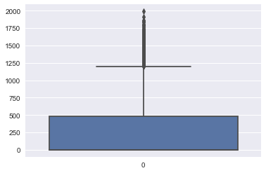
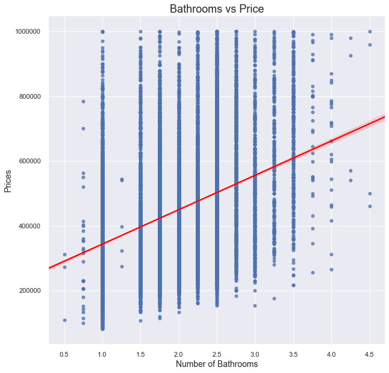

## Final Project Submission

Please fill out:
* Student name: Eric Cusick
* Student pace: Full time
* Scheduled project review date/time: 
* Instructor name: James Irving
* Blog post URL: https://ericusick.github.io/osemn_framework


### Overview

The goal of this project is to get an accurate data from the "kc_house_data.csv" file using linear regression model. When working through this final project we need to apply what we had learn from Module 2 of the course. Using modeling and work through the OSEMN Framework as a reference. The target audience are the sellers of the house looking to maximize their house's value. 

## OBTAIN


> Importing packages


```python
import pandas as pd
import numpy as np
import matplotlib.pyplot as plt
%matplotlib inline
import seaborn as sns
plt.style.use('seaborn')
```

> Loading in the dataset for the project and make sure it loaded correctly


```python
df = pd.read_csv("kc_house_data.csv")
df.head()
```


<div>
<style scoped>
    .dataframe tbody tr th:only-of-type {
        vertical-align: middle;
    }

    .dataframe tbody tr th {
        vertical-align: top;
    }

    .dataframe thead th {
        text-align: right;
    }
</style>
<table border="1" class="dataframe">
  <thead>
    <tr style="text-align: right;">
      <th></th>
      <th>id</th>
      <th>date</th>
      <th>price</th>
      <th>bedrooms</th>
      <th>bathrooms</th>
      <th>sqft_living</th>
      <th>sqft_lot</th>
      <th>floors</th>
      <th>waterfront</th>
      <th>view</th>
      <th>...</th>
      <th>grade</th>
      <th>sqft_above</th>
      <th>sqft_basement</th>
      <th>yr_built</th>
      <th>yr_renovated</th>
      <th>zipcode</th>
      <th>lat</th>
      <th>long</th>
      <th>sqft_living15</th>
      <th>sqft_lot15</th>
    </tr>
  </thead>
  <tbody>
    <tr>
      <td>0</td>
      <td>7129300520</td>
      <td>10/13/2014</td>
      <td>221900.0</td>
      <td>3</td>
      <td>1.00</td>
      <td>1180</td>
      <td>5650</td>
      <td>1.0</td>
      <td>NaN</td>
      <td>0.0</td>
      <td>...</td>
      <td>7</td>
      <td>1180</td>
      <td>0.0</td>
      <td>1955</td>
      <td>0.0</td>
      <td>98178</td>
      <td>47.5112</td>
      <td>-122.257</td>
      <td>1340</td>
      <td>5650</td>
    </tr>
    <tr>
      <td>1</td>
      <td>6414100192</td>
      <td>12/9/2014</td>
      <td>538000.0</td>
      <td>3</td>
      <td>2.25</td>
      <td>2570</td>
      <td>7242</td>
      <td>2.0</td>
      <td>0.0</td>
      <td>0.0</td>
      <td>...</td>
      <td>7</td>
      <td>2170</td>
      <td>400.0</td>
      <td>1951</td>
      <td>1991.0</td>
      <td>98125</td>
      <td>47.7210</td>
      <td>-122.319</td>
      <td>1690</td>
      <td>7639</td>
    </tr>
    <tr>
      <td>2</td>
      <td>5631500400</td>
      <td>2/25/2015</td>
      <td>180000.0</td>
      <td>2</td>
      <td>1.00</td>
      <td>770</td>
      <td>10000</td>
      <td>1.0</td>
      <td>0.0</td>
      <td>0.0</td>
      <td>...</td>
      <td>6</td>
      <td>770</td>
      <td>0.0</td>
      <td>1933</td>
      <td>NaN</td>
      <td>98028</td>
      <td>47.7379</td>
      <td>-122.233</td>
      <td>2720</td>
      <td>8062</td>
    </tr>
    <tr>
      <td>3</td>
      <td>2487200875</td>
      <td>12/9/2014</td>
      <td>604000.0</td>
      <td>4</td>
      <td>3.00</td>
      <td>1960</td>
      <td>5000</td>
      <td>1.0</td>
      <td>0.0</td>
      <td>0.0</td>
      <td>...</td>
      <td>7</td>
      <td>1050</td>
      <td>910.0</td>
      <td>1965</td>
      <td>0.0</td>
      <td>98136</td>
      <td>47.5208</td>
      <td>-122.393</td>
      <td>1360</td>
      <td>5000</td>
    </tr>
    <tr>
      <td>4</td>
      <td>1954400510</td>
      <td>2/18/2015</td>
      <td>510000.0</td>
      <td>3</td>
      <td>2.00</td>
      <td>1680</td>
      <td>8080</td>
      <td>1.0</td>
      <td>0.0</td>
      <td>0.0</td>
      <td>...</td>
      <td>8</td>
      <td>1680</td>
      <td>0.0</td>
      <td>1987</td>
      <td>0.0</td>
      <td>98074</td>
      <td>47.6168</td>
      <td>-122.045</td>
      <td>1800</td>
      <td>7503</td>
    </tr>
  </tbody>
</table>
<p>5 rows × 21 columns</p>
</div>


## SCRUBBING

### Previewing the Data

 >Checking Data Types


```python
df.info()
```

    <class 'pandas.core.frame.DataFrame'>
    RangeIndex: 21597 entries, 0 to 21596
    Data columns (total 21 columns):
    id               21597 non-null int64
    date             21597 non-null object
    price            21597 non-null float64
    bedrooms         21597 non-null int64
    bathrooms        21597 non-null float64
    sqft_living      21597 non-null int64
    sqft_lot         21597 non-null int64
    floors           21597 non-null float64
    waterfront       19221 non-null float64
    view             21534 non-null float64
    condition        21597 non-null int64
    grade            21597 non-null int64
    sqft_above       21597 non-null int64
    sqft_basement    21597 non-null object
    yr_built         21597 non-null int64
    yr_renovated     17755 non-null float64
    zipcode          21597 non-null int64
    lat              21597 non-null float64
    long             21597 non-null float64
    sqft_living15    21597 non-null int64
    sqft_lot15       21597 non-null int64
    dtypes: float64(8), int64(11), object(2)
    memory usage: 3.5+ MB
    


```python
# Both date and sqft_basement are object
```

>Checking out 'sqft_basement' column because it is listed as an object


```python
df.sqft_basement.unique()[:5]
```


    array(['0.0', '400.0', '910.0', '1530.0', '?'], dtype=object)


>Checking out the 'price' column


```python
df.price.unique()[:5]
```


    array([221900., 538000., 180000., 604000., 510000.])


```python
# It's a float dtype but ended up checking to make sure there was no weird 
# symbols
```

>Checking out the waterfront due to missing rows


```python
df.waterfront.unique()
```


    array([nan,  0.,  1.])


>Checking to see if there is any extraneous values


```python
for col in df:
    print(col, '\n', df[col].value_counts(normalize=True).head(), '\n\n')
```

    id 
     795000620     0.000139
    1825069031    0.000093
    2019200220    0.000093
    7129304540    0.000093
    1781500435    0.000093
    Name: id, dtype: float64 
    
    
    date 
     6/23/2014    0.006575
    6/25/2014    0.006066
    6/26/2014    0.006066
    7/8/2014     0.005880
    4/27/2015    0.005834
    Name: date, dtype: float64 
    
    
    price 
     350000.0    0.007964
    450000.0    0.007964
    550000.0    0.007362
    500000.0    0.007038
    425000.0    0.006945
    Name: price, dtype: float64 
    
    
    bedrooms 
     3    0.454878
    4    0.318655
    2    0.127796
    5    0.074131
    6    0.012594
    Name: bedrooms, dtype: float64 
    
    
    bathrooms 
     2.50    0.248970
    1.00    0.178312
    1.75    0.141131
    2.25    0.094782
    2.00    0.089364
    Name: bathrooms, dtype: float64 
    
    
    sqft_living 
     1300    0.006390
    1400    0.006251
    1440    0.006158
    1660    0.005973
    1010    0.005973
    Name: sqft_living, dtype: float64 
    
    
    sqft_lot 
     5000    0.016576
    6000    0.013428
    4000    0.011622
    7200    0.010187
    7500    0.005510
    Name: sqft_lot, dtype: float64 
    
    
    floors 
     1.0    0.494189
    2.0    0.381303
    1.5    0.088438
    3.0    0.028291
    2.5    0.007455
    Name: floors, dtype: float64 
    
    
    waterfront 
     0.0    0.992404
    1.0    0.007596
    Name: waterfront, dtype: float64 
    
    
    view 
     0.0    0.901923
    2.0    0.044441
    3.0    0.023591
    1.0    0.015325
    4.0    0.014721
    Name: view, dtype: float64 
    
    
    condition 
     3    0.649164
    4    0.262861
    5    0.078761
    2    0.007871
    1    0.001343
    Name: condition, dtype: float64 
    
    
    grade 
     7     0.415521
    8     0.280826
    9     0.121082
    6     0.094365
    10    0.052507
    Name: grade, dtype: float64 
    
    
    sqft_above 
     1300    0.009816
    1010    0.009724
    1200    0.009538
    1220    0.008890
    1140    0.008520
    Name: sqft_above, dtype: float64 
    
    
    sqft_basement 
     0.0      0.593879
    ?        0.021021
    600.0    0.010048
    500.0    0.009677
    700.0    0.009631
    Name: sqft_basement, dtype: float64 
    
    
    yr_built 
     2014    0.025883
    2006    0.020975
    2005    0.020836
    2004    0.020049
    2003    0.019447
    Name: yr_built, dtype: float64 
    
    
    yr_renovated 
     0.0       0.958096
    2014.0    0.004112
    2003.0    0.001746
    2013.0    0.001746
    2007.0    0.001690
    Name: yr_renovated, dtype: float64 
    
    
    zipcode 
     98103    0.027874
    98038    0.027272
    98115    0.026994
    98052    0.026578
    98117    0.025605
    Name: zipcode, dtype: float64 
    
    
    lat 
     47.6624    0.000787
    47.5491    0.000787
    47.5322    0.000787
    47.6846    0.000787
    47.6711    0.000741
    Name: lat, dtype: float64 
    
    
    long 
     -122.290    0.005325
    -122.300    0.005140
    -122.362    0.004815
    -122.291    0.004630
    -122.372    0.004584
    Name: long, dtype: float64 
    
    
    sqft_living15 
     1540    0.009122
    1440    0.009029
    1560    0.008890
    1500    0.008334
    1460    0.007825
    Name: sqft_living15, dtype: float64 
    
    
    sqft_lot15 
     5000    0.019771
    4000    0.016484
    6000    0.013335
    7200    0.009724
    4800    0.006714
    Name: sqft_lot15, dtype: float64 
    
    
    


```python
# Columns that have extraneous values: sqft_basement
```

>Checking for missing values


```python
df.isna().sum()
```


    id                  0
    date                0
    price               0
    bedrooms            0
    bathrooms           0
    sqft_living         0
    sqft_lot            0
    floors              0
    waterfront       2376
    view               63
    condition           0
    grade               0
    sqft_above          0
    sqft_basement       0
    yr_built            0
    yr_renovated     3842
    zipcode             0
    lat                 0
    long                0
    sqft_living15       0
    sqft_lot15          0
    dtype: int64


```python
# Waterfront, yr_renovated, and view are missing some values

# May be a good idea to fill in the view with the mode or remove the rows
# altogether

# Waterfront nan should be mark with a 0 under the assumption the house is not
# on a waterfront

# yr_renovated needs to be transform into a numeric boolean value
```

>Using .describe() to take a look at some of the min and max values in each columns


```python
df.describe()
```


<div>
<style scoped>
    .dataframe tbody tr th:only-of-type {
        vertical-align: middle;
    }

    .dataframe tbody tr th {
        vertical-align: top;
    }

    .dataframe thead th {
        text-align: right;
    }
</style>
<table border="1" class="dataframe">
  <thead>
    <tr style="text-align: right;">
      <th></th>
      <th>id</th>
      <th>price</th>
      <th>bedrooms</th>
      <th>bathrooms</th>
      <th>sqft_living</th>
      <th>sqft_lot</th>
      <th>floors</th>
      <th>waterfront</th>
      <th>view</th>
      <th>condition</th>
      <th>grade</th>
      <th>sqft_above</th>
      <th>yr_built</th>
      <th>yr_renovated</th>
      <th>zipcode</th>
      <th>lat</th>
      <th>long</th>
      <th>sqft_living15</th>
      <th>sqft_lot15</th>
    </tr>
  </thead>
  <tbody>
    <tr>
      <td>count</td>
      <td>2.159700e+04</td>
      <td>2.159700e+04</td>
      <td>21597.000000</td>
      <td>21597.000000</td>
      <td>21597.000000</td>
      <td>2.159700e+04</td>
      <td>21597.000000</td>
      <td>19221.000000</td>
      <td>21534.000000</td>
      <td>21597.000000</td>
      <td>21597.000000</td>
      <td>21597.000000</td>
      <td>21597.000000</td>
      <td>17755.000000</td>
      <td>21597.000000</td>
      <td>21597.000000</td>
      <td>21597.000000</td>
      <td>21597.000000</td>
      <td>21597.000000</td>
    </tr>
    <tr>
      <td>mean</td>
      <td>4.580474e+09</td>
      <td>5.402966e+05</td>
      <td>3.373200</td>
      <td>2.115826</td>
      <td>2080.321850</td>
      <td>1.509941e+04</td>
      <td>1.494096</td>
      <td>0.007596</td>
      <td>0.233863</td>
      <td>3.409825</td>
      <td>7.657915</td>
      <td>1788.596842</td>
      <td>1970.999676</td>
      <td>83.636778</td>
      <td>98077.951845</td>
      <td>47.560093</td>
      <td>-122.213982</td>
      <td>1986.620318</td>
      <td>12758.283512</td>
    </tr>
    <tr>
      <td>std</td>
      <td>2.876736e+09</td>
      <td>3.673681e+05</td>
      <td>0.926299</td>
      <td>0.768984</td>
      <td>918.106125</td>
      <td>4.141264e+04</td>
      <td>0.539683</td>
      <td>0.086825</td>
      <td>0.765686</td>
      <td>0.650546</td>
      <td>1.173200</td>
      <td>827.759761</td>
      <td>29.375234</td>
      <td>399.946414</td>
      <td>53.513072</td>
      <td>0.138552</td>
      <td>0.140724</td>
      <td>685.230472</td>
      <td>27274.441950</td>
    </tr>
    <tr>
      <td>min</td>
      <td>1.000102e+06</td>
      <td>7.800000e+04</td>
      <td>1.000000</td>
      <td>0.500000</td>
      <td>370.000000</td>
      <td>5.200000e+02</td>
      <td>1.000000</td>
      <td>0.000000</td>
      <td>0.000000</td>
      <td>1.000000</td>
      <td>3.000000</td>
      <td>370.000000</td>
      <td>1900.000000</td>
      <td>0.000000</td>
      <td>98001.000000</td>
      <td>47.155900</td>
      <td>-122.519000</td>
      <td>399.000000</td>
      <td>651.000000</td>
    </tr>
    <tr>
      <td>25%</td>
      <td>2.123049e+09</td>
      <td>3.220000e+05</td>
      <td>3.000000</td>
      <td>1.750000</td>
      <td>1430.000000</td>
      <td>5.040000e+03</td>
      <td>1.000000</td>
      <td>0.000000</td>
      <td>0.000000</td>
      <td>3.000000</td>
      <td>7.000000</td>
      <td>1190.000000</td>
      <td>1951.000000</td>
      <td>0.000000</td>
      <td>98033.000000</td>
      <td>47.471100</td>
      <td>-122.328000</td>
      <td>1490.000000</td>
      <td>5100.000000</td>
    </tr>
    <tr>
      <td>50%</td>
      <td>3.904930e+09</td>
      <td>4.500000e+05</td>
      <td>3.000000</td>
      <td>2.250000</td>
      <td>1910.000000</td>
      <td>7.618000e+03</td>
      <td>1.500000</td>
      <td>0.000000</td>
      <td>0.000000</td>
      <td>3.000000</td>
      <td>7.000000</td>
      <td>1560.000000</td>
      <td>1975.000000</td>
      <td>0.000000</td>
      <td>98065.000000</td>
      <td>47.571800</td>
      <td>-122.231000</td>
      <td>1840.000000</td>
      <td>7620.000000</td>
    </tr>
    <tr>
      <td>75%</td>
      <td>7.308900e+09</td>
      <td>6.450000e+05</td>
      <td>4.000000</td>
      <td>2.500000</td>
      <td>2550.000000</td>
      <td>1.068500e+04</td>
      <td>2.000000</td>
      <td>0.000000</td>
      <td>0.000000</td>
      <td>4.000000</td>
      <td>8.000000</td>
      <td>2210.000000</td>
      <td>1997.000000</td>
      <td>0.000000</td>
      <td>98118.000000</td>
      <td>47.678000</td>
      <td>-122.125000</td>
      <td>2360.000000</td>
      <td>10083.000000</td>
    </tr>
    <tr>
      <td>max</td>
      <td>9.900000e+09</td>
      <td>7.700000e+06</td>
      <td>33.000000</td>
      <td>8.000000</td>
      <td>13540.000000</td>
      <td>1.651359e+06</td>
      <td>3.500000</td>
      <td>1.000000</td>
      <td>4.000000</td>
      <td>5.000000</td>
      <td>13.000000</td>
      <td>9410.000000</td>
      <td>2015.000000</td>
      <td>2015.000000</td>
      <td>98199.000000</td>
      <td>47.777600</td>
      <td>-121.315000</td>
      <td>6210.000000</td>
      <td>871200.000000</td>
    </tr>
  </tbody>
</table>
</div>


```python
# 'sqft_basement' and 'date' columns are missing due to being an object
# we would want to have the sqft_basement to be an integer/float
# the 'date' can be left alone as it is a categorical data
```

### Cleaning/Fixing Data

>Converting the 'sqft_basement' dtype from an object to a number


```python
df.sqft_basement.head(10)
```


    0       0.0
    1     400.0
    2       0.0
    3     910.0
    4       0.0
    5    1530.0
    6         ?
    7       0.0
    8     730.0
    9       0.0
    Name: sqft_basement, dtype: object


```python
# Needs to fix it into a mean!!!!!!!
df.sqft_basement = df.sqft_basement.replace('?', np.nan)
```


```python
df.sqft_basement.head(10)
```


    0       0.0
    1     400.0
    2       0.0
    3     910.0
    4       0.0
    5    1530.0
    6       NaN
    7       0.0
    8     730.0
    9       0.0
    Name: sqft_basement, dtype: object


```python
df.sqft_basement = df.sqft_basement.astype('float64')
# not a perament change yet
```


```python
df.sqft_basement = df.sqft_basement.fillna(np.nanmedian(df.sqft_basement))
```


```python
df.sqft_basement.head(10)
```


    0       0.0
    1     400.0
    2       0.0
    3     910.0
    4       0.0
    5    1530.0
    6       0.0
    7       0.0
    8     730.0
    9       0.0
    Name: sqft_basement, dtype: float64


>Taking care of missing values in the dataset

>Replace all missing value in 'waterfront' to a 0 assuming that the house is not on a waterfront


```python
df.waterfront = df.waterfront.fillna(0)
```


```python
df.waterfront.unique()
```


    array([0., 1.])


>Filling in the missing values for 'view' column with a 0


```python
df.view = df.view.fillna(0)
```


```python
df.view.unique()
```


    array([0., 3., 4., 2., 1.])


>Filling in the missing values for 'yr_renovated' with a 0 assuming that they have not been renovated


```python
df.yr_renovated = df.yr_renovated.fillna(0)
```


```python
df.yr_renovated.unique()
```


    array([   0., 1991., 2002., 2010., 1992., 2013., 1994., 1978., 2005.,
           2003., 1984., 1954., 2014., 2011., 1983., 1945., 1990., 1988.,
           1977., 1981., 1995., 2000., 1999., 1998., 1970., 1989., 2004.,
           1986., 2007., 1987., 2006., 1985., 2001., 1980., 1971., 1979.,
           1997., 1950., 1969., 1948., 2009., 2015., 1974., 2008., 1968.,
           2012., 1963., 1951., 1962., 1953., 1993., 1996., 1955., 1982.,
           1956., 1940., 1976., 1946., 1975., 1964., 1973., 1957., 1959.,
           1960., 1967., 1965., 1934., 1972., 1944., 1958.])


```python
df.isna().sum()
```


    id               0
    date             0
    price            0
    bedrooms         0
    bathrooms        0
    sqft_living      0
    sqft_lot         0
    floors           0
    waterfront       0
    view             0
    condition        0
    grade            0
    sqft_above       0
    sqft_basement    0
    yr_built         0
    yr_renovated     0
    zipcode          0
    lat              0
    long             0
    sqft_living15    0
    sqft_lot15       0
    dtype: int64


```python
# All missing values has been replaced
```

>Checking the .describe() for changes


```python
df.describe()
```


<div>
<style scoped>
    .dataframe tbody tr th:only-of-type {
        vertical-align: middle;
    }

    .dataframe tbody tr th {
        vertical-align: top;
    }

    .dataframe thead th {
        text-align: right;
    }
</style>
<table border="1" class="dataframe">
  <thead>
    <tr style="text-align: right;">
      <th></th>
      <th>id</th>
      <th>price</th>
      <th>bedrooms</th>
      <th>bathrooms</th>
      <th>sqft_living</th>
      <th>sqft_lot</th>
      <th>floors</th>
      <th>waterfront</th>
      <th>view</th>
      <th>condition</th>
      <th>grade</th>
      <th>sqft_above</th>
      <th>sqft_basement</th>
      <th>yr_built</th>
      <th>yr_renovated</th>
      <th>zipcode</th>
      <th>lat</th>
      <th>long</th>
      <th>sqft_living15</th>
      <th>sqft_lot15</th>
    </tr>
  </thead>
  <tbody>
    <tr>
      <td>count</td>
      <td>2.159700e+04</td>
      <td>2.159700e+04</td>
      <td>21597.000000</td>
      <td>21597.000000</td>
      <td>21597.000000</td>
      <td>2.159700e+04</td>
      <td>21597.000000</td>
      <td>21597.000000</td>
      <td>21597.000000</td>
      <td>21597.000000</td>
      <td>21597.000000</td>
      <td>21597.000000</td>
      <td>21597.000000</td>
      <td>21597.000000</td>
      <td>21597.000000</td>
      <td>21597.000000</td>
      <td>21597.000000</td>
      <td>21597.000000</td>
      <td>21597.000000</td>
      <td>21597.000000</td>
    </tr>
    <tr>
      <td>mean</td>
      <td>4.580474e+09</td>
      <td>5.402966e+05</td>
      <td>3.373200</td>
      <td>2.115826</td>
      <td>2080.321850</td>
      <td>1.509941e+04</td>
      <td>1.494096</td>
      <td>0.006760</td>
      <td>0.233181</td>
      <td>3.409825</td>
      <td>7.657915</td>
      <td>1788.596842</td>
      <td>285.716581</td>
      <td>1970.999676</td>
      <td>68.758207</td>
      <td>98077.951845</td>
      <td>47.560093</td>
      <td>-122.213982</td>
      <td>1986.620318</td>
      <td>12758.283512</td>
    </tr>
    <tr>
      <td>std</td>
      <td>2.876736e+09</td>
      <td>3.673681e+05</td>
      <td>0.926299</td>
      <td>0.768984</td>
      <td>918.106125</td>
      <td>4.141264e+04</td>
      <td>0.539683</td>
      <td>0.081944</td>
      <td>0.764673</td>
      <td>0.650546</td>
      <td>1.173200</td>
      <td>827.759761</td>
      <td>439.819830</td>
      <td>29.375234</td>
      <td>364.037499</td>
      <td>53.513072</td>
      <td>0.138552</td>
      <td>0.140724</td>
      <td>685.230472</td>
      <td>27274.441950</td>
    </tr>
    <tr>
      <td>min</td>
      <td>1.000102e+06</td>
      <td>7.800000e+04</td>
      <td>1.000000</td>
      <td>0.500000</td>
      <td>370.000000</td>
      <td>5.200000e+02</td>
      <td>1.000000</td>
      <td>0.000000</td>
      <td>0.000000</td>
      <td>1.000000</td>
      <td>3.000000</td>
      <td>370.000000</td>
      <td>0.000000</td>
      <td>1900.000000</td>
      <td>0.000000</td>
      <td>98001.000000</td>
      <td>47.155900</td>
      <td>-122.519000</td>
      <td>399.000000</td>
      <td>651.000000</td>
    </tr>
    <tr>
      <td>25%</td>
      <td>2.123049e+09</td>
      <td>3.220000e+05</td>
      <td>3.000000</td>
      <td>1.750000</td>
      <td>1430.000000</td>
      <td>5.040000e+03</td>
      <td>1.000000</td>
      <td>0.000000</td>
      <td>0.000000</td>
      <td>3.000000</td>
      <td>7.000000</td>
      <td>1190.000000</td>
      <td>0.000000</td>
      <td>1951.000000</td>
      <td>0.000000</td>
      <td>98033.000000</td>
      <td>47.471100</td>
      <td>-122.328000</td>
      <td>1490.000000</td>
      <td>5100.000000</td>
    </tr>
    <tr>
      <td>50%</td>
      <td>3.904930e+09</td>
      <td>4.500000e+05</td>
      <td>3.000000</td>
      <td>2.250000</td>
      <td>1910.000000</td>
      <td>7.618000e+03</td>
      <td>1.500000</td>
      <td>0.000000</td>
      <td>0.000000</td>
      <td>3.000000</td>
      <td>7.000000</td>
      <td>1560.000000</td>
      <td>0.000000</td>
      <td>1975.000000</td>
      <td>0.000000</td>
      <td>98065.000000</td>
      <td>47.571800</td>
      <td>-122.231000</td>
      <td>1840.000000</td>
      <td>7620.000000</td>
    </tr>
    <tr>
      <td>75%</td>
      <td>7.308900e+09</td>
      <td>6.450000e+05</td>
      <td>4.000000</td>
      <td>2.500000</td>
      <td>2550.000000</td>
      <td>1.068500e+04</td>
      <td>2.000000</td>
      <td>0.000000</td>
      <td>0.000000</td>
      <td>4.000000</td>
      <td>8.000000</td>
      <td>2210.000000</td>
      <td>550.000000</td>
      <td>1997.000000</td>
      <td>0.000000</td>
      <td>98118.000000</td>
      <td>47.678000</td>
      <td>-122.125000</td>
      <td>2360.000000</td>
      <td>10083.000000</td>
    </tr>
    <tr>
      <td>max</td>
      <td>9.900000e+09</td>
      <td>7.700000e+06</td>
      <td>33.000000</td>
      <td>8.000000</td>
      <td>13540.000000</td>
      <td>1.651359e+06</td>
      <td>3.500000</td>
      <td>1.000000</td>
      <td>4.000000</td>
      <td>5.000000</td>
      <td>13.000000</td>
      <td>9410.000000</td>
      <td>4820.000000</td>
      <td>2015.000000</td>
      <td>2015.000000</td>
      <td>98199.000000</td>
      <td>47.777600</td>
      <td>-121.315000</td>
      <td>6210.000000</td>
      <td>871200.000000</td>
    </tr>
  </tbody>
</table>
</div>


```python
df.columns
```


    Index(['id', 'date', 'price', 'bedrooms', 'bathrooms', 'sqft_living',
           'sqft_lot', 'floors', 'waterfront', 'view', 'condition', 'grade',
           'sqft_above', 'sqft_basement', 'yr_built', 'yr_renovated', 'zipcode',
           'lat', 'long', 'sqft_living15', 'sqft_lot15'],
          dtype='object')


>Converting the date column to a datetime format to create a new column for months


```python
df.date = pd.to_datetime(df.date)
```


```python
df['month'] = df.date.dt.month
```

>Checking to see if the new columns 'month' were added to the dataset


```python
df.head()
```


<div>
<style scoped>
    .dataframe tbody tr th:only-of-type {
        vertical-align: middle;
    }

    .dataframe tbody tr th {
        vertical-align: top;
    }

    .dataframe thead th {
        text-align: right;
    }
</style>
<table border="1" class="dataframe">
  <thead>
    <tr style="text-align: right;">
      <th></th>
      <th>id</th>
      <th>date</th>
      <th>price</th>
      <th>bedrooms</th>
      <th>bathrooms</th>
      <th>sqft_living</th>
      <th>sqft_lot</th>
      <th>floors</th>
      <th>waterfront</th>
      <th>view</th>
      <th>...</th>
      <th>sqft_above</th>
      <th>sqft_basement</th>
      <th>yr_built</th>
      <th>yr_renovated</th>
      <th>zipcode</th>
      <th>lat</th>
      <th>long</th>
      <th>sqft_living15</th>
      <th>sqft_lot15</th>
      <th>month</th>
    </tr>
  </thead>
  <tbody>
    <tr>
      <td>0</td>
      <td>7129300520</td>
      <td>2014-10-13</td>
      <td>221900.0</td>
      <td>3</td>
      <td>1.00</td>
      <td>1180</td>
      <td>5650</td>
      <td>1.0</td>
      <td>0.0</td>
      <td>0.0</td>
      <td>...</td>
      <td>1180</td>
      <td>0.0</td>
      <td>1955</td>
      <td>0.0</td>
      <td>98178</td>
      <td>47.5112</td>
      <td>-122.257</td>
      <td>1340</td>
      <td>5650</td>
      <td>10</td>
    </tr>
    <tr>
      <td>1</td>
      <td>6414100192</td>
      <td>2014-12-09</td>
      <td>538000.0</td>
      <td>3</td>
      <td>2.25</td>
      <td>2570</td>
      <td>7242</td>
      <td>2.0</td>
      <td>0.0</td>
      <td>0.0</td>
      <td>...</td>
      <td>2170</td>
      <td>400.0</td>
      <td>1951</td>
      <td>1991.0</td>
      <td>98125</td>
      <td>47.7210</td>
      <td>-122.319</td>
      <td>1690</td>
      <td>7639</td>
      <td>12</td>
    </tr>
    <tr>
      <td>2</td>
      <td>5631500400</td>
      <td>2015-02-25</td>
      <td>180000.0</td>
      <td>2</td>
      <td>1.00</td>
      <td>770</td>
      <td>10000</td>
      <td>1.0</td>
      <td>0.0</td>
      <td>0.0</td>
      <td>...</td>
      <td>770</td>
      <td>0.0</td>
      <td>1933</td>
      <td>0.0</td>
      <td>98028</td>
      <td>47.7379</td>
      <td>-122.233</td>
      <td>2720</td>
      <td>8062</td>
      <td>2</td>
    </tr>
    <tr>
      <td>3</td>
      <td>2487200875</td>
      <td>2014-12-09</td>
      <td>604000.0</td>
      <td>4</td>
      <td>3.00</td>
      <td>1960</td>
      <td>5000</td>
      <td>1.0</td>
      <td>0.0</td>
      <td>0.0</td>
      <td>...</td>
      <td>1050</td>
      <td>910.0</td>
      <td>1965</td>
      <td>0.0</td>
      <td>98136</td>
      <td>47.5208</td>
      <td>-122.393</td>
      <td>1360</td>
      <td>5000</td>
      <td>12</td>
    </tr>
    <tr>
      <td>4</td>
      <td>1954400510</td>
      <td>2015-02-18</td>
      <td>510000.0</td>
      <td>3</td>
      <td>2.00</td>
      <td>1680</td>
      <td>8080</td>
      <td>1.0</td>
      <td>0.0</td>
      <td>0.0</td>
      <td>...</td>
      <td>1680</td>
      <td>0.0</td>
      <td>1987</td>
      <td>0.0</td>
      <td>98074</td>
      <td>47.6168</td>
      <td>-122.045</td>
      <td>1800</td>
      <td>7503</td>
      <td>2</td>
    </tr>
  </tbody>
</table>
<p>5 rows × 22 columns</p>
</div>


>Dropping the 'date' column, we're only interested in the months


```python
df = df.drop('date', axis=1)
```

>Converting the datatype in 'yr_renovated' to a boolean value


```python
df['yr_renovated'] = df['yr_renovated'].astype('bool')
```


```python
df['yr_renovated'].value_counts()
```


    False    20853
    True       744
    Name: yr_renovated, dtype: int64


```python
df['yr_renovated'] = df['yr_renovated'].astype('int')
```


```python
df['yr_renovated'].value_counts()
```


    0    20853
    1      744
    Name: yr_renovated, dtype: int64


### One-Hot Encoding Categorical Columns


```python
# Using columns 'condition', 'grade', 'zipcode' to check out the number of 
# unique values in each columns to see what is worth OHE

df[['condition', 'grade', 'zipcode']].nunique()
```


    condition     5
    grade        11
    zipcode      70
    dtype: int64


```python
fig, axes = plt.subplots(nrows=1, ncols=3, figsize=(16,10), sharey=True)

feats = ['condition', 'grade', 'zipcode']

for col, ax in zip(feats, axes.flatten()):
    (df.groupby(col)               
         .mean()['price']        
         .sort_values()              
         .plot
         .bar(ax=ax))                
    
    ax.set_title(col)                
fig.tight_layout()
```


```python
df_=df.copy()
```


```python
df = pd.get_dummies(df_, columns = feats, drop_first=True)
df
# df_preprocessed = df.drop(feats, axis=1)
# df_preprocessed = pd.concat([df_preprocessed, dummies], axis=1)
# df_preprocessed.head()
```


<div>
<style scoped>
    .dataframe tbody tr th:only-of-type {
        vertical-align: middle;
    }

    .dataframe tbody tr th {
        vertical-align: top;
    }

    .dataframe thead th {
        text-align: right;
    }
</style>
<table border="1" class="dataframe">
  <thead>
    <tr style="text-align: right;">
      <th></th>
      <th>id</th>
      <th>price</th>
      <th>bedrooms</th>
      <th>bathrooms</th>
      <th>sqft_living</th>
      <th>sqft_lot</th>
      <th>floors</th>
      <th>waterfront</th>
      <th>view</th>
      <th>sqft_above</th>
      <th>...</th>
      <th>zipcode_98146</th>
      <th>zipcode_98148</th>
      <th>zipcode_98155</th>
      <th>zipcode_98166</th>
      <th>zipcode_98168</th>
      <th>zipcode_98177</th>
      <th>zipcode_98178</th>
      <th>zipcode_98188</th>
      <th>zipcode_98198</th>
      <th>zipcode_98199</th>
    </tr>
  </thead>
  <tbody>
    <tr>
      <td>0</td>
      <td>7129300520</td>
      <td>221900.0</td>
      <td>3</td>
      <td>1.00</td>
      <td>1180</td>
      <td>5650</td>
      <td>1.0</td>
      <td>0.0</td>
      <td>0.0</td>
      <td>1180</td>
      <td>...</td>
      <td>0</td>
      <td>0</td>
      <td>0</td>
      <td>0</td>
      <td>0</td>
      <td>0</td>
      <td>1</td>
      <td>0</td>
      <td>0</td>
      <td>0</td>
    </tr>
    <tr>
      <td>1</td>
      <td>6414100192</td>
      <td>538000.0</td>
      <td>3</td>
      <td>2.25</td>
      <td>2570</td>
      <td>7242</td>
      <td>2.0</td>
      <td>0.0</td>
      <td>0.0</td>
      <td>2170</td>
      <td>...</td>
      <td>0</td>
      <td>0</td>
      <td>0</td>
      <td>0</td>
      <td>0</td>
      <td>0</td>
      <td>0</td>
      <td>0</td>
      <td>0</td>
      <td>0</td>
    </tr>
    <tr>
      <td>2</td>
      <td>5631500400</td>
      <td>180000.0</td>
      <td>2</td>
      <td>1.00</td>
      <td>770</td>
      <td>10000</td>
      <td>1.0</td>
      <td>0.0</td>
      <td>0.0</td>
      <td>770</td>
      <td>...</td>
      <td>0</td>
      <td>0</td>
      <td>0</td>
      <td>0</td>
      <td>0</td>
      <td>0</td>
      <td>0</td>
      <td>0</td>
      <td>0</td>
      <td>0</td>
    </tr>
    <tr>
      <td>3</td>
      <td>2487200875</td>
      <td>604000.0</td>
      <td>4</td>
      <td>3.00</td>
      <td>1960</td>
      <td>5000</td>
      <td>1.0</td>
      <td>0.0</td>
      <td>0.0</td>
      <td>1050</td>
      <td>...</td>
      <td>0</td>
      <td>0</td>
      <td>0</td>
      <td>0</td>
      <td>0</td>
      <td>0</td>
      <td>0</td>
      <td>0</td>
      <td>0</td>
      <td>0</td>
    </tr>
    <tr>
      <td>4</td>
      <td>1954400510</td>
      <td>510000.0</td>
      <td>3</td>
      <td>2.00</td>
      <td>1680</td>
      <td>8080</td>
      <td>1.0</td>
      <td>0.0</td>
      <td>0.0</td>
      <td>1680</td>
      <td>...</td>
      <td>0</td>
      <td>0</td>
      <td>0</td>
      <td>0</td>
      <td>0</td>
      <td>0</td>
      <td>0</td>
      <td>0</td>
      <td>0</td>
      <td>0</td>
    </tr>
    <tr>
      <td>...</td>
      <td>...</td>
      <td>...</td>
      <td>...</td>
      <td>...</td>
      <td>...</td>
      <td>...</td>
      <td>...</td>
      <td>...</td>
      <td>...</td>
      <td>...</td>
      <td>...</td>
      <td>...</td>
      <td>...</td>
      <td>...</td>
      <td>...</td>
      <td>...</td>
      <td>...</td>
      <td>...</td>
      <td>...</td>
      <td>...</td>
      <td>...</td>
    </tr>
    <tr>
      <td>21592</td>
      <td>263000018</td>
      <td>360000.0</td>
      <td>3</td>
      <td>2.50</td>
      <td>1530</td>
      <td>1131</td>
      <td>3.0</td>
      <td>0.0</td>
      <td>0.0</td>
      <td>1530</td>
      <td>...</td>
      <td>0</td>
      <td>0</td>
      <td>0</td>
      <td>0</td>
      <td>0</td>
      <td>0</td>
      <td>0</td>
      <td>0</td>
      <td>0</td>
      <td>0</td>
    </tr>
    <tr>
      <td>21593</td>
      <td>6600060120</td>
      <td>400000.0</td>
      <td>4</td>
      <td>2.50</td>
      <td>2310</td>
      <td>5813</td>
      <td>2.0</td>
      <td>0.0</td>
      <td>0.0</td>
      <td>2310</td>
      <td>...</td>
      <td>1</td>
      <td>0</td>
      <td>0</td>
      <td>0</td>
      <td>0</td>
      <td>0</td>
      <td>0</td>
      <td>0</td>
      <td>0</td>
      <td>0</td>
    </tr>
    <tr>
      <td>21594</td>
      <td>1523300141</td>
      <td>402101.0</td>
      <td>2</td>
      <td>0.75</td>
      <td>1020</td>
      <td>1350</td>
      <td>2.0</td>
      <td>0.0</td>
      <td>0.0</td>
      <td>1020</td>
      <td>...</td>
      <td>0</td>
      <td>0</td>
      <td>0</td>
      <td>0</td>
      <td>0</td>
      <td>0</td>
      <td>0</td>
      <td>0</td>
      <td>0</td>
      <td>0</td>
    </tr>
    <tr>
      <td>21595</td>
      <td>291310100</td>
      <td>400000.0</td>
      <td>3</td>
      <td>2.50</td>
      <td>1600</td>
      <td>2388</td>
      <td>2.0</td>
      <td>0.0</td>
      <td>0.0</td>
      <td>1600</td>
      <td>...</td>
      <td>0</td>
      <td>0</td>
      <td>0</td>
      <td>0</td>
      <td>0</td>
      <td>0</td>
      <td>0</td>
      <td>0</td>
      <td>0</td>
      <td>0</td>
    </tr>
    <tr>
      <td>21596</td>
      <td>1523300157</td>
      <td>325000.0</td>
      <td>2</td>
      <td>0.75</td>
      <td>1020</td>
      <td>1076</td>
      <td>2.0</td>
      <td>0.0</td>
      <td>0.0</td>
      <td>1020</td>
      <td>...</td>
      <td>0</td>
      <td>0</td>
      <td>0</td>
      <td>0</td>
      <td>0</td>
      <td>0</td>
      <td>0</td>
      <td>0</td>
      <td>0</td>
      <td>0</td>
    </tr>
  </tbody>
</table>
<p>21597 rows × 101 columns</p>
</div>


### Checking for Multicollinearity 

>Investigating whether multicollinearity exists in 'sqft' columns


```python
sqft_col = ['sqft_living', 'sqft_lot', 'sqft_above', 'sqft_basement', 
            'sqft_living15', 'sqft_lot15']
for col in sqft_col:
    t_f = col in df.columns
    print(f"{col}={t_f}")
```

    sqft_living=True
    sqft_lot=True
    sqft_above=True
    sqft_basement=True
    sqft_living15=True
    sqft_lot15=True
    


```python
df[sqft_col].corr()
```


<div>
<style scoped>
    .dataframe tbody tr th:only-of-type {
        vertical-align: middle;
    }

    .dataframe tbody tr th {
        vertical-align: top;
    }

    .dataframe thead th {
        text-align: right;
    }
</style>
<table border="1" class="dataframe">
  <thead>
    <tr style="text-align: right;">
      <th></th>
      <th>sqft_living</th>
      <th>sqft_lot</th>
      <th>sqft_above</th>
      <th>sqft_basement</th>
      <th>sqft_living15</th>
      <th>sqft_lot15</th>
    </tr>
  </thead>
  <tbody>
    <tr>
      <td>sqft_living</td>
      <td>1.000000</td>
      <td>0.173453</td>
      <td>0.876448</td>
      <td>0.428660</td>
      <td>0.756402</td>
      <td>0.184342</td>
    </tr>
    <tr>
      <td>sqft_lot</td>
      <td>0.173453</td>
      <td>1.000000</td>
      <td>0.184139</td>
      <td>0.015031</td>
      <td>0.144763</td>
      <td>0.718204</td>
    </tr>
    <tr>
      <td>sqft_above</td>
      <td>0.876448</td>
      <td>0.184139</td>
      <td>1.000000</td>
      <td>-0.051175</td>
      <td>0.731767</td>
      <td>0.195077</td>
    </tr>
    <tr>
      <td>sqft_basement</td>
      <td>0.428660</td>
      <td>0.015031</td>
      <td>-0.051175</td>
      <td>1.000000</td>
      <td>0.199288</td>
      <td>0.015885</td>
    </tr>
    <tr>
      <td>sqft_living15</td>
      <td>0.756402</td>
      <td>0.144763</td>
      <td>0.731767</td>
      <td>0.199288</td>
      <td>1.000000</td>
      <td>0.183515</td>
    </tr>
    <tr>
      <td>sqft_lot15</td>
      <td>0.184342</td>
      <td>0.718204</td>
      <td>0.195077</td>
      <td>0.015885</td>
      <td>0.183515</td>
      <td>1.000000</td>
    </tr>
  </tbody>
</table>
</div>


```python
sns.heatmap(df[sqft_col].corr(), center=0, annot=True);
```


```python
# There seems to be a significant correlation between:
# 'sqft_living' and 'sqft_above'
# 'sqft_living' and 'sqft_living15' 
# 'sqft_lot' and 'sqft_lot15'
# 'sqft_above' and 'sqft_living15'

# I would eliminate the columns 'sqft_above', 'sqft_living15', 'sqft_lot15'
```

>Removing Columns from the Dataset


```python
df = df.drop(['view', 'lat', 'long', 'sqft_above', 'sqft_living15', 'sqft_lot15', 'id'], axis=1)
```


```python
df.head()
```


<div>
<style scoped>
    .dataframe tbody tr th:only-of-type {
        vertical-align: middle;
    }

    .dataframe tbody tr th {
        vertical-align: top;
    }

    .dataframe thead th {
        text-align: right;
    }
</style>
<table border="1" class="dataframe">
  <thead>
    <tr style="text-align: right;">
      <th></th>
      <th>price</th>
      <th>bedrooms</th>
      <th>bathrooms</th>
      <th>sqft_living</th>
      <th>sqft_lot</th>
      <th>floors</th>
      <th>waterfront</th>
      <th>sqft_basement</th>
      <th>yr_built</th>
      <th>yr_renovated</th>
      <th>...</th>
      <th>zipcode_98146</th>
      <th>zipcode_98148</th>
      <th>zipcode_98155</th>
      <th>zipcode_98166</th>
      <th>zipcode_98168</th>
      <th>zipcode_98177</th>
      <th>zipcode_98178</th>
      <th>zipcode_98188</th>
      <th>zipcode_98198</th>
      <th>zipcode_98199</th>
    </tr>
  </thead>
  <tbody>
    <tr>
      <td>0</td>
      <td>221900.0</td>
      <td>3</td>
      <td>1.00</td>
      <td>1180</td>
      <td>5650</td>
      <td>1.0</td>
      <td>0.0</td>
      <td>0.0</td>
      <td>1955</td>
      <td>0</td>
      <td>...</td>
      <td>0</td>
      <td>0</td>
      <td>0</td>
      <td>0</td>
      <td>0</td>
      <td>0</td>
      <td>1</td>
      <td>0</td>
      <td>0</td>
      <td>0</td>
    </tr>
    <tr>
      <td>1</td>
      <td>538000.0</td>
      <td>3</td>
      <td>2.25</td>
      <td>2570</td>
      <td>7242</td>
      <td>2.0</td>
      <td>0.0</td>
      <td>400.0</td>
      <td>1951</td>
      <td>1</td>
      <td>...</td>
      <td>0</td>
      <td>0</td>
      <td>0</td>
      <td>0</td>
      <td>0</td>
      <td>0</td>
      <td>0</td>
      <td>0</td>
      <td>0</td>
      <td>0</td>
    </tr>
    <tr>
      <td>2</td>
      <td>180000.0</td>
      <td>2</td>
      <td>1.00</td>
      <td>770</td>
      <td>10000</td>
      <td>1.0</td>
      <td>0.0</td>
      <td>0.0</td>
      <td>1933</td>
      <td>0</td>
      <td>...</td>
      <td>0</td>
      <td>0</td>
      <td>0</td>
      <td>0</td>
      <td>0</td>
      <td>0</td>
      <td>0</td>
      <td>0</td>
      <td>0</td>
      <td>0</td>
    </tr>
    <tr>
      <td>3</td>
      <td>604000.0</td>
      <td>4</td>
      <td>3.00</td>
      <td>1960</td>
      <td>5000</td>
      <td>1.0</td>
      <td>0.0</td>
      <td>910.0</td>
      <td>1965</td>
      <td>0</td>
      <td>...</td>
      <td>0</td>
      <td>0</td>
      <td>0</td>
      <td>0</td>
      <td>0</td>
      <td>0</td>
      <td>0</td>
      <td>0</td>
      <td>0</td>
      <td>0</td>
    </tr>
    <tr>
      <td>4</td>
      <td>510000.0</td>
      <td>3</td>
      <td>2.00</td>
      <td>1680</td>
      <td>8080</td>
      <td>1.0</td>
      <td>0.0</td>
      <td>0.0</td>
      <td>1987</td>
      <td>0</td>
      <td>...</td>
      <td>0</td>
      <td>0</td>
      <td>0</td>
      <td>0</td>
      <td>0</td>
      <td>0</td>
      <td>0</td>
      <td>0</td>
      <td>0</td>
      <td>0</td>
    </tr>
  </tbody>
</table>
<p>5 rows × 94 columns</p>
</div>


## EXPLORING

### Quick Overview

>Histogram over each columns


```python
df.hist(bins = 'auto', figsize = (20,20));
```


### Exploring For Linearity


>Here we're just taking a peek at potentially important
correlation using 'price' based off of assumption and observation


```python
sns.jointplot('sqft_living', 'price', data=df, kind='reg'); 
```


```python
sns.jointplot('sqft_lot', 'price', data=df, kind='reg');
```


```python
sns.jointplot('floors', 'price', data=df, kind='reg');
```


```python
sns.jointplot('yr_renovated', 'price', data=df, kind='reg');
```


>I've found the website containing information retaining to the grade and condition criteria set by King County https://info.kingcounty.gov/assessor/esales/Glossary.aspx?type=r


```python
sns.jointplot('grade', 'price', data=df_, kind='reg');
```


```python
sns.stripplot('condition', 'price', data=df_);
sns.barplot('condition', 'price', data=df_);
```


```python
plt.figure(figsize = (15, 15))
df_.groupby('condition').boxplot(column = 'price')
```


    1         AxesSubplot(0.1,0.679412;0.363636x0.220588)
    2    AxesSubplot(0.536364,0.679412;0.363636x0.220588)
    3         AxesSubplot(0.1,0.414706;0.363636x0.220588)
    4    AxesSubplot(0.536364,0.414706;0.363636x0.220588)
    5             AxesSubplot(0.1,0.15;0.363636x0.220588)
    dtype: object


    <Figure size 1080x1080 with 0 Axes>


```python
sns.jointplot('bedrooms', 'price', data=df, kind='reg');
```


```python
sns.jointplot('bathrooms', 'price', data=df, kind='reg');
```


```python
sns.jointplot('month', 'price', data=df, kind='reg');
```


```python
sns.jointplot('zipcode', 'price', data=df_, kind='reg');
```


```python
sns.boxplot(df['price'])
```


    <matplotlib.axes._subplots.AxesSubplot at 0x1d0d7ee2f28>


```python
df_.groupby('zipcode').boxplot(column = 'price')
```


    98001        AxesSubplot(0.1,0.829245;0.0851064x0.0707547)
    98002    AxesSubplot(0.202128,0.829245;0.0851064x0.0707...
    98003    AxesSubplot(0.304255,0.829245;0.0851064x0.0707...
    98004    AxesSubplot(0.406383,0.829245;0.0851064x0.0707...
    98005    AxesSubplot(0.508511,0.829245;0.0851064x0.0707...
                                   ...                        
    98177       AxesSubplot(0.202128,0.15;0.0851064x0.0707547)
    98178       AxesSubplot(0.304255,0.15;0.0851064x0.0707547)
    98188       AxesSubplot(0.406383,0.15;0.0851064x0.0707547)
    98198       AxesSubplot(0.508511,0.15;0.0851064x0.0707547)
    98199       AxesSubplot(0.610638,0.15;0.0851064x0.0707547)
    Length: 70, dtype: object


## MODEL

### Setting Up the Data for Modeling

Importing packages for modeling


```python
from statsmodels.formula.api import ols
from statsmodels.stats.outliers_influence import variance_inflation_factor
import statsmodels.api as sm
import scipy.stats as stats
from sklearn.model_selection import train_test_split
```

>Haven't remove outliers yet


```python
df.head()
```


<div>
<style scoped>
    .dataframe tbody tr th:only-of-type {
        vertical-align: middle;
    }

    .dataframe tbody tr th {
        vertical-align: top;
    }

    .dataframe thead th {
        text-align: right;
    }
</style>
<table border="1" class="dataframe">
  <thead>
    <tr style="text-align: right;">
      <th></th>
      <th>price</th>
      <th>bedrooms</th>
      <th>bathrooms</th>
      <th>sqft_living</th>
      <th>sqft_lot</th>
      <th>floors</th>
      <th>waterfront</th>
      <th>sqft_basement</th>
      <th>yr_built</th>
      <th>yr_renovated</th>
      <th>...</th>
      <th>zipcode_98146</th>
      <th>zipcode_98148</th>
      <th>zipcode_98155</th>
      <th>zipcode_98166</th>
      <th>zipcode_98168</th>
      <th>zipcode_98177</th>
      <th>zipcode_98178</th>
      <th>zipcode_98188</th>
      <th>zipcode_98198</th>
      <th>zipcode_98199</th>
    </tr>
  </thead>
  <tbody>
    <tr>
      <td>0</td>
      <td>221900.0</td>
      <td>3</td>
      <td>1.00</td>
      <td>1180</td>
      <td>5650</td>
      <td>1.0</td>
      <td>0.0</td>
      <td>0.0</td>
      <td>1955</td>
      <td>0</td>
      <td>...</td>
      <td>0</td>
      <td>0</td>
      <td>0</td>
      <td>0</td>
      <td>0</td>
      <td>0</td>
      <td>1</td>
      <td>0</td>
      <td>0</td>
      <td>0</td>
    </tr>
    <tr>
      <td>1</td>
      <td>538000.0</td>
      <td>3</td>
      <td>2.25</td>
      <td>2570</td>
      <td>7242</td>
      <td>2.0</td>
      <td>0.0</td>
      <td>400.0</td>
      <td>1951</td>
      <td>1</td>
      <td>...</td>
      <td>0</td>
      <td>0</td>
      <td>0</td>
      <td>0</td>
      <td>0</td>
      <td>0</td>
      <td>0</td>
      <td>0</td>
      <td>0</td>
      <td>0</td>
    </tr>
    <tr>
      <td>2</td>
      <td>180000.0</td>
      <td>2</td>
      <td>1.00</td>
      <td>770</td>
      <td>10000</td>
      <td>1.0</td>
      <td>0.0</td>
      <td>0.0</td>
      <td>1933</td>
      <td>0</td>
      <td>...</td>
      <td>0</td>
      <td>0</td>
      <td>0</td>
      <td>0</td>
      <td>0</td>
      <td>0</td>
      <td>0</td>
      <td>0</td>
      <td>0</td>
      <td>0</td>
    </tr>
    <tr>
      <td>3</td>
      <td>604000.0</td>
      <td>4</td>
      <td>3.00</td>
      <td>1960</td>
      <td>5000</td>
      <td>1.0</td>
      <td>0.0</td>
      <td>910.0</td>
      <td>1965</td>
      <td>0</td>
      <td>...</td>
      <td>0</td>
      <td>0</td>
      <td>0</td>
      <td>0</td>
      <td>0</td>
      <td>0</td>
      <td>0</td>
      <td>0</td>
      <td>0</td>
      <td>0</td>
    </tr>
    <tr>
      <td>4</td>
      <td>510000.0</td>
      <td>3</td>
      <td>2.00</td>
      <td>1680</td>
      <td>8080</td>
      <td>1.0</td>
      <td>0.0</td>
      <td>0.0</td>
      <td>1987</td>
      <td>0</td>
      <td>...</td>
      <td>0</td>
      <td>0</td>
      <td>0</td>
      <td>0</td>
      <td>0</td>
      <td>0</td>
      <td>0</td>
      <td>0</td>
      <td>0</td>
      <td>0</td>
    </tr>
  </tbody>
</table>
<p>5 rows × 94 columns</p>
</div>


```python
# Checking to see if there is any spacing, symbols, etc. in the column's name
list(df.columns)
```


    ['price',
     'bedrooms',
     'bathrooms',
     'sqft_living',
     'sqft_lot',
     'floors',
     'waterfront',
     'sqft_basement',
     'yr_built',
     'yr_renovated',
     'month',
     'condition_2',
     'condition_3',
     'condition_4',
     'condition_5',
     'grade_4',
     'grade_5',
     'grade_6',
     'grade_7',
     'grade_8',
     'grade_9',
     'grade_10',
     'grade_11',
     'grade_12',
     'grade_13',
     'zipcode_98002',
     'zipcode_98003',
     'zipcode_98004',
     'zipcode_98005',
     'zipcode_98006',
     'zipcode_98007',
     'zipcode_98008',
     'zipcode_98010',
     'zipcode_98011',
     'zipcode_98014',
     'zipcode_98019',
     'zipcode_98022',
     'zipcode_98023',
     'zipcode_98024',
     'zipcode_98027',
     'zipcode_98028',
     'zipcode_98029',
     'zipcode_98030',
     'zipcode_98031',
     'zipcode_98032',
     'zipcode_98033',
     'zipcode_98034',
     'zipcode_98038',
     'zipcode_98039',
     'zipcode_98040',
     'zipcode_98042',
     'zipcode_98045',
     'zipcode_98052',
     'zipcode_98053',
     'zipcode_98055',
     'zipcode_98056',
     'zipcode_98058',
     'zipcode_98059',
     'zipcode_98065',
     'zipcode_98070',
     'zipcode_98072',
     'zipcode_98074',
     'zipcode_98075',
     'zipcode_98077',
     'zipcode_98092',
     'zipcode_98102',
     'zipcode_98103',
     'zipcode_98105',
     'zipcode_98106',
     'zipcode_98107',
     'zipcode_98108',
     'zipcode_98109',
     'zipcode_98112',
     'zipcode_98115',
     'zipcode_98116',
     'zipcode_98117',
     'zipcode_98118',
     'zipcode_98119',
     'zipcode_98122',
     'zipcode_98125',
     'zipcode_98126',
     'zipcode_98133',
     'zipcode_98136',
     'zipcode_98144',
     'zipcode_98146',
     'zipcode_98148',
     'zipcode_98155',
     'zipcode_98166',
     'zipcode_98168',
     'zipcode_98177',
     'zipcode_98178',
     'zipcode_98188',
     'zipcode_98198',
     'zipcode_98199']


```python
# Defining the problem
outcome = 'price'
x_cols = list(df.columns)
x_cols.remove(outcome)
```


```python
train, test = train_test_split(df)
```


```python
print(len(train), len(test))
train.head()
```

    16197 5400
    


<div>
<style scoped>
    .dataframe tbody tr th:only-of-type {
        vertical-align: middle;
    }

    .dataframe tbody tr th {
        vertical-align: top;
    }

    .dataframe thead th {
        text-align: right;
    }
</style>
<table border="1" class="dataframe">
  <thead>
    <tr style="text-align: right;">
      <th></th>
      <th>price</th>
      <th>bedrooms</th>
      <th>bathrooms</th>
      <th>sqft_living</th>
      <th>sqft_lot</th>
      <th>floors</th>
      <th>waterfront</th>
      <th>sqft_basement</th>
      <th>yr_built</th>
      <th>yr_renovated</th>
      <th>...</th>
      <th>zipcode_98146</th>
      <th>zipcode_98148</th>
      <th>zipcode_98155</th>
      <th>zipcode_98166</th>
      <th>zipcode_98168</th>
      <th>zipcode_98177</th>
      <th>zipcode_98178</th>
      <th>zipcode_98188</th>
      <th>zipcode_98198</th>
      <th>zipcode_98199</th>
    </tr>
  </thead>
  <tbody>
    <tr>
      <td>16802</td>
      <td>305000.0</td>
      <td>3</td>
      <td>2.0</td>
      <td>1830</td>
      <td>10873</td>
      <td>1.0</td>
      <td>0.0</td>
      <td>0.0</td>
      <td>1989</td>
      <td>0</td>
      <td>...</td>
      <td>0</td>
      <td>0</td>
      <td>0</td>
      <td>0</td>
      <td>0</td>
      <td>0</td>
      <td>0</td>
      <td>0</td>
      <td>0</td>
      <td>0</td>
    </tr>
    <tr>
      <td>525</td>
      <td>727500.0</td>
      <td>2</td>
      <td>2.0</td>
      <td>1240</td>
      <td>9119</td>
      <td>1.0</td>
      <td>0.0</td>
      <td>0.0</td>
      <td>1952</td>
      <td>0</td>
      <td>...</td>
      <td>0</td>
      <td>0</td>
      <td>0</td>
      <td>0</td>
      <td>0</td>
      <td>0</td>
      <td>0</td>
      <td>0</td>
      <td>0</td>
      <td>0</td>
    </tr>
    <tr>
      <td>2222</td>
      <td>275000.0</td>
      <td>3</td>
      <td>2.5</td>
      <td>1600</td>
      <td>7000</td>
      <td>2.0</td>
      <td>0.0</td>
      <td>0.0</td>
      <td>1993</td>
      <td>0</td>
      <td>...</td>
      <td>0</td>
      <td>0</td>
      <td>0</td>
      <td>0</td>
      <td>0</td>
      <td>0</td>
      <td>0</td>
      <td>0</td>
      <td>0</td>
      <td>0</td>
    </tr>
    <tr>
      <td>8780</td>
      <td>210000.0</td>
      <td>3</td>
      <td>2.0</td>
      <td>960</td>
      <td>9380</td>
      <td>1.0</td>
      <td>0.0</td>
      <td>0.0</td>
      <td>1949</td>
      <td>0</td>
      <td>...</td>
      <td>1</td>
      <td>0</td>
      <td>0</td>
      <td>0</td>
      <td>0</td>
      <td>0</td>
      <td>0</td>
      <td>0</td>
      <td>0</td>
      <td>0</td>
    </tr>
    <tr>
      <td>12419</td>
      <td>595000.0</td>
      <td>3</td>
      <td>2.5</td>
      <td>2250</td>
      <td>8300</td>
      <td>2.0</td>
      <td>0.0</td>
      <td>0.0</td>
      <td>2003</td>
      <td>0</td>
      <td>...</td>
      <td>0</td>
      <td>0</td>
      <td>0</td>
      <td>0</td>
      <td>0</td>
      <td>0</td>
      <td>0</td>
      <td>0</td>
      <td>0</td>
      <td>0</td>
    </tr>
  </tbody>
</table>
<p>5 rows × 94 columns</p>
</div>


```python
# Fitting the actual model
predictors = '+'.join(x_cols)
formula = outcome + '~' + predictors
model = ols(formula=formula, data=train).fit()
model.summary()
```


<table class="simpletable">
<caption>OLS Regression Results</caption>
<tr>
  <th>Dep. Variable:</th>          <td>price</td>      <th>  R-squared:         </th>  <td>   0.827</td>  
</tr>
<tr>
  <th>Model:</th>                   <td>OLS</td>       <th>  Adj. R-squared:    </th>  <td>   0.826</td>  
</tr>
<tr>
  <th>Method:</th>             <td>Least Squares</td>  <th>  F-statistic:       </th>  <td>   835.4</td>  
</tr>
<tr>
  <th>Date:</th>             <td>Fri, 18 Sep 2020</td> <th>  Prob (F-statistic):</th>   <td>  0.00</td>   
</tr>
<tr>
  <th>Time:</th>                 <td>17:21:40</td>     <th>  Log-Likelihood:    </th> <td>-2.1604e+05</td>
</tr>
<tr>
  <th>No. Observations:</th>      <td> 16197</td>      <th>  AIC:               </th>  <td>4.323e+05</td> 
</tr>
<tr>
  <th>Df Residuals:</th>          <td> 16104</td>      <th>  BIC:               </th>  <td>4.330e+05</td> 
</tr>
<tr>
  <th>Df Model:</th>              <td>    92</td>      <th>                     </th>      <td> </td>     
</tr>
<tr>
  <th>Covariance Type:</th>      <td>nonrobust</td>    <th>                     </th>      <td> </td>     
</tr>
</table>
<table class="simpletable">
<tr>
        <td></td>           <th>coef</th>     <th>std err</th>      <th>t</th>      <th>P>|t|</th>  <th>[0.025</th>    <th>0.975]</th>  
</tr>
<tr>
  <th>Intercept</th>     <td> 1.246e+06</td> <td> 1.31e+05</td> <td>    9.542</td> <td> 0.000</td> <td>  9.9e+05</td> <td>  1.5e+06</td>
</tr>
<tr>
  <th>bedrooms</th>      <td> -1.86e+04</td> <td> 1780.720</td> <td>  -10.444</td> <td> 0.000</td> <td>-2.21e+04</td> <td>-1.51e+04</td>
</tr>
<tr>
  <th>bathrooms</th>     <td> 2.689e+04</td> <td> 2861.049</td> <td>    9.400</td> <td> 0.000</td> <td> 2.13e+04</td> <td> 3.25e+04</td>
</tr>
<tr>
  <th>sqft_living</th>   <td>  170.9509</td> <td>    3.171</td> <td>   53.914</td> <td> 0.000</td> <td>  164.736</td> <td>  177.166</td>
</tr>
<tr>
  <th>sqft_lot</th>      <td>    0.1818</td> <td>    0.031</td> <td>    5.921</td> <td> 0.000</td> <td>    0.122</td> <td>    0.242</td>
</tr>
<tr>
  <th>floors</th>        <td>-2.742e+04</td> <td> 3429.443</td> <td>   -7.997</td> <td> 0.000</td> <td>-3.41e+04</td> <td>-2.07e+04</td>
</tr>
<tr>
  <th>waterfront</th>    <td>  8.05e+05</td> <td> 1.55e+04</td> <td>   52.075</td> <td> 0.000</td> <td> 7.75e+05</td> <td> 8.35e+05</td>
</tr>
<tr>
  <th>sqft_basement</th> <td>  -32.3862</td> <td>    3.915</td> <td>   -8.271</td> <td> 0.000</td> <td>  -40.061</td> <td>  -24.711</td>
</tr>
<tr>
  <th>yr_built</th>      <td> -578.7549</td> <td>   70.688</td> <td>   -8.187</td> <td> 0.000</td> <td> -717.311</td> <td> -440.199</td>
</tr>
<tr>
  <th>yr_renovated</th>  <td> 5.779e+04</td> <td> 6937.594</td> <td>    8.330</td> <td> 0.000</td> <td> 4.42e+04</td> <td> 7.14e+04</td>
</tr>
<tr>
  <th>month</th>         <td>-3150.6512</td> <td>  381.167</td> <td>   -8.266</td> <td> 0.000</td> <td>-3897.781</td> <td>-2403.522</td>
</tr>
<tr>
  <th>condition_2</th>   <td> 1.295e+05</td> <td> 4.01e+04</td> <td>    3.227</td> <td> 0.001</td> <td> 5.08e+04</td> <td> 2.08e+05</td>
</tr>
<tr>
  <th>condition_3</th>   <td> 1.536e+05</td> <td>  3.8e+04</td> <td>    4.044</td> <td> 0.000</td> <td> 7.92e+04</td> <td> 2.28e+05</td>
</tr>
<tr>
  <th>condition_4</th>   <td> 1.795e+05</td> <td>  3.8e+04</td> <td>    4.726</td> <td> 0.000</td> <td> 1.05e+05</td> <td> 2.54e+05</td>
</tr>
<tr>
  <th>condition_5</th>   <td> 2.178e+05</td> <td> 3.82e+04</td> <td>    5.708</td> <td> 0.000</td> <td> 1.43e+05</td> <td> 2.93e+05</td>
</tr>
<tr>
  <th>grade_4</th>       <td>-2.195e+05</td> <td> 3.08e+04</td> <td>   -7.134</td> <td> 0.000</td> <td> -2.8e+05</td> <td>-1.59e+05</td>
</tr>
<tr>
  <th>grade_5</th>       <td> -2.64e+05</td> <td> 1.66e+04</td> <td>  -15.902</td> <td> 0.000</td> <td>-2.97e+05</td> <td>-2.31e+05</td>
</tr>
<tr>
  <th>grade_6</th>       <td>-2.664e+05</td> <td> 1.43e+04</td> <td>  -18.598</td> <td> 0.000</td> <td>-2.94e+05</td> <td>-2.38e+05</td>
</tr>
<tr>
  <th>grade_7</th>       <td> -2.57e+05</td> <td> 1.46e+04</td> <td>  -17.653</td> <td> 0.000</td> <td>-2.86e+05</td> <td>-2.28e+05</td>
</tr>
<tr>
  <th>grade_8</th>       <td>-2.191e+05</td> <td> 1.49e+04</td> <td>  -14.682</td> <td> 0.000</td> <td>-2.48e+05</td> <td> -1.9e+05</td>
</tr>
<tr>
  <th>grade_9</th>       <td>-1.287e+05</td> <td> 1.54e+04</td> <td>   -8.358</td> <td> 0.000</td> <td>-1.59e+05</td> <td>-9.85e+04</td>
</tr>
<tr>
  <th>grade_10</th>      <td>-6437.1322</td> <td>  1.6e+04</td> <td>   -0.403</td> <td> 0.687</td> <td>-3.78e+04</td> <td> 2.49e+04</td>
</tr>
<tr>
  <th>grade_11</th>      <td> 2.257e+05</td> <td> 1.76e+04</td> <td>   12.838</td> <td> 0.000</td> <td> 1.91e+05</td> <td>  2.6e+05</td>
</tr>
<tr>
  <th>grade_12</th>      <td> 5.649e+05</td> <td> 2.41e+04</td> <td>   23.467</td> <td> 0.000</td> <td> 5.18e+05</td> <td> 6.12e+05</td>
</tr>
<tr>
  <th>grade_13</th>      <td> 1.816e+06</td> <td> 4.72e+04</td> <td>   38.439</td> <td> 0.000</td> <td> 1.72e+06</td> <td> 1.91e+06</td>
</tr>
<tr>
  <th>zipcode_98002</th> <td> 5938.5732</td> <td> 1.55e+04</td> <td>    0.383</td> <td> 0.702</td> <td>-2.45e+04</td> <td> 3.63e+04</td>
</tr>
<tr>
  <th>zipcode_98003</th> <td>-4948.7621</td> <td> 1.39e+04</td> <td>   -0.356</td> <td> 0.722</td> <td>-3.22e+04</td> <td> 2.23e+04</td>
</tr>
<tr>
  <th>zipcode_98004</th> <td> 7.609e+05</td> <td> 1.35e+04</td> <td>   56.476</td> <td> 0.000</td> <td> 7.35e+05</td> <td> 7.87e+05</td>
</tr>
<tr>
  <th>zipcode_98005</th> <td> 2.972e+05</td> <td> 1.63e+04</td> <td>   18.271</td> <td> 0.000</td> <td> 2.65e+05</td> <td> 3.29e+05</td>
</tr>
<tr>
  <th>zipcode_98006</th> <td> 2.457e+05</td> <td> 1.22e+04</td> <td>   20.139</td> <td> 0.000</td> <td> 2.22e+05</td> <td>  2.7e+05</td>
</tr>
<tr>
  <th>zipcode_98007</th> <td> 2.389e+05</td> <td> 1.73e+04</td> <td>   13.845</td> <td> 0.000</td> <td> 2.05e+05</td> <td> 2.73e+05</td>
</tr>
<tr>
  <th>zipcode_98008</th> <td> 2.652e+05</td> <td> 1.38e+04</td> <td>   19.198</td> <td> 0.000</td> <td> 2.38e+05</td> <td> 2.92e+05</td>
</tr>
<tr>
  <th>zipcode_98010</th> <td>  5.63e+04</td> <td> 2.02e+04</td> <td>    2.793</td> <td> 0.005</td> <td> 1.68e+04</td> <td> 9.58e+04</td>
</tr>
<tr>
  <th>zipcode_98011</th> <td> 1.292e+05</td> <td> 1.54e+04</td> <td>    8.380</td> <td> 0.000</td> <td>  9.9e+04</td> <td> 1.59e+05</td>
</tr>
<tr>
  <th>zipcode_98014</th> <td> 9.381e+04</td> <td> 1.84e+04</td> <td>    5.092</td> <td> 0.000</td> <td> 5.77e+04</td> <td>  1.3e+05</td>
</tr>
<tr>
  <th>zipcode_98019</th> <td>  9.74e+04</td> <td> 1.56e+04</td> <td>    6.227</td> <td> 0.000</td> <td> 6.67e+04</td> <td> 1.28e+05</td>
</tr>
<tr>
  <th>zipcode_98022</th> <td> 1.358e+04</td> <td>  1.5e+04</td> <td>    0.908</td> <td> 0.364</td> <td>-1.57e+04</td> <td> 4.29e+04</td>
</tr>
<tr>
  <th>zipcode_98023</th> <td>-3.206e+04</td> <td> 1.21e+04</td> <td>   -2.644</td> <td> 0.008</td> <td>-5.58e+04</td> <td>-8288.609</td>
</tr>
<tr>
  <th>zipcode_98024</th> <td> 1.357e+05</td> <td> 2.08e+04</td> <td>    6.512</td> <td> 0.000</td> <td> 9.49e+04</td> <td> 1.77e+05</td>
</tr>
<tr>
  <th>zipcode_98027</th> <td> 1.699e+05</td> <td> 1.25e+04</td> <td>   13.612</td> <td> 0.000</td> <td> 1.45e+05</td> <td> 1.94e+05</td>
</tr>
<tr>
  <th>zipcode_98028</th> <td> 1.298e+05</td> <td> 1.36e+04</td> <td>    9.521</td> <td> 0.000</td> <td> 1.03e+05</td> <td> 1.57e+05</td>
</tr>
<tr>
  <th>zipcode_98029</th> <td> 2.218e+05</td> <td> 1.36e+04</td> <td>   16.277</td> <td> 0.000</td> <td> 1.95e+05</td> <td> 2.49e+05</td>
</tr>
<tr>
  <th>zipcode_98030</th> <td> -169.1597</td> <td> 1.42e+04</td> <td>   -0.012</td> <td> 0.990</td> <td>-2.79e+04</td> <td> 2.76e+04</td>
</tr>
<tr>
  <th>zipcode_98031</th> <td> 1.273e+04</td> <td>  1.4e+04</td> <td>    0.912</td> <td> 0.362</td> <td>-1.46e+04</td> <td> 4.01e+04</td>
</tr>
<tr>
  <th>zipcode_98032</th> <td> 2566.0582</td> <td>  1.8e+04</td> <td>    0.143</td> <td> 0.887</td> <td>-3.27e+04</td> <td> 3.78e+04</td>
</tr>
<tr>
  <th>zipcode_98033</th> <td>  3.55e+05</td> <td> 1.24e+04</td> <td>   28.549</td> <td> 0.000</td> <td> 3.31e+05</td> <td> 3.79e+05</td>
</tr>
<tr>
  <th>zipcode_98034</th> <td>  1.99e+05</td> <td> 1.18e+04</td> <td>   16.912</td> <td> 0.000</td> <td> 1.76e+05</td> <td> 2.22e+05</td>
</tr>
<tr>
  <th>zipcode_98038</th> <td> 3.766e+04</td> <td> 1.16e+04</td> <td>    3.236</td> <td> 0.001</td> <td> 1.48e+04</td> <td> 6.05e+04</td>
</tr>
<tr>
  <th>zipcode_98039</th> <td>  1.17e+06</td> <td> 2.63e+04</td> <td>   44.396</td> <td> 0.000</td> <td> 1.12e+06</td> <td> 1.22e+06</td>
</tr>
<tr>
  <th>zipcode_98040</th> <td> 5.056e+05</td> <td> 1.41e+04</td> <td>   35.904</td> <td> 0.000</td> <td> 4.78e+05</td> <td> 5.33e+05</td>
</tr>
<tr>
  <th>zipcode_98042</th> <td> 3911.3220</td> <td> 1.18e+04</td> <td>    0.331</td> <td> 0.741</td> <td>-1.93e+04</td> <td> 2.71e+04</td>
</tr>
<tr>
  <th>zipcode_98045</th> <td> 9.797e+04</td> <td> 1.49e+04</td> <td>    6.555</td> <td> 0.000</td> <td> 6.87e+04</td> <td> 1.27e+05</td>
</tr>
<tr>
  <th>zipcode_98052</th> <td> 2.352e+05</td> <td> 1.18e+04</td> <td>   19.918</td> <td> 0.000</td> <td> 2.12e+05</td> <td> 2.58e+05</td>
</tr>
<tr>
  <th>zipcode_98053</th> <td> 2.014e+05</td> <td> 1.27e+04</td> <td>   15.856</td> <td> 0.000</td> <td> 1.77e+05</td> <td> 2.26e+05</td>
</tr>
<tr>
  <th>zipcode_98055</th> <td> 4.212e+04</td> <td> 1.43e+04</td> <td>    2.950</td> <td> 0.003</td> <td> 1.41e+04</td> <td> 7.01e+04</td>
</tr>
<tr>
  <th>zipcode_98056</th> <td> 9.393e+04</td> <td> 1.26e+04</td> <td>    7.481</td> <td> 0.000</td> <td> 6.93e+04</td> <td> 1.19e+05</td>
</tr>
<tr>
  <th>zipcode_98058</th> <td> 2.439e+04</td> <td> 1.23e+04</td> <td>    1.983</td> <td> 0.047</td> <td>  278.324</td> <td> 4.85e+04</td>
</tr>
<tr>
  <th>zipcode_98059</th> <td> 7.971e+04</td> <td> 1.22e+04</td> <td>    6.530</td> <td> 0.000</td> <td> 5.58e+04</td> <td> 1.04e+05</td>
</tr>
<tr>
  <th>zipcode_98065</th> <td> 1.143e+05</td> <td> 1.34e+04</td> <td>    8.503</td> <td> 0.000</td> <td> 8.79e+04</td> <td> 1.41e+05</td>
</tr>
<tr>
  <th>zipcode_98070</th> <td> 1.522e+04</td> <td> 1.85e+04</td> <td>    0.821</td> <td> 0.412</td> <td>-2.11e+04</td> <td> 5.16e+04</td>
</tr>
<tr>
  <th>zipcode_98072</th> <td> 1.531e+05</td> <td> 1.39e+04</td> <td>   10.981</td> <td> 0.000</td> <td> 1.26e+05</td> <td>  1.8e+05</td>
</tr>
<tr>
  <th>zipcode_98074</th> <td> 1.724e+05</td> <td> 1.26e+04</td> <td>   13.668</td> <td> 0.000</td> <td> 1.48e+05</td> <td> 1.97e+05</td>
</tr>
<tr>
  <th>zipcode_98075</th> <td> 1.675e+05</td> <td> 1.32e+04</td> <td>   12.673</td> <td> 0.000</td> <td> 1.42e+05</td> <td> 1.93e+05</td>
</tr>
<tr>
  <th>zipcode_98077</th> <td> 1.002e+05</td> <td> 1.54e+04</td> <td>    6.491</td> <td> 0.000</td> <td>    7e+04</td> <td>  1.3e+05</td>
</tr>
<tr>
  <th>zipcode_98092</th> <td> -2.84e+04</td> <td> 1.29e+04</td> <td>   -2.208</td> <td> 0.027</td> <td>-5.36e+04</td> <td>-3193.624</td>
</tr>
<tr>
  <th>zipcode_98102</th> <td> 4.717e+05</td> <td> 2.02e+04</td> <td>   23.350</td> <td> 0.000</td> <td> 4.32e+05</td> <td> 5.11e+05</td>
</tr>
<tr>
  <th>zipcode_98103</th> <td> 3.331e+05</td> <td>  1.2e+04</td> <td>   27.764</td> <td> 0.000</td> <td>  3.1e+05</td> <td> 3.57e+05</td>
</tr>
<tr>
  <th>zipcode_98105</th> <td> 4.676e+05</td> <td> 1.52e+04</td> <td>   30.816</td> <td> 0.000</td> <td> 4.38e+05</td> <td> 4.97e+05</td>
</tr>
<tr>
  <th>zipcode_98106</th> <td> 1.204e+05</td> <td> 1.32e+04</td> <td>    9.118</td> <td> 0.000</td> <td> 9.45e+04</td> <td> 1.46e+05</td>
</tr>
<tr>
  <th>zipcode_98107</th> <td> 3.291e+05</td> <td> 1.44e+04</td> <td>   22.852</td> <td> 0.000</td> <td> 3.01e+05</td> <td> 3.57e+05</td>
</tr>
<tr>
  <th>zipcode_98108</th> <td> 1.145e+05</td> <td> 1.62e+04</td> <td>    7.078</td> <td> 0.000</td> <td> 8.28e+04</td> <td> 1.46e+05</td>
</tr>
<tr>
  <th>zipcode_98109</th> <td> 5.138e+05</td> <td> 1.91e+04</td> <td>   26.885</td> <td> 0.000</td> <td> 4.76e+05</td> <td> 5.51e+05</td>
</tr>
<tr>
  <th>zipcode_98112</th> <td> 5.979e+05</td> <td> 1.44e+04</td> <td>   41.628</td> <td> 0.000</td> <td>  5.7e+05</td> <td> 6.26e+05</td>
</tr>
<tr>
  <th>zipcode_98115</th> <td> 3.306e+05</td> <td> 1.19e+04</td> <td>   27.784</td> <td> 0.000</td> <td> 3.07e+05</td> <td> 3.54e+05</td>
</tr>
<tr>
  <th>zipcode_98116</th> <td>   3.1e+05</td> <td> 1.34e+04</td> <td>   23.145</td> <td> 0.000</td> <td> 2.84e+05</td> <td> 3.36e+05</td>
</tr>
<tr>
  <th>zipcode_98117</th> <td> 3.157e+05</td> <td> 1.21e+04</td> <td>   25.999</td> <td> 0.000</td> <td> 2.92e+05</td> <td>  3.4e+05</td>
</tr>
<tr>
  <th>zipcode_98118</th> <td> 1.584e+05</td> <td> 1.22e+04</td> <td>   13.025</td> <td> 0.000</td> <td> 1.35e+05</td> <td> 1.82e+05</td>
</tr>
<tr>
  <th>zipcode_98119</th> <td> 4.842e+05</td> <td> 1.67e+04</td> <td>   29.067</td> <td> 0.000</td> <td> 4.52e+05</td> <td> 5.17e+05</td>
</tr>
<tr>
  <th>zipcode_98122</th> <td> 3.397e+05</td> <td>  1.4e+04</td> <td>   24.286</td> <td> 0.000</td> <td> 3.12e+05</td> <td> 3.67e+05</td>
</tr>
<tr>
  <th>zipcode_98125</th> <td> 2.041e+05</td> <td> 1.27e+04</td> <td>   16.099</td> <td> 0.000</td> <td> 1.79e+05</td> <td> 2.29e+05</td>
</tr>
<tr>
  <th>zipcode_98126</th> <td> 1.966e+05</td> <td> 1.31e+04</td> <td>   15.024</td> <td> 0.000</td> <td> 1.71e+05</td> <td> 2.22e+05</td>
</tr>
<tr>
  <th>zipcode_98133</th> <td> 1.563e+05</td> <td>  1.2e+04</td> <td>   13.012</td> <td> 0.000</td> <td> 1.33e+05</td> <td>  1.8e+05</td>
</tr>
<tr>
  <th>zipcode_98136</th> <td> 2.656e+05</td> <td> 1.46e+04</td> <td>   18.227</td> <td> 0.000</td> <td> 2.37e+05</td> <td> 2.94e+05</td>
</tr>
<tr>
  <th>zipcode_98144</th> <td>  2.79e+05</td> <td> 1.34e+04</td> <td>   20.808</td> <td> 0.000</td> <td> 2.53e+05</td> <td> 3.05e+05</td>
</tr>
<tr>
  <th>zipcode_98146</th> <td> 1.103e+05</td> <td> 1.39e+04</td> <td>    7.947</td> <td> 0.000</td> <td> 8.31e+04</td> <td> 1.37e+05</td>
</tr>
<tr>
  <th>zipcode_98148</th> <td> 5.833e+04</td> <td> 2.48e+04</td> <td>    2.356</td> <td> 0.018</td> <td> 9801.725</td> <td> 1.07e+05</td>
</tr>
<tr>
  <th>zipcode_98155</th> <td> 1.386e+05</td> <td> 1.22e+04</td> <td>   11.322</td> <td> 0.000</td> <td> 1.15e+05</td> <td> 1.63e+05</td>
</tr>
<tr>
  <th>zipcode_98166</th> <td> 6.813e+04</td> <td> 1.47e+04</td> <td>    4.636</td> <td> 0.000</td> <td> 3.93e+04</td> <td> 9.69e+04</td>
</tr>
<tr>
  <th>zipcode_98168</th> <td> 4.758e+04</td> <td> 1.42e+04</td> <td>    3.345</td> <td> 0.001</td> <td> 1.97e+04</td> <td> 7.55e+04</td>
</tr>
<tr>
  <th>zipcode_98177</th> <td>  2.43e+05</td> <td> 1.45e+04</td> <td>   16.778</td> <td> 0.000</td> <td> 2.15e+05</td> <td> 2.71e+05</td>
</tr>
<tr>
  <th>zipcode_98178</th> <td> 3.806e+04</td> <td> 1.44e+04</td> <td>    2.641</td> <td> 0.008</td> <td> 9811.491</td> <td> 6.63e+04</td>
</tr>
<tr>
  <th>zipcode_98188</th> <td> 3.087e+04</td> <td>  1.7e+04</td> <td>    1.817</td> <td> 0.069</td> <td>-2439.832</td> <td> 6.42e+04</td>
</tr>
<tr>
  <th>zipcode_98198</th> <td> 2.144e+04</td> <td> 1.38e+04</td> <td>    1.554</td> <td> 0.120</td> <td>-5604.446</td> <td> 4.85e+04</td>
</tr>
<tr>
  <th>zipcode_98199</th> <td> 3.926e+05</td> <td> 1.35e+04</td> <td>   29.031</td> <td> 0.000</td> <td> 3.66e+05</td> <td> 4.19e+05</td>
</tr>
</table>
<table class="simpletable">
<tr>
  <th>Omnibus:</th>       <td>12434.071</td> <th>  Durbin-Watson:     </th>  <td>   2.010</td>  
</tr>
<tr>
  <th>Prob(Omnibus):</th>  <td> 0.000</td>   <th>  Jarque-Bera (JB):  </th> <td>1378056.782</td>
</tr>
<tr>
  <th>Skew:</th>           <td> 2.966</td>   <th>  Prob(JB):          </th>  <td>    0.00</td>  
</tr>
<tr>
  <th>Kurtosis:</th>       <td>47.797</td>   <th>  Cond. No.          </th>  <td>4.68e+18</td>  
</tr>
</table><br/><br/>Warnings:<br/>[1] Standard Errors assume that the covariance matrix of the errors is correctly specified.<br/>[2] The smallest eigenvalue is 1.49e-24. This might indicate that there are<br/>strong multicollinearity problems or that the design matrix is singular.


>Removing uninfluential features


```python
summary = model.summary()
p_table = summary.tables[1]
p_table = pd.DataFrame(p_table.data)
p_table.columns = p_table.iloc[0]
p_table = p_table.drop(0)
p_table = p_table.set_index(p_table.columns[0])
p_table['P>|t|'] = p_table['P>|t|'].astype(float)
x_cols = list(p_table[p_table['P>|t|'] < 0.05].index)
x_cols.remove('Intercept')
print(len(p_table), len(x_cols))
print(x_cols[:5])
p_table.head()
```

    94 82
    ['bedrooms', 'bathrooms', 'sqft_living', 'sqft_lot', 'floors']
    


<div>
<style scoped>
    .dataframe tbody tr th:only-of-type {
        vertical-align: middle;
    }

    .dataframe tbody tr th {
        vertical-align: top;
    }

    .dataframe thead th {
        text-align: right;
    }
</style>
<table border="1" class="dataframe">
  <thead>
    <tr style="text-align: right;">
      <th></th>
      <th>coef</th>
      <th>std err</th>
      <th>t</th>
      <th>P&gt;|t|</th>
      <th>[0.025</th>
      <th>0.975]</th>
    </tr>
    <tr>
      <th></th>
      <th></th>
      <th></th>
      <th></th>
      <th></th>
      <th></th>
      <th></th>
    </tr>
  </thead>
  <tbody>
    <tr>
      <td>Intercept</td>
      <td>1.246e+06</td>
      <td>1.31e+05</td>
      <td>9.542</td>
      <td>0.0</td>
      <td>9.9e+05</td>
      <td>1.5e+06</td>
    </tr>
    <tr>
      <td>bedrooms</td>
      <td>-1.86e+04</td>
      <td>1780.720</td>
      <td>-10.444</td>
      <td>0.0</td>
      <td>-2.21e+04</td>
      <td>-1.51e+04</td>
    </tr>
    <tr>
      <td>bathrooms</td>
      <td>2.689e+04</td>
      <td>2861.049</td>
      <td>9.400</td>
      <td>0.0</td>
      <td>2.13e+04</td>
      <td>3.25e+04</td>
    </tr>
    <tr>
      <td>sqft_living</td>
      <td>170.9509</td>
      <td>3.171</td>
      <td>53.914</td>
      <td>0.0</td>
      <td>164.736</td>
      <td>177.166</td>
    </tr>
    <tr>
      <td>sqft_lot</td>
      <td>0.1818</td>
      <td>0.031</td>
      <td>5.921</td>
      <td>0.0</td>
      <td>0.122</td>
      <td>0.242</td>
    </tr>
  </tbody>
</table>
</div>


>Taking a look at the OLS to see the changes and if the R-squared value is still at a healthy number


```python
predictors = '+'.join(x_cols)
formula = outcome + '~' + predictors
model = ols(formula=formula, data=train).fit()
model.summary()
```


<table class="simpletable">
<caption>OLS Regression Results</caption>
<tr>
  <th>Dep. Variable:</th>          <td>price</td>      <th>  R-squared:         </th>  <td>   0.827</td>  
</tr>
<tr>
  <th>Model:</th>                   <td>OLS</td>       <th>  Adj. R-squared:    </th>  <td>   0.826</td>  
</tr>
<tr>
  <th>Method:</th>             <td>Least Squares</td>  <th>  F-statistic:       </th>  <td>   937.3</td>  
</tr>
<tr>
  <th>Date:</th>             <td>Fri, 18 Sep 2020</td> <th>  Prob (F-statistic):</th>   <td>  0.00</td>   
</tr>
<tr>
  <th>Time:</th>                 <td>17:21:41</td>     <th>  Log-Likelihood:    </th> <td>-2.1605e+05</td>
</tr>
<tr>
  <th>No. Observations:</th>      <td> 16197</td>      <th>  AIC:               </th>  <td>4.323e+05</td> 
</tr>
<tr>
  <th>Df Residuals:</th>          <td> 16114</td>      <th>  BIC:               </th>  <td>4.329e+05</td> 
</tr>
<tr>
  <th>Df Model:</th>              <td>    82</td>      <th>                     </th>      <td> </td>     
</tr>
<tr>
  <th>Covariance Type:</th>      <td>nonrobust</td>    <th>                     </th>      <td> </td>     
</tr>
</table>
<table class="simpletable">
<tr>
        <td></td>           <th>coef</th>     <th>std err</th>      <th>t</th>      <th>P>|t|</th>  <th>[0.025</th>    <th>0.975]</th>  
</tr>
<tr>
  <th>Intercept</th>     <td> 1.261e+06</td> <td> 1.44e+05</td> <td>    8.777</td> <td> 0.000</td> <td> 9.79e+05</td> <td> 1.54e+06</td>
</tr>
<tr>
  <th>bedrooms</th>      <td>-1.864e+04</td> <td> 1778.224</td> <td>  -10.485</td> <td> 0.000</td> <td>-2.21e+04</td> <td>-1.52e+04</td>
</tr>
<tr>
  <th>bathrooms</th>     <td>  2.69e+04</td> <td> 2858.886</td> <td>    9.410</td> <td> 0.000</td> <td> 2.13e+04</td> <td> 3.25e+04</td>
</tr>
<tr>
  <th>sqft_living</th>   <td>  170.8488</td> <td>    3.168</td> <td>   53.932</td> <td> 0.000</td> <td>  164.639</td> <td>  177.058</td>
</tr>
<tr>
  <th>sqft_lot</th>      <td>    0.1859</td> <td>    0.030</td> <td>    6.186</td> <td> 0.000</td> <td>    0.127</td> <td>    0.245</td>
</tr>
<tr>
  <th>floors</th>        <td>-2.737e+04</td> <td> 3427.090</td> <td>   -7.986</td> <td> 0.000</td> <td>-3.41e+04</td> <td>-2.07e+04</td>
</tr>
<tr>
  <th>waterfront</th>    <td>  8.07e+05</td> <td> 1.53e+04</td> <td>   52.875</td> <td> 0.000</td> <td> 7.77e+05</td> <td> 8.37e+05</td>
</tr>
<tr>
  <th>sqft_basement</th> <td>  -32.1622</td> <td>    3.907</td> <td>   -8.232</td> <td> 0.000</td> <td>  -39.820</td> <td>  -24.504</td>
</tr>
<tr>
  <th>yr_built</th>      <td> -586.3214</td> <td>   70.395</td> <td>   -8.329</td> <td> 0.000</td> <td> -724.304</td> <td> -448.339</td>
</tr>
<tr>
  <th>yr_renovated</th>  <td> 5.786e+04</td> <td> 6928.710</td> <td>    8.351</td> <td> 0.000</td> <td> 4.43e+04</td> <td> 7.14e+04</td>
</tr>
<tr>
  <th>month</th>         <td>-3147.8112</td> <td>  381.016</td> <td>   -8.262</td> <td> 0.000</td> <td>-3894.645</td> <td>-2400.978</td>
</tr>
<tr>
  <th>condition_2</th>   <td> 1.301e+05</td> <td> 4.01e+04</td> <td>    3.243</td> <td> 0.001</td> <td> 5.15e+04</td> <td> 2.09e+05</td>
</tr>
<tr>
  <th>condition_3</th>   <td> 1.544e+05</td> <td>  3.8e+04</td> <td>    4.065</td> <td> 0.000</td> <td> 7.99e+04</td> <td> 2.29e+05</td>
</tr>
<tr>
  <th>condition_4</th>   <td>   1.8e+05</td> <td>  3.8e+04</td> <td>    4.741</td> <td> 0.000</td> <td> 1.06e+05</td> <td> 2.54e+05</td>
</tr>
<tr>
  <th>condition_5</th>   <td> 2.186e+05</td> <td> 3.81e+04</td> <td>    5.730</td> <td> 0.000</td> <td> 1.44e+05</td> <td> 2.93e+05</td>
</tr>
<tr>
  <th>grade_4</th>       <td>-2.122e+05</td> <td> 3.23e+04</td> <td>   -6.563</td> <td> 0.000</td> <td>-2.76e+05</td> <td>-1.49e+05</td>
</tr>
<tr>
  <th>grade_5</th>       <td>-2.573e+05</td> <td> 1.43e+04</td> <td>  -18.044</td> <td> 0.000</td> <td>-2.85e+05</td> <td>-2.29e+05</td>
</tr>
<tr>
  <th>grade_6</th>       <td>-2.596e+05</td> <td> 9116.808</td> <td>  -28.477</td> <td> 0.000</td> <td>-2.77e+05</td> <td>-2.42e+05</td>
</tr>
<tr>
  <th>grade_7</th>       <td>-2.504e+05</td> <td> 7493.488</td> <td>  -33.421</td> <td> 0.000</td> <td>-2.65e+05</td> <td>-2.36e+05</td>
</tr>
<tr>
  <th>grade_8</th>       <td>-2.127e+05</td> <td> 6745.075</td> <td>  -31.533</td> <td> 0.000</td> <td>-2.26e+05</td> <td>-1.99e+05</td>
</tr>
<tr>
  <th>grade_9</th>       <td>-1.222e+05</td> <td> 6552.386</td> <td>  -18.644</td> <td> 0.000</td> <td>-1.35e+05</td> <td>-1.09e+05</td>
</tr>
<tr>
  <th>grade_11</th>      <td> 2.322e+05</td> <td> 1.04e+04</td> <td>   22.347</td> <td> 0.000</td> <td> 2.12e+05</td> <td> 2.53e+05</td>
</tr>
<tr>
  <th>grade_12</th>      <td> 5.714e+05</td> <td> 2.04e+04</td> <td>   28.009</td> <td> 0.000</td> <td> 5.31e+05</td> <td> 6.11e+05</td>
</tr>
<tr>
  <th>grade_13</th>      <td> 1.823e+06</td> <td> 4.92e+04</td> <td>   37.050</td> <td> 0.000</td> <td> 1.73e+06</td> <td> 1.92e+06</td>
</tr>
<tr>
  <th>zipcode_98004</th> <td> 7.535e+05</td> <td> 1.04e+04</td> <td>   72.320</td> <td> 0.000</td> <td> 7.33e+05</td> <td> 7.74e+05</td>
</tr>
<tr>
  <th>zipcode_98005</th> <td> 2.897e+05</td> <td> 1.38e+04</td> <td>   20.953</td> <td> 0.000</td> <td> 2.63e+05</td> <td> 3.17e+05</td>
</tr>
<tr>
  <th>zipcode_98006</th> <td> 2.383e+05</td> <td> 8703.580</td> <td>   27.379</td> <td> 0.000</td> <td> 2.21e+05</td> <td> 2.55e+05</td>
</tr>
<tr>
  <th>zipcode_98007</th> <td> 2.314e+05</td> <td>  1.5e+04</td> <td>   15.440</td> <td> 0.000</td> <td> 2.02e+05</td> <td> 2.61e+05</td>
</tr>
<tr>
  <th>zipcode_98008</th> <td> 2.577e+05</td> <td> 1.08e+04</td> <td>   23.756</td> <td> 0.000</td> <td> 2.36e+05</td> <td> 2.79e+05</td>
</tr>
<tr>
  <th>zipcode_98010</th> <td> 4.862e+04</td> <td> 1.82e+04</td> <td>    2.665</td> <td> 0.008</td> <td> 1.29e+04</td> <td> 8.44e+04</td>
</tr>
<tr>
  <th>zipcode_98011</th> <td> 1.217e+05</td> <td> 1.29e+04</td> <td>    9.470</td> <td> 0.000</td> <td> 9.65e+04</td> <td> 1.47e+05</td>
</tr>
<tr>
  <th>zipcode_98014</th> <td> 8.597e+04</td> <td> 1.63e+04</td> <td>    5.270</td> <td> 0.000</td> <td>  5.4e+04</td> <td> 1.18e+05</td>
</tr>
<tr>
  <th>zipcode_98019</th> <td> 8.986e+04</td> <td> 1.31e+04</td> <td>    6.848</td> <td> 0.000</td> <td> 6.41e+04</td> <td> 1.16e+05</td>
</tr>
<tr>
  <th>zipcode_98023</th> <td>-3.952e+04</td> <td> 8620.146</td> <td>   -4.585</td> <td> 0.000</td> <td>-5.64e+04</td> <td>-2.26e+04</td>
</tr>
<tr>
  <th>zipcode_98024</th> <td> 1.278e+05</td> <td>  1.9e+04</td> <td>    6.732</td> <td> 0.000</td> <td> 9.06e+04</td> <td> 1.65e+05</td>
</tr>
<tr>
  <th>zipcode_98027</th> <td> 1.624e+05</td> <td> 9097.557</td> <td>   17.850</td> <td> 0.000</td> <td> 1.45e+05</td> <td>  1.8e+05</td>
</tr>
<tr>
  <th>zipcode_98028</th> <td> 1.223e+05</td> <td> 1.06e+04</td> <td>   11.489</td> <td> 0.000</td> <td> 1.01e+05</td> <td> 1.43e+05</td>
</tr>
<tr>
  <th>zipcode_98029</th> <td> 2.145e+05</td> <td> 1.06e+04</td> <td>   20.160</td> <td> 0.000</td> <td> 1.94e+05</td> <td> 2.35e+05</td>
</tr>
<tr>
  <th>zipcode_98033</th> <td> 3.476e+05</td> <td> 9045.589</td> <td>   38.425</td> <td> 0.000</td> <td>  3.3e+05</td> <td> 3.65e+05</td>
</tr>
<tr>
  <th>zipcode_98034</th> <td> 1.915e+05</td> <td> 8116.698</td> <td>   23.589</td> <td> 0.000</td> <td> 1.76e+05</td> <td> 2.07e+05</td>
</tr>
<tr>
  <th>zipcode_98038</th> <td> 3.026e+04</td> <td> 7948.784</td> <td>    3.807</td> <td> 0.000</td> <td> 1.47e+04</td> <td> 4.58e+04</td>
</tr>
<tr>
  <th>zipcode_98039</th> <td> 1.162e+06</td> <td> 2.49e+04</td> <td>   46.641</td> <td> 0.000</td> <td> 1.11e+06</td> <td> 1.21e+06</td>
</tr>
<tr>
  <th>zipcode_98040</th> <td> 4.982e+05</td> <td> 1.12e+04</td> <td>   44.581</td> <td> 0.000</td> <td> 4.76e+05</td> <td>  5.2e+05</td>
</tr>
<tr>
  <th>zipcode_98045</th> <td> 9.039e+04</td> <td> 1.23e+04</td> <td>    7.365</td> <td> 0.000</td> <td> 6.63e+04</td> <td> 1.14e+05</td>
</tr>
<tr>
  <th>zipcode_98052</th> <td> 2.279e+05</td> <td> 8173.363</td> <td>   27.878</td> <td> 0.000</td> <td> 2.12e+05</td> <td> 2.44e+05</td>
</tr>
<tr>
  <th>zipcode_98053</th> <td> 1.941e+05</td> <td> 9426.968</td> <td>   20.585</td> <td> 0.000</td> <td> 1.76e+05</td> <td> 2.13e+05</td>
</tr>
<tr>
  <th>zipcode_98055</th> <td> 3.449e+04</td> <td> 1.15e+04</td> <td>    3.011</td> <td> 0.003</td> <td>  1.2e+04</td> <td> 5.69e+04</td>
</tr>
<tr>
  <th>zipcode_98056</th> <td>  8.64e+04</td> <td> 9212.604</td> <td>    9.379</td> <td> 0.000</td> <td> 6.83e+04</td> <td> 1.04e+05</td>
</tr>
<tr>
  <th>zipcode_98058</th> <td> 1.692e+04</td> <td> 8856.389</td> <td>    1.911</td> <td> 0.056</td> <td> -437.251</td> <td> 3.43e+04</td>
</tr>
<tr>
  <th>zipcode_98059</th> <td> 7.236e+04</td> <td> 8745.896</td> <td>    8.274</td> <td> 0.000</td> <td> 5.52e+04</td> <td> 8.95e+04</td>
</tr>
<tr>
  <th>zipcode_98065</th> <td> 1.069e+05</td> <td> 1.04e+04</td> <td>   10.257</td> <td> 0.000</td> <td> 8.65e+04</td> <td> 1.27e+05</td>
</tr>
<tr>
  <th>zipcode_98072</th> <td> 1.456e+05</td> <td>  1.1e+04</td> <td>   13.207</td> <td> 0.000</td> <td> 1.24e+05</td> <td> 1.67e+05</td>
</tr>
<tr>
  <th>zipcode_98074</th> <td> 1.651e+05</td> <td> 9307.696</td> <td>   17.734</td> <td> 0.000</td> <td> 1.47e+05</td> <td> 1.83e+05</td>
</tr>
<tr>
  <th>zipcode_98075</th> <td> 1.602e+05</td> <td> 1.01e+04</td> <td>   15.854</td> <td> 0.000</td> <td>  1.4e+05</td> <td>  1.8e+05</td>
</tr>
<tr>
  <th>zipcode_98077</th> <td> 9.273e+04</td> <td> 1.28e+04</td> <td>    7.218</td> <td> 0.000</td> <td> 6.75e+04</td> <td> 1.18e+05</td>
</tr>
<tr>
  <th>zipcode_98092</th> <td>-3.582e+04</td> <td> 9619.426</td> <td>   -3.724</td> <td> 0.000</td> <td>-5.47e+04</td> <td> -1.7e+04</td>
</tr>
<tr>
  <th>zipcode_98102</th> <td>  4.64e+05</td> <td> 1.83e+04</td> <td>   25.342</td> <td> 0.000</td> <td> 4.28e+05</td> <td>    5e+05</td>
</tr>
<tr>
  <th>zipcode_98103</th> <td> 3.254e+05</td> <td> 8437.936</td> <td>   38.566</td> <td> 0.000</td> <td> 3.09e+05</td> <td> 3.42e+05</td>
</tr>
<tr>
  <th>zipcode_98105</th> <td> 4.599e+05</td> <td> 1.25e+04</td> <td>   36.680</td> <td> 0.000</td> <td> 4.35e+05</td> <td> 4.84e+05</td>
</tr>
<tr>
  <th>zipcode_98106</th> <td> 1.127e+05</td> <td> 1.01e+04</td> <td>   11.173</td> <td> 0.000</td> <td> 9.29e+04</td> <td> 1.32e+05</td>
</tr>
<tr>
  <th>zipcode_98107</th> <td> 3.214e+05</td> <td> 1.16e+04</td> <td>   27.701</td> <td> 0.000</td> <td> 2.99e+05</td> <td> 3.44e+05</td>
</tr>
<tr>
  <th>zipcode_98108</th> <td> 1.067e+05</td> <td> 1.37e+04</td> <td>    7.765</td> <td> 0.000</td> <td> 7.98e+04</td> <td> 1.34e+05</td>
</tr>
<tr>
  <th>zipcode_98109</th> <td>  5.06e+05</td> <td> 1.71e+04</td> <td>   29.606</td> <td> 0.000</td> <td> 4.73e+05</td> <td>  5.4e+05</td>
</tr>
<tr>
  <th>zipcode_98112</th> <td> 5.902e+05</td> <td> 1.15e+04</td> <td>   51.130</td> <td> 0.000</td> <td> 5.68e+05</td> <td> 6.13e+05</td>
</tr>
<tr>
  <th>zipcode_98115</th> <td> 3.228e+05</td> <td> 8291.375</td> <td>   38.934</td> <td> 0.000</td> <td> 3.07e+05</td> <td> 3.39e+05</td>
</tr>
<tr>
  <th>zipcode_98116</th> <td> 3.023e+05</td> <td> 1.03e+04</td> <td>   29.300</td> <td> 0.000</td> <td> 2.82e+05</td> <td> 3.23e+05</td>
</tr>
<tr>
  <th>zipcode_98117</th> <td> 3.079e+05</td> <td> 8630.386</td> <td>   35.682</td> <td> 0.000</td> <td> 2.91e+05</td> <td> 3.25e+05</td>
</tr>
<tr>
  <th>zipcode_98118</th> <td> 1.506e+05</td> <td> 8668.829</td> <td>   17.372</td> <td> 0.000</td> <td> 1.34e+05</td> <td> 1.68e+05</td>
</tr>
<tr>
  <th>zipcode_98119</th> <td> 4.764e+05</td> <td> 1.43e+04</td> <td>   33.326</td> <td> 0.000</td> <td> 4.48e+05</td> <td> 5.04e+05</td>
</tr>
<tr>
  <th>zipcode_98122</th> <td>  3.32e+05</td> <td> 1.11e+04</td> <td>   29.961</td> <td> 0.000</td> <td>  3.1e+05</td> <td> 3.54e+05</td>
</tr>
<tr>
  <th>zipcode_98125</th> <td> 1.963e+05</td> <td> 9379.770</td> <td>   20.931</td> <td> 0.000</td> <td> 1.78e+05</td> <td> 2.15e+05</td>
</tr>
<tr>
  <th>zipcode_98126</th> <td> 1.888e+05</td> <td> 9913.397</td> <td>   19.046</td> <td> 0.000</td> <td> 1.69e+05</td> <td> 2.08e+05</td>
</tr>
<tr>
  <th>zipcode_98133</th> <td> 1.487e+05</td> <td> 8457.707</td> <td>   17.579</td> <td> 0.000</td> <td> 1.32e+05</td> <td> 1.65e+05</td>
</tr>
<tr>
  <th>zipcode_98136</th> <td> 2.579e+05</td> <td> 1.18e+04</td> <td>   21.837</td> <td> 0.000</td> <td> 2.35e+05</td> <td> 2.81e+05</td>
</tr>
<tr>
  <th>zipcode_98144</th> <td> 2.712e+05</td> <td> 1.03e+04</td> <td>   26.228</td> <td> 0.000</td> <td> 2.51e+05</td> <td> 2.92e+05</td>
</tr>
<tr>
  <th>zipcode_98146</th> <td> 1.025e+05</td> <td> 1.09e+04</td> <td>    9.368</td> <td> 0.000</td> <td>  8.1e+04</td> <td> 1.24e+05</td>
</tr>
<tr>
  <th>zipcode_98148</th> <td>  5.07e+04</td> <td> 2.32e+04</td> <td>    2.181</td> <td> 0.029</td> <td> 5126.215</td> <td> 9.63e+04</td>
</tr>
<tr>
  <th>zipcode_98155</th> <td> 1.309e+05</td> <td> 8778.272</td> <td>   14.917</td> <td> 0.000</td> <td> 1.14e+05</td> <td> 1.48e+05</td>
</tr>
<tr>
  <th>zipcode_98166</th> <td> 6.035e+04</td> <td> 1.19e+04</td> <td>    5.053</td> <td> 0.000</td> <td> 3.69e+04</td> <td> 8.38e+04</td>
</tr>
<tr>
  <th>zipcode_98168</th> <td> 3.971e+04</td> <td> 1.14e+04</td> <td>    3.487</td> <td> 0.000</td> <td> 1.74e+04</td> <td>  6.2e+04</td>
</tr>
<tr>
  <th>zipcode_98177</th> <td> 2.354e+05</td> <td> 1.17e+04</td> <td>   20.140</td> <td> 0.000</td> <td> 2.12e+05</td> <td> 2.58e+05</td>
</tr>
<tr>
  <th>zipcode_98178</th> <td> 3.019e+04</td> <td> 1.16e+04</td> <td>    2.600</td> <td> 0.009</td> <td> 7428.992</td> <td> 5.29e+04</td>
</tr>
<tr>
  <th>zipcode_98199</th> <td>  3.85e+05</td> <td> 1.05e+04</td> <td>   36.728</td> <td> 0.000</td> <td> 3.64e+05</td> <td> 4.05e+05</td>
</tr>
</table>
<table class="simpletable">
<tr>
  <th>Omnibus:</th>       <td>12423.257</td> <th>  Durbin-Watson:     </th>  <td>   2.010</td>  
</tr>
<tr>
  <th>Prob(Omnibus):</th>  <td> 0.000</td>   <th>  Jarque-Bera (JB):  </th> <td>1371533.781</td>
</tr>
<tr>
  <th>Skew:</th>           <td> 2.963</td>   <th>  Prob(JB):          </th>  <td>    0.00</td>  
</tr>
<tr>
  <th>Kurtosis:</th>       <td>47.690</td>   <th>  Cond. No.          </th>  <td>5.54e+06</td>  
</tr>
</table><br/><br/>Warnings:<br/>[1] Standard Errors assume that the covariance matrix of the errors is correctly specified.<br/>[2] The condition number is large, 5.54e+06. This might indicate that there are<br/>strong multicollinearity or other numerical problems.


```python
pd.set_option('display.float_format', lambda x: '%.5f' % x)
```


```python
model.params.sort_values().tail(20)
```


    zipcode_98116    302301.78008
    zipcode_98117    307946.14656
    zipcode_98107    321414.71209
    zipcode_98115    322815.74712
    zipcode_98103    325416.18485
    zipcode_98122    331965.79236
    zipcode_98033    347573.97474
    zipcode_98199    384954.34276
    zipcode_98105    459889.07050
    zipcode_98102    464030.85227
    zipcode_98119    476440.09726
    zipcode_98040    498150.00952
    zipcode_98109    506035.04698
    grade_12         571356.05672
    zipcode_98112    590211.88689
    zipcode_98004    753487.53297
    waterfront       806979.77395
    zipcode_98039   1162457.90318
    Intercept       1261061.16364
    grade_13        1822734.78375
    dtype: float64


```python
model.params['yr_renovated']
```


    57859.13100050982


```python
model.pvalues[model.pvalues > 0.05]
```


    zipcode_98058   0.05606
    dtype: float64


>The R-squared seems to be unchanged


```python
predictors = '+'.join(x_cols)
formula = outcome + "~" + predictors
model = ols(formula=formula, data=train).fit()
model.summary()
```


<table class="simpletable">
<caption>OLS Regression Results</caption>
<tr>
  <th>Dep. Variable:</th>          <td>price</td>      <th>  R-squared:         </th>  <td>   0.827</td>  
</tr>
<tr>
  <th>Model:</th>                   <td>OLS</td>       <th>  Adj. R-squared:    </th>  <td>   0.826</td>  
</tr>
<tr>
  <th>Method:</th>             <td>Least Squares</td>  <th>  F-statistic:       </th>  <td>   937.3</td>  
</tr>
<tr>
  <th>Date:</th>             <td>Fri, 18 Sep 2020</td> <th>  Prob (F-statistic):</th>   <td>  0.00</td>   
</tr>
<tr>
  <th>Time:</th>                 <td>17:21:41</td>     <th>  Log-Likelihood:    </th> <td>-2.1605e+05</td>
</tr>
<tr>
  <th>No. Observations:</th>      <td> 16197</td>      <th>  AIC:               </th>  <td>4.323e+05</td> 
</tr>
<tr>
  <th>Df Residuals:</th>          <td> 16114</td>      <th>  BIC:               </th>  <td>4.329e+05</td> 
</tr>
<tr>
  <th>Df Model:</th>              <td>    82</td>      <th>                     </th>      <td> </td>     
</tr>
<tr>
  <th>Covariance Type:</th>      <td>nonrobust</td>    <th>                     </th>      <td> </td>     
</tr>
</table>
<table class="simpletable">
<tr>
        <td></td>           <th>coef</th>     <th>std err</th>      <th>t</th>      <th>P>|t|</th>  <th>[0.025</th>    <th>0.975]</th>  
</tr>
<tr>
  <th>Intercept</th>     <td> 1.261e+06</td> <td> 1.44e+05</td> <td>    8.777</td> <td> 0.000</td> <td> 9.79e+05</td> <td> 1.54e+06</td>
</tr>
<tr>
  <th>bedrooms</th>      <td>-1.864e+04</td> <td> 1778.224</td> <td>  -10.485</td> <td> 0.000</td> <td>-2.21e+04</td> <td>-1.52e+04</td>
</tr>
<tr>
  <th>bathrooms</th>     <td>  2.69e+04</td> <td> 2858.886</td> <td>    9.410</td> <td> 0.000</td> <td> 2.13e+04</td> <td> 3.25e+04</td>
</tr>
<tr>
  <th>sqft_living</th>   <td>  170.8488</td> <td>    3.168</td> <td>   53.932</td> <td> 0.000</td> <td>  164.639</td> <td>  177.058</td>
</tr>
<tr>
  <th>sqft_lot</th>      <td>    0.1859</td> <td>    0.030</td> <td>    6.186</td> <td> 0.000</td> <td>    0.127</td> <td>    0.245</td>
</tr>
<tr>
  <th>floors</th>        <td>-2.737e+04</td> <td> 3427.090</td> <td>   -7.986</td> <td> 0.000</td> <td>-3.41e+04</td> <td>-2.07e+04</td>
</tr>
<tr>
  <th>waterfront</th>    <td>  8.07e+05</td> <td> 1.53e+04</td> <td>   52.875</td> <td> 0.000</td> <td> 7.77e+05</td> <td> 8.37e+05</td>
</tr>
<tr>
  <th>sqft_basement</th> <td>  -32.1622</td> <td>    3.907</td> <td>   -8.232</td> <td> 0.000</td> <td>  -39.820</td> <td>  -24.504</td>
</tr>
<tr>
  <th>yr_built</th>      <td> -586.3214</td> <td>   70.395</td> <td>   -8.329</td> <td> 0.000</td> <td> -724.304</td> <td> -448.339</td>
</tr>
<tr>
  <th>yr_renovated</th>  <td> 5.786e+04</td> <td> 6928.710</td> <td>    8.351</td> <td> 0.000</td> <td> 4.43e+04</td> <td> 7.14e+04</td>
</tr>
<tr>
  <th>month</th>         <td>-3147.8112</td> <td>  381.016</td> <td>   -8.262</td> <td> 0.000</td> <td>-3894.645</td> <td>-2400.978</td>
</tr>
<tr>
  <th>condition_2</th>   <td> 1.301e+05</td> <td> 4.01e+04</td> <td>    3.243</td> <td> 0.001</td> <td> 5.15e+04</td> <td> 2.09e+05</td>
</tr>
<tr>
  <th>condition_3</th>   <td> 1.544e+05</td> <td>  3.8e+04</td> <td>    4.065</td> <td> 0.000</td> <td> 7.99e+04</td> <td> 2.29e+05</td>
</tr>
<tr>
  <th>condition_4</th>   <td>   1.8e+05</td> <td>  3.8e+04</td> <td>    4.741</td> <td> 0.000</td> <td> 1.06e+05</td> <td> 2.54e+05</td>
</tr>
<tr>
  <th>condition_5</th>   <td> 2.186e+05</td> <td> 3.81e+04</td> <td>    5.730</td> <td> 0.000</td> <td> 1.44e+05</td> <td> 2.93e+05</td>
</tr>
<tr>
  <th>grade_4</th>       <td>-2.122e+05</td> <td> 3.23e+04</td> <td>   -6.563</td> <td> 0.000</td> <td>-2.76e+05</td> <td>-1.49e+05</td>
</tr>
<tr>
  <th>grade_5</th>       <td>-2.573e+05</td> <td> 1.43e+04</td> <td>  -18.044</td> <td> 0.000</td> <td>-2.85e+05</td> <td>-2.29e+05</td>
</tr>
<tr>
  <th>grade_6</th>       <td>-2.596e+05</td> <td> 9116.808</td> <td>  -28.477</td> <td> 0.000</td> <td>-2.77e+05</td> <td>-2.42e+05</td>
</tr>
<tr>
  <th>grade_7</th>       <td>-2.504e+05</td> <td> 7493.488</td> <td>  -33.421</td> <td> 0.000</td> <td>-2.65e+05</td> <td>-2.36e+05</td>
</tr>
<tr>
  <th>grade_8</th>       <td>-2.127e+05</td> <td> 6745.075</td> <td>  -31.533</td> <td> 0.000</td> <td>-2.26e+05</td> <td>-1.99e+05</td>
</tr>
<tr>
  <th>grade_9</th>       <td>-1.222e+05</td> <td> 6552.386</td> <td>  -18.644</td> <td> 0.000</td> <td>-1.35e+05</td> <td>-1.09e+05</td>
</tr>
<tr>
  <th>grade_11</th>      <td> 2.322e+05</td> <td> 1.04e+04</td> <td>   22.347</td> <td> 0.000</td> <td> 2.12e+05</td> <td> 2.53e+05</td>
</tr>
<tr>
  <th>grade_12</th>      <td> 5.714e+05</td> <td> 2.04e+04</td> <td>   28.009</td> <td> 0.000</td> <td> 5.31e+05</td> <td> 6.11e+05</td>
</tr>
<tr>
  <th>grade_13</th>      <td> 1.823e+06</td> <td> 4.92e+04</td> <td>   37.050</td> <td> 0.000</td> <td> 1.73e+06</td> <td> 1.92e+06</td>
</tr>
<tr>
  <th>zipcode_98004</th> <td> 7.535e+05</td> <td> 1.04e+04</td> <td>   72.320</td> <td> 0.000</td> <td> 7.33e+05</td> <td> 7.74e+05</td>
</tr>
<tr>
  <th>zipcode_98005</th> <td> 2.897e+05</td> <td> 1.38e+04</td> <td>   20.953</td> <td> 0.000</td> <td> 2.63e+05</td> <td> 3.17e+05</td>
</tr>
<tr>
  <th>zipcode_98006</th> <td> 2.383e+05</td> <td> 8703.580</td> <td>   27.379</td> <td> 0.000</td> <td> 2.21e+05</td> <td> 2.55e+05</td>
</tr>
<tr>
  <th>zipcode_98007</th> <td> 2.314e+05</td> <td>  1.5e+04</td> <td>   15.440</td> <td> 0.000</td> <td> 2.02e+05</td> <td> 2.61e+05</td>
</tr>
<tr>
  <th>zipcode_98008</th> <td> 2.577e+05</td> <td> 1.08e+04</td> <td>   23.756</td> <td> 0.000</td> <td> 2.36e+05</td> <td> 2.79e+05</td>
</tr>
<tr>
  <th>zipcode_98010</th> <td> 4.862e+04</td> <td> 1.82e+04</td> <td>    2.665</td> <td> 0.008</td> <td> 1.29e+04</td> <td> 8.44e+04</td>
</tr>
<tr>
  <th>zipcode_98011</th> <td> 1.217e+05</td> <td> 1.29e+04</td> <td>    9.470</td> <td> 0.000</td> <td> 9.65e+04</td> <td> 1.47e+05</td>
</tr>
<tr>
  <th>zipcode_98014</th> <td> 8.597e+04</td> <td> 1.63e+04</td> <td>    5.270</td> <td> 0.000</td> <td>  5.4e+04</td> <td> 1.18e+05</td>
</tr>
<tr>
  <th>zipcode_98019</th> <td> 8.986e+04</td> <td> 1.31e+04</td> <td>    6.848</td> <td> 0.000</td> <td> 6.41e+04</td> <td> 1.16e+05</td>
</tr>
<tr>
  <th>zipcode_98023</th> <td>-3.952e+04</td> <td> 8620.146</td> <td>   -4.585</td> <td> 0.000</td> <td>-5.64e+04</td> <td>-2.26e+04</td>
</tr>
<tr>
  <th>zipcode_98024</th> <td> 1.278e+05</td> <td>  1.9e+04</td> <td>    6.732</td> <td> 0.000</td> <td> 9.06e+04</td> <td> 1.65e+05</td>
</tr>
<tr>
  <th>zipcode_98027</th> <td> 1.624e+05</td> <td> 9097.557</td> <td>   17.850</td> <td> 0.000</td> <td> 1.45e+05</td> <td>  1.8e+05</td>
</tr>
<tr>
  <th>zipcode_98028</th> <td> 1.223e+05</td> <td> 1.06e+04</td> <td>   11.489</td> <td> 0.000</td> <td> 1.01e+05</td> <td> 1.43e+05</td>
</tr>
<tr>
  <th>zipcode_98029</th> <td> 2.145e+05</td> <td> 1.06e+04</td> <td>   20.160</td> <td> 0.000</td> <td> 1.94e+05</td> <td> 2.35e+05</td>
</tr>
<tr>
  <th>zipcode_98033</th> <td> 3.476e+05</td> <td> 9045.589</td> <td>   38.425</td> <td> 0.000</td> <td>  3.3e+05</td> <td> 3.65e+05</td>
</tr>
<tr>
  <th>zipcode_98034</th> <td> 1.915e+05</td> <td> 8116.698</td> <td>   23.589</td> <td> 0.000</td> <td> 1.76e+05</td> <td> 2.07e+05</td>
</tr>
<tr>
  <th>zipcode_98038</th> <td> 3.026e+04</td> <td> 7948.784</td> <td>    3.807</td> <td> 0.000</td> <td> 1.47e+04</td> <td> 4.58e+04</td>
</tr>
<tr>
  <th>zipcode_98039</th> <td> 1.162e+06</td> <td> 2.49e+04</td> <td>   46.641</td> <td> 0.000</td> <td> 1.11e+06</td> <td> 1.21e+06</td>
</tr>
<tr>
  <th>zipcode_98040</th> <td> 4.982e+05</td> <td> 1.12e+04</td> <td>   44.581</td> <td> 0.000</td> <td> 4.76e+05</td> <td>  5.2e+05</td>
</tr>
<tr>
  <th>zipcode_98045</th> <td> 9.039e+04</td> <td> 1.23e+04</td> <td>    7.365</td> <td> 0.000</td> <td> 6.63e+04</td> <td> 1.14e+05</td>
</tr>
<tr>
  <th>zipcode_98052</th> <td> 2.279e+05</td> <td> 8173.363</td> <td>   27.878</td> <td> 0.000</td> <td> 2.12e+05</td> <td> 2.44e+05</td>
</tr>
<tr>
  <th>zipcode_98053</th> <td> 1.941e+05</td> <td> 9426.968</td> <td>   20.585</td> <td> 0.000</td> <td> 1.76e+05</td> <td> 2.13e+05</td>
</tr>
<tr>
  <th>zipcode_98055</th> <td> 3.449e+04</td> <td> 1.15e+04</td> <td>    3.011</td> <td> 0.003</td> <td>  1.2e+04</td> <td> 5.69e+04</td>
</tr>
<tr>
  <th>zipcode_98056</th> <td>  8.64e+04</td> <td> 9212.604</td> <td>    9.379</td> <td> 0.000</td> <td> 6.83e+04</td> <td> 1.04e+05</td>
</tr>
<tr>
  <th>zipcode_98058</th> <td> 1.692e+04</td> <td> 8856.389</td> <td>    1.911</td> <td> 0.056</td> <td> -437.251</td> <td> 3.43e+04</td>
</tr>
<tr>
  <th>zipcode_98059</th> <td> 7.236e+04</td> <td> 8745.896</td> <td>    8.274</td> <td> 0.000</td> <td> 5.52e+04</td> <td> 8.95e+04</td>
</tr>
<tr>
  <th>zipcode_98065</th> <td> 1.069e+05</td> <td> 1.04e+04</td> <td>   10.257</td> <td> 0.000</td> <td> 8.65e+04</td> <td> 1.27e+05</td>
</tr>
<tr>
  <th>zipcode_98072</th> <td> 1.456e+05</td> <td>  1.1e+04</td> <td>   13.207</td> <td> 0.000</td> <td> 1.24e+05</td> <td> 1.67e+05</td>
</tr>
<tr>
  <th>zipcode_98074</th> <td> 1.651e+05</td> <td> 9307.696</td> <td>   17.734</td> <td> 0.000</td> <td> 1.47e+05</td> <td> 1.83e+05</td>
</tr>
<tr>
  <th>zipcode_98075</th> <td> 1.602e+05</td> <td> 1.01e+04</td> <td>   15.854</td> <td> 0.000</td> <td>  1.4e+05</td> <td>  1.8e+05</td>
</tr>
<tr>
  <th>zipcode_98077</th> <td> 9.273e+04</td> <td> 1.28e+04</td> <td>    7.218</td> <td> 0.000</td> <td> 6.75e+04</td> <td> 1.18e+05</td>
</tr>
<tr>
  <th>zipcode_98092</th> <td>-3.582e+04</td> <td> 9619.426</td> <td>   -3.724</td> <td> 0.000</td> <td>-5.47e+04</td> <td> -1.7e+04</td>
</tr>
<tr>
  <th>zipcode_98102</th> <td>  4.64e+05</td> <td> 1.83e+04</td> <td>   25.342</td> <td> 0.000</td> <td> 4.28e+05</td> <td>    5e+05</td>
</tr>
<tr>
  <th>zipcode_98103</th> <td> 3.254e+05</td> <td> 8437.936</td> <td>   38.566</td> <td> 0.000</td> <td> 3.09e+05</td> <td> 3.42e+05</td>
</tr>
<tr>
  <th>zipcode_98105</th> <td> 4.599e+05</td> <td> 1.25e+04</td> <td>   36.680</td> <td> 0.000</td> <td> 4.35e+05</td> <td> 4.84e+05</td>
</tr>
<tr>
  <th>zipcode_98106</th> <td> 1.127e+05</td> <td> 1.01e+04</td> <td>   11.173</td> <td> 0.000</td> <td> 9.29e+04</td> <td> 1.32e+05</td>
</tr>
<tr>
  <th>zipcode_98107</th> <td> 3.214e+05</td> <td> 1.16e+04</td> <td>   27.701</td> <td> 0.000</td> <td> 2.99e+05</td> <td> 3.44e+05</td>
</tr>
<tr>
  <th>zipcode_98108</th> <td> 1.067e+05</td> <td> 1.37e+04</td> <td>    7.765</td> <td> 0.000</td> <td> 7.98e+04</td> <td> 1.34e+05</td>
</tr>
<tr>
  <th>zipcode_98109</th> <td>  5.06e+05</td> <td> 1.71e+04</td> <td>   29.606</td> <td> 0.000</td> <td> 4.73e+05</td> <td>  5.4e+05</td>
</tr>
<tr>
  <th>zipcode_98112</th> <td> 5.902e+05</td> <td> 1.15e+04</td> <td>   51.130</td> <td> 0.000</td> <td> 5.68e+05</td> <td> 6.13e+05</td>
</tr>
<tr>
  <th>zipcode_98115</th> <td> 3.228e+05</td> <td> 8291.375</td> <td>   38.934</td> <td> 0.000</td> <td> 3.07e+05</td> <td> 3.39e+05</td>
</tr>
<tr>
  <th>zipcode_98116</th> <td> 3.023e+05</td> <td> 1.03e+04</td> <td>   29.300</td> <td> 0.000</td> <td> 2.82e+05</td> <td> 3.23e+05</td>
</tr>
<tr>
  <th>zipcode_98117</th> <td> 3.079e+05</td> <td> 8630.386</td> <td>   35.682</td> <td> 0.000</td> <td> 2.91e+05</td> <td> 3.25e+05</td>
</tr>
<tr>
  <th>zipcode_98118</th> <td> 1.506e+05</td> <td> 8668.829</td> <td>   17.372</td> <td> 0.000</td> <td> 1.34e+05</td> <td> 1.68e+05</td>
</tr>
<tr>
  <th>zipcode_98119</th> <td> 4.764e+05</td> <td> 1.43e+04</td> <td>   33.326</td> <td> 0.000</td> <td> 4.48e+05</td> <td> 5.04e+05</td>
</tr>
<tr>
  <th>zipcode_98122</th> <td>  3.32e+05</td> <td> 1.11e+04</td> <td>   29.961</td> <td> 0.000</td> <td>  3.1e+05</td> <td> 3.54e+05</td>
</tr>
<tr>
  <th>zipcode_98125</th> <td> 1.963e+05</td> <td> 9379.770</td> <td>   20.931</td> <td> 0.000</td> <td> 1.78e+05</td> <td> 2.15e+05</td>
</tr>
<tr>
  <th>zipcode_98126</th> <td> 1.888e+05</td> <td> 9913.397</td> <td>   19.046</td> <td> 0.000</td> <td> 1.69e+05</td> <td> 2.08e+05</td>
</tr>
<tr>
  <th>zipcode_98133</th> <td> 1.487e+05</td> <td> 8457.707</td> <td>   17.579</td> <td> 0.000</td> <td> 1.32e+05</td> <td> 1.65e+05</td>
</tr>
<tr>
  <th>zipcode_98136</th> <td> 2.579e+05</td> <td> 1.18e+04</td> <td>   21.837</td> <td> 0.000</td> <td> 2.35e+05</td> <td> 2.81e+05</td>
</tr>
<tr>
  <th>zipcode_98144</th> <td> 2.712e+05</td> <td> 1.03e+04</td> <td>   26.228</td> <td> 0.000</td> <td> 2.51e+05</td> <td> 2.92e+05</td>
</tr>
<tr>
  <th>zipcode_98146</th> <td> 1.025e+05</td> <td> 1.09e+04</td> <td>    9.368</td> <td> 0.000</td> <td>  8.1e+04</td> <td> 1.24e+05</td>
</tr>
<tr>
  <th>zipcode_98148</th> <td>  5.07e+04</td> <td> 2.32e+04</td> <td>    2.181</td> <td> 0.029</td> <td> 5126.215</td> <td> 9.63e+04</td>
</tr>
<tr>
  <th>zipcode_98155</th> <td> 1.309e+05</td> <td> 8778.272</td> <td>   14.917</td> <td> 0.000</td> <td> 1.14e+05</td> <td> 1.48e+05</td>
</tr>
<tr>
  <th>zipcode_98166</th> <td> 6.035e+04</td> <td> 1.19e+04</td> <td>    5.053</td> <td> 0.000</td> <td> 3.69e+04</td> <td> 8.38e+04</td>
</tr>
<tr>
  <th>zipcode_98168</th> <td> 3.971e+04</td> <td> 1.14e+04</td> <td>    3.487</td> <td> 0.000</td> <td> 1.74e+04</td> <td>  6.2e+04</td>
</tr>
<tr>
  <th>zipcode_98177</th> <td> 2.354e+05</td> <td> 1.17e+04</td> <td>   20.140</td> <td> 0.000</td> <td> 2.12e+05</td> <td> 2.58e+05</td>
</tr>
<tr>
  <th>zipcode_98178</th> <td> 3.019e+04</td> <td> 1.16e+04</td> <td>    2.600</td> <td> 0.009</td> <td> 7428.992</td> <td> 5.29e+04</td>
</tr>
<tr>
  <th>zipcode_98199</th> <td>  3.85e+05</td> <td> 1.05e+04</td> <td>   36.728</td> <td> 0.000</td> <td> 3.64e+05</td> <td> 4.05e+05</td>
</tr>
</table>
<table class="simpletable">
<tr>
  <th>Omnibus:</th>       <td>12423.257</td> <th>  Durbin-Watson:     </th>  <td>   2.010</td>  
</tr>
<tr>
  <th>Prob(Omnibus):</th>  <td> 0.000</td>   <th>  Jarque-Bera (JB):  </th> <td>1371533.781</td>
</tr>
<tr>
  <th>Skew:</th>           <td> 2.963</td>   <th>  Prob(JB):          </th>  <td>    0.00</td>  
</tr>
<tr>
  <th>Kurtosis:</th>       <td>47.690</td>   <th>  Cond. No.          </th>  <td>5.54e+06</td>  
</tr>
</table><br/><br/>Warnings:<br/>[1] Standard Errors assume that the covariance matrix of the errors is correctly specified.<br/>[2] The condition number is large, 5.54e+06. This might indicate that there are<br/>strong multicollinearity or other numerical problems.


### Looking into Multicollinearity


```python
X = df[x_cols]
X = sm.add_constant(X)
vif = [variance_inflation_factor(X.values, i) for i in range(X.shape[1])]
list(zip(x_cols, vif))
```

    C:\Users\epcus\anaconda3\envs\learn-env\lib\site-packages\numpy\core\fromnumeric.py:2389: FutureWarning: Method .ptp is deprecated and will be removed in a future version. Use numpy.ptp instead.
      return ptp(axis=axis, out=out, **kwargs)
    


    [('bedrooms', 14455.828151508325),
     ('bathrooms', 1.758745150952014),
     ('sqft_living', 3.4484011309001845),
     ('sqft_lot', 5.99965799513915),
     ('floors', 1.1658866838657165),
     ('waterfront', 2.4402839843584423),
     ('sqft_basement', 1.0504270200660524),
     ('yr_built', 2.078017870465241),
     ('yr_renovated', 3.051011264720396),
     ('month', 1.14199855707763),
     ('condition_2', 1.0055749103029017),
     ('condition_3', 6.883035092512576),
     ('condition_4', 173.8254440272712),
     ('condition_5', 147.9981746847251),
     ('grade_4', 56.07074949594897),
     ('grade_5', 1.0855702049016636),
     ('grade_6', 1.6216787041209295),
     ('grade_7', 5.002263690168802),
     ('grade_8', 9.558667977168778),
     ('grade_9', 6.421973022292587),
     ('grade_11', 3.1784760784799966),
     ('grade_12', 1.3996336816570702),
     ('grade_13', 1.1584956989866082),
     ('zipcode_98004', 1.062558498224853),
     ('zipcode_98005', 1.1474627011331082),
     ('zipcode_98006', 1.0767198728914205),
     ('zipcode_98007', 1.234161720053279),
     ('zipcode_98008', 1.05350829817851),
     ('zipcode_98010', 1.1032428700139296),
     ('zipcode_98011', 1.0389961456969998),
     ('zipcode_98014', 1.0675011253229787),
     ('zipcode_98019', 1.067859354359997),
     ('zipcode_98023', 1.0696374433065443),
     ('zipcode_98024', 1.1616706613147056),
     ('zipcode_98027', 1.0439065616239058),
     ('zipcode_98028', 1.150061025363862),
     ('zipcode_98029', 1.0943784107992314),
     ('zipcode_98033', 1.1357262758168127),
     ('zipcode_98034', 1.1516329027309695),
     ('zipcode_98038', 1.177210915662987),
     ('zipcode_98039', 1.2018401151443194),
     ('zipcode_98040', 1.043126761232548),
     ('zipcode_98045', 1.1533739219566856),
     ('zipcode_98052', 1.0782705722690362),
     ('zipcode_98053', 1.204435114115908),
     ('zipcode_98055', 1.172523370253537),
     ('zipcode_98056', 1.0890296170652956),
     ('zipcode_98058', 1.1388214659357636),
     ('zipcode_98059', 1.1429274078223437),
     ('zipcode_98065', 1.1626741052851217),
     ('zipcode_98072', 1.1247733045502102),
     ('zipcode_98074', 1.0948344241960315),
     ('zipcode_98075', 1.1870318596704512),
     ('zipcode_98077', 1.1775043278535433),
     ('zipcode_98092', 1.0911029674918225),
     ('zipcode_98102', 1.1182596890984353),
     ('zipcode_98103', 1.089097826127947),
     ('zipcode_98105', 1.3664582970259016),
     ('zipcode_98106', 1.1527232638376912),
     ('zipcode_98107', 1.1377478488673918),
     ('zipcode_98108', 1.158293386902542),
     ('zipcode_98109', 1.0799035315792762),
     ('zipcode_98112', 1.082727847712613),
     ('zipcode_98115', 1.21278023393338),
     ('zipcode_98116', 1.2870508371030895),
     ('zipcode_98117', 1.1703473332141066),
     ('zipcode_98118', 1.2780197706733947),
     ('zipcode_98119', 1.2328349435296104),
     ('zipcode_98122', 1.1394023765841594),
     ('zipcode_98125', 1.197564203702165),
     ('zipcode_98126', 1.1572658177181017),
     ('zipcode_98133', 1.1591568076703909),
     ('zipcode_98136', 1.1777806255462213),
     ('zipcode_98144', 1.122164757492621),
     ('zipcode_98146', 1.1780222871913633),
     ('zipcode_98148', 1.1146449394478088),
     ('zipcode_98155', 1.024067700110525),
     ('zipcode_98166', 1.1546527632625272),
     ('zipcode_98168', 1.0958186612590322),
     ('zipcode_98177', 1.1201029801432096),
     ('zipcode_98178', 1.1096366468522982),
     ('zipcode_98199', 1.1098098525362927)]


```python
vif_scores = list(zip(x_cols, vif))
x_cols = [x for x, vif in vif_scores if vif < 6]
print(len(vif_scores), len(x_cols))
```

    82 75
    


```python
predictors = '+'.join(x_cols)
formula = outcome + "~" + predictors
model = ols(formula=formula, data=train).fit()
model.summary()
```


<table class="simpletable">
<caption>OLS Regression Results</caption>
<tr>
  <th>Dep. Variable:</th>          <td>price</td>      <th>  R-squared:         </th>  <td>   0.810</td>  
</tr>
<tr>
  <th>Model:</th>                   <td>OLS</td>       <th>  Adj. R-squared:    </th>  <td>   0.810</td>  
</tr>
<tr>
  <th>Method:</th>             <td>Least Squares</td>  <th>  F-statistic:       </th>  <td>   918.8</td>  
</tr>
<tr>
  <th>Date:</th>             <td>Fri, 18 Sep 2020</td> <th>  Prob (F-statistic):</th>   <td>  0.00</td>   
</tr>
<tr>
  <th>Time:</th>                 <td>17:21:50</td>     <th>  Log-Likelihood:    </th> <td>-2.1677e+05</td>
</tr>
<tr>
  <th>No. Observations:</th>      <td> 16197</td>      <th>  AIC:               </th>  <td>4.337e+05</td> 
</tr>
<tr>
  <th>Df Residuals:</th>          <td> 16121</td>      <th>  BIC:               </th>  <td>4.343e+05</td> 
</tr>
<tr>
  <th>Df Model:</th>              <td>    75</td>      <th>                     </th>      <td> </td>     
</tr>
<tr>
  <th>Covariance Type:</th>      <td>nonrobust</td>    <th>                     </th>      <td> </td>     
</tr>
</table>
<table class="simpletable">
<tr>
        <td></td>           <th>coef</th>     <th>std err</th>      <th>t</th>      <th>P>|t|</th>  <th>[0.025</th>    <th>0.975]</th>  
</tr>
<tr>
  <th>Intercept</th>     <td> 1.065e+06</td> <td> 1.33e+05</td> <td>    7.990</td> <td> 0.000</td> <td> 8.04e+05</td> <td> 1.33e+06</td>
</tr>
<tr>
  <th>bathrooms</th>     <td> 1.917e+04</td> <td> 2910.770</td> <td>    6.585</td> <td> 0.000</td> <td> 1.35e+04</td> <td> 2.49e+04</td>
</tr>
<tr>
  <th>sqft_living</th>   <td>  202.4894</td> <td>    2.762</td> <td>   73.307</td> <td> 0.000</td> <td>  197.075</td> <td>  207.904</td>
</tr>
<tr>
  <th>sqft_lot</th>      <td>    0.2415</td> <td>    0.031</td> <td>    7.711</td> <td> 0.000</td> <td>    0.180</td> <td>    0.303</td>
</tr>
<tr>
  <th>floors</th>        <td>-3.274e+04</td> <td> 3575.595</td> <td>   -9.156</td> <td> 0.000</td> <td>-3.97e+04</td> <td>-2.57e+04</td>
</tr>
<tr>
  <th>waterfront</th>    <td>  8.43e+05</td> <td> 1.59e+04</td> <td>   53.059</td> <td> 0.000</td> <td> 8.12e+05</td> <td> 8.74e+05</td>
</tr>
<tr>
  <th>sqft_basement</th> <td>  -54.1336</td> <td>    3.984</td> <td>  -13.589</td> <td> 0.000</td> <td>  -61.942</td> <td>  -46.325</td>
</tr>
<tr>
  <th>yr_built</th>      <td> -551.3034</td> <td>   68.169</td> <td>   -8.087</td> <td> 0.000</td> <td> -684.923</td> <td> -417.684</td>
</tr>
<tr>
  <th>yr_renovated</th>  <td> 4.603e+04</td> <td> 7121.647</td> <td>    6.463</td> <td> 0.000</td> <td> 3.21e+04</td> <td>    6e+04</td>
</tr>
<tr>
  <th>month</th>         <td>-3005.7050</td> <td>  398.193</td> <td>   -7.548</td> <td> 0.000</td> <td>-3786.208</td> <td>-2225.202</td>
</tr>
<tr>
  <th>condition_2</th>   <td>-3.747e+04</td> <td> 1.43e+04</td> <td>   -2.629</td> <td> 0.009</td> <td>-6.54e+04</td> <td>-9529.864</td>
</tr>
<tr>
  <th>grade_5</th>       <td>-2.716e+04</td> <td> 1.26e+04</td> <td>   -2.151</td> <td> 0.031</td> <td>-5.19e+04</td> <td>-2410.478</td>
</tr>
<tr>
  <th>grade_6</th>       <td>-3.794e+04</td> <td> 5806.984</td> <td>   -6.534</td> <td> 0.000</td> <td>-4.93e+04</td> <td>-2.66e+04</td>
</tr>
<tr>
  <th>grade_7</th>       <td>-5.033e+04</td> <td> 3429.005</td> <td>  -14.679</td> <td> 0.000</td> <td>-5.71e+04</td> <td>-4.36e+04</td>
</tr>
<tr>
  <th>grade_11</th>      <td> 3.251e+05</td> <td> 1.01e+04</td> <td>   32.307</td> <td> 0.000</td> <td> 3.05e+05</td> <td> 3.45e+05</td>
</tr>
<tr>
  <th>grade_12</th>      <td> 6.364e+05</td> <td> 2.09e+04</td> <td>   30.408</td> <td> 0.000</td> <td> 5.95e+05</td> <td> 6.77e+05</td>
</tr>
<tr>
  <th>grade_13</th>      <td> 1.838e+06</td> <td> 5.12e+04</td> <td>   35.935</td> <td> 0.000</td> <td> 1.74e+06</td> <td> 1.94e+06</td>
</tr>
<tr>
  <th>zipcode_98004</th> <td> 7.856e+05</td> <td> 1.08e+04</td> <td>   72.476</td> <td> 0.000</td> <td> 7.64e+05</td> <td> 8.07e+05</td>
</tr>
<tr>
  <th>zipcode_98005</th> <td> 3.119e+05</td> <td> 1.44e+04</td> <td>   21.621</td> <td> 0.000</td> <td> 2.84e+05</td> <td>  3.4e+05</td>
</tr>
<tr>
  <th>zipcode_98006</th> <td> 2.714e+05</td> <td> 9045.479</td> <td>   30.001</td> <td> 0.000</td> <td> 2.54e+05</td> <td> 2.89e+05</td>
</tr>
<tr>
  <th>zipcode_98007</th> <td> 2.487e+05</td> <td> 1.56e+04</td> <td>   15.890</td> <td> 0.000</td> <td> 2.18e+05</td> <td> 2.79e+05</td>
</tr>
<tr>
  <th>zipcode_98008</th> <td> 2.591e+05</td> <td> 1.13e+04</td> <td>   22.870</td> <td> 0.000</td> <td> 2.37e+05</td> <td> 2.81e+05</td>
</tr>
<tr>
  <th>zipcode_98010</th> <td> 5.934e+04</td> <td> 1.91e+04</td> <td>    3.112</td> <td> 0.002</td> <td>  2.2e+04</td> <td> 9.67e+04</td>
</tr>
<tr>
  <th>zipcode_98011</th> <td> 1.176e+05</td> <td> 1.34e+04</td> <td>    8.765</td> <td> 0.000</td> <td> 9.13e+04</td> <td> 1.44e+05</td>
</tr>
<tr>
  <th>zipcode_98014</th> <td> 8.304e+04</td> <td>  1.7e+04</td> <td>    4.884</td> <td> 0.000</td> <td> 4.97e+04</td> <td> 1.16e+05</td>
</tr>
<tr>
  <th>zipcode_98019</th> <td> 7.577e+04</td> <td> 1.37e+04</td> <td>    5.532</td> <td> 0.000</td> <td> 4.89e+04</td> <td> 1.03e+05</td>
</tr>
<tr>
  <th>zipcode_98023</th> <td> -3.64e+04</td> <td> 9005.996</td> <td>   -4.042</td> <td> 0.000</td> <td>-5.41e+04</td> <td>-1.88e+04</td>
</tr>
<tr>
  <th>zipcode_98024</th> <td> 1.217e+05</td> <td> 1.98e+04</td> <td>    6.137</td> <td> 0.000</td> <td> 8.29e+04</td> <td> 1.61e+05</td>
</tr>
<tr>
  <th>zipcode_98027</th> <td> 1.717e+05</td> <td> 9505.132</td> <td>   18.062</td> <td> 0.000</td> <td> 1.53e+05</td> <td>  1.9e+05</td>
</tr>
<tr>
  <th>zipcode_98028</th> <td> 1.182e+05</td> <td> 1.11e+04</td> <td>   10.639</td> <td> 0.000</td> <td> 9.65e+04</td> <td>  1.4e+05</td>
</tr>
<tr>
  <th>zipcode_98029</th> <td> 2.214e+05</td> <td> 1.11e+04</td> <td>   19.927</td> <td> 0.000</td> <td>    2e+05</td> <td> 2.43e+05</td>
</tr>
<tr>
  <th>zipcode_98033</th> <td> 3.692e+05</td> <td> 9432.514</td> <td>   39.143</td> <td> 0.000</td> <td> 3.51e+05</td> <td> 3.88e+05</td>
</tr>
<tr>
  <th>zipcode_98034</th> <td> 1.967e+05</td> <td> 8471.940</td> <td>   23.212</td> <td> 0.000</td> <td>  1.8e+05</td> <td> 2.13e+05</td>
</tr>
<tr>
  <th>zipcode_98038</th> <td> 2.246e+04</td> <td> 8300.698</td> <td>    2.706</td> <td> 0.007</td> <td> 6193.540</td> <td> 3.87e+04</td>
</tr>
<tr>
  <th>zipcode_98039</th> <td>  1.19e+06</td> <td>  2.6e+04</td> <td>   45.700</td> <td> 0.000</td> <td> 1.14e+06</td> <td> 1.24e+06</td>
</tr>
<tr>
  <th>zipcode_98040</th> <td> 5.426e+05</td> <td> 1.16e+04</td> <td>   46.770</td> <td> 0.000</td> <td>  5.2e+05</td> <td> 5.65e+05</td>
</tr>
<tr>
  <th>zipcode_98045</th> <td> 9.033e+04</td> <td> 1.28e+04</td> <td>    7.048</td> <td> 0.000</td> <td> 6.52e+04</td> <td> 1.15e+05</td>
</tr>
<tr>
  <th>zipcode_98052</th> <td> 2.352e+05</td> <td> 8528.802</td> <td>   27.583</td> <td> 0.000</td> <td> 2.19e+05</td> <td> 2.52e+05</td>
</tr>
<tr>
  <th>zipcode_98053</th> <td> 1.991e+05</td> <td> 9799.653</td> <td>   20.318</td> <td> 0.000</td> <td>  1.8e+05</td> <td> 2.18e+05</td>
</tr>
<tr>
  <th>zipcode_98055</th> <td> 3.485e+04</td> <td>  1.2e+04</td> <td>    2.914</td> <td> 0.004</td> <td> 1.14e+04</td> <td> 5.83e+04</td>
</tr>
<tr>
  <th>zipcode_98056</th> <td> 9.737e+04</td> <td> 9610.660</td> <td>   10.132</td> <td> 0.000</td> <td> 7.85e+04</td> <td> 1.16e+05</td>
</tr>
<tr>
  <th>zipcode_98058</th> <td> 1.581e+04</td> <td> 9257.174</td> <td>    1.707</td> <td> 0.088</td> <td>-2338.567</td> <td>  3.4e+04</td>
</tr>
<tr>
  <th>zipcode_98059</th> <td> 6.582e+04</td> <td> 9136.808</td> <td>    7.204</td> <td> 0.000</td> <td> 4.79e+04</td> <td> 8.37e+04</td>
</tr>
<tr>
  <th>zipcode_98065</th> <td> 9.514e+04</td> <td> 1.09e+04</td> <td>    8.754</td> <td> 0.000</td> <td> 7.38e+04</td> <td> 1.16e+05</td>
</tr>
<tr>
  <th>zipcode_98072</th> <td> 1.568e+05</td> <td> 1.15e+04</td> <td>   13.622</td> <td> 0.000</td> <td> 1.34e+05</td> <td> 1.79e+05</td>
</tr>
<tr>
  <th>zipcode_98074</th> <td> 1.944e+05</td> <td> 9653.166</td> <td>   20.133</td> <td> 0.000</td> <td> 1.75e+05</td> <td> 2.13e+05</td>
</tr>
<tr>
  <th>zipcode_98075</th> <td> 2.027e+05</td> <td> 1.05e+04</td> <td>   19.382</td> <td> 0.000</td> <td> 1.82e+05</td> <td> 2.23e+05</td>
</tr>
<tr>
  <th>zipcode_98077</th> <td> 1.182e+05</td> <td> 1.34e+04</td> <td>    8.812</td> <td> 0.000</td> <td> 9.19e+04</td> <td> 1.44e+05</td>
</tr>
<tr>
  <th>zipcode_98092</th> <td>-3.842e+04</td> <td> 1.01e+04</td> <td>   -3.821</td> <td> 0.000</td> <td>-5.81e+04</td> <td>-1.87e+04</td>
</tr>
<tr>
  <th>zipcode_98102</th> <td> 4.982e+05</td> <td> 1.91e+04</td> <td>   26.140</td> <td> 0.000</td> <td> 4.61e+05</td> <td> 5.36e+05</td>
</tr>
<tr>
  <th>zipcode_98103</th> <td> 3.405e+05</td> <td> 8747.518</td> <td>   38.928</td> <td> 0.000</td> <td> 3.23e+05</td> <td> 3.58e+05</td>
</tr>
<tr>
  <th>zipcode_98105</th> <td> 4.799e+05</td> <td> 1.31e+04</td> <td>   36.752</td> <td> 0.000</td> <td> 4.54e+05</td> <td> 5.05e+05</td>
</tr>
<tr>
  <th>zipcode_98106</th> <td>  1.18e+05</td> <td> 1.05e+04</td> <td>   11.241</td> <td> 0.000</td> <td> 9.74e+04</td> <td> 1.39e+05</td>
</tr>
<tr>
  <th>zipcode_98107</th> <td>  3.37e+05</td> <td> 1.21e+04</td> <td>   27.877</td> <td> 0.000</td> <td> 3.13e+05</td> <td> 3.61e+05</td>
</tr>
<tr>
  <th>zipcode_98108</th> <td> 1.112e+05</td> <td> 1.43e+04</td> <td>    7.754</td> <td> 0.000</td> <td> 8.31e+04</td> <td> 1.39e+05</td>
</tr>
<tr>
  <th>zipcode_98109</th> <td> 5.367e+05</td> <td> 1.78e+04</td> <td>   30.168</td> <td> 0.000</td> <td> 5.02e+05</td> <td> 5.72e+05</td>
</tr>
<tr>
  <th>zipcode_98112</th> <td> 6.336e+05</td> <td> 1.19e+04</td> <td>   53.120</td> <td> 0.000</td> <td>  6.1e+05</td> <td> 6.57e+05</td>
</tr>
<tr>
  <th>zipcode_98115</th> <td> 3.377e+05</td> <td> 8598.587</td> <td>   39.280</td> <td> 0.000</td> <td> 3.21e+05</td> <td> 3.55e+05</td>
</tr>
<tr>
  <th>zipcode_98116</th> <td>  3.27e+05</td> <td> 1.07e+04</td> <td>   30.505</td> <td> 0.000</td> <td> 3.06e+05</td> <td> 3.48e+05</td>
</tr>
<tr>
  <th>zipcode_98117</th> <td> 3.258e+05</td> <td> 8958.100</td> <td>   36.367</td> <td> 0.000</td> <td> 3.08e+05</td> <td> 3.43e+05</td>
</tr>
<tr>
  <th>zipcode_98118</th> <td> 1.582e+05</td> <td> 8996.768</td> <td>   17.588</td> <td> 0.000</td> <td> 1.41e+05</td> <td> 1.76e+05</td>
</tr>
<tr>
  <th>zipcode_98119</th> <td> 5.029e+05</td> <td> 1.49e+04</td> <td>   33.830</td> <td> 0.000</td> <td> 4.74e+05</td> <td> 5.32e+05</td>
</tr>
<tr>
  <th>zipcode_98122</th> <td> 3.536e+05</td> <td> 1.15e+04</td> <td>   30.773</td> <td> 0.000</td> <td> 3.31e+05</td> <td> 3.76e+05</td>
</tr>
<tr>
  <th>zipcode_98125</th> <td> 1.951e+05</td> <td> 9761.998</td> <td>   19.988</td> <td> 0.000</td> <td> 1.76e+05</td> <td> 2.14e+05</td>
</tr>
<tr>
  <th>zipcode_98126</th> <td> 2.039e+05</td> <td> 1.03e+04</td> <td>   19.787</td> <td> 0.000</td> <td> 1.84e+05</td> <td> 2.24e+05</td>
</tr>
<tr>
  <th>zipcode_98133</th> <td> 1.575e+05</td> <td> 8829.927</td> <td>   17.840</td> <td> 0.000</td> <td>  1.4e+05</td> <td> 1.75e+05</td>
</tr>
<tr>
  <th>zipcode_98136</th> <td> 2.769e+05</td> <td> 1.23e+04</td> <td>   22.528</td> <td> 0.000</td> <td> 2.53e+05</td> <td> 3.01e+05</td>
</tr>
<tr>
  <th>zipcode_98144</th> <td> 2.901e+05</td> <td> 1.08e+04</td> <td>   26.943</td> <td> 0.000</td> <td> 2.69e+05</td> <td> 3.11e+05</td>
</tr>
<tr>
  <th>zipcode_98146</th> <td> 1.013e+05</td> <td> 1.14e+04</td> <td>    8.879</td> <td> 0.000</td> <td> 7.89e+04</td> <td> 1.24e+05</td>
</tr>
<tr>
  <th>zipcode_98148</th> <td> 4.564e+04</td> <td> 2.43e+04</td> <td>    1.879</td> <td> 0.060</td> <td>-1960.365</td> <td> 9.32e+04</td>
</tr>
<tr>
  <th>zipcode_98155</th> <td> 1.323e+05</td> <td> 9155.804</td> <td>   14.446</td> <td> 0.000</td> <td> 1.14e+05</td> <td>  1.5e+05</td>
</tr>
<tr>
  <th>zipcode_98166</th> <td> 6.228e+04</td> <td> 1.25e+04</td> <td>    4.989</td> <td> 0.000</td> <td> 3.78e+04</td> <td> 8.68e+04</td>
</tr>
<tr>
  <th>zipcode_98168</th> <td> 3.831e+04</td> <td> 1.18e+04</td> <td>    3.233</td> <td> 0.001</td> <td> 1.51e+04</td> <td> 6.15e+04</td>
</tr>
<tr>
  <th>zipcode_98177</th> <td> 2.481e+05</td> <td> 1.22e+04</td> <td>   20.339</td> <td> 0.000</td> <td> 2.24e+05</td> <td> 2.72e+05</td>
</tr>
<tr>
  <th>zipcode_98178</th> <td> 2.639e+04</td> <td> 1.21e+04</td> <td>    2.183</td> <td> 0.029</td> <td> 2693.994</td> <td> 5.01e+04</td>
</tr>
<tr>
  <th>zipcode_98199</th> <td> 4.159e+05</td> <td> 1.09e+04</td> <td>   38.228</td> <td> 0.000</td> <td> 3.95e+05</td> <td> 4.37e+05</td>
</tr>
</table>
<table class="simpletable">
<tr>
  <th>Omnibus:</th>       <td>11353.608</td> <th>  Durbin-Watson:     </th>  <td>   2.016</td> 
</tr>
<tr>
  <th>Prob(Omnibus):</th>  <td> 0.000</td>   <th>  Jarque-Bera (JB):  </th> <td>865333.418</td>
</tr>
<tr>
  <th>Skew:</th>           <td> 2.665</td>   <th>  Prob(JB):          </th>  <td>    0.00</td> 
</tr>
<tr>
  <th>Kurtosis:</th>       <td>38.409</td>   <th>  Cond. No.          </th>  <td>4.85e+06</td> 
</tr>
</table><br/><br/>Warnings:<br/>[1] Standard Errors assume that the covariance matrix of the errors is correctly specified.<br/>[2] The condition number is large, 4.85e+06. This might indicate that there are<br/>strong multicollinearity or other numerical problems.


### Checking the Normality and Homoscedasticity Assumption


```python
fig = sm.graphics.qqplot(model.resid, dist=stats.norm, line='45', fit=True)
```


```python
# Without removing much outliers this looks like a hot mess
```


```python
plt.scatter(model.predict(train[x_cols]), model.resid)
plt.plot(model.predict(train[x_cols]), [0 for i in range(len(train))])
```


    [<matplotlib.lines.Line2D at 0x1d0d8e2bd30>]


```python
# There seems to be some grouping in a cone shape but it can be clean up 
# significantly to be more accurate
```


```python
plt.scatter(train['price'], model.resid)
# plt.plot(model.predict(train[x_cols]), [0 for i in range(len(train))])
```


    <matplotlib.collections.PathCollection at 0x1d0d22a3c50>


### Cleaning Outliers

> Looking for any suspicious value in the describe function


```python
df.describe()
```


<div>
<style scoped>
    .dataframe tbody tr th:only-of-type {
        vertical-align: middle;
    }

    .dataframe tbody tr th {
        vertical-align: top;
    }

    .dataframe thead th {
        text-align: right;
    }
</style>
<table border="1" class="dataframe">
  <thead>
    <tr style="text-align: right;">
      <th></th>
      <th>price</th>
      <th>bedrooms</th>
      <th>bathrooms</th>
      <th>sqft_living</th>
      <th>sqft_lot</th>
      <th>floors</th>
      <th>waterfront</th>
      <th>sqft_basement</th>
      <th>yr_built</th>
      <th>yr_renovated</th>
      <th>...</th>
      <th>zipcode_98146</th>
      <th>zipcode_98148</th>
      <th>zipcode_98155</th>
      <th>zipcode_98166</th>
      <th>zipcode_98168</th>
      <th>zipcode_98177</th>
      <th>zipcode_98178</th>
      <th>zipcode_98188</th>
      <th>zipcode_98198</th>
      <th>zipcode_98199</th>
    </tr>
  </thead>
  <tbody>
    <tr>
      <td>count</td>
      <td>21597.00000</td>
      <td>21597.00000</td>
      <td>21597.00000</td>
      <td>21597.00000</td>
      <td>21597.00000</td>
      <td>21597.00000</td>
      <td>21597.00000</td>
      <td>21597.00000</td>
      <td>21597.00000</td>
      <td>21597.00000</td>
      <td>...</td>
      <td>21597.00000</td>
      <td>21597.00000</td>
      <td>21597.00000</td>
      <td>21597.00000</td>
      <td>21597.00000</td>
      <td>21597.00000</td>
      <td>21597.00000</td>
      <td>21597.00000</td>
      <td>21597.00000</td>
      <td>21597.00000</td>
    </tr>
    <tr>
      <td>mean</td>
      <td>540296.57351</td>
      <td>3.37320</td>
      <td>2.11583</td>
      <td>2080.32185</td>
      <td>15099.40876</td>
      <td>1.49410</td>
      <td>0.00676</td>
      <td>285.71658</td>
      <td>1970.99968</td>
      <td>0.03445</td>
      <td>...</td>
      <td>0.01334</td>
      <td>0.00264</td>
      <td>0.02065</td>
      <td>0.01176</td>
      <td>0.01246</td>
      <td>0.01181</td>
      <td>0.01213</td>
      <td>0.00630</td>
      <td>0.01296</td>
      <td>0.01468</td>
    </tr>
    <tr>
      <td>std</td>
      <td>367368.14010</td>
      <td>0.92630</td>
      <td>0.76898</td>
      <td>918.10613</td>
      <td>41412.63688</td>
      <td>0.53968</td>
      <td>0.08194</td>
      <td>439.81983</td>
      <td>29.37523</td>
      <td>0.18238</td>
      <td>...</td>
      <td>0.11471</td>
      <td>0.05131</td>
      <td>0.14222</td>
      <td>0.10781</td>
      <td>0.11091</td>
      <td>0.10802</td>
      <td>0.10947</td>
      <td>0.07911</td>
      <td>0.11313</td>
      <td>0.12026</td>
    </tr>
    <tr>
      <td>min</td>
      <td>78000.00000</td>
      <td>1.00000</td>
      <td>0.50000</td>
      <td>370.00000</td>
      <td>520.00000</td>
      <td>1.00000</td>
      <td>0.00000</td>
      <td>0.00000</td>
      <td>1900.00000</td>
      <td>0.00000</td>
      <td>...</td>
      <td>0.00000</td>
      <td>0.00000</td>
      <td>0.00000</td>
      <td>0.00000</td>
      <td>0.00000</td>
      <td>0.00000</td>
      <td>0.00000</td>
      <td>0.00000</td>
      <td>0.00000</td>
      <td>0.00000</td>
    </tr>
    <tr>
      <td>25%</td>
      <td>322000.00000</td>
      <td>3.00000</td>
      <td>1.75000</td>
      <td>1430.00000</td>
      <td>5040.00000</td>
      <td>1.00000</td>
      <td>0.00000</td>
      <td>0.00000</td>
      <td>1951.00000</td>
      <td>0.00000</td>
      <td>...</td>
      <td>0.00000</td>
      <td>0.00000</td>
      <td>0.00000</td>
      <td>0.00000</td>
      <td>0.00000</td>
      <td>0.00000</td>
      <td>0.00000</td>
      <td>0.00000</td>
      <td>0.00000</td>
      <td>0.00000</td>
    </tr>
    <tr>
      <td>50%</td>
      <td>450000.00000</td>
      <td>3.00000</td>
      <td>2.25000</td>
      <td>1910.00000</td>
      <td>7618.00000</td>
      <td>1.50000</td>
      <td>0.00000</td>
      <td>0.00000</td>
      <td>1975.00000</td>
      <td>0.00000</td>
      <td>...</td>
      <td>0.00000</td>
      <td>0.00000</td>
      <td>0.00000</td>
      <td>0.00000</td>
      <td>0.00000</td>
      <td>0.00000</td>
      <td>0.00000</td>
      <td>0.00000</td>
      <td>0.00000</td>
      <td>0.00000</td>
    </tr>
    <tr>
      <td>75%</td>
      <td>645000.00000</td>
      <td>4.00000</td>
      <td>2.50000</td>
      <td>2550.00000</td>
      <td>10685.00000</td>
      <td>2.00000</td>
      <td>0.00000</td>
      <td>550.00000</td>
      <td>1997.00000</td>
      <td>0.00000</td>
      <td>...</td>
      <td>0.00000</td>
      <td>0.00000</td>
      <td>0.00000</td>
      <td>0.00000</td>
      <td>0.00000</td>
      <td>0.00000</td>
      <td>0.00000</td>
      <td>0.00000</td>
      <td>0.00000</td>
      <td>0.00000</td>
    </tr>
    <tr>
      <td>max</td>
      <td>7700000.00000</td>
      <td>33.00000</td>
      <td>8.00000</td>
      <td>13540.00000</td>
      <td>1651359.00000</td>
      <td>3.50000</td>
      <td>1.00000</td>
      <td>4820.00000</td>
      <td>2015.00000</td>
      <td>1.00000</td>
      <td>...</td>
      <td>1.00000</td>
      <td>1.00000</td>
      <td>1.00000</td>
      <td>1.00000</td>
      <td>1.00000</td>
      <td>1.00000</td>
      <td>1.00000</td>
      <td>1.00000</td>
      <td>1.00000</td>
      <td>1.00000</td>
    </tr>
  </tbody>
</table>
<p>8 rows × 94 columns</p>
</div>


```python
df.shape
```


    (21597, 94)


```python
# The bedrooms and bathrooms columns seems to have a high max value which 
# can skew the data
```

> Taking a look at the bedrooms column on a boxplot and then adjust as needed


```python
sns.boxplot(data=df['bedrooms'])
```


    <matplotlib.axes._subplots.AxesSubplot at 0x1d0d21b0198>


```python
df.drop(df[df['bedrooms'] > 5].index, inplace = True)
df.drop(df[df['bedrooms'] < 2].index, inplace = True)
```


```python
# Checking the changes
```


```python
sns.boxplot(data=df['bedrooms'])
```


    <matplotlib.axes._subplots.AxesSubplot at 0x1d0d21d16d8>


```python
df.head(15)
```


<div>
<style scoped>
    .dataframe tbody tr th:only-of-type {
        vertical-align: middle;
    }

    .dataframe tbody tr th {
        vertical-align: top;
    }

    .dataframe thead th {
        text-align: right;
    }
</style>
<table border="1" class="dataframe">
  <thead>
    <tr style="text-align: right;">
      <th></th>
      <th>price</th>
      <th>bedrooms</th>
      <th>bathrooms</th>
      <th>sqft_living</th>
      <th>sqft_lot</th>
      <th>floors</th>
      <th>waterfront</th>
      <th>sqft_basement</th>
      <th>yr_built</th>
      <th>yr_renovated</th>
      <th>...</th>
      <th>zipcode_98146</th>
      <th>zipcode_98148</th>
      <th>zipcode_98155</th>
      <th>zipcode_98166</th>
      <th>zipcode_98168</th>
      <th>zipcode_98177</th>
      <th>zipcode_98178</th>
      <th>zipcode_98188</th>
      <th>zipcode_98198</th>
      <th>zipcode_98199</th>
    </tr>
  </thead>
  <tbody>
    <tr>
      <td>0</td>
      <td>221900.00000</td>
      <td>3</td>
      <td>1.00000</td>
      <td>1180</td>
      <td>5650</td>
      <td>1.00000</td>
      <td>0.00000</td>
      <td>0.00000</td>
      <td>1955</td>
      <td>0</td>
      <td>...</td>
      <td>0</td>
      <td>0</td>
      <td>0</td>
      <td>0</td>
      <td>0</td>
      <td>0</td>
      <td>1</td>
      <td>0</td>
      <td>0</td>
      <td>0</td>
    </tr>
    <tr>
      <td>1</td>
      <td>538000.00000</td>
      <td>3</td>
      <td>2.25000</td>
      <td>2570</td>
      <td>7242</td>
      <td>2.00000</td>
      <td>0.00000</td>
      <td>400.00000</td>
      <td>1951</td>
      <td>1</td>
      <td>...</td>
      <td>0</td>
      <td>0</td>
      <td>0</td>
      <td>0</td>
      <td>0</td>
      <td>0</td>
      <td>0</td>
      <td>0</td>
      <td>0</td>
      <td>0</td>
    </tr>
    <tr>
      <td>2</td>
      <td>180000.00000</td>
      <td>2</td>
      <td>1.00000</td>
      <td>770</td>
      <td>10000</td>
      <td>1.00000</td>
      <td>0.00000</td>
      <td>0.00000</td>
      <td>1933</td>
      <td>0</td>
      <td>...</td>
      <td>0</td>
      <td>0</td>
      <td>0</td>
      <td>0</td>
      <td>0</td>
      <td>0</td>
      <td>0</td>
      <td>0</td>
      <td>0</td>
      <td>0</td>
    </tr>
    <tr>
      <td>3</td>
      <td>604000.00000</td>
      <td>4</td>
      <td>3.00000</td>
      <td>1960</td>
      <td>5000</td>
      <td>1.00000</td>
      <td>0.00000</td>
      <td>910.00000</td>
      <td>1965</td>
      <td>0</td>
      <td>...</td>
      <td>0</td>
      <td>0</td>
      <td>0</td>
      <td>0</td>
      <td>0</td>
      <td>0</td>
      <td>0</td>
      <td>0</td>
      <td>0</td>
      <td>0</td>
    </tr>
    <tr>
      <td>4</td>
      <td>510000.00000</td>
      <td>3</td>
      <td>2.00000</td>
      <td>1680</td>
      <td>8080</td>
      <td>1.00000</td>
      <td>0.00000</td>
      <td>0.00000</td>
      <td>1987</td>
      <td>0</td>
      <td>...</td>
      <td>0</td>
      <td>0</td>
      <td>0</td>
      <td>0</td>
      <td>0</td>
      <td>0</td>
      <td>0</td>
      <td>0</td>
      <td>0</td>
      <td>0</td>
    </tr>
    <tr>
      <td>5</td>
      <td>1230000.00000</td>
      <td>4</td>
      <td>4.50000</td>
      <td>5420</td>
      <td>101930</td>
      <td>1.00000</td>
      <td>0.00000</td>
      <td>1530.00000</td>
      <td>2001</td>
      <td>0</td>
      <td>...</td>
      <td>0</td>
      <td>0</td>
      <td>0</td>
      <td>0</td>
      <td>0</td>
      <td>0</td>
      <td>0</td>
      <td>0</td>
      <td>0</td>
      <td>0</td>
    </tr>
    <tr>
      <td>6</td>
      <td>257500.00000</td>
      <td>3</td>
      <td>2.25000</td>
      <td>1715</td>
      <td>6819</td>
      <td>2.00000</td>
      <td>0.00000</td>
      <td>0.00000</td>
      <td>1995</td>
      <td>0</td>
      <td>...</td>
      <td>0</td>
      <td>0</td>
      <td>0</td>
      <td>0</td>
      <td>0</td>
      <td>0</td>
      <td>0</td>
      <td>0</td>
      <td>0</td>
      <td>0</td>
    </tr>
    <tr>
      <td>7</td>
      <td>291850.00000</td>
      <td>3</td>
      <td>1.50000</td>
      <td>1060</td>
      <td>9711</td>
      <td>1.00000</td>
      <td>0.00000</td>
      <td>0.00000</td>
      <td>1963</td>
      <td>0</td>
      <td>...</td>
      <td>0</td>
      <td>0</td>
      <td>0</td>
      <td>0</td>
      <td>0</td>
      <td>0</td>
      <td>0</td>
      <td>0</td>
      <td>1</td>
      <td>0</td>
    </tr>
    <tr>
      <td>8</td>
      <td>229500.00000</td>
      <td>3</td>
      <td>1.00000</td>
      <td>1780</td>
      <td>7470</td>
      <td>1.00000</td>
      <td>0.00000</td>
      <td>730.00000</td>
      <td>1960</td>
      <td>0</td>
      <td>...</td>
      <td>1</td>
      <td>0</td>
      <td>0</td>
      <td>0</td>
      <td>0</td>
      <td>0</td>
      <td>0</td>
      <td>0</td>
      <td>0</td>
      <td>0</td>
    </tr>
    <tr>
      <td>9</td>
      <td>323000.00000</td>
      <td>3</td>
      <td>2.50000</td>
      <td>1890</td>
      <td>6560</td>
      <td>2.00000</td>
      <td>0.00000</td>
      <td>0.00000</td>
      <td>2003</td>
      <td>0</td>
      <td>...</td>
      <td>0</td>
      <td>0</td>
      <td>0</td>
      <td>0</td>
      <td>0</td>
      <td>0</td>
      <td>0</td>
      <td>0</td>
      <td>0</td>
      <td>0</td>
    </tr>
    <tr>
      <td>10</td>
      <td>662500.00000</td>
      <td>3</td>
      <td>2.50000</td>
      <td>3560</td>
      <td>9796</td>
      <td>1.00000</td>
      <td>0.00000</td>
      <td>1700.00000</td>
      <td>1965</td>
      <td>0</td>
      <td>...</td>
      <td>0</td>
      <td>0</td>
      <td>0</td>
      <td>0</td>
      <td>0</td>
      <td>0</td>
      <td>0</td>
      <td>0</td>
      <td>0</td>
      <td>0</td>
    </tr>
    <tr>
      <td>11</td>
      <td>468000.00000</td>
      <td>2</td>
      <td>1.00000</td>
      <td>1160</td>
      <td>6000</td>
      <td>1.00000</td>
      <td>0.00000</td>
      <td>300.00000</td>
      <td>1942</td>
      <td>0</td>
      <td>...</td>
      <td>0</td>
      <td>0</td>
      <td>0</td>
      <td>0</td>
      <td>0</td>
      <td>0</td>
      <td>0</td>
      <td>0</td>
      <td>0</td>
      <td>0</td>
    </tr>
    <tr>
      <td>12</td>
      <td>310000.00000</td>
      <td>3</td>
      <td>1.00000</td>
      <td>1430</td>
      <td>19901</td>
      <td>1.50000</td>
      <td>0.00000</td>
      <td>0.00000</td>
      <td>1927</td>
      <td>0</td>
      <td>...</td>
      <td>0</td>
      <td>0</td>
      <td>0</td>
      <td>0</td>
      <td>0</td>
      <td>0</td>
      <td>0</td>
      <td>0</td>
      <td>0</td>
      <td>0</td>
    </tr>
    <tr>
      <td>13</td>
      <td>400000.00000</td>
      <td>3</td>
      <td>1.75000</td>
      <td>1370</td>
      <td>9680</td>
      <td>1.00000</td>
      <td>0.00000</td>
      <td>0.00000</td>
      <td>1977</td>
      <td>0</td>
      <td>...</td>
      <td>0</td>
      <td>0</td>
      <td>0</td>
      <td>0</td>
      <td>0</td>
      <td>0</td>
      <td>0</td>
      <td>0</td>
      <td>0</td>
      <td>0</td>
    </tr>
    <tr>
      <td>14</td>
      <td>530000.00000</td>
      <td>5</td>
      <td>2.00000</td>
      <td>1810</td>
      <td>4850</td>
      <td>1.50000</td>
      <td>0.00000</td>
      <td>0.00000</td>
      <td>1900</td>
      <td>0</td>
      <td>...</td>
      <td>0</td>
      <td>0</td>
      <td>0</td>
      <td>0</td>
      <td>0</td>
      <td>0</td>
      <td>0</td>
      <td>0</td>
      <td>0</td>
      <td>0</td>
    </tr>
  </tbody>
</table>
<p>15 rows × 94 columns</p>
</div>


```python
df.shape
```


    (21067, 94)


```python
df['bedrooms'].value_counts()
```


    3    9824
    4    6882
    2    2760
    5    1601
    Name: bedrooms, dtype: int64


> Taking a look at the bathrooms column on a boxplot and then adjust as needed


```python
sns.boxplot(data=df['bathrooms'])
```


    <matplotlib.axes._subplots.AxesSubplot at 0x1d0d224fa90>


```python
df['bathrooms'].value_counts()
```


    2.50000    5343
    1.00000    3706
    1.75000    3027
    2.25000    2025
    2.00000    1899
    1.50000    1425
    2.75000    1148
    3.50000     708
    3.00000     699
    3.25000     575
    3.75000     139
    4.00000     117
    4.50000      72
    4.25000      69
    0.75000      44
    4.75000      18
    5.00000      14
    5.50000       9
    5.25000       9
    1.25000       7
    6.00000       4
    0.50000       3
    5.75000       3
    6.25000       2
    6.50000       1
    6.75000       1
    Name: bathrooms, dtype: int64


```python
df.drop(df[df['bathrooms'] > 4.5].index, inplace = True)
```


```python
sns.boxplot(data=df['bathrooms'])
```


    <matplotlib.axes._subplots.AxesSubplot at 0x1d0d22fc908>


```python
# Seeing what changes has been made
```


```python
df.shape
```


    (21006, 94)


>Checking the floors columns with a value counts function to see the ratios of the floors 


```python
df['floors'].value_counts(normalize=True) * 100
```


    1.00000   49.42873
    2.00000   38.20337
    1.50000    8.81177
    3.00000    2.86109
    2.50000    0.66648
    3.50000    0.02856
    Name: floors, dtype: float64


```python
df.drop(df[df['floors'] == 3.5].index, inplace = True)
df.drop(df[df['floors'] == 2.5].index, inplace = True)
```


```python
df.shape
```


    (20860, 94)


>Taking a look at the price column to see if we can get rid of some extreme outliers to keep the data from skewing 


```python
df['price'].describe()
```


    count     20860.00000
    mean     529601.71807
    std      332991.87729
    min       78000.00000
    25%      320000.00000
    50%      450000.00000
    75%      635000.00000
    max     7060000.00000
    Name: price, dtype: float64


```python
sns.boxplot(data=df['price'])
```


    <matplotlib.axes._subplots.AxesSubplot at 0x1d0d23d30b8>


```python
df.drop(df[df['price'] > 1000000].index, inplace = True)
```


```python
df.shape
```


    (19569, 94)


```python
sns.boxplot(data=df['price'])
```


    <matplotlib.axes._subplots.AxesSubplot at 0x1d0d2469978>


>Checking out the sqft_living column now


```python
df['sqft_living'].describe()
```


    count   19569.00000
    mean     1949.43472
    std       737.85035
    min       440.00000
    25%      1400.00000
    50%      1840.00000
    75%      2393.00000
    max      5710.00000
    Name: sqft_living, dtype: float64


```python
sns.boxplot(data=df['sqft_living'])
```


    <matplotlib.axes._subplots.AxesSubplot at 0x1d0d24c5c18>


```python
df.drop(df[df['sqft_living'] > 3800].index, inplace = True)
```


```python
sns.boxplot(data=df['sqft_living'])
```


    <matplotlib.axes._subplots.AxesSubplot at 0x1d0d2526550>


```python
df.shape
```


    (19236, 94)


>Taking a look at sqft_lot to see if we can make any adjustment


```python
df['sqft_lot'].describe()
```


    count     19236.00000
    mean      13865.78358
    std       37771.70127
    min         520.00000
    25%        5000.00000
    50%        7483.00000
    75%       10155.00000
    max     1651359.00000
    Name: sqft_lot, dtype: float64


```python
sns.boxplot(data=df['sqft_lot'])
```


    <matplotlib.axes._subplots.AxesSubplot at 0x1d0d258d2b0>


```python
df.drop(df[df['sqft_lot'] > 15000].index, inplace = True)
```


```python
sns.boxplot(data=df['sqft_lot'])
```


    <matplotlib.axes._subplots.AxesSubplot at 0x1d0d2779cf8>


```python
df.shape
```


    (16752, 94)


> Now clean up the sqft_basement 


```python
df['sqft_basement'].describe()
```


    count   16752.00000
    mean      243.16135
    std       374.66359
    min         0.00000
    25%         0.00000
    50%         0.00000
    75%       480.00000
    max      1990.00000
    Name: sqft_basement, dtype: float64


```python
sns.boxplot(data=df['sqft_basement'])
```


    <matplotlib.axes._subplots.AxesSubplot at 0x1d0d27ec2e8>





```python
df.drop(df[df['sqft_basement'] > 1000].index, inplace = True)
```


```python
sns.boxplot(data=df['sqft_basement'])
```


    <matplotlib.axes._subplots.AxesSubplot at 0x1d0d28557f0>


```python
df.shape
```


    (15860, 94)


```python
# Been checking on the df.shape function after each column changes to see how
# data has been removed
```

### New Model with Removed Outliers

> Going through the whole process of making a linear regression model again


```python
outcome = 'price'
x_cols = list(df.columns)
x_cols.remove(outcome)
```


```python
train, test = train_test_split(df)
```


```python
print(len(train), len(test))
train.head()
```

    11895 3965
    


<div>
<style scoped>
    .dataframe tbody tr th:only-of-type {
        vertical-align: middle;
    }

    .dataframe tbody tr th {
        vertical-align: top;
    }

    .dataframe thead th {
        text-align: right;
    }
</style>
<table border="1" class="dataframe">
  <thead>
    <tr style="text-align: right;">
      <th></th>
      <th>price</th>
      <th>bedrooms</th>
      <th>bathrooms</th>
      <th>sqft_living</th>
      <th>sqft_lot</th>
      <th>floors</th>
      <th>waterfront</th>
      <th>sqft_basement</th>
      <th>yr_built</th>
      <th>yr_renovated</th>
      <th>...</th>
      <th>zipcode_98146</th>
      <th>zipcode_98148</th>
      <th>zipcode_98155</th>
      <th>zipcode_98166</th>
      <th>zipcode_98168</th>
      <th>zipcode_98177</th>
      <th>zipcode_98178</th>
      <th>zipcode_98188</th>
      <th>zipcode_98198</th>
      <th>zipcode_98199</th>
    </tr>
  </thead>
  <tbody>
    <tr>
      <td>6287</td>
      <td>236000.00000</td>
      <td>3</td>
      <td>1.75000</td>
      <td>1090</td>
      <td>7647</td>
      <td>1.00000</td>
      <td>0.00000</td>
      <td>0.00000</td>
      <td>1994</td>
      <td>0</td>
      <td>...</td>
      <td>0</td>
      <td>0</td>
      <td>0</td>
      <td>0</td>
      <td>0</td>
      <td>0</td>
      <td>0</td>
      <td>0</td>
      <td>0</td>
      <td>0</td>
    </tr>
    <tr>
      <td>862</td>
      <td>539900.00000</td>
      <td>3</td>
      <td>1.75000</td>
      <td>1650</td>
      <td>10150</td>
      <td>1.00000</td>
      <td>0.00000</td>
      <td>420.00000</td>
      <td>1976</td>
      <td>0</td>
      <td>...</td>
      <td>0</td>
      <td>0</td>
      <td>0</td>
      <td>0</td>
      <td>0</td>
      <td>0</td>
      <td>0</td>
      <td>0</td>
      <td>0</td>
      <td>0</td>
    </tr>
    <tr>
      <td>17142</td>
      <td>355000.00000</td>
      <td>3</td>
      <td>1.75000</td>
      <td>1120</td>
      <td>7740</td>
      <td>1.00000</td>
      <td>0.00000</td>
      <td>260.00000</td>
      <td>1948</td>
      <td>0</td>
      <td>...</td>
      <td>0</td>
      <td>0</td>
      <td>0</td>
      <td>0</td>
      <td>0</td>
      <td>0</td>
      <td>0</td>
      <td>0</td>
      <td>0</td>
      <td>0</td>
    </tr>
    <tr>
      <td>10425</td>
      <td>312000.00000</td>
      <td>4</td>
      <td>1.00000</td>
      <td>1190</td>
      <td>7620</td>
      <td>1.50000</td>
      <td>0.00000</td>
      <td>0.00000</td>
      <td>1926</td>
      <td>0</td>
      <td>...</td>
      <td>0</td>
      <td>0</td>
      <td>0</td>
      <td>0</td>
      <td>0</td>
      <td>0</td>
      <td>0</td>
      <td>0</td>
      <td>0</td>
      <td>0</td>
    </tr>
    <tr>
      <td>11104</td>
      <td>629950.00000</td>
      <td>3</td>
      <td>2.50000</td>
      <td>1680</td>
      <td>1620</td>
      <td>2.00000</td>
      <td>0.00000</td>
      <td>560.00000</td>
      <td>2014</td>
      <td>0</td>
      <td>...</td>
      <td>0</td>
      <td>0</td>
      <td>0</td>
      <td>0</td>
      <td>0</td>
      <td>0</td>
      <td>0</td>
      <td>0</td>
      <td>0</td>
      <td>0</td>
    </tr>
  </tbody>
</table>
<p>5 rows × 94 columns</p>
</div>


```python
predictors = '+'.join(x_cols)
formula = outcome + '~' + predictors
model = ols(formula=formula, data=train).fit()
model.summary()
```


<table class="simpletable">
<caption>OLS Regression Results</caption>
<tr>
  <th>Dep. Variable:</th>          <td>price</td>      <th>  R-squared:         </th>  <td>   0.831</td>  
</tr>
<tr>
  <th>Model:</th>                   <td>OLS</td>       <th>  Adj. R-squared:    </th>  <td>   0.830</td>  
</tr>
<tr>
  <th>Method:</th>             <td>Least Squares</td>  <th>  F-statistic:       </th>  <td>   646.6</td>  
</tr>
<tr>
  <th>Date:</th>             <td>Fri, 18 Sep 2020</td> <th>  Prob (F-statistic):</th>   <td>  0.00</td>   
</tr>
<tr>
  <th>Time:</th>                 <td>17:21:53</td>     <th>  Log-Likelihood:    </th> <td>-1.5066e+05</td>
</tr>
<tr>
  <th>No. Observations:</th>      <td> 11895</td>      <th>  AIC:               </th>  <td>3.015e+05</td> 
</tr>
<tr>
  <th>Df Residuals:</th>          <td> 11804</td>      <th>  BIC:               </th>  <td>3.022e+05</td> 
</tr>
<tr>
  <th>Df Model:</th>              <td>    90</td>      <th>                     </th>      <td> </td>     
</tr>
<tr>
  <th>Covariance Type:</th>      <td>nonrobust</td>    <th>                     </th>      <td> </td>     
</tr>
</table>
<table class="simpletable">
<tr>
        <td></td>           <th>coef</th>     <th>std err</th>      <th>t</th>      <th>P>|t|</th>  <th>[0.025</th>    <th>0.975]</th>  
</tr>
<tr>
  <th>Intercept</th>     <td> 9.072e+05</td> <td> 7.86e+04</td> <td>   11.545</td> <td> 0.000</td> <td> 7.53e+05</td> <td> 1.06e+06</td>
</tr>
<tr>
  <th>bedrooms</th>      <td>-3076.2334</td> <td> 1235.399</td> <td>   -2.490</td> <td> 0.013</td> <td>-5497.819</td> <td> -654.648</td>
</tr>
<tr>
  <th>bathrooms</th>     <td> 1.577e+04</td> <td> 1853.295</td> <td>    8.511</td> <td> 0.000</td> <td> 1.21e+04</td> <td> 1.94e+04</td>
</tr>
<tr>
  <th>sqft_living</th>   <td>  128.5499</td> <td>    2.282</td> <td>   56.339</td> <td> 0.000</td> <td>  124.077</td> <td>  133.022</td>
</tr>
<tr>
  <th>sqft_lot</th>      <td>    1.9337</td> <td>    0.347</td> <td>    5.578</td> <td> 0.000</td> <td>    1.254</td> <td>    2.613</td>
</tr>
<tr>
  <th>floors</th>        <td>-1.498e+04</td> <td> 2228.783</td> <td>   -6.720</td> <td> 0.000</td> <td>-1.93e+04</td> <td>-1.06e+04</td>
</tr>
<tr>
  <th>waterfront</th>    <td> 3.627e+05</td> <td> 2.55e+04</td> <td>   14.235</td> <td> 0.000</td> <td> 3.13e+05</td> <td> 4.13e+05</td>
</tr>
<tr>
  <th>sqft_basement</th> <td>  -31.1588</td> <td>    3.090</td> <td>  -10.082</td> <td> 0.000</td> <td>  -37.217</td> <td>  -25.101</td>
</tr>
<tr>
  <th>yr_built</th>      <td> -561.5327</td> <td>   43.567</td> <td>  -12.889</td> <td> 0.000</td> <td> -646.931</td> <td> -476.134</td>
</tr>
<tr>
  <th>yr_renovated</th>  <td> 3.403e+04</td> <td> 4713.749</td> <td>    7.219</td> <td> 0.000</td> <td> 2.48e+04</td> <td> 4.33e+04</td>
</tr>
<tr>
  <th>month</th>         <td>-2403.2469</td> <td>  227.012</td> <td>  -10.586</td> <td> 0.000</td> <td>-2848.228</td> <td>-1958.266</td>
</tr>
<tr>
  <th>condition_2</th>   <td> 1.213e+05</td> <td> 2.31e+04</td> <td>    5.251</td> <td> 0.000</td> <td>  7.6e+04</td> <td> 1.67e+05</td>
</tr>
<tr>
  <th>condition_3</th>   <td> 1.638e+05</td> <td> 2.16e+04</td> <td>    7.581</td> <td> 0.000</td> <td> 1.21e+05</td> <td> 2.06e+05</td>
</tr>
<tr>
  <th>condition_4</th>   <td> 1.822e+05</td> <td> 2.16e+04</td> <td>    8.429</td> <td> 0.000</td> <td>  1.4e+05</td> <td> 2.25e+05</td>
</tr>
<tr>
  <th>condition_5</th>   <td> 2.063e+05</td> <td> 2.17e+04</td> <td>    9.501</td> <td> 0.000</td> <td> 1.64e+05</td> <td> 2.49e+05</td>
</tr>
<tr>
  <th>grade_4</th>       <td>-2595.6708</td> <td> 3.19e+04</td> <td>   -0.081</td> <td> 0.935</td> <td>-6.51e+04</td> <td> 5.99e+04</td>
</tr>
<tr>
  <th>grade_5</th>       <td>  1.95e+04</td> <td> 1.16e+04</td> <td>    1.675</td> <td> 0.094</td> <td>-3318.310</td> <td> 4.23e+04</td>
</tr>
<tr>
  <th>grade_6</th>       <td> 2.824e+04</td> <td> 1.07e+04</td> <td>    2.645</td> <td> 0.008</td> <td> 7313.186</td> <td> 4.92e+04</td>
</tr>
<tr>
  <th>grade_7</th>       <td> 5.705e+04</td> <td>  1.1e+04</td> <td>    5.201</td> <td> 0.000</td> <td> 3.55e+04</td> <td> 7.86e+04</td>
</tr>
<tr>
  <th>grade_8</th>       <td> 1.034e+05</td> <td> 1.13e+04</td> <td>    9.108</td> <td> 0.000</td> <td> 8.11e+04</td> <td> 1.26e+05</td>
</tr>
<tr>
  <th>grade_9</th>       <td> 1.731e+05</td> <td> 1.18e+04</td> <td>   14.647</td> <td> 0.000</td> <td>  1.5e+05</td> <td> 1.96e+05</td>
</tr>
<tr>
  <th>grade_10</th>      <td> 2.156e+05</td> <td> 1.26e+04</td> <td>   17.047</td> <td> 0.000</td> <td> 1.91e+05</td> <td>  2.4e+05</td>
</tr>
<tr>
  <th>grade_11</th>      <td> 3.129e+05</td> <td> 1.95e+04</td> <td>   16.064</td> <td> 0.000</td> <td> 2.75e+05</td> <td> 3.51e+05</td>
</tr>
<tr>
  <th>grade_12</th>      <td>-1.716e-09</td> <td> 7.77e-11</td> <td>  -22.084</td> <td> 0.000</td> <td>-1.87e-09</td> <td>-1.56e-09</td>
</tr>
<tr>
  <th>grade_13</th>      <td>-1.112e-10</td> <td> 2.51e-11</td> <td>   -4.431</td> <td> 0.000</td> <td> -1.6e-10</td> <td> -6.2e-11</td>
</tr>
<tr>
  <th>zipcode_98002</th> <td> 1820.2540</td> <td> 8637.099</td> <td>    0.211</td> <td> 0.833</td> <td>-1.51e+04</td> <td> 1.88e+04</td>
</tr>
<tr>
  <th>zipcode_98003</th> <td> 2869.8962</td> <td> 8072.166</td> <td>    0.356</td> <td> 0.722</td> <td> -1.3e+04</td> <td> 1.87e+04</td>
</tr>
<tr>
  <th>zipcode_98004</th> <td> 5.093e+05</td> <td> 1.07e+04</td> <td>   47.410</td> <td> 0.000</td> <td> 4.88e+05</td> <td>  5.3e+05</td>
</tr>
<tr>
  <th>zipcode_98005</th> <td> 3.266e+05</td> <td> 1.16e+04</td> <td>   28.229</td> <td> 0.000</td> <td> 3.04e+05</td> <td> 3.49e+05</td>
</tr>
<tr>
  <th>zipcode_98006</th> <td> 2.707e+05</td> <td> 7902.941</td> <td>   34.258</td> <td> 0.000</td> <td> 2.55e+05</td> <td> 2.86e+05</td>
</tr>
<tr>
  <th>zipcode_98007</th> <td> 2.458e+05</td> <td> 1.04e+04</td> <td>   23.550</td> <td> 0.000</td> <td> 2.25e+05</td> <td> 2.66e+05</td>
</tr>
<tr>
  <th>zipcode_98008</th> <td> 2.382e+05</td> <td> 8256.257</td> <td>   28.849</td> <td> 0.000</td> <td> 2.22e+05</td> <td> 2.54e+05</td>
</tr>
<tr>
  <th>zipcode_98010</th> <td> 7.234e+04</td> <td> 1.48e+04</td> <td>    4.877</td> <td> 0.000</td> <td> 4.33e+04</td> <td> 1.01e+05</td>
</tr>
<tr>
  <th>zipcode_98011</th> <td>  1.52e+05</td> <td> 9173.263</td> <td>   16.567</td> <td> 0.000</td> <td> 1.34e+05</td> <td>  1.7e+05</td>
</tr>
<tr>
  <th>zipcode_98014</th> <td> 9.219e+04</td> <td> 1.81e+04</td> <td>    5.080</td> <td> 0.000</td> <td> 5.66e+04</td> <td> 1.28e+05</td>
</tr>
<tr>
  <th>zipcode_98019</th> <td> 9.547e+04</td> <td> 9787.016</td> <td>    9.755</td> <td> 0.000</td> <td> 7.63e+04</td> <td> 1.15e+05</td>
</tr>
<tr>
  <th>zipcode_98022</th> <td> 3866.9340</td> <td> 9693.732</td> <td>    0.399</td> <td> 0.690</td> <td>-1.51e+04</td> <td> 2.29e+04</td>
</tr>
<tr>
  <th>zipcode_98023</th> <td>-1.828e+04</td> <td> 7118.128</td> <td>   -2.569</td> <td> 0.010</td> <td>-3.22e+04</td> <td>-4330.379</td>
</tr>
<tr>
  <th>zipcode_98024</th> <td> 1.358e+05</td> <td>  2.3e+04</td> <td>    5.911</td> <td> 0.000</td> <td> 9.07e+04</td> <td> 1.81e+05</td>
</tr>
<tr>
  <th>zipcode_98027</th> <td>   2.3e+05</td> <td> 8408.059</td> <td>   27.360</td> <td> 0.000</td> <td> 2.14e+05</td> <td> 2.47e+05</td>
</tr>
<tr>
  <th>zipcode_98028</th> <td> 1.404e+05</td> <td> 8353.574</td> <td>   16.805</td> <td> 0.000</td> <td> 1.24e+05</td> <td> 1.57e+05</td>
</tr>
<tr>
  <th>zipcode_98029</th> <td> 2.286e+05</td> <td> 7751.881</td> <td>   29.487</td> <td> 0.000</td> <td> 2.13e+05</td> <td> 2.44e+05</td>
</tr>
<tr>
  <th>zipcode_98030</th> <td> 5306.8084</td> <td> 8151.405</td> <td>    0.651</td> <td> 0.515</td> <td>-1.07e+04</td> <td> 2.13e+04</td>
</tr>
<tr>
  <th>zipcode_98031</th> <td> 1.376e+04</td> <td> 8095.446</td> <td>    1.700</td> <td> 0.089</td> <td>-2107.322</td> <td> 2.96e+04</td>
</tr>
<tr>
  <th>zipcode_98032</th> <td> 4467.3661</td> <td> 1.03e+04</td> <td>    0.432</td> <td> 0.666</td> <td>-1.58e+04</td> <td> 2.47e+04</td>
</tr>
<tr>
  <th>zipcode_98033</th> <td> 3.127e+05</td> <td> 7656.085</td> <td>   40.847</td> <td> 0.000</td> <td> 2.98e+05</td> <td> 3.28e+05</td>
</tr>
<tr>
  <th>zipcode_98034</th> <td> 1.883e+05</td> <td> 7040.481</td> <td>   26.743</td> <td> 0.000</td> <td> 1.74e+05</td> <td> 2.02e+05</td>
</tr>
<tr>
  <th>zipcode_98038</th> <td> 4.098e+04</td> <td> 6960.154</td> <td>    5.887</td> <td> 0.000</td> <td> 2.73e+04</td> <td> 5.46e+04</td>
</tr>
<tr>
  <th>zipcode_98039</th> <td> 6.438e+05</td> <td> 3.89e+04</td> <td>   16.541</td> <td> 0.000</td> <td> 5.67e+05</td> <td>  7.2e+05</td>
</tr>
<tr>
  <th>zipcode_98040</th> <td> 4.192e+05</td> <td>  1.1e+04</td> <td>   38.034</td> <td> 0.000</td> <td> 3.98e+05</td> <td> 4.41e+05</td>
</tr>
<tr>
  <th>zipcode_98042</th> <td> 7349.3180</td> <td> 7131.082</td> <td>    1.031</td> <td> 0.303</td> <td>-6628.780</td> <td> 2.13e+04</td>
</tr>
<tr>
  <th>zipcode_98045</th> <td> 9.866e+04</td> <td> 9557.792</td> <td>   10.323</td> <td> 0.000</td> <td> 7.99e+04</td> <td> 1.17e+05</td>
</tr>
<tr>
  <th>zipcode_98052</th> <td> 2.537e+05</td> <td> 7111.707</td> <td>   35.670</td> <td> 0.000</td> <td>  2.4e+05</td> <td> 2.68e+05</td>
</tr>
<tr>
  <th>zipcode_98053</th> <td> 2.582e+05</td> <td> 8276.479</td> <td>   31.191</td> <td> 0.000</td> <td> 2.42e+05</td> <td> 2.74e+05</td>
</tr>
<tr>
  <th>zipcode_98055</th> <td> 4.141e+04</td> <td> 8011.978</td> <td>    5.168</td> <td> 0.000</td> <td> 2.57e+04</td> <td> 5.71e+04</td>
</tr>
<tr>
  <th>zipcode_98056</th> <td> 1.033e+05</td> <td> 7539.357</td> <td>   13.703</td> <td> 0.000</td> <td> 8.85e+04</td> <td> 1.18e+05</td>
</tr>
<tr>
  <th>zipcode_98058</th> <td>  3.11e+04</td> <td> 7425.558</td> <td>    4.189</td> <td> 0.000</td> <td> 1.65e+04</td> <td> 4.57e+04</td>
</tr>
<tr>
  <th>zipcode_98059</th> <td>  9.87e+04</td> <td> 7445.275</td> <td>   13.257</td> <td> 0.000</td> <td> 8.41e+04</td> <td> 1.13e+05</td>
</tr>
<tr>
  <th>zipcode_98065</th> <td> 1.434e+05</td> <td> 7979.106</td> <td>   17.969</td> <td> 0.000</td> <td> 1.28e+05</td> <td> 1.59e+05</td>
</tr>
<tr>
  <th>zipcode_98070</th> <td> 2.918e+04</td> <td> 2.21e+04</td> <td>    1.323</td> <td> 0.186</td> <td>-1.41e+04</td> <td> 7.24e+04</td>
</tr>
<tr>
  <th>zipcode_98072</th> <td> 1.541e+05</td> <td> 9888.557</td> <td>   15.583</td> <td> 0.000</td> <td> 1.35e+05</td> <td> 1.73e+05</td>
</tr>
<tr>
  <th>zipcode_98074</th> <td> 2.091e+05</td> <td> 7750.897</td> <td>   26.979</td> <td> 0.000</td> <td> 1.94e+05</td> <td> 2.24e+05</td>
</tr>
<tr>
  <th>zipcode_98075</th> <td> 2.277e+05</td> <td> 8970.502</td> <td>   25.378</td> <td> 0.000</td> <td>  2.1e+05</td> <td> 2.45e+05</td>
</tr>
<tr>
  <th>zipcode_98077</th> <td> 1.489e+05</td> <td> 1.62e+04</td> <td>    9.193</td> <td> 0.000</td> <td> 1.17e+05</td> <td> 1.81e+05</td>
</tr>
<tr>
  <th>zipcode_98092</th> <td>-2.312e+04</td> <td> 8033.053</td> <td>   -2.878</td> <td> 0.004</td> <td>-3.89e+04</td> <td>-7374.834</td>
</tr>
<tr>
  <th>zipcode_98102</th> <td> 3.919e+05</td> <td> 1.26e+04</td> <td>   31.075</td> <td> 0.000</td> <td> 3.67e+05</td> <td> 4.17e+05</td>
</tr>
<tr>
  <th>zipcode_98103</th> <td> 3.196e+05</td> <td> 7295.406</td> <td>   43.802</td> <td> 0.000</td> <td> 3.05e+05</td> <td> 3.34e+05</td>
</tr>
<tr>
  <th>zipcode_98105</th> <td> 3.708e+05</td> <td> 9439.951</td> <td>   39.282</td> <td> 0.000</td> <td> 3.52e+05</td> <td> 3.89e+05</td>
</tr>
<tr>
  <th>zipcode_98106</th> <td> 1.137e+05</td> <td> 7829.529</td> <td>   14.516</td> <td> 0.000</td> <td> 9.83e+04</td> <td> 1.29e+05</td>
</tr>
<tr>
  <th>zipcode_98107</th> <td> 3.214e+05</td> <td> 8435.284</td> <td>   38.099</td> <td> 0.000</td> <td> 3.05e+05</td> <td> 3.38e+05</td>
</tr>
<tr>
  <th>zipcode_98108</th> <td> 1.186e+05</td> <td> 9230.208</td> <td>   12.848</td> <td> 0.000</td> <td>    1e+05</td> <td> 1.37e+05</td>
</tr>
<tr>
  <th>zipcode_98109</th> <td> 4.061e+05</td> <td> 1.18e+04</td> <td>   34.523</td> <td> 0.000</td> <td> 3.83e+05</td> <td> 4.29e+05</td>
</tr>
<tr>
  <th>zipcode_98112</th> <td>  4.05e+05</td> <td> 9731.594</td> <td>   41.616</td> <td> 0.000</td> <td> 3.86e+05</td> <td> 4.24e+05</td>
</tr>
<tr>
  <th>zipcode_98115</th> <td> 3.088e+05</td> <td> 7212.342</td> <td>   42.815</td> <td> 0.000</td> <td> 2.95e+05</td> <td> 3.23e+05</td>
</tr>
<tr>
  <th>zipcode_98116</th> <td> 2.894e+05</td> <td> 8074.775</td> <td>   35.840</td> <td> 0.000</td> <td> 2.74e+05</td> <td> 3.05e+05</td>
</tr>
<tr>
  <th>zipcode_98117</th> <td> 3.085e+05</td> <td> 7299.768</td> <td>   42.258</td> <td> 0.000</td> <td> 2.94e+05</td> <td> 3.23e+05</td>
</tr>
<tr>
  <th>zipcode_98118</th> <td>  1.61e+05</td> <td> 7367.098</td> <td>   21.854</td> <td> 0.000</td> <td> 1.47e+05</td> <td> 1.75e+05</td>
</tr>
<tr>
  <th>zipcode_98119</th> <td> 4.005e+05</td> <td> 1.01e+04</td> <td>   39.735</td> <td> 0.000</td> <td> 3.81e+05</td> <td>  4.2e+05</td>
</tr>
<tr>
  <th>zipcode_98122</th> <td> 3.136e+05</td> <td> 8495.995</td> <td>   36.909</td> <td> 0.000</td> <td> 2.97e+05</td> <td>  3.3e+05</td>
</tr>
<tr>
  <th>zipcode_98125</th> <td> 1.922e+05</td> <td> 7505.254</td> <td>   25.610</td> <td> 0.000</td> <td> 1.77e+05</td> <td> 2.07e+05</td>
</tr>
<tr>
  <th>zipcode_98126</th> <td> 1.942e+05</td> <td> 7793.475</td> <td>   24.924</td> <td> 0.000</td> <td> 1.79e+05</td> <td>  2.1e+05</td>
</tr>
<tr>
  <th>zipcode_98133</th> <td> 1.552e+05</td> <td> 7174.741</td> <td>   21.628</td> <td> 0.000</td> <td> 1.41e+05</td> <td> 1.69e+05</td>
</tr>
<tr>
  <th>zipcode_98136</th> <td> 2.631e+05</td> <td> 8442.317</td> <td>   31.161</td> <td> 0.000</td> <td> 2.47e+05</td> <td>  2.8e+05</td>
</tr>
<tr>
  <th>zipcode_98144</th> <td> 2.366e+05</td> <td> 8146.631</td> <td>   29.038</td> <td> 0.000</td> <td> 2.21e+05</td> <td> 2.53e+05</td>
</tr>
<tr>
  <th>zipcode_98146</th> <td> 1.002e+05</td> <td> 8094.482</td> <td>   12.374</td> <td> 0.000</td> <td> 8.43e+04</td> <td> 1.16e+05</td>
</tr>
<tr>
  <th>zipcode_98148</th> <td> 5.059e+04</td> <td> 1.31e+04</td> <td>    3.875</td> <td> 0.000</td> <td>  2.5e+04</td> <td> 7.62e+04</td>
</tr>
<tr>
  <th>zipcode_98155</th> <td> 1.344e+05</td> <td> 7463.659</td> <td>   18.002</td> <td> 0.000</td> <td>  1.2e+05</td> <td> 1.49e+05</td>
</tr>
<tr>
  <th>zipcode_98166</th> <td> 9.627e+04</td> <td> 9048.096</td> <td>   10.640</td> <td> 0.000</td> <td> 7.85e+04</td> <td> 1.14e+05</td>
</tr>
<tr>
  <th>zipcode_98168</th> <td> 4.376e+04</td> <td> 8281.105</td> <td>    5.285</td> <td> 0.000</td> <td> 2.75e+04</td> <td>    6e+04</td>
</tr>
<tr>
  <th>zipcode_98177</th> <td> 2.017e+05</td> <td> 9149.524</td> <td>   22.050</td> <td> 0.000</td> <td> 1.84e+05</td> <td>  2.2e+05</td>
</tr>
<tr>
  <th>zipcode_98178</th> <td> 5.662e+04</td> <td> 8558.219</td> <td>    6.616</td> <td> 0.000</td> <td> 3.98e+04</td> <td> 7.34e+04</td>
</tr>
<tr>
  <th>zipcode_98188</th> <td> 3.028e+04</td> <td> 1.02e+04</td> <td>    2.975</td> <td> 0.003</td> <td> 1.03e+04</td> <td> 5.02e+04</td>
</tr>
<tr>
  <th>zipcode_98198</th> <td>  2.74e+04</td> <td> 8336.254</td> <td>    3.286</td> <td> 0.001</td> <td> 1.11e+04</td> <td> 4.37e+04</td>
</tr>
<tr>
  <th>zipcode_98199</th> <td> 3.469e+05</td> <td> 8618.787</td> <td>   40.255</td> <td> 0.000</td> <td>  3.3e+05</td> <td> 3.64e+05</td>
</tr>
</table>
<table class="simpletable">
<tr>
  <th>Omnibus:</th>       <td>1055.845</td> <th>  Durbin-Watson:     </th> <td>   2.028</td>
</tr>
<tr>
  <th>Prob(Omnibus):</th>  <td> 0.000</td>  <th>  Jarque-Bera (JB):  </th> <td>3672.414</td>
</tr>
<tr>
  <th>Skew:</th>           <td> 0.424</td>  <th>  Prob(JB):          </th> <td>    0.00</td>
</tr>
<tr>
  <th>Kurtosis:</th>       <td> 5.587</td>  <th>  Cond. No.          </th> <td>6.31e+17</td>
</tr>
</table><br/><br/>Warnings:<br/>[1] Standard Errors assume that the covariance matrix of the errors is correctly specified.<br/>[2] The smallest eigenvalue is 1.85e-24. This might indicate that there are<br/>strong multicollinearity problems or that the design matrix is singular.


```python
summary = model.summary()
p_table = summary.tables[1]
p_table = pd.DataFrame(p_table.data)
p_table.columns = p_table.iloc[0]
p_table = p_table.drop(0)
p_table = p_table.set_index(p_table.columns[0])
p_table['P>|t|'] = p_table['P>|t|'].astype(float)
x_cols = list(p_table[p_table['P>|t|'] < 0.05].index)
x_cols.remove('Intercept')
print(len(p_table), len(x_cols))
print(x_cols[:5])
p_table.head()
```

    94 83
    ['bedrooms', 'bathrooms', 'sqft_living', 'sqft_lot', 'floors']
    


<div>
<style scoped>
    .dataframe tbody tr th:only-of-type {
        vertical-align: middle;
    }

    .dataframe tbody tr th {
        vertical-align: top;
    }

    .dataframe thead th {
        text-align: right;
    }
</style>
<table border="1" class="dataframe">
  <thead>
    <tr style="text-align: right;">
      <th></th>
      <th>coef</th>
      <th>std err</th>
      <th>t</th>
      <th>P&gt;|t|</th>
      <th>[0.025</th>
      <th>0.975]</th>
    </tr>
    <tr>
      <th></th>
      <th></th>
      <th></th>
      <th></th>
      <th></th>
      <th></th>
      <th></th>
    </tr>
  </thead>
  <tbody>
    <tr>
      <td>Intercept</td>
      <td>9.072e+05</td>
      <td>7.86e+04</td>
      <td>11.545</td>
      <td>0.00000</td>
      <td>7.53e+05</td>
      <td>1.06e+06</td>
    </tr>
    <tr>
      <td>bedrooms</td>
      <td>-3076.2334</td>
      <td>1235.399</td>
      <td>-2.490</td>
      <td>0.01300</td>
      <td>-5497.819</td>
      <td>-654.648</td>
    </tr>
    <tr>
      <td>bathrooms</td>
      <td>1.577e+04</td>
      <td>1853.295</td>
      <td>8.511</td>
      <td>0.00000</td>
      <td>1.21e+04</td>
      <td>1.94e+04</td>
    </tr>
    <tr>
      <td>sqft_living</td>
      <td>128.5499</td>
      <td>2.282</td>
      <td>56.339</td>
      <td>0.00000</td>
      <td>124.077</td>
      <td>133.022</td>
    </tr>
    <tr>
      <td>sqft_lot</td>
      <td>1.9337</td>
      <td>0.347</td>
      <td>5.578</td>
      <td>0.00000</td>
      <td>1.254</td>
      <td>2.613</td>
    </tr>
  </tbody>
</table>
</div>


```python
predictors = '+'.join(x_cols)
formula = outcome + '~' + predictors
model = ols(formula=formula, data=train).fit()
model.summary()
```


<table class="simpletable">
<caption>OLS Regression Results</caption>
<tr>
  <th>Dep. Variable:</th>          <td>price</td>      <th>  R-squared:         </th>  <td>   0.831</td>  
</tr>
<tr>
  <th>Model:</th>                   <td>OLS</td>       <th>  Adj. R-squared:    </th>  <td>   0.830</td>  
</tr>
<tr>
  <th>Method:</th>             <td>Least Squares</td>  <th>  F-statistic:       </th>  <td>   718.6</td>  
</tr>
<tr>
  <th>Date:</th>             <td>Fri, 18 Sep 2020</td> <th>  Prob (F-statistic):</th>   <td>  0.00</td>   
</tr>
<tr>
  <th>Time:</th>                 <td>17:21:53</td>     <th>  Log-Likelihood:    </th> <td>-1.5067e+05</td>
</tr>
<tr>
  <th>No. Observations:</th>      <td> 11895</td>      <th>  AIC:               </th>  <td>3.015e+05</td> 
</tr>
<tr>
  <th>Df Residuals:</th>          <td> 11813</td>      <th>  BIC:               </th>  <td>3.021e+05</td> 
</tr>
<tr>
  <th>Df Model:</th>              <td>    81</td>      <th>                     </th>      <td> </td>     
</tr>
<tr>
  <th>Covariance Type:</th>      <td>nonrobust</td>    <th>                     </th>      <td> </td>     
</tr>
</table>
<table class="simpletable">
<tr>
        <td></td>           <th>coef</th>     <th>std err</th>      <th>t</th>      <th>P>|t|</th>  <th>[0.025</th>    <th>0.975]</th>  
</tr>
<tr>
  <th>Intercept</th>     <td> 9.269e+05</td> <td> 8.69e+04</td> <td>   10.670</td> <td> 0.000</td> <td> 7.57e+05</td> <td>  1.1e+06</td>
</tr>
<tr>
  <th>bedrooms</th>      <td>-3097.9204</td> <td> 1233.995</td> <td>   -2.510</td> <td> 0.012</td> <td>-5516.753</td> <td> -679.088</td>
</tr>
<tr>
  <th>bathrooms</th>     <td>  1.58e+04</td> <td> 1851.506</td> <td>    8.533</td> <td> 0.000</td> <td> 1.22e+04</td> <td> 1.94e+04</td>
</tr>
<tr>
  <th>sqft_living</th>   <td>  128.6047</td> <td>    2.278</td> <td>   56.447</td> <td> 0.000</td> <td>  124.139</td> <td>  133.071</td>
</tr>
<tr>
  <th>sqft_lot</th>      <td>    1.9380</td> <td>    0.345</td> <td>    5.612</td> <td> 0.000</td> <td>    1.261</td> <td>    2.615</td>
</tr>
<tr>
  <th>floors</th>        <td>-1.496e+04</td> <td> 2225.805</td> <td>   -6.722</td> <td> 0.000</td> <td>-1.93e+04</td> <td>-1.06e+04</td>
</tr>
<tr>
  <th>waterfront</th>    <td> 3.702e+05</td> <td> 2.47e+04</td> <td>   15.015</td> <td> 0.000</td> <td> 3.22e+05</td> <td> 4.19e+05</td>
</tr>
<tr>
  <th>sqft_basement</th> <td>  -31.1213</td> <td>    3.082</td> <td>  -10.097</td> <td> 0.000</td> <td>  -37.163</td> <td>  -25.080</td>
</tr>
<tr>
  <th>yr_built</th>      <td> -559.5673</td> <td>   43.448</td> <td>  -12.879</td> <td> 0.000</td> <td> -644.732</td> <td> -474.403</td>
</tr>
<tr>
  <th>yr_renovated</th>  <td> 3.387e+04</td> <td> 4707.918</td> <td>    7.195</td> <td> 0.000</td> <td> 2.46e+04</td> <td> 4.31e+04</td>
</tr>
<tr>
  <th>month</th>         <td>-2401.0640</td> <td>  226.875</td> <td>  -10.583</td> <td> 0.000</td> <td>-2845.776</td> <td>-1956.352</td>
</tr>
<tr>
  <th>condition_2</th>   <td> 1.217e+05</td> <td> 2.31e+04</td> <td>    5.276</td> <td> 0.000</td> <td> 7.65e+04</td> <td> 1.67e+05</td>
</tr>
<tr>
  <th>condition_3</th>   <td> 1.641e+05</td> <td> 2.16e+04</td> <td>    7.596</td> <td> 0.000</td> <td> 1.22e+05</td> <td> 2.06e+05</td>
</tr>
<tr>
  <th>condition_4</th>   <td> 1.825e+05</td> <td> 2.16e+04</td> <td>    8.448</td> <td> 0.000</td> <td>  1.4e+05</td> <td> 2.25e+05</td>
</tr>
<tr>
  <th>condition_5</th>   <td> 2.067e+05</td> <td> 2.17e+04</td> <td>    9.524</td> <td> 0.000</td> <td> 1.64e+05</td> <td> 2.49e+05</td>
</tr>
<tr>
  <th>grade_6</th>       <td> 9715.7725</td> <td> 7307.413</td> <td>    1.330</td> <td> 0.184</td> <td>-4607.961</td> <td>  2.4e+04</td>
</tr>
<tr>
  <th>grade_7</th>       <td> 3.856e+04</td> <td> 7254.147</td> <td>    5.316</td> <td> 0.000</td> <td> 2.43e+04</td> <td> 5.28e+04</td>
</tr>
<tr>
  <th>grade_8</th>       <td> 8.484e+04</td> <td> 7605.652</td> <td>   11.155</td> <td> 0.000</td> <td> 6.99e+04</td> <td> 9.98e+04</td>
</tr>
<tr>
  <th>grade_9</th>       <td> 1.546e+05</td> <td> 8224.130</td> <td>   18.796</td> <td> 0.000</td> <td> 1.38e+05</td> <td> 1.71e+05</td>
</tr>
<tr>
  <th>grade_10</th>      <td>  1.97e+05</td> <td> 9615.097</td> <td>   20.493</td> <td> 0.000</td> <td> 1.78e+05</td> <td> 2.16e+05</td>
</tr>
<tr>
  <th>grade_11</th>      <td> 2.943e+05</td> <td> 1.94e+04</td> <td>   15.201</td> <td> 0.000</td> <td> 2.56e+05</td> <td> 3.32e+05</td>
</tr>
<tr>
  <th>grade_12</th>      <td> 5.738e-08</td> <td>  3.4e-09</td> <td>   16.872</td> <td> 0.000</td> <td> 5.07e-08</td> <td>  6.4e-08</td>
</tr>
<tr>
  <th>grade_13</th>      <td> 2.793e-08</td> <td> 1.65e-09</td> <td>   16.965</td> <td> 0.000</td> <td> 2.47e-08</td> <td> 3.12e-08</td>
</tr>
<tr>
  <th>zipcode_98004</th> <td> 5.038e+05</td> <td> 9363.539</td> <td>   53.803</td> <td> 0.000</td> <td> 4.85e+05</td> <td> 5.22e+05</td>
</tr>
<tr>
  <th>zipcode_98005</th> <td>  3.21e+05</td> <td> 1.03e+04</td> <td>   31.174</td> <td> 0.000</td> <td> 3.01e+05</td> <td> 3.41e+05</td>
</tr>
<tr>
  <th>zipcode_98006</th> <td> 2.651e+05</td> <td> 5892.183</td> <td>   45.000</td> <td> 0.000</td> <td> 2.54e+05</td> <td> 2.77e+05</td>
</tr>
<tr>
  <th>zipcode_98007</th> <td> 2.403e+05</td> <td> 9008.758</td> <td>   26.676</td> <td> 0.000</td> <td> 2.23e+05</td> <td> 2.58e+05</td>
</tr>
<tr>
  <th>zipcode_98008</th> <td> 2.327e+05</td> <td> 6352.079</td> <td>   36.631</td> <td> 0.000</td> <td>  2.2e+05</td> <td> 2.45e+05</td>
</tr>
<tr>
  <th>zipcode_98010</th> <td> 6.635e+04</td> <td> 1.38e+04</td> <td>    4.792</td> <td> 0.000</td> <td> 3.92e+04</td> <td> 9.35e+04</td>
</tr>
<tr>
  <th>zipcode_98011</th> <td> 1.464e+05</td> <td> 7535.647</td> <td>   19.432</td> <td> 0.000</td> <td> 1.32e+05</td> <td> 1.61e+05</td>
</tr>
<tr>
  <th>zipcode_98014</th> <td> 8.675e+04</td> <td> 1.74e+04</td> <td>    4.994</td> <td> 0.000</td> <td> 5.27e+04</td> <td> 1.21e+05</td>
</tr>
<tr>
  <th>zipcode_98019</th> <td> 8.993e+04</td> <td> 8292.875</td> <td>   10.844</td> <td> 0.000</td> <td> 7.37e+04</td> <td> 1.06e+05</td>
</tr>
<tr>
  <th>zipcode_98023</th> <td>-2.383e+04</td> <td> 4807.373</td> <td>   -4.956</td> <td> 0.000</td> <td>-3.33e+04</td> <td>-1.44e+04</td>
</tr>
<tr>
  <th>zipcode_98024</th> <td> 1.304e+05</td> <td> 2.24e+04</td> <td>    5.834</td> <td> 0.000</td> <td> 8.66e+04</td> <td> 1.74e+05</td>
</tr>
<tr>
  <th>zipcode_98027</th> <td> 2.244e+05</td> <td> 6560.608</td> <td>   34.204</td> <td> 0.000</td> <td> 2.12e+05</td> <td> 2.37e+05</td>
</tr>
<tr>
  <th>zipcode_98028</th> <td> 1.349e+05</td> <td> 6515.391</td> <td>   20.701</td> <td> 0.000</td> <td> 1.22e+05</td> <td> 1.48e+05</td>
</tr>
<tr>
  <th>zipcode_98029</th> <td>  2.23e+05</td> <td> 5697.758</td> <td>   39.146</td> <td> 0.000</td> <td> 2.12e+05</td> <td> 2.34e+05</td>
</tr>
<tr>
  <th>zipcode_98033</th> <td> 3.072e+05</td> <td> 5566.541</td> <td>   55.189</td> <td> 0.000</td> <td> 2.96e+05</td> <td> 3.18e+05</td>
</tr>
<tr>
  <th>zipcode_98034</th> <td> 1.828e+05</td> <td> 4706.333</td> <td>   38.835</td> <td> 0.000</td> <td> 1.74e+05</td> <td> 1.92e+05</td>
</tr>
<tr>
  <th>zipcode_98038</th> <td> 3.543e+04</td> <td> 4599.816</td> <td>    7.702</td> <td> 0.000</td> <td> 2.64e+04</td> <td> 4.44e+04</td>
</tr>
<tr>
  <th>zipcode_98039</th> <td> 6.383e+05</td> <td> 3.86e+04</td> <td>   16.556</td> <td> 0.000</td> <td> 5.63e+05</td> <td> 7.14e+05</td>
</tr>
<tr>
  <th>zipcode_98040</th> <td> 4.137e+05</td> <td> 9676.939</td> <td>   42.747</td> <td> 0.000</td> <td> 3.95e+05</td> <td> 4.33e+05</td>
</tr>
<tr>
  <th>zipcode_98045</th> <td> 9.315e+04</td> <td> 8014.706</td> <td>   11.622</td> <td> 0.000</td> <td> 7.74e+04</td> <td> 1.09e+05</td>
</tr>
<tr>
  <th>zipcode_98052</th> <td> 2.481e+05</td> <td> 4801.135</td> <td>   51.682</td> <td> 0.000</td> <td> 2.39e+05</td> <td> 2.58e+05</td>
</tr>
<tr>
  <th>zipcode_98053</th> <td> 2.526e+05</td> <td> 6397.828</td> <td>   39.483</td> <td> 0.000</td> <td>  2.4e+05</td> <td> 2.65e+05</td>
</tr>
<tr>
  <th>zipcode_98055</th> <td> 3.598e+04</td> <td> 6051.372</td> <td>    5.945</td> <td> 0.000</td> <td> 2.41e+04</td> <td> 4.78e+04</td>
</tr>
<tr>
  <th>zipcode_98056</th> <td> 9.787e+04</td> <td> 5402.210</td> <td>   18.117</td> <td> 0.000</td> <td> 8.73e+04</td> <td> 1.08e+05</td>
</tr>
<tr>
  <th>zipcode_98058</th> <td> 2.558e+04</td> <td> 5250.996</td> <td>    4.872</td> <td> 0.000</td> <td> 1.53e+04</td> <td> 3.59e+04</td>
</tr>
<tr>
  <th>zipcode_98059</th> <td> 9.315e+04</td> <td> 5294.474</td> <td>   17.594</td> <td> 0.000</td> <td> 8.28e+04</td> <td> 1.04e+05</td>
</tr>
<tr>
  <th>zipcode_98065</th> <td> 1.378e+05</td> <td> 6033.307</td> <td>   22.845</td> <td> 0.000</td> <td> 1.26e+05</td> <td>  1.5e+05</td>
</tr>
<tr>
  <th>zipcode_98072</th> <td> 1.486e+05</td> <td> 8392.329</td> <td>   17.702</td> <td> 0.000</td> <td> 1.32e+05</td> <td> 1.65e+05</td>
</tr>
<tr>
  <th>zipcode_98074</th> <td> 2.036e+05</td> <td> 5727.422</td> <td>   35.543</td> <td> 0.000</td> <td> 1.92e+05</td> <td> 2.15e+05</td>
</tr>
<tr>
  <th>zipcode_98075</th> <td> 2.221e+05</td> <td> 7288.773</td> <td>   30.470</td> <td> 0.000</td> <td> 2.08e+05</td> <td> 2.36e+05</td>
</tr>
<tr>
  <th>zipcode_98077</th> <td> 1.434e+05</td> <td> 1.53e+04</td> <td>    9.352</td> <td> 0.000</td> <td> 1.13e+05</td> <td> 1.73e+05</td>
</tr>
<tr>
  <th>zipcode_98092</th> <td>-2.866e+04</td> <td> 6089.314</td> <td>   -4.707</td> <td> 0.000</td> <td>-4.06e+04</td> <td>-1.67e+04</td>
</tr>
<tr>
  <th>zipcode_98102</th> <td> 3.865e+05</td> <td> 1.14e+04</td> <td>   33.772</td> <td> 0.000</td> <td> 3.64e+05</td> <td> 4.09e+05</td>
</tr>
<tr>
  <th>zipcode_98103</th> <td> 3.141e+05</td> <td> 5014.942</td> <td>   62.636</td> <td> 0.000</td> <td> 3.04e+05</td> <td> 3.24e+05</td>
</tr>
<tr>
  <th>zipcode_98105</th> <td> 3.654e+05</td> <td> 7804.478</td> <td>   46.818</td> <td> 0.000</td> <td>  3.5e+05</td> <td> 3.81e+05</td>
</tr>
<tr>
  <th>zipcode_98106</th> <td> 1.082e+05</td> <td> 5793.675</td> <td>   18.678</td> <td> 0.000</td> <td> 9.69e+04</td> <td>  1.2e+05</td>
</tr>
<tr>
  <th>zipcode_98107</th> <td> 3.159e+05</td> <td> 6562.528</td> <td>   48.143</td> <td> 0.000</td> <td> 3.03e+05</td> <td> 3.29e+05</td>
</tr>
<tr>
  <th>zipcode_98108</th> <td> 1.131e+05</td> <td> 7574.877</td> <td>   14.937</td> <td> 0.000</td> <td> 9.83e+04</td> <td> 1.28e+05</td>
</tr>
<tr>
  <th>zipcode_98109</th> <td> 4.007e+05</td> <td> 1.05e+04</td> <td>   38.188</td> <td> 0.000</td> <td>  3.8e+05</td> <td> 4.21e+05</td>
</tr>
<tr>
  <th>zipcode_98112</th> <td> 3.996e+05</td> <td> 8158.145</td> <td>   48.979</td> <td> 0.000</td> <td> 3.84e+05</td> <td> 4.16e+05</td>
</tr>
<tr>
  <th>zipcode_98115</th> <td> 3.034e+05</td> <td> 4910.268</td> <td>   61.780</td> <td> 0.000</td> <td> 2.94e+05</td> <td> 3.13e+05</td>
</tr>
<tr>
  <th>zipcode_98116</th> <td>  2.84e+05</td> <td> 6096.700</td> <td>   46.578</td> <td> 0.000</td> <td> 2.72e+05</td> <td> 2.96e+05</td>
</tr>
<tr>
  <th>zipcode_98117</th> <td>  3.03e+05</td> <td> 5018.195</td> <td>   60.388</td> <td> 0.000</td> <td> 2.93e+05</td> <td> 3.13e+05</td>
</tr>
<tr>
  <th>zipcode_98118</th> <td> 1.556e+05</td> <td> 5147.707</td> <td>   30.224</td> <td> 0.000</td> <td> 1.45e+05</td> <td> 1.66e+05</td>
</tr>
<tr>
  <th>zipcode_98119</th> <td> 3.951e+05</td> <td> 8569.127</td> <td>   46.107</td> <td> 0.000</td> <td> 3.78e+05</td> <td> 4.12e+05</td>
</tr>
<tr>
  <th>zipcode_98122</th> <td> 3.081e+05</td> <td> 6645.642</td> <td>   46.367</td> <td> 0.000</td> <td> 2.95e+05</td> <td> 3.21e+05</td>
</tr>
<tr>
  <th>zipcode_98125</th> <td> 1.868e+05</td> <td> 5362.173</td> <td>   34.829</td> <td> 0.000</td> <td> 1.76e+05</td> <td> 1.97e+05</td>
</tr>
<tr>
  <th>zipcode_98126</th> <td> 1.888e+05</td> <td> 5718.568</td> <td>   33.019</td> <td> 0.000</td> <td> 1.78e+05</td> <td>    2e+05</td>
</tr>
<tr>
  <th>zipcode_98133</th> <td> 1.497e+05</td> <td> 4877.183</td> <td>   30.696</td> <td> 0.000</td> <td>  1.4e+05</td> <td> 1.59e+05</td>
</tr>
<tr>
  <th>zipcode_98136</th> <td> 2.576e+05</td> <td> 6583.813</td> <td>   39.125</td> <td> 0.000</td> <td> 2.45e+05</td> <td>  2.7e+05</td>
</tr>
<tr>
  <th>zipcode_98144</th> <td> 2.311e+05</td> <td> 6189.453</td> <td>   37.340</td> <td> 0.000</td> <td> 2.19e+05</td> <td> 2.43e+05</td>
</tr>
<tr>
  <th>zipcode_98146</th> <td> 9.478e+04</td> <td> 6164.115</td> <td>   15.375</td> <td> 0.000</td> <td> 8.27e+04</td> <td> 1.07e+05</td>
</tr>
<tr>
  <th>zipcode_98148</th> <td> 4.516e+04</td> <td>  1.2e+04</td> <td>    3.775</td> <td> 0.000</td> <td> 2.17e+04</td> <td> 6.86e+04</td>
</tr>
<tr>
  <th>zipcode_98155</th> <td> 1.289e+05</td> <td> 5305.436</td> <td>   24.296</td> <td> 0.000</td> <td> 1.19e+05</td> <td> 1.39e+05</td>
</tr>
<tr>
  <th>zipcode_98166</th> <td> 9.082e+04</td> <td> 7363.035</td> <td>   12.335</td> <td> 0.000</td> <td> 7.64e+04</td> <td> 1.05e+05</td>
</tr>
<tr>
  <th>zipcode_98168</th> <td>  3.84e+04</td> <td> 6412.579</td> <td>    5.988</td> <td> 0.000</td> <td> 2.58e+04</td> <td>  5.1e+04</td>
</tr>
<tr>
  <th>zipcode_98177</th> <td> 1.963e+05</td> <td> 7480.508</td> <td>   26.239</td> <td> 0.000</td> <td> 1.82e+05</td> <td> 2.11e+05</td>
</tr>
<tr>
  <th>zipcode_98178</th> <td> 5.099e+04</td> <td> 6745.766</td> <td>    7.559</td> <td> 0.000</td> <td> 3.78e+04</td> <td> 6.42e+04</td>
</tr>
<tr>
  <th>zipcode_98188</th> <td> 2.482e+04</td> <td> 8735.373</td> <td>    2.842</td> <td> 0.004</td> <td> 7701.788</td> <td> 4.19e+04</td>
</tr>
<tr>
  <th>zipcode_98198</th> <td> 2.179e+04</td> <td> 6473.362</td> <td>    3.366</td> <td> 0.001</td> <td> 9100.595</td> <td> 3.45e+04</td>
</tr>
<tr>
  <th>zipcode_98199</th> <td> 3.415e+05</td> <td> 6799.690</td> <td>   50.222</td> <td> 0.000</td> <td> 3.28e+05</td> <td> 3.55e+05</td>
</tr>
</table>
<table class="simpletable">
<tr>
  <th>Omnibus:</th>       <td>1055.909</td> <th>  Durbin-Watson:     </th> <td>   2.027</td>
</tr>
<tr>
  <th>Prob(Omnibus):</th>  <td> 0.000</td>  <th>  Jarque-Bera (JB):  </th> <td>3666.840</td>
</tr>
<tr>
  <th>Skew:</th>           <td> 0.424</td>  <th>  Prob(JB):          </th> <td>    0.00</td>
</tr>
<tr>
  <th>Kurtosis:</th>       <td> 5.584</td>  <th>  Cond. No.          </th> <td>1.09e+20</td>
</tr>
</table><br/><br/>Warnings:<br/>[1] Standard Errors assume that the covariance matrix of the errors is correctly specified.<br/>[2] The smallest eigenvalue is 6.19e-29. This might indicate that there are<br/>strong multicollinearity problems or that the design matrix is singular.


```python
pd.set_option('display.float_format', lambda x: '%.5f' % x)
```


```python
model.params.sort_values().tail(20)
```


    zipcode_98116   283971.58634
    grade_11        294330.42683
    zipcode_98117   303040.40563
    zipcode_98115   303356.84611
    zipcode_98033   307209.16408
    zipcode_98122   308140.42554
    zipcode_98103   314116.15552
    zipcode_98107   315936.81386
    zipcode_98005   321025.04722
    zipcode_98199   341490.68595
    zipcode_98105   365392.41861
    waterfront      370174.65480
    zipcode_98102   386455.96678
    zipcode_98119   395095.99026
    zipcode_98112   399575.33050
    zipcode_98109   400671.80608
    zipcode_98040   413664.51345
    zipcode_98004   503789.28590
    zipcode_98039   638309.78298
    Intercept       926901.57719
    dtype: float64


```python
model.params['yr_renovated']
```


    33873.56351154315


```python
model.pvalues[model.pvalues > 0.05]
```


    grade_6   0.18368
    dtype: float64


```python
# df.drop(df[df['zipcode_98070']].index, inplace = True, axis=1)
```


```python
predictors = '+'.join(x_cols)
formula = outcome + "~" + predictors
model = ols(formula=formula, data=train).fit()
model.summary()
```


<table class="simpletable">
<caption>OLS Regression Results</caption>
<tr>
  <th>Dep. Variable:</th>          <td>price</td>      <th>  R-squared:         </th>  <td>   0.831</td>  
</tr>
<tr>
  <th>Model:</th>                   <td>OLS</td>       <th>  Adj. R-squared:    </th>  <td>   0.830</td>  
</tr>
<tr>
  <th>Method:</th>             <td>Least Squares</td>  <th>  F-statistic:       </th>  <td>   718.6</td>  
</tr>
<tr>
  <th>Date:</th>             <td>Fri, 18 Sep 2020</td> <th>  Prob (F-statistic):</th>   <td>  0.00</td>   
</tr>
<tr>
  <th>Time:</th>                 <td>17:21:54</td>     <th>  Log-Likelihood:    </th> <td>-1.5067e+05</td>
</tr>
<tr>
  <th>No. Observations:</th>      <td> 11895</td>      <th>  AIC:               </th>  <td>3.015e+05</td> 
</tr>
<tr>
  <th>Df Residuals:</th>          <td> 11813</td>      <th>  BIC:               </th>  <td>3.021e+05</td> 
</tr>
<tr>
  <th>Df Model:</th>              <td>    81</td>      <th>                     </th>      <td> </td>     
</tr>
<tr>
  <th>Covariance Type:</th>      <td>nonrobust</td>    <th>                     </th>      <td> </td>     
</tr>
</table>
<table class="simpletable">
<tr>
        <td></td>           <th>coef</th>     <th>std err</th>      <th>t</th>      <th>P>|t|</th>  <th>[0.025</th>    <th>0.975]</th>  
</tr>
<tr>
  <th>Intercept</th>     <td> 9.269e+05</td> <td> 8.69e+04</td> <td>   10.670</td> <td> 0.000</td> <td> 7.57e+05</td> <td>  1.1e+06</td>
</tr>
<tr>
  <th>bedrooms</th>      <td>-3097.9204</td> <td> 1233.995</td> <td>   -2.510</td> <td> 0.012</td> <td>-5516.753</td> <td> -679.088</td>
</tr>
<tr>
  <th>bathrooms</th>     <td>  1.58e+04</td> <td> 1851.506</td> <td>    8.533</td> <td> 0.000</td> <td> 1.22e+04</td> <td> 1.94e+04</td>
</tr>
<tr>
  <th>sqft_living</th>   <td>  128.6047</td> <td>    2.278</td> <td>   56.447</td> <td> 0.000</td> <td>  124.139</td> <td>  133.071</td>
</tr>
<tr>
  <th>sqft_lot</th>      <td>    1.9380</td> <td>    0.345</td> <td>    5.612</td> <td> 0.000</td> <td>    1.261</td> <td>    2.615</td>
</tr>
<tr>
  <th>floors</th>        <td>-1.496e+04</td> <td> 2225.805</td> <td>   -6.722</td> <td> 0.000</td> <td>-1.93e+04</td> <td>-1.06e+04</td>
</tr>
<tr>
  <th>waterfront</th>    <td> 3.702e+05</td> <td> 2.47e+04</td> <td>   15.015</td> <td> 0.000</td> <td> 3.22e+05</td> <td> 4.19e+05</td>
</tr>
<tr>
  <th>sqft_basement</th> <td>  -31.1213</td> <td>    3.082</td> <td>  -10.097</td> <td> 0.000</td> <td>  -37.163</td> <td>  -25.080</td>
</tr>
<tr>
  <th>yr_built</th>      <td> -559.5673</td> <td>   43.448</td> <td>  -12.879</td> <td> 0.000</td> <td> -644.732</td> <td> -474.403</td>
</tr>
<tr>
  <th>yr_renovated</th>  <td> 3.387e+04</td> <td> 4707.918</td> <td>    7.195</td> <td> 0.000</td> <td> 2.46e+04</td> <td> 4.31e+04</td>
</tr>
<tr>
  <th>month</th>         <td>-2401.0640</td> <td>  226.875</td> <td>  -10.583</td> <td> 0.000</td> <td>-2845.776</td> <td>-1956.352</td>
</tr>
<tr>
  <th>condition_2</th>   <td> 1.217e+05</td> <td> 2.31e+04</td> <td>    5.276</td> <td> 0.000</td> <td> 7.65e+04</td> <td> 1.67e+05</td>
</tr>
<tr>
  <th>condition_3</th>   <td> 1.641e+05</td> <td> 2.16e+04</td> <td>    7.596</td> <td> 0.000</td> <td> 1.22e+05</td> <td> 2.06e+05</td>
</tr>
<tr>
  <th>condition_4</th>   <td> 1.825e+05</td> <td> 2.16e+04</td> <td>    8.448</td> <td> 0.000</td> <td>  1.4e+05</td> <td> 2.25e+05</td>
</tr>
<tr>
  <th>condition_5</th>   <td> 2.067e+05</td> <td> 2.17e+04</td> <td>    9.524</td> <td> 0.000</td> <td> 1.64e+05</td> <td> 2.49e+05</td>
</tr>
<tr>
  <th>grade_6</th>       <td> 9715.7725</td> <td> 7307.413</td> <td>    1.330</td> <td> 0.184</td> <td>-4607.961</td> <td>  2.4e+04</td>
</tr>
<tr>
  <th>grade_7</th>       <td> 3.856e+04</td> <td> 7254.147</td> <td>    5.316</td> <td> 0.000</td> <td> 2.43e+04</td> <td> 5.28e+04</td>
</tr>
<tr>
  <th>grade_8</th>       <td> 8.484e+04</td> <td> 7605.652</td> <td>   11.155</td> <td> 0.000</td> <td> 6.99e+04</td> <td> 9.98e+04</td>
</tr>
<tr>
  <th>grade_9</th>       <td> 1.546e+05</td> <td> 8224.130</td> <td>   18.796</td> <td> 0.000</td> <td> 1.38e+05</td> <td> 1.71e+05</td>
</tr>
<tr>
  <th>grade_10</th>      <td>  1.97e+05</td> <td> 9615.097</td> <td>   20.493</td> <td> 0.000</td> <td> 1.78e+05</td> <td> 2.16e+05</td>
</tr>
<tr>
  <th>grade_11</th>      <td> 2.943e+05</td> <td> 1.94e+04</td> <td>   15.201</td> <td> 0.000</td> <td> 2.56e+05</td> <td> 3.32e+05</td>
</tr>
<tr>
  <th>grade_12</th>      <td> 5.738e-08</td> <td>  3.4e-09</td> <td>   16.872</td> <td> 0.000</td> <td> 5.07e-08</td> <td>  6.4e-08</td>
</tr>
<tr>
  <th>grade_13</th>      <td> 2.793e-08</td> <td> 1.65e-09</td> <td>   16.965</td> <td> 0.000</td> <td> 2.47e-08</td> <td> 3.12e-08</td>
</tr>
<tr>
  <th>zipcode_98004</th> <td> 5.038e+05</td> <td> 9363.539</td> <td>   53.803</td> <td> 0.000</td> <td> 4.85e+05</td> <td> 5.22e+05</td>
</tr>
<tr>
  <th>zipcode_98005</th> <td>  3.21e+05</td> <td> 1.03e+04</td> <td>   31.174</td> <td> 0.000</td> <td> 3.01e+05</td> <td> 3.41e+05</td>
</tr>
<tr>
  <th>zipcode_98006</th> <td> 2.651e+05</td> <td> 5892.183</td> <td>   45.000</td> <td> 0.000</td> <td> 2.54e+05</td> <td> 2.77e+05</td>
</tr>
<tr>
  <th>zipcode_98007</th> <td> 2.403e+05</td> <td> 9008.758</td> <td>   26.676</td> <td> 0.000</td> <td> 2.23e+05</td> <td> 2.58e+05</td>
</tr>
<tr>
  <th>zipcode_98008</th> <td> 2.327e+05</td> <td> 6352.079</td> <td>   36.631</td> <td> 0.000</td> <td>  2.2e+05</td> <td> 2.45e+05</td>
</tr>
<tr>
  <th>zipcode_98010</th> <td> 6.635e+04</td> <td> 1.38e+04</td> <td>    4.792</td> <td> 0.000</td> <td> 3.92e+04</td> <td> 9.35e+04</td>
</tr>
<tr>
  <th>zipcode_98011</th> <td> 1.464e+05</td> <td> 7535.647</td> <td>   19.432</td> <td> 0.000</td> <td> 1.32e+05</td> <td> 1.61e+05</td>
</tr>
<tr>
  <th>zipcode_98014</th> <td> 8.675e+04</td> <td> 1.74e+04</td> <td>    4.994</td> <td> 0.000</td> <td> 5.27e+04</td> <td> 1.21e+05</td>
</tr>
<tr>
  <th>zipcode_98019</th> <td> 8.993e+04</td> <td> 8292.875</td> <td>   10.844</td> <td> 0.000</td> <td> 7.37e+04</td> <td> 1.06e+05</td>
</tr>
<tr>
  <th>zipcode_98023</th> <td>-2.383e+04</td> <td> 4807.373</td> <td>   -4.956</td> <td> 0.000</td> <td>-3.33e+04</td> <td>-1.44e+04</td>
</tr>
<tr>
  <th>zipcode_98024</th> <td> 1.304e+05</td> <td> 2.24e+04</td> <td>    5.834</td> <td> 0.000</td> <td> 8.66e+04</td> <td> 1.74e+05</td>
</tr>
<tr>
  <th>zipcode_98027</th> <td> 2.244e+05</td> <td> 6560.608</td> <td>   34.204</td> <td> 0.000</td> <td> 2.12e+05</td> <td> 2.37e+05</td>
</tr>
<tr>
  <th>zipcode_98028</th> <td> 1.349e+05</td> <td> 6515.391</td> <td>   20.701</td> <td> 0.000</td> <td> 1.22e+05</td> <td> 1.48e+05</td>
</tr>
<tr>
  <th>zipcode_98029</th> <td>  2.23e+05</td> <td> 5697.758</td> <td>   39.146</td> <td> 0.000</td> <td> 2.12e+05</td> <td> 2.34e+05</td>
</tr>
<tr>
  <th>zipcode_98033</th> <td> 3.072e+05</td> <td> 5566.541</td> <td>   55.189</td> <td> 0.000</td> <td> 2.96e+05</td> <td> 3.18e+05</td>
</tr>
<tr>
  <th>zipcode_98034</th> <td> 1.828e+05</td> <td> 4706.333</td> <td>   38.835</td> <td> 0.000</td> <td> 1.74e+05</td> <td> 1.92e+05</td>
</tr>
<tr>
  <th>zipcode_98038</th> <td> 3.543e+04</td> <td> 4599.816</td> <td>    7.702</td> <td> 0.000</td> <td> 2.64e+04</td> <td> 4.44e+04</td>
</tr>
<tr>
  <th>zipcode_98039</th> <td> 6.383e+05</td> <td> 3.86e+04</td> <td>   16.556</td> <td> 0.000</td> <td> 5.63e+05</td> <td> 7.14e+05</td>
</tr>
<tr>
  <th>zipcode_98040</th> <td> 4.137e+05</td> <td> 9676.939</td> <td>   42.747</td> <td> 0.000</td> <td> 3.95e+05</td> <td> 4.33e+05</td>
</tr>
<tr>
  <th>zipcode_98045</th> <td> 9.315e+04</td> <td> 8014.706</td> <td>   11.622</td> <td> 0.000</td> <td> 7.74e+04</td> <td> 1.09e+05</td>
</tr>
<tr>
  <th>zipcode_98052</th> <td> 2.481e+05</td> <td> 4801.135</td> <td>   51.682</td> <td> 0.000</td> <td> 2.39e+05</td> <td> 2.58e+05</td>
</tr>
<tr>
  <th>zipcode_98053</th> <td> 2.526e+05</td> <td> 6397.828</td> <td>   39.483</td> <td> 0.000</td> <td>  2.4e+05</td> <td> 2.65e+05</td>
</tr>
<tr>
  <th>zipcode_98055</th> <td> 3.598e+04</td> <td> 6051.372</td> <td>    5.945</td> <td> 0.000</td> <td> 2.41e+04</td> <td> 4.78e+04</td>
</tr>
<tr>
  <th>zipcode_98056</th> <td> 9.787e+04</td> <td> 5402.210</td> <td>   18.117</td> <td> 0.000</td> <td> 8.73e+04</td> <td> 1.08e+05</td>
</tr>
<tr>
  <th>zipcode_98058</th> <td> 2.558e+04</td> <td> 5250.996</td> <td>    4.872</td> <td> 0.000</td> <td> 1.53e+04</td> <td> 3.59e+04</td>
</tr>
<tr>
  <th>zipcode_98059</th> <td> 9.315e+04</td> <td> 5294.474</td> <td>   17.594</td> <td> 0.000</td> <td> 8.28e+04</td> <td> 1.04e+05</td>
</tr>
<tr>
  <th>zipcode_98065</th> <td> 1.378e+05</td> <td> 6033.307</td> <td>   22.845</td> <td> 0.000</td> <td> 1.26e+05</td> <td>  1.5e+05</td>
</tr>
<tr>
  <th>zipcode_98072</th> <td> 1.486e+05</td> <td> 8392.329</td> <td>   17.702</td> <td> 0.000</td> <td> 1.32e+05</td> <td> 1.65e+05</td>
</tr>
<tr>
  <th>zipcode_98074</th> <td> 2.036e+05</td> <td> 5727.422</td> <td>   35.543</td> <td> 0.000</td> <td> 1.92e+05</td> <td> 2.15e+05</td>
</tr>
<tr>
  <th>zipcode_98075</th> <td> 2.221e+05</td> <td> 7288.773</td> <td>   30.470</td> <td> 0.000</td> <td> 2.08e+05</td> <td> 2.36e+05</td>
</tr>
<tr>
  <th>zipcode_98077</th> <td> 1.434e+05</td> <td> 1.53e+04</td> <td>    9.352</td> <td> 0.000</td> <td> 1.13e+05</td> <td> 1.73e+05</td>
</tr>
<tr>
  <th>zipcode_98092</th> <td>-2.866e+04</td> <td> 6089.314</td> <td>   -4.707</td> <td> 0.000</td> <td>-4.06e+04</td> <td>-1.67e+04</td>
</tr>
<tr>
  <th>zipcode_98102</th> <td> 3.865e+05</td> <td> 1.14e+04</td> <td>   33.772</td> <td> 0.000</td> <td> 3.64e+05</td> <td> 4.09e+05</td>
</tr>
<tr>
  <th>zipcode_98103</th> <td> 3.141e+05</td> <td> 5014.942</td> <td>   62.636</td> <td> 0.000</td> <td> 3.04e+05</td> <td> 3.24e+05</td>
</tr>
<tr>
  <th>zipcode_98105</th> <td> 3.654e+05</td> <td> 7804.478</td> <td>   46.818</td> <td> 0.000</td> <td>  3.5e+05</td> <td> 3.81e+05</td>
</tr>
<tr>
  <th>zipcode_98106</th> <td> 1.082e+05</td> <td> 5793.675</td> <td>   18.678</td> <td> 0.000</td> <td> 9.69e+04</td> <td>  1.2e+05</td>
</tr>
<tr>
  <th>zipcode_98107</th> <td> 3.159e+05</td> <td> 6562.528</td> <td>   48.143</td> <td> 0.000</td> <td> 3.03e+05</td> <td> 3.29e+05</td>
</tr>
<tr>
  <th>zipcode_98108</th> <td> 1.131e+05</td> <td> 7574.877</td> <td>   14.937</td> <td> 0.000</td> <td> 9.83e+04</td> <td> 1.28e+05</td>
</tr>
<tr>
  <th>zipcode_98109</th> <td> 4.007e+05</td> <td> 1.05e+04</td> <td>   38.188</td> <td> 0.000</td> <td>  3.8e+05</td> <td> 4.21e+05</td>
</tr>
<tr>
  <th>zipcode_98112</th> <td> 3.996e+05</td> <td> 8158.145</td> <td>   48.979</td> <td> 0.000</td> <td> 3.84e+05</td> <td> 4.16e+05</td>
</tr>
<tr>
  <th>zipcode_98115</th> <td> 3.034e+05</td> <td> 4910.268</td> <td>   61.780</td> <td> 0.000</td> <td> 2.94e+05</td> <td> 3.13e+05</td>
</tr>
<tr>
  <th>zipcode_98116</th> <td>  2.84e+05</td> <td> 6096.700</td> <td>   46.578</td> <td> 0.000</td> <td> 2.72e+05</td> <td> 2.96e+05</td>
</tr>
<tr>
  <th>zipcode_98117</th> <td>  3.03e+05</td> <td> 5018.195</td> <td>   60.388</td> <td> 0.000</td> <td> 2.93e+05</td> <td> 3.13e+05</td>
</tr>
<tr>
  <th>zipcode_98118</th> <td> 1.556e+05</td> <td> 5147.707</td> <td>   30.224</td> <td> 0.000</td> <td> 1.45e+05</td> <td> 1.66e+05</td>
</tr>
<tr>
  <th>zipcode_98119</th> <td> 3.951e+05</td> <td> 8569.127</td> <td>   46.107</td> <td> 0.000</td> <td> 3.78e+05</td> <td> 4.12e+05</td>
</tr>
<tr>
  <th>zipcode_98122</th> <td> 3.081e+05</td> <td> 6645.642</td> <td>   46.367</td> <td> 0.000</td> <td> 2.95e+05</td> <td> 3.21e+05</td>
</tr>
<tr>
  <th>zipcode_98125</th> <td> 1.868e+05</td> <td> 5362.173</td> <td>   34.829</td> <td> 0.000</td> <td> 1.76e+05</td> <td> 1.97e+05</td>
</tr>
<tr>
  <th>zipcode_98126</th> <td> 1.888e+05</td> <td> 5718.568</td> <td>   33.019</td> <td> 0.000</td> <td> 1.78e+05</td> <td>    2e+05</td>
</tr>
<tr>
  <th>zipcode_98133</th> <td> 1.497e+05</td> <td> 4877.183</td> <td>   30.696</td> <td> 0.000</td> <td>  1.4e+05</td> <td> 1.59e+05</td>
</tr>
<tr>
  <th>zipcode_98136</th> <td> 2.576e+05</td> <td> 6583.813</td> <td>   39.125</td> <td> 0.000</td> <td> 2.45e+05</td> <td>  2.7e+05</td>
</tr>
<tr>
  <th>zipcode_98144</th> <td> 2.311e+05</td> <td> 6189.453</td> <td>   37.340</td> <td> 0.000</td> <td> 2.19e+05</td> <td> 2.43e+05</td>
</tr>
<tr>
  <th>zipcode_98146</th> <td> 9.478e+04</td> <td> 6164.115</td> <td>   15.375</td> <td> 0.000</td> <td> 8.27e+04</td> <td> 1.07e+05</td>
</tr>
<tr>
  <th>zipcode_98148</th> <td> 4.516e+04</td> <td>  1.2e+04</td> <td>    3.775</td> <td> 0.000</td> <td> 2.17e+04</td> <td> 6.86e+04</td>
</tr>
<tr>
  <th>zipcode_98155</th> <td> 1.289e+05</td> <td> 5305.436</td> <td>   24.296</td> <td> 0.000</td> <td> 1.19e+05</td> <td> 1.39e+05</td>
</tr>
<tr>
  <th>zipcode_98166</th> <td> 9.082e+04</td> <td> 7363.035</td> <td>   12.335</td> <td> 0.000</td> <td> 7.64e+04</td> <td> 1.05e+05</td>
</tr>
<tr>
  <th>zipcode_98168</th> <td>  3.84e+04</td> <td> 6412.579</td> <td>    5.988</td> <td> 0.000</td> <td> 2.58e+04</td> <td>  5.1e+04</td>
</tr>
<tr>
  <th>zipcode_98177</th> <td> 1.963e+05</td> <td> 7480.508</td> <td>   26.239</td> <td> 0.000</td> <td> 1.82e+05</td> <td> 2.11e+05</td>
</tr>
<tr>
  <th>zipcode_98178</th> <td> 5.099e+04</td> <td> 6745.766</td> <td>    7.559</td> <td> 0.000</td> <td> 3.78e+04</td> <td> 6.42e+04</td>
</tr>
<tr>
  <th>zipcode_98188</th> <td> 2.482e+04</td> <td> 8735.373</td> <td>    2.842</td> <td> 0.004</td> <td> 7701.788</td> <td> 4.19e+04</td>
</tr>
<tr>
  <th>zipcode_98198</th> <td> 2.179e+04</td> <td> 6473.362</td> <td>    3.366</td> <td> 0.001</td> <td> 9100.595</td> <td> 3.45e+04</td>
</tr>
<tr>
  <th>zipcode_98199</th> <td> 3.415e+05</td> <td> 6799.690</td> <td>   50.222</td> <td> 0.000</td> <td> 3.28e+05</td> <td> 3.55e+05</td>
</tr>
</table>
<table class="simpletable">
<tr>
  <th>Omnibus:</th>       <td>1055.909</td> <th>  Durbin-Watson:     </th> <td>   2.027</td>
</tr>
<tr>
  <th>Prob(Omnibus):</th>  <td> 0.000</td>  <th>  Jarque-Bera (JB):  </th> <td>3666.840</td>
</tr>
<tr>
  <th>Skew:</th>           <td> 0.424</td>  <th>  Prob(JB):          </th> <td>    0.00</td>
</tr>
<tr>
  <th>Kurtosis:</th>       <td> 5.584</td>  <th>  Cond. No.          </th> <td>1.09e+20</td>
</tr>
</table><br/><br/>Warnings:<br/>[1] Standard Errors assume that the covariance matrix of the errors is correctly specified.<br/>[2] The smallest eigenvalue is 6.19e-29. This might indicate that there are<br/>strong multicollinearity problems or that the design matrix is singular.


```python
X = df[x_cols]
X = sm.add_constant(X)
vif = [variance_inflation_factor(X.values, i) for i in range(X.shape[1])]
list(zip(x_cols, vif))
```

    C:\Users\epcus\anaconda3\envs\learn-env\lib\site-packages\numpy\core\fromnumeric.py:2389: FutureWarning: Method .ptp is deprecated and will be removed in a future version. Use numpy.ptp instead.
      return ptp(axis=axis, out=out, **kwargs)
    C:\Users\epcus\anaconda3\envs\learn-env\lib\site-packages\statsmodels\regression\linear_model.py:1636: RuntimeWarning: invalid value encountered in double_scalars
      return 1 - self.ssr/self.centered_tss
    


    [('bedrooms', 15401.231341594697),
     ('bathrooms', 1.7787303146472873),
     ('sqft_living', 3.11833231412087),
     ('sqft_lot', 4.190828842293742),
     ('floors', 2.253947980032296),
     ('waterfront', 2.9467234242043756),
     ('sqft_basement', 1.015347283170496),
     ('yr_built', 1.735571201649288),
     ('yr_renovated', 3.4807511739645705),
     ('month', 1.1101090210612135),
     ('condition_2', 1.0070133201653926),
     ('condition_3', 8.251460914979823),
     ('condition_4', 226.94957793805875),
     ('condition_5', 192.12076012488097),
     ('grade_6', 71.39804436260002),
     ('grade_7', 10.662573313197587),
     ('grade_8', 26.925804921394803),
     ('grade_9', 24.168650060473823),
     ('grade_10', 11.873110490996812),
     ('grade_11', 3.8649850424659573),
     ('grade_12', 1.2591571132534545),
     ('grade_13', nan),
     ('zipcode_98004', nan),
     ('zipcode_98005', 1.0624040138662234),
     ('zipcode_98006', 1.0533675372769526),
     ('zipcode_98007', 1.179778113070397),
     ('zipcode_98008', 1.0617336549205747),
     ('zipcode_98010', 1.1224565190829274),
     ('zipcode_98011', 1.0290370554891477),
     ('zipcode_98014', 1.083655589179099),
     ('zipcode_98019', 1.0174391680380899),
     ('zipcode_98023', 1.0715186692818337),
     ('zipcode_98024', 1.2144451535115661),
     ('zipcode_98027', 1.0144430077869357),
     ('zipcode_98028', 1.1333663935074967),
     ('zipcode_98029', 1.1141222427355315),
     ('zipcode_98033', 1.2004381677338976),
     ('zipcode_98034', 1.1507952844685254),
     ('zipcode_98038', 1.2244090329219277),
     ('zipcode_98039', 1.256870537146714),
     ('zipcode_98040', 1.0036911054441595),
     ('zipcode_98045', 1.0740207154787045),
     ('zipcode_98052', 1.0699266408248038),
     ('zipcode_98053', 1.252734942865147),
     ('zipcode_98055', 1.163199267786104),
     ('zipcode_98056', 1.1242706795011816),
     ('zipcode_98058', 1.188133130178603),
     ('zipcode_98059', 1.1760274752375688),
     ('zipcode_98065', 1.182036900242981),
     ('zipcode_98072', 1.1671775674774338),
     ('zipcode_98074', 1.0616515282145387),
     ('zipcode_98075', 1.2172430876261926),
     ('zipcode_98077', 1.2020293111908753),
     ('zipcode_98092', 1.0249428150605135),
     ('zipcode_98102', 1.1296915276629813),
     ('zipcode_98103', 1.1158749462144482),
     ('zipcode_98105', 1.6637316348393016),
     ('zipcode_98106', 1.2022384039612486),
     ('zipcode_98107', 1.226800155035623),
     ('zipcode_98108', 1.299536708448845),
     ('zipcode_98109', 1.1354638641614623),
     ('zipcode_98112', 1.114042963448398),
     ('zipcode_98115', 1.198850475354007),
     ('zipcode_98116', 1.4740779829614528),
     ('zipcode_98117', 1.282601525171842),
     ('zipcode_98118', 1.5204672094017455),
     ('zipcode_98119', 1.3726652494383897),
     ('zipcode_98122', 1.2075785821858853),
     ('zipcode_98125', 1.3119673084267915),
     ('zipcode_98126', 1.2228369861813595),
     ('zipcode_98133', 1.2789163579154204),
     ('zipcode_98136', 1.2662795452865414),
     ('zipcode_98144', 1.2006955532916612),
     ('zipcode_98146', 1.2889821918803481),
     ('zipcode_98148', 1.1579240403366458),
     ('zipcode_98155', 1.0370733087822759),
     ('zipcode_98166', 1.2040866442798885),
     ('zipcode_98168', 1.0925867544891161),
     ('zipcode_98177', 1.147682225667133),
     ('zipcode_98178', 1.1057085265853204),
     ('zipcode_98188', 1.1532567096242101),
     ('zipcode_98198', 1.0625087173468049),
     ('zipcode_98199', 1.1168152606794428)]


```python
vif_scores = list(zip(x_cols, vif))
x_cols = [x for x, vif in vif_scores if vif < 6]
print(len(vif_scores), len(x_cols))
```

    83 72
    


```python
predictors = '+'.join(x_cols)
formula = outcome + "~" + predictors
model = ols(formula=formula, data=train).fit()
model.summary()
```


<table class="simpletable">
<caption>OLS Regression Results</caption>
<tr>
  <th>Dep. Variable:</th>          <td>price</td>      <th>  R-squared:         </th>  <td>   0.759</td>  
</tr>
<tr>
  <th>Model:</th>                   <td>OLS</td>       <th>  Adj. R-squared:    </th>  <td>   0.757</td>  
</tr>
<tr>
  <th>Method:</th>             <td>Least Squares</td>  <th>  F-statistic:       </th>  <td>   523.7</td>  
</tr>
<tr>
  <th>Date:</th>             <td>Fri, 18 Sep 2020</td> <th>  Prob (F-statistic):</th>   <td>  0.00</td>   
</tr>
<tr>
  <th>Time:</th>                 <td>17:22:00</td>     <th>  Log-Likelihood:    </th> <td>-1.5279e+05</td>
</tr>
<tr>
  <th>No. Observations:</th>      <td> 11895</td>      <th>  AIC:               </th>  <td>3.057e+05</td> 
</tr>
<tr>
  <th>Df Residuals:</th>          <td> 11823</td>      <th>  BIC:               </th>  <td>3.063e+05</td> 
</tr>
<tr>
  <th>Df Model:</th>              <td>    71</td>      <th>                     </th>      <td> </td>     
</tr>
<tr>
  <th>Covariance Type:</th>      <td>nonrobust</td>    <th>                     </th>      <td> </td>     
</tr>
</table>
<table class="simpletable">
<tr>
        <td></td>           <th>coef</th>     <th>std err</th>      <th>t</th>      <th>P>|t|</th>  <th>[0.025</th>    <th>0.975]</th>  
</tr>
<tr>
  <th>Intercept</th>     <td>  7.53e+05</td> <td> 8.95e+04</td> <td>    8.409</td> <td> 0.000</td> <td> 5.77e+05</td> <td> 9.29e+05</td>
</tr>
<tr>
  <th>bathrooms</th>     <td> 1.821e+04</td> <td> 2160.691</td> <td>    8.427</td> <td> 0.000</td> <td>  1.4e+04</td> <td> 2.24e+04</td>
</tr>
<tr>
  <th>sqft_living</th>   <td>  163.5635</td> <td>    2.165</td> <td>   75.548</td> <td> 0.000</td> <td>  159.320</td> <td>  167.807</td>
</tr>
<tr>
  <th>sqft_lot</th>      <td>    3.3488</td> <td>    0.409</td> <td>    8.194</td> <td> 0.000</td> <td>    2.548</td> <td>    4.150</td>
</tr>
<tr>
  <th>floors</th>        <td>-9932.8644</td> <td> 2647.261</td> <td>   -3.752</td> <td> 0.000</td> <td>-1.51e+04</td> <td>-4743.798</td>
</tr>
<tr>
  <th>waterfront</th>    <td> 3.414e+05</td> <td> 2.93e+04</td> <td>   11.642</td> <td> 0.000</td> <td> 2.84e+05</td> <td> 3.99e+05</td>
</tr>
<tr>
  <th>sqft_basement</th> <td>  -44.0751</td> <td>    3.593</td> <td>  -12.267</td> <td> 0.000</td> <td>  -51.118</td> <td>  -37.032</td>
</tr>
<tr>
  <th>yr_built</th>      <td> -392.0964</td> <td>   45.988</td> <td>   -8.526</td> <td> 0.000</td> <td> -482.240</td> <td> -301.953</td>
</tr>
<tr>
  <th>yr_renovated</th>  <td> 3.198e+04</td> <td> 5545.965</td> <td>    5.767</td> <td> 0.000</td> <td> 2.11e+04</td> <td> 4.29e+04</td>
</tr>
<tr>
  <th>month</th>         <td>-2198.9179</td> <td>  271.020</td> <td>   -8.113</td> <td> 0.000</td> <td>-2730.162</td> <td>-1667.674</td>
</tr>
<tr>
  <th>condition_2</th>   <td>-5.593e+04</td> <td>    1e+04</td> <td>   -5.571</td> <td> 0.000</td> <td>-7.56e+04</td> <td>-3.62e+04</td>
</tr>
<tr>
  <th>grade_11</th>      <td> 1.464e+05</td> <td> 2.09e+04</td> <td>    7.008</td> <td> 0.000</td> <td> 1.05e+05</td> <td> 1.87e+05</td>
</tr>
<tr>
  <th>grade_12</th>      <td>-8.994e-09</td> <td> 7.04e-09</td> <td>   -1.277</td> <td> 0.202</td> <td>-2.28e-08</td> <td> 4.81e-09</td>
</tr>
<tr>
  <th>zipcode_98005</th> <td> 3.217e+05</td> <td> 1.23e+04</td> <td>   26.254</td> <td> 0.000</td> <td> 2.98e+05</td> <td> 3.46e+05</td>
</tr>
<tr>
  <th>zipcode_98006</th> <td> 2.762e+05</td> <td> 6921.487</td> <td>   39.903</td> <td> 0.000</td> <td> 2.63e+05</td> <td>  2.9e+05</td>
</tr>
<tr>
  <th>zipcode_98007</th> <td> 2.409e+05</td> <td> 1.07e+04</td> <td>   22.501</td> <td> 0.000</td> <td>  2.2e+05</td> <td> 2.62e+05</td>
</tr>
<tr>
  <th>zipcode_98008</th> <td> 2.216e+05</td> <td> 7532.201</td> <td>   29.422</td> <td> 0.000</td> <td> 2.07e+05</td> <td> 2.36e+05</td>
</tr>
<tr>
  <th>zipcode_98010</th> <td> 3.547e+04</td> <td> 1.65e+04</td> <td>    2.154</td> <td> 0.031</td> <td> 3193.387</td> <td> 6.77e+04</td>
</tr>
<tr>
  <th>zipcode_98011</th> <td> 1.252e+05</td> <td> 8969.425</td> <td>   13.959</td> <td> 0.000</td> <td> 1.08e+05</td> <td> 1.43e+05</td>
</tr>
<tr>
  <th>zipcode_98014</th> <td> 5.728e+04</td> <td> 2.07e+04</td> <td>    2.762</td> <td> 0.006</td> <td> 1.66e+04</td> <td> 9.79e+04</td>
</tr>
<tr>
  <th>zipcode_98019</th> <td> 4.752e+04</td> <td> 9876.300</td> <td>    4.811</td> <td> 0.000</td> <td> 2.82e+04</td> <td> 6.69e+04</td>
</tr>
<tr>
  <th>zipcode_98023</th> <td>-4.242e+04</td> <td> 5698.284</td> <td>   -7.445</td> <td> 0.000</td> <td>-5.36e+04</td> <td>-3.13e+04</td>
</tr>
<tr>
  <th>zipcode_98024</th> <td> 1.024e+05</td> <td> 2.67e+04</td> <td>    3.838</td> <td> 0.000</td> <td> 5.01e+04</td> <td> 1.55e+05</td>
</tr>
<tr>
  <th>zipcode_98027</th> <td> 2.183e+05</td> <td> 7774.249</td> <td>   28.080</td> <td> 0.000</td> <td> 2.03e+05</td> <td> 2.34e+05</td>
</tr>
<tr>
  <th>zipcode_98028</th> <td> 1.117e+05</td> <td> 7743.504</td> <td>   14.430</td> <td> 0.000</td> <td> 9.66e+04</td> <td> 1.27e+05</td>
</tr>
<tr>
  <th>zipcode_98029</th> <td> 2.253e+05</td> <td> 6708.827</td> <td>   33.583</td> <td> 0.000</td> <td> 2.12e+05</td> <td> 2.38e+05</td>
</tr>
<tr>
  <th>zipcode_98033</th> <td> 2.977e+05</td> <td> 6603.749</td> <td>   45.086</td> <td> 0.000</td> <td> 2.85e+05</td> <td> 3.11e+05</td>
</tr>
<tr>
  <th>zipcode_98034</th> <td> 1.584e+05</td> <td> 5576.057</td> <td>   28.416</td> <td> 0.000</td> <td> 1.48e+05</td> <td> 1.69e+05</td>
</tr>
<tr>
  <th>zipcode_98038</th> <td>   73.6191</td> <td> 5460.185</td> <td>    0.013</td> <td> 0.989</td> <td>-1.06e+04</td> <td> 1.08e+04</td>
</tr>
<tr>
  <th>zipcode_98039</th> <td> 6.329e+05</td> <td> 4.61e+04</td> <td>   13.739</td> <td> 0.000</td> <td> 5.43e+05</td> <td> 7.23e+05</td>
</tr>
<tr>
  <th>zipcode_98040</th> <td> 4.292e+05</td> <td> 1.15e+04</td> <td>   37.418</td> <td> 0.000</td> <td> 4.07e+05</td> <td> 4.52e+05</td>
</tr>
<tr>
  <th>zipcode_98045</th> <td>  6.19e+04</td> <td> 9553.390</td> <td>    6.479</td> <td> 0.000</td> <td> 4.32e+04</td> <td> 8.06e+04</td>
</tr>
<tr>
  <th>zipcode_98052</th> <td> 2.422e+05</td> <td> 5661.640</td> <td>   42.785</td> <td> 0.000</td> <td> 2.31e+05</td> <td> 2.53e+05</td>
</tr>
<tr>
  <th>zipcode_98053</th> <td> 2.267e+05</td> <td> 7552.323</td> <td>   30.022</td> <td> 0.000</td> <td> 2.12e+05</td> <td> 2.42e+05</td>
</tr>
<tr>
  <th>zipcode_98055</th> <td> 1.022e+04</td> <td> 7192.872</td> <td>    1.420</td> <td> 0.156</td> <td>-3883.488</td> <td> 2.43e+04</td>
</tr>
<tr>
  <th>zipcode_98056</th> <td> 8.416e+04</td> <td> 6372.449</td> <td>   13.207</td> <td> 0.000</td> <td> 7.17e+04</td> <td> 9.67e+04</td>
</tr>
<tr>
  <th>zipcode_98058</th> <td> 7870.9205</td> <td> 6237.147</td> <td>    1.262</td> <td> 0.207</td> <td>-4354.915</td> <td> 2.01e+04</td>
</tr>
<tr>
  <th>zipcode_98059</th> <td> 6.305e+04</td> <td> 6300.337</td> <td>   10.007</td> <td> 0.000</td> <td> 5.07e+04</td> <td> 7.54e+04</td>
</tr>
<tr>
  <th>zipcode_98065</th> <td> 1.001e+05</td> <td> 7157.535</td> <td>   13.980</td> <td> 0.000</td> <td>  8.6e+04</td> <td> 1.14e+05</td>
</tr>
<tr>
  <th>zipcode_98072</th> <td> 1.282e+05</td> <td>    1e+04</td> <td>   12.808</td> <td> 0.000</td> <td> 1.09e+05</td> <td> 1.48e+05</td>
</tr>
<tr>
  <th>zipcode_98074</th> <td> 2.088e+05</td> <td> 6718.929</td> <td>   31.080</td> <td> 0.000</td> <td> 1.96e+05</td> <td> 2.22e+05</td>
</tr>
<tr>
  <th>zipcode_98075</th> <td> 2.337e+05</td> <td> 8485.834</td> <td>   27.541</td> <td> 0.000</td> <td> 2.17e+05</td> <td>  2.5e+05</td>
</tr>
<tr>
  <th>zipcode_98077</th> <td> 1.338e+05</td> <td> 1.83e+04</td> <td>    7.306</td> <td> 0.000</td> <td> 9.79e+04</td> <td>  1.7e+05</td>
</tr>
<tr>
  <th>zipcode_98092</th> <td>-4.653e+04</td> <td> 7244.923</td> <td>   -6.422</td> <td> 0.000</td> <td>-6.07e+04</td> <td>-3.23e+04</td>
</tr>
<tr>
  <th>zipcode_98102</th> <td> 4.041e+05</td> <td> 1.35e+04</td> <td>   29.883</td> <td> 0.000</td> <td> 3.78e+05</td> <td> 4.31e+05</td>
</tr>
<tr>
  <th>zipcode_98103</th> <td> 3.115e+05</td> <td> 5826.464</td> <td>   53.470</td> <td> 0.000</td> <td>    3e+05</td> <td> 3.23e+05</td>
</tr>
<tr>
  <th>zipcode_98105</th> <td>  3.68e+05</td> <td> 9187.825</td> <td>   40.056</td> <td> 0.000</td> <td>  3.5e+05</td> <td> 3.86e+05</td>
</tr>
<tr>
  <th>zipcode_98106</th> <td> 8.702e+04</td> <td> 6843.408</td> <td>   12.716</td> <td> 0.000</td> <td> 7.36e+04</td> <td>    1e+05</td>
</tr>
<tr>
  <th>zipcode_98107</th> <td> 3.166e+05</td> <td> 7715.493</td> <td>   41.034</td> <td> 0.000</td> <td> 3.01e+05</td> <td> 3.32e+05</td>
</tr>
<tr>
  <th>zipcode_98108</th> <td> 9.143e+04</td> <td> 9001.102</td> <td>   10.158</td> <td> 0.000</td> <td> 7.38e+04</td> <td> 1.09e+05</td>
</tr>
<tr>
  <th>zipcode_98109</th> <td>  4.09e+05</td> <td> 1.24e+04</td> <td>   33.012</td> <td> 0.000</td> <td> 3.85e+05</td> <td> 4.33e+05</td>
</tr>
<tr>
  <th>zipcode_98112</th> <td> 4.066e+05</td> <td> 9563.039</td> <td>   42.517</td> <td> 0.000</td> <td> 3.88e+05</td> <td> 4.25e+05</td>
</tr>
<tr>
  <th>zipcode_98115</th> <td> 2.943e+05</td> <td> 5722.732</td> <td>   51.427</td> <td> 0.000</td> <td> 2.83e+05</td> <td> 3.06e+05</td>
</tr>
<tr>
  <th>zipcode_98116</th> <td> 2.822e+05</td> <td> 7154.091</td> <td>   39.442</td> <td> 0.000</td> <td> 2.68e+05</td> <td> 2.96e+05</td>
</tr>
<tr>
  <th>zipcode_98117</th> <td> 2.978e+05</td> <td> 5860.821</td> <td>   50.810</td> <td> 0.000</td> <td> 2.86e+05</td> <td> 3.09e+05</td>
</tr>
<tr>
  <th>zipcode_98118</th> <td> 1.343e+05</td> <td> 6033.764</td> <td>   22.266</td> <td> 0.000</td> <td> 1.23e+05</td> <td> 1.46e+05</td>
</tr>
<tr>
  <th>zipcode_98119</th> <td> 4.082e+05</td> <td>    1e+04</td> <td>   40.620</td> <td> 0.000</td> <td> 3.88e+05</td> <td> 4.28e+05</td>
</tr>
<tr>
  <th>zipcode_98122</th> <td> 3.117e+05</td> <td> 7760.234</td> <td>   40.166</td> <td> 0.000</td> <td> 2.96e+05</td> <td> 3.27e+05</td>
</tr>
<tr>
  <th>zipcode_98125</th> <td> 1.661e+05</td> <td> 6335.229</td> <td>   26.221</td> <td> 0.000</td> <td> 1.54e+05</td> <td> 1.79e+05</td>
</tr>
<tr>
  <th>zipcode_98126</th> <td> 1.775e+05</td> <td> 6736.177</td> <td>   26.353</td> <td> 0.000</td> <td> 1.64e+05</td> <td> 1.91e+05</td>
</tr>
<tr>
  <th>zipcode_98133</th> <td> 1.315e+05</td> <td> 5771.129</td> <td>   22.779</td> <td> 0.000</td> <td>  1.2e+05</td> <td> 1.43e+05</td>
</tr>
<tr>
  <th>zipcode_98136</th> <td> 2.525e+05</td> <td> 7762.055</td> <td>   32.536</td> <td> 0.000</td> <td> 2.37e+05</td> <td> 2.68e+05</td>
</tr>
<tr>
  <th>zipcode_98144</th> <td> 2.245e+05</td> <td> 7305.688</td> <td>   30.736</td> <td> 0.000</td> <td>  2.1e+05</td> <td> 2.39e+05</td>
</tr>
<tr>
  <th>zipcode_98146</th> <td>   6.4e+04</td> <td> 7285.904</td> <td>    8.784</td> <td> 0.000</td> <td> 4.97e+04</td> <td> 7.83e+04</td>
</tr>
<tr>
  <th>zipcode_98148</th> <td> 9209.5419</td> <td> 1.43e+04</td> <td>    0.646</td> <td> 0.518</td> <td>-1.87e+04</td> <td> 3.71e+04</td>
</tr>
<tr>
  <th>zipcode_98155</th> <td> 1.077e+05</td> <td> 6284.362</td> <td>   17.142</td> <td> 0.000</td> <td> 9.54e+04</td> <td>  1.2e+05</td>
</tr>
<tr>
  <th>zipcode_98166</th> <td> 6.597e+04</td> <td> 8758.168</td> <td>    7.533</td> <td> 0.000</td> <td> 4.88e+04</td> <td> 8.31e+04</td>
</tr>
<tr>
  <th>zipcode_98168</th> <td>  488.5789</td> <td> 7547.453</td> <td>    0.065</td> <td> 0.948</td> <td>-1.43e+04</td> <td> 1.53e+04</td>
</tr>
<tr>
  <th>zipcode_98177</th> <td> 1.864e+05</td> <td> 8855.619</td> <td>   21.051</td> <td> 0.000</td> <td> 1.69e+05</td> <td> 2.04e+05</td>
</tr>
<tr>
  <th>zipcode_98178</th> <td> 1.993e+04</td> <td> 7992.142</td> <td>    2.494</td> <td> 0.013</td> <td> 4267.022</td> <td> 3.56e+04</td>
</tr>
<tr>
  <th>zipcode_98188</th> <td>-8128.0823</td> <td> 1.04e+04</td> <td>   -0.781</td> <td> 0.435</td> <td>-2.85e+04</td> <td> 1.23e+04</td>
</tr>
<tr>
  <th>zipcode_98198</th> <td>-1972.1504</td> <td> 7708.050</td> <td>   -0.256</td> <td> 0.798</td> <td>-1.71e+04</td> <td> 1.31e+04</td>
</tr>
<tr>
  <th>zipcode_98199</th> <td> 3.441e+05</td> <td> 7993.503</td> <td>   43.049</td> <td> 0.000</td> <td> 3.28e+05</td> <td>  3.6e+05</td>
</tr>
</table>
<table class="simpletable">
<tr>
  <th>Omnibus:</th>       <td>3961.448</td> <th>  Durbin-Watson:     </th> <td>   2.013</td> 
</tr>
<tr>
  <th>Prob(Omnibus):</th>  <td> 0.000</td>  <th>  Jarque-Bera (JB):  </th> <td>32652.485</td>
</tr>
<tr>
  <th>Skew:</th>           <td> 1.367</td>  <th>  Prob(JB):          </th> <td>    0.00</td> 
</tr>
<tr>
  <th>Kurtosis:</th>       <td>10.642</td>  <th>  Cond. No.          </th> <td>1.12e+20</td> 
</tr>
</table><br/><br/>Warnings:<br/>[1] Standard Errors assume that the covariance matrix of the errors is correctly specified.<br/>[2] The smallest eigenvalue is 5.89e-29. This might indicate that there are<br/>strong multicollinearity problems or that the design matrix is singular.


### New Normality and Homoscedasticity Assumption


```python
fig = sm.graphics.qqplot(model.resid, dist=stats.norm, line='45', fit=True)
```


```python
# The QQ plot looks much better than the original, will still need
# some more work 
```


```python
plt.scatter(model.predict(train[x_cols]), model.resid)
plt.plot(model.predict(train[x_cols]), [0 for i in range(len(train))])
```


    [<matplotlib.lines.Line2D at 0x1d0d2614e80>]


```python
# The homoscedsticity looks better as well, tighter grouping, however
# it still could use some more work
```


```python
plt.scatter(train['price'], model.resid)
```


    <matplotlib.collections.PathCollection at 0x1d0d271a1d0>


```python
# More consist plotting with some stragglers once again better, but could 
# use more work
```

## INTERPRET

### What factors(columns) boost the overall value of the house?

> We'll take a look at the coefficient to see what are some important factors in potentially raising the house value for the seller 


```python
model.params.sort_values().tail(60)
```


    zipcode_98168      488.57890
    zipcode_98058     7870.92051
    zipcode_98148     9209.54187
    zipcode_98055    10215.72574
    bathrooms        18208.22092
    zipcode_98178    19932.93677
    yr_renovated     31984.34104
    zipcode_98010    35471.69136
    zipcode_98019    47515.41105
    zipcode_98014    57281.75187
    zipcode_98045    61896.64489
    zipcode_98059    63050.22418
    zipcode_98146    64001.38135
    zipcode_98166    65973.37264
    zipcode_98056    84160.46308
    zipcode_98106    87018.83264
    zipcode_98108    91431.44310
    zipcode_98065   100059.86789
    zipcode_98024   102446.12443
    zipcode_98155   107725.81327
    zipcode_98028   111736.54818
    zipcode_98011   125203.30769
    zipcode_98072   128159.10623
    zipcode_98133   131462.22722
    zipcode_98077   133768.79190
    zipcode_98118   134347.10198
    grade_11        146397.15309
    zipcode_98034   158447.83198
    zipcode_98125   166115.18530
    zipcode_98126   177520.80808
    zipcode_98177   186416.84387
    zipcode_98074   208823.66988
    zipcode_98027   218304.28003
    zipcode_98008   221612.58921
    zipcode_98144   224547.27959
    zipcode_98029   225303.75974
    zipcode_98053   226734.19536
    zipcode_98075   233711.88622
    zipcode_98007   240874.43230
    zipcode_98052   242235.11060
    zipcode_98136   252543.35840
    zipcode_98006   276186.00972
    zipcode_98116   282171.33659
    zipcode_98115   294302.71972
    zipcode_98033   297733.67494
    zipcode_98117   297788.60457
    zipcode_98103   311541.85320
    zipcode_98122   311699.03728
    zipcode_98107   316597.68645
    zipcode_98005   321694.91037
    waterfront      341376.80622
    zipcode_98199   344115.67700
    zipcode_98105   368023.83088
    zipcode_98102   404063.90247
    zipcode_98112   406595.60884
    zipcode_98119   408191.12045
    zipcode_98109   409018.78992
    zipcode_98040   429173.74913
    zipcode_98039   632896.97388
    Intercept       752988.13049
    dtype: float64


```python
model.params['yr_renovated']
```


    31984.341036521677


```python
model.params['bathrooms']
```


    18208.220915910297


```python
model.params['month']
```


    -2198.9179435601973


> The majority of the house's value is going to come from the location. Also having a waterfront property does increase the overall value of the house. We can call these factors the uncontrollable, meaning you cannot change these factor unless you were to move the entire house to a new location which is an expensive thing to be doing assuming you can find a space for it.

> Looking at some coefficient that we can control would be the 'yr_renovated' and 'bathrooms'. It is possible to increase the value of the house by updating the house itself and adding a half bathroom for an example. 

### Does the time of year have an impact on value when selling a house?


```python
sns.set(style = 'darkgrid')
```


```python
f, ax = plt.subplots(figsize = (12, 8))
sns.barplot(y= 'price', x= 'month',
               data = df, ax=ax, color = 'b')
ax.set_title('Time of the Year', fontsize = 18)
ax.set_ylabel('Average Price', fontsize = 14)
ax.set_xlabel('Months', fontsize = 14);
```


> There is a slight increase in value of the house when selling it in spring time and a decrease in value during the winter time. 

### Does the number of bathrooms affect the price of the house?


```python
# Making a scatter plot using seaborn
f, ax = plt.subplots(figsize=(10, 10))
sns.despine(f, left=True, bottom=True)
# Included a red line to show correlation between bathrooms and price
sns.regplot(x= 'bathrooms', y= 'price',
                data=df, ax=ax, line_kws = {'color':'red'})
sns.set(style = 'darkgrid')
ax.set_xlabel('Number of Bathrooms', fontsize = 14)
ax.set_ylabel('Prices', fontsize = 14)
ax.set_title ('Bathrooms vs Price', fontsize = 18);
```





> There is a bit of a significant increase in house's value by adding on bathroom by the quarters. The four key components to a bathroom are sink, toilet, shower, and a bathtub.

### Does renovation increase the value of the house?


```python
df['yr_renovated'] = df['yr_renovated'].astype(bool)
```


```python
renovated = sns.catplot(
    data=df, kind="bar",
    x="yr_renovated", y="price",
    palette="dark", alpha=.6, height=6)
renovated.despine(left=True)

renovated.set_axis_labels("Renovated or Not", "Average House's Value");
```


> This is taking a look to see how much of an increase in house's value by renovating your house.

### Conclusion

The controllable to look at when selling a house are the time of the year, number of bathrooms, and renovation. The reason that they are controllable is because the seller can take advantage of these features to increase the overall value of the house. When it time to sell a house you can gain a slight increase in value when selling it in the Spring season, try not to sell it during the Winter season because that is where the value at the lowest. It's a good idea to add on a half bathroom in the house if there is space for it, because it can increase the value of the house a reasonable amount. Also renovation is a great idea when selling a house, because it updates the rooms, appliances, etc. to a more modern standard which in turn increase the value of the house. These three features should be taken into consideration when selling a property if one wish to maximize their profits. 
